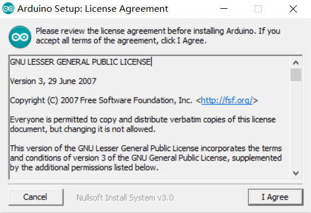
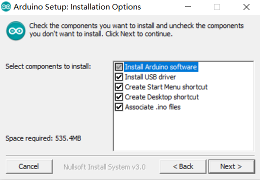
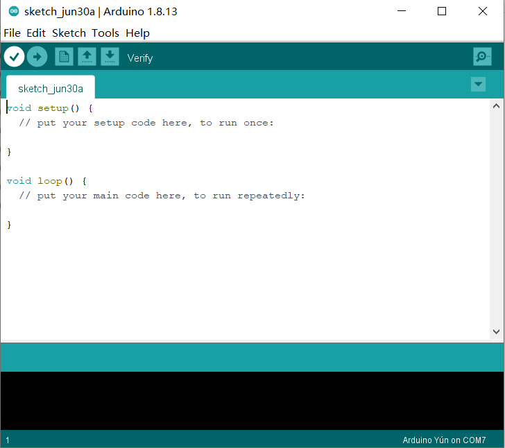
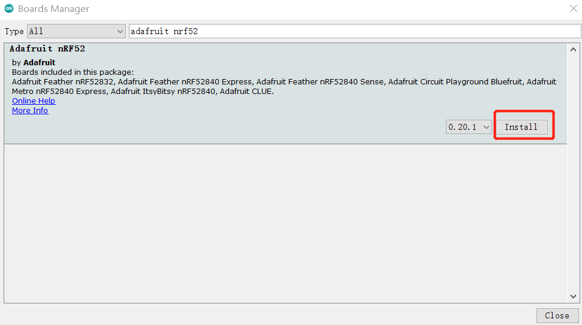
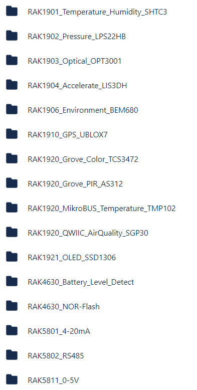
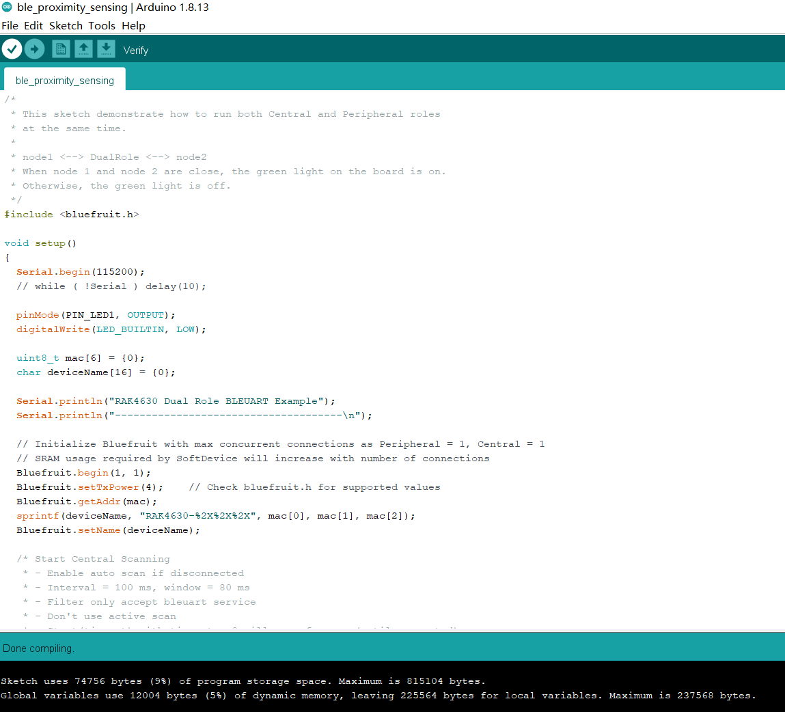

# Installation of Board Support Package in Arduino IDE

## Arduino IDE Download and Installation

You should use Arduino IDE for WisBlock coding and programming.

Please download the Arduino IDE on the Arduino official website:

https://www.arduino.cc/en/Main/Software 

You can see the current version of Arduino IDE is V1.8.13, and there are several versions for Windows, Linux, and Mac OS X.


Just download the correct version of Arduino IDE from here.


### Install in Windows

Now, let's install the Arduino IDE, which you just download, on a Windows PC.



"I Agree"



"Next"


"Install"


After 100% progress, Arduino IDE has been installed successfully.




### Install in Linux

In Linux, there is no install process actually, just a process of uncompression, then you can open Arduino IDE successfully.


### Install in Mac OS X

In Mac OS X, it is almost same with Linux, there is no install process actually, just a process of uncompression, then you can open Arduino IDE successfully.


### Open Arduino IDE


As you see, Arduino IDE has mainly 5 parts:

1) IDE option menu

You can configure some general parameters such as the serial port, the board information, the libraries, the edit parameters, and so on.

2) Operating buttons

You can verify/compile source code, upload the compiled code into WisBlock, open a new Arduino IDE window, open an exist application, or save the current application. 


3) Code area

You can edit the source code which will be compiled and uploaded into WisBlock later in this area.

4) State area

5) Output message area

You can see the output message in this area, no matter failed information and success information.


### Configuration On Arduino IDE

Once Arduino IDE has been installed successfully, and you've understood the mainly parts of Arduino IDE, we can do some configuration changes on Arduino IDE so that it can be adapted to WisBlock.

We use https://github.com/adafruit/Adafruit_nRF52_Arduino and do as below:

- Open Arduino IDE

- Go into Preferences

  

- Add https://www.adafruit.com/package_adafruit_index.json as an 'Additional Board Manager URL'

  

- Restart the Arduino IDE

- Open the Boards Manager from the Tools -> Board menu

  

- Search and install "Adafruit nRF52" as the following image shows, and install it. It is the BSP actually.

  

- Download and copy the following folder to the specified path:

	https://github.com/RAKWireless/WisBlock/tree/master/BSP/WisCore_RAK4631_Board/

 	The path maybe like:

	  - macOS : `~/Library/Arduino15/packages/adafruit/hardware/nrf52/0.20.5/variants/`
	  - Linux : `~/.arduino15/packages/adafruit/hardware/nrf52/0.20.5/variants/`
	  - Windows: `%APPDATA%\Local\Arduino15\packages\adafruit\hardware\nrf52\0.20.5\variants\`


- Open ./adafruit/hardware/nrf52/0.20.5/boards.txt, and copy the content of the following file into the end of boards.txt:

  	https://github.com/RAKWireless/WisBlock/tree//master/BSP/config.txt

  Then add **menu.region=Region** to the begin of boards.txt (line 21) like

  ```
  menu.softdevice=Bootloader
  menu.debug=Debug
  menu.region=Region
  ```

- Open ./adafruit/hardware/nrf52/0.20.5/platform.txt.

  Add **-DDEBUG** at the end of line 39 like below:

  ```
  compiler.cpp.flags=-mcpu={build.mcu} -mthumb -c -g {compiler.warning_flags} {build.float_flags} -std=gnu++11 -ffunction-sections -fdata-sections -fno-threadsafe-statics -nostdlib --param max-inline-insns-single=500 -fno-rtti -fno-exceptions -MMD -DDEBUG
  ```
  
  Add **build.region_flags=-DREGION_EU868** in the end of line 56 like below:
  
  ```
  # this can be overriden in boards.txt 
  build.float_flags=-mfloat-abi=hard -mfpu=fpv4-sp-d16 -u _printf_float 
  build.debug_flags=-DCFG_DEBUG=0 
  build.logger_flags=-DCFG_LOGGER=1 
  build.sysview_flags=-DCFG_SYSVIEW=0 
  build.region_flags=-DREGION_EU868
  ```
  
  Add **{build.region_flags}** after **{build.debug_flags}** at line 64 like below:
  
  ```
  build.flags.nrf= -DSOFTDEVICE_PRESENT -DARDUINO_NRF52_ADAFRUIT -DNRF52_SERIES -DLFS_NAME_MAX=64 -Ofast {build.debug_flags} {build.region_flags} {build.logger_flags} {build.sysview_flags} "-
  ```
  
  Add **compiler.libraries.ldflags=** in the end of line 76 like below:
  
  ```
  # These can be overridden in platform.local.txt
  compiler.c.extra_flags=
  compiler.c.elf.extra_flags=
  compiler.cpp.extra_flags=
  compiler.S.extra_flags=
  compiler.ar.extra_flags=
  compiler.elf2bin.extra_flags=
  compiler.elf2hex.extra_flags=
  compiler.libraries.ldflags=
  ```
  
  Add **{compiler.libraries.ldflags}** before **-Wl,--end-group** at line 95 like below:
  
  ```
  recipe.c.combine.pattern="{compiler.path}{compiler.c.elf.cmd}"  "-L{build.path}" {compiler.c.elf.flags} {compiler.c.elf.extra_flags} "-L{build.core.path}/linker" "-T{build.ldscript}" "-Wl,-Map,{build.path}/{build.project_name}.map" {compiler.ldflags} -o "{build.path}/{build.project_name}.elf" {object_files} -Wl,--start-group -lm "{build.path}/{archive_file}" {compiler.libraries.ldflags} -Wl,--end-group
  ```
  
  
  
- Restart Arduino IDE, and select "WisCore RAK4631 Board" as follow:


OK, we've configured Arduino IDE correctly and install the BSP successfully!

### Load Examples

RAK has supplied many examples source code on Github for WisBlock:

https://github.com/RAKWireless/WisBlock/tree/master/examples




You can use WisBlock directly or make their customized code according to these examples source code. What you need to do is just to load one of these examples into Arduino IDE by opening a .ino file in RAK examples, in this document, we use "ble_proximity_sensing.ino":


Now, we can compile it directly according to the section 7, or do some customized code before compiling it If you want.

About customization code, you can have a look at the section 9 for more details.


### Compiling Project

The compiling process is very easy, what you need to do is just to click the Verify/Compile button on Arduino IDE:


Then it will start to compile:


After compiling successfully, you can see some information in the output message area, and the state is "Done compiling":



Now, you can connect your WisBlock hardware with your PC, and upload the code into it.

### Uploading to WisBlock

Before uploading, please make sure that your WisBlock hardware has been connected with your PC correctly, and your PC has recognized WisBlock hardware successfully. If it is, you can select the port now as the following image shows:


Then click the "Upload" button to start it:


After uploading successfully, you can see some information as the following image shows in the output message area:


Great! That means you've uploaded the code into WisBlock successfully.

Now, enjoy you WisBlock and have an amazing play time!


### Customized Code

As you know, RAK has supplied some examples source code for reference so that you can learn some code level method about how to do an application for WisBlock. Meanwhile, RAK has supplied a set of tutorials too, which has introduced the ability of WisBlock software and shown the development process of these RAK examples so that you can understand better about how to do some customized code.

All of these tutorials can be found in every example folder:

https://github.com/RAKWireless/WisBlock/tree/master/examples