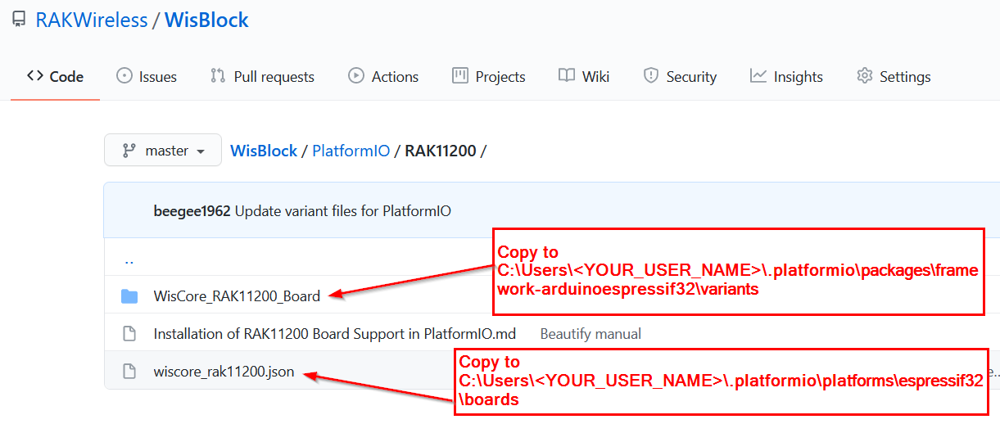

## Installation of RAK11200 Board Support in PlatformIO(Just for test now)

### Install PlatformIO

First of all, install VS code which is a great and open source tool, and you can download it here:

https://code.visualstudio.com/

After installing VS code, you can search PlatformIO and install it in the Extensions item.

### Install  Espressif 32 Arduino framework

After installing PlatformIO, you can see the PlatformIO icon and open it as follow

Open "Platforms" in PlatformIO and search "Espressif" as follow

You can see there are several items, just click "Espressif 32" item and "Install" it as follow

### Add WisBlock Core RAK11200 to the platform

Download the folder WisCore_RAK11200_board and the file wiscore_rak_11200.json from this repository

Copy the file **`wiscore_rak11200.json`** to the boards folder of the espressif32 platform folder.

The path should be similar to:
```
- Windows: %USER%.platformio\platforms\espressif32\boards
- Linux:    ~/.platformio/platforms/espressif32/boards
- Mac OS:  /Users/{Your_User_id}/.platformio/platforms/espressif32/boards
```



Before you can copy the variants folder, you first need to create a new project for the RAK11200 in PlatformIO

Then, create a new project in PlatformIO:

Choose "WisCore RAK11200 Board (RAKwireless)" for "Board" item, and choose "Arduino" for "Framework" item as follow:


### Add WisBlock Core RAK11200 to the framework

Now, Copy the complete folder "WisCore_RAK11200_Board" in the "PlatformIO" folder which you just downloaded to the framework-arduinoespressif32 package variants folder. The path should be similar to:

```
 - Windows: %USER%\\.platformio\packages\framework-arduinoespressif32\variants
 - Linux:    ~/.platformio/packages/framework-arduinoespressif32/variants
 - Mac OS:  /Users/{Your_User_id}/.platformio/packages/framework-arduinoespressif32/variants
```


