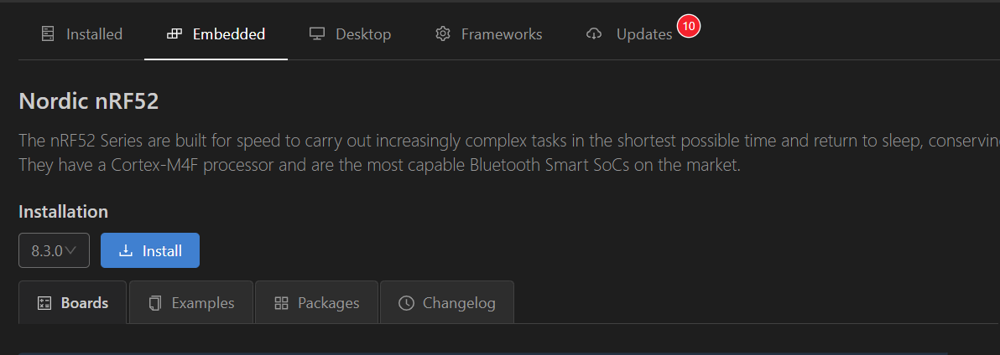
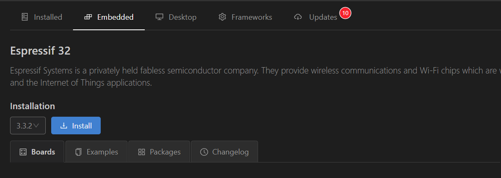
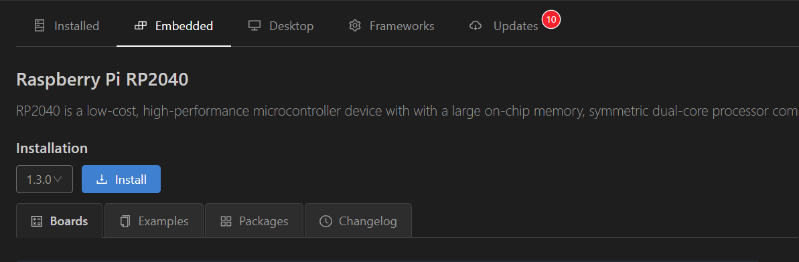
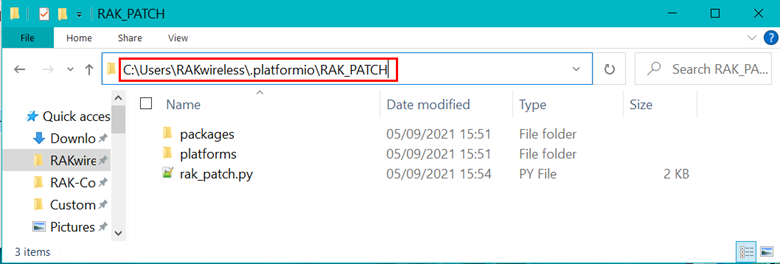
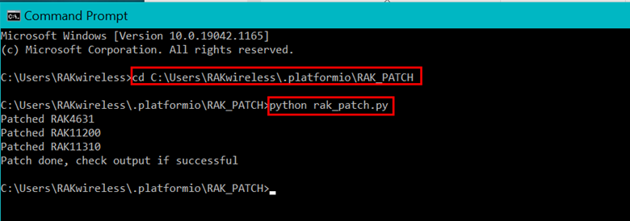
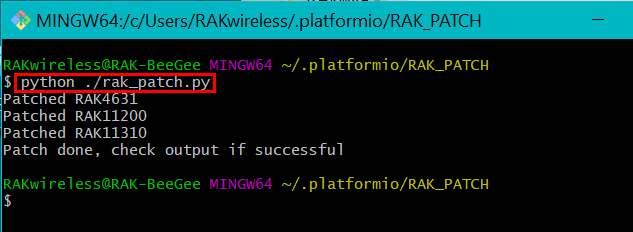

# RAK WisBlock modules in PlatformIO

A small script that installs or updates RAKwireless WisBlock modules in PlatformIO BSP's
This script does not install the required BSP's (platform and package), it only patches already installed BSP's.

_**REMARK**_
Tested only on Windows 10 and Ubuntu!

- [First install](#first-install)
- [Update](#update)
- [Download](#download)

## First install
Before you can use the WisBlock Core modules with PlatformIO you need to install the original platforms:
- RAK4631 => install nRF52 platform    

- RAK11200 => install ESP32 platform

- RAK11300 => install Raspberry Pi RP2040 platform

After the required platforms are installed, follow the steps as shown in [Update](#update)

## Update
After updating or installing the nRF52, ESP32 or Raspberry Pi RP2040 package do the following steps:

### 1. Open a project that uses the updated platform

### 2. Compile the project so that PlatformIO is installing the packages belonging to the platform
   - Ignore the _**Unknown board ID**_ or _**variant.h: No such file or directory**_ errors until the following patch has been applied

### 3. Patch the platform and package   

Unzip the contents of **RAK_PATCH.zip** into folder RAK_PATCH in your PlatformIO installation folder.    
   
| Paths on different OS: |    |    
| --- | --- |    
| Windows | `%USER%\.platformio\` | 
| Linux | `~/.platformio/` | 
| MacOS | `/Users/{Your_User_id}/.platformio/` | 
   
**Example (Windows 10):**    

**Install the patch**    

Open a terminal in the .platformio folder and execute **`python ./rak_patch.py`**

Example (Windows 10 terminal):    

Example (Linux terminal):    

# Download

Download the complete package from [RAK_PATCH.zip](https://raw.githubusercontent.com/RAKWireless/WisBlock/master/PlatformIO/RAK_PATCH.zip)
