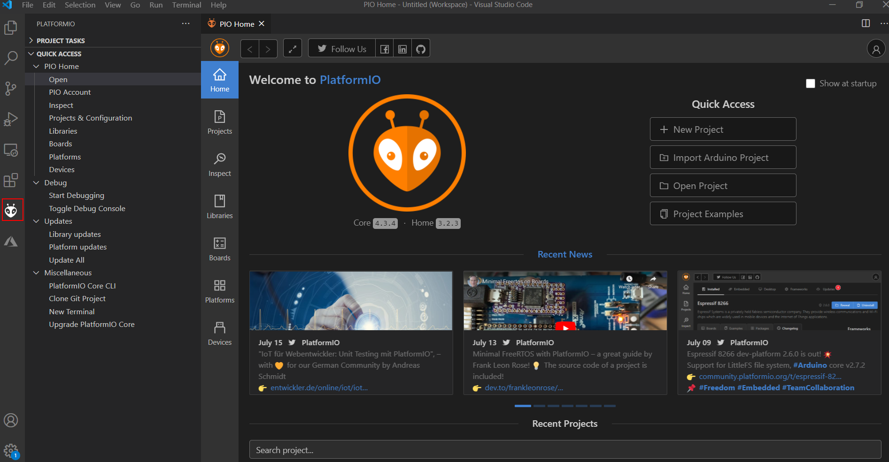
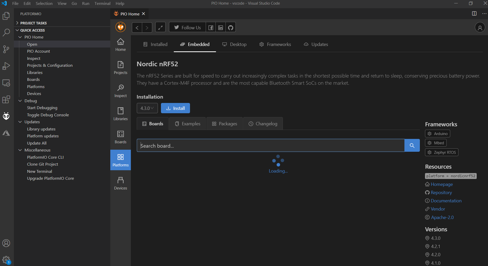

# Installation of Board Support Package in PlatformIO

## Install PlatformIO

First of all, install VS code which is a great and open source tool, and you can download it here:

https://code.visualstudio.com/

After installing VS code, you can search PlatformIO and install it in the Extensions item:

After installing PlatformIO, you can see the PlatformIO icon and open it as follow:

Open "Platforms" in PlatformIO and search "Nordic" as follow:

You can see there are several items, just click "Nordic nRF52" item and "Install" it as follow:

Download the PlatformIO folder from:

https://github.com/RAKWireless/WisBlock/tree/master/PlatformIO/

Copy the file **`wiscore_rak4631.json`** to the boards folder of the nordicnrf52 platform folder.

The path maybe like: 

 - Windows: %USER%\.platformio\platforms\nordicnrf52\boards

Then, create a new project in PlatformIO:

Choose "WisCore RAK4631 Board (RAKwireless)" for "Board" item, and choose "Arduino" for "Framework" item as follow:

After creating successfully, you can see the project:

Now, Copy the complete folder "WisCore_RAK4631_Board" in the "PlatformIO" folder which you just downloaded to the framework-arduinoadafruitnrf52 package variants folder. The path maybe like:
 - Windows: %USER%\.platformio\packages\framework-arduinoadafruitnrf52\variants

Finally, restart the PlatformIO.

OK, you've install and configure PlatformIO for WisBlock successfully.

Now, let's try to compile an example of WisBlock using PlatformIO. We use the LoRaWAN® OTAA example in this document:

https://github.com/RAKWireless/WisBlock/tree/master/examples/communications/LoRa/LoRaWAN/LoRaWAN_OTAA/

Just copy the source code of the .ino file into the main.cpp of the PlatformIO project we just created:

Then we need to install the LoRaWAN® library "SX126x-Arduino" in PlatformIO firstly because this example is built based on this library. Just search "SX126x" in "Libraries" item of PlatformIO, and you can see "SX126x-Arduino" as follow:

Just click it and "Install" this library as follow:

Then compile it by click the compiling icon at the bottom tool bar as follow:

 

Great! We've compiled this example successfully!

Same as in Arduino IDE, there is an upload icon (red circle) on the right of the compiling icon (green circle) which can be used to upload the compiled firmware into your device.

