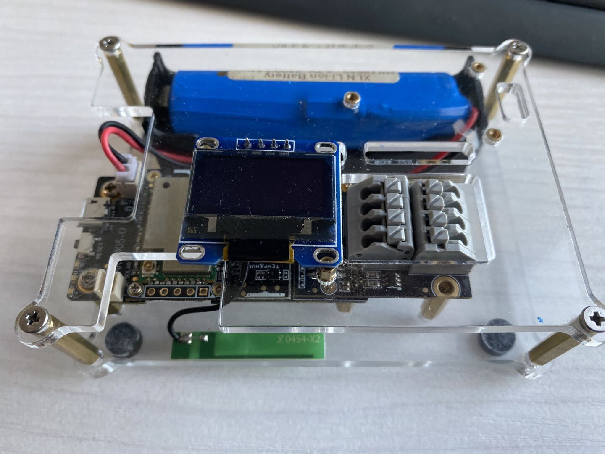

# RAKwireless WisBlock
#### 
## Introduction
WisBlock is an amazing product built by the RAK company for IoT industry. It can build circuits like clicking blocks together to quickly to realize your idea.

WisBlock consists of WisBlock Base, WisBlock Core, WisBlock Sensor and WisBlock IO.
- WisBlock Base → the block that the whole system is build on.    
- WisBlock Core → the processing unit with the microcontroller    
- WisBlock Sensor → the blocks with a variety of sensors    
- WisBlock IO → The blocks that extend the communication possibilities of the WisBlock.

This repository is created to make your start with WisBlock as simple as possible.
Let's get started.

**RAKwireless invests time and resources providing this open source code, please support RAKwireless and open-source hardware by purchasing products from RAKwireless!**

For support and questions about RAKwireless products please visit our [forum](https://forum.rakwireless.com/)

To buy WisBlock modules please visit our [online store](https://store.rakwireless.com/)

----
## Where to find what

- Documentation  
    - [Quick Start Guide](doc/Quick_Start/README.md)

- [Examples](/examples/)
    - [Communications](/examples/communications/)
        - [LoRa](/examples/communications/LoRa/)
            - [LoRaWAN](/examples/communications/LoRa/LoRaWAN/)
            - [LoRa P2P](/examples/communications/LoRa/LoRaP2P/)

        - [BLE](/examples/communications/BLE/)
            - [BLE Proximity Sensing](/examples/communications/BLE/ble_proximity_sensing/)
            - [BLE_OTA_DFU](/examples/communications/BLE/ble_ota_dfu/)
            - [BLE_UART](/examples/communications/BLE/ble_uart/)
            
        - [WiFi](/examples/communications/WiFi/)
        
        - [Cellular](/examples/communications/Cellular/)
        
    - [Sensors](/examples/sensors/)
        - [RAK1901_Temperature&Humidity_SHTC3](/examples/sensors/RAK1901_Temperature_Humidity_SHTC3/)
        - [RAK1902_Pressure_LPS22HB](/examples/sensors/RAK1902_Pressure_LPS22HB/)
        - [RAK1903_Optical_OPT3001](/examples/sensors/RAK1903_Optical_OPT3001/)
        - [RAK1904_Accelerate_LIS3DH](/examples/sensors/RAK1904_Accelerate_LIS3DH/)
        - [RAK1906_Environment_BME680](/examples/sensors/RAK1906_Environment_BEM680/)
        - [RAK1910_GPS_UBLOX7](/examples/sensors/RAK1910_GPS_UBLOX7/)
        - [RAK1920_MikroBUS_Temperature_TMP102](/examples/sensors/RAK1920_MikroBUS_Temperature_TMP102/)
        - [RAK1920_QWIIC_AirQuality_SGP30](/examples/sensors/RAK1920_QWIIC_AirQuality_SGP30/)
        - [RAK1920_Grove_PIR_AS312](/examples/sensors/RAK1920_Grove_PIR_AS312/)
        - [RAK1920_Grove_Color_TCS3472](/examples/sensors/RAK1920_Grove_Color_TCS3472/)
        - [RAK1921_OLED_SSD1306](/examples/sensors/RAK1921_OLED_SSD1306/)
        - [RAK5802_RS485](/examples/sensors/RAK5802_RS485/)
        - [RAK5801_4-20mA](/examples/sensors/RAK5801_4-20mA/)
        - [RAK5811_0-5V](/examples/sensors/RAK5811_0-5V/)
        - [RAK4630_Battery_Level](/examples/sensors/RAK4630_Battery_Level_Detect/)
        - [RAK4630_NOR_Flash](/examples/sensors/RAK4630_NOR-Flash/)
        
    - [Solutions](/examples/solutions/)
        - [BLE_Gateway](/examples/solutions/BLE_Gateway/)
        - [Hydraulic_Pressure_Monitoring](/examples/solutions/Hydraulic_Pressure_Monitoring/)
        - [Environment_Monitoring](/examples/solutions/Environment_Monitoring/)
        - [Water_Level_Monitoring](/examples/solutions/Water_Level_Monitoring/)
        - [Weather_Monitoring](/examples/solutions/Weather_Monitoring/)
        - [GPS_Tracker](/examples/solutions/GPS_Tracker/)
        - [PAR_Monitoring](/examples/solutions/PAR_Monitoring/)
        - [Soil_Conductivity_Monitoring](/examples/solutions/Soil_Conductivity_Monitoring/)
        - [Soil_pH_Monitoring](/examples/solutions/Soil_pH_Monitoring/)
        - [Wind_Speed_Monitoring](/examples/solutions/Wind_Speed_Monitoring/)
        - [Inteligence_Agriculture](/examples/solutions/Inteligence_Agriculture/)
    
- Bootloader
    - [Flashable Bootloader](bootloader/)
    - [Bootloader Source Code](bootloader/Adafruit_nRF52_Bootloader/)

## Overview
WisBlock is a modular Plug&Play system. Compared with other systems (Arduino, Raspberry Pi, M5Stack) it has several advantages.

1. Using a compact connector makes its size very small. A WisBlock Base board, which is the base carrier, is only 30mm by 60mm in size. One WisBlock Base can hold one microcontroller module (WisBlock Core), one IO module (WisBlock IO) and up to 4 sensor modules (WisBlock Sensor).

2. Using an industrial rated connector enables you to use the same modules from rapid prototyping to testing to final product.  

3. WisBlock is not only modular on hardware base, but with ready to use software blocks it is simple to create an application to match your implementation requirements.

----
## Modularity
### Base board
WisBlock Base is the base board that makes flexibility and modularity possible.

### Plug&Play hardware modules 
WisBlock Core → processing blocks with LoRa/LoRaWan connectivity    
WisBlock Sensor → wide range of sensor blocks    
WisBlock IO → blocks for user interfaces, custom sensor connections and actuators   

### Plug&Play software modules
Using Arduino framework provides a free and widely available programming environment
Open Source libraries for communication protocols
Open Source libraries for data processing
Open Source libraries for sensors input
Open Source libraries for actuators
Open Source libraries for user interfaces

----
### WisBlock Base
WisBlock is build up on a WisBlock Base board, a platform carrier that allows easy plug-in of 1 WisBlock Core processing board, 1 WisBlock IO interface board and up to 4 WisBlock Sensor boards.

WisBlock Base is providing the power supply, battery and solar panel supplies and charging block. In addition it has connectors for programming and debugging. 

During development phase WisBlock Base allows you to quickly switch between microcontrollers, IO functionality and sensors by simply changing the modules.

Repairs and upgrades are easy with WisBlock Base on your final product, because modules can be changed with just Plug'n'Play.

For controlling and limiting power consumption of your IoT solution, WisBlock Base enables to control the power supply for the WisBlock Sensor and WisBlock IO modules, limiting the power consumption by switching off these modules if they are not needed.

----
### WisBlock Core
WisBlock Core is the processing unit of your IoT solution.

Select the processing power based on the requirements of your application from a range of processing boards which starts with low single core to high dual core processing power  units are available. 

All of them have the LoRa/LoRaWan communication capability, some of them offer in addition WiFi, Bluetooth or Bluetooth Low Energy. All are designed for battery optimized low power consumption.

----
### WisBlock Sensor
A range of sensors for sensing environmental conditions (temperature, humidity, …), location and movement conditions (GNSS/GPS, accelerometer, …) that you just plug into WisBlock Base makes it easy to complete your application with the required sensors.

----
### WisBlock IO
WisBlock IO extensions provide your application with interfaces that are not covered by WisBlock Core or WisBlock Sensor blocks.     
This includes 
- user interfaces like 
  - keyboards
  - buttons
  - displays
- communication interfaces like    
  - 0~5V
  - 4-20mA
  - I2C
  - RS232
  - RS485
  - many more
- alternative power supplies like
  - 24V
  - POE
