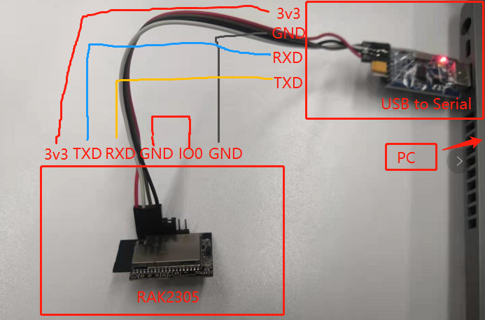
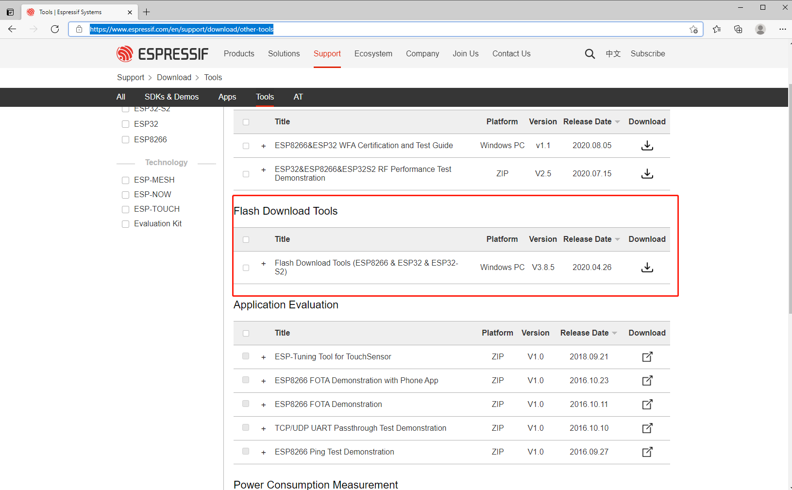
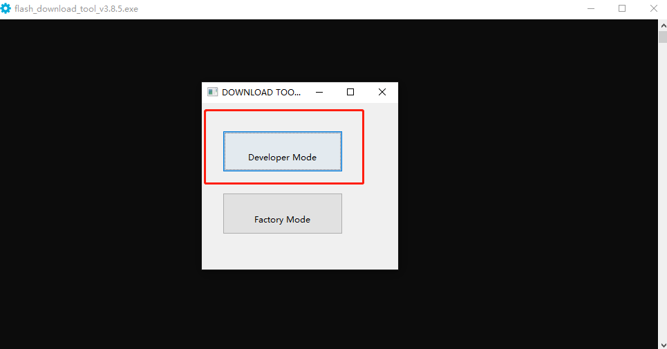
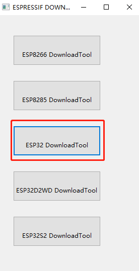
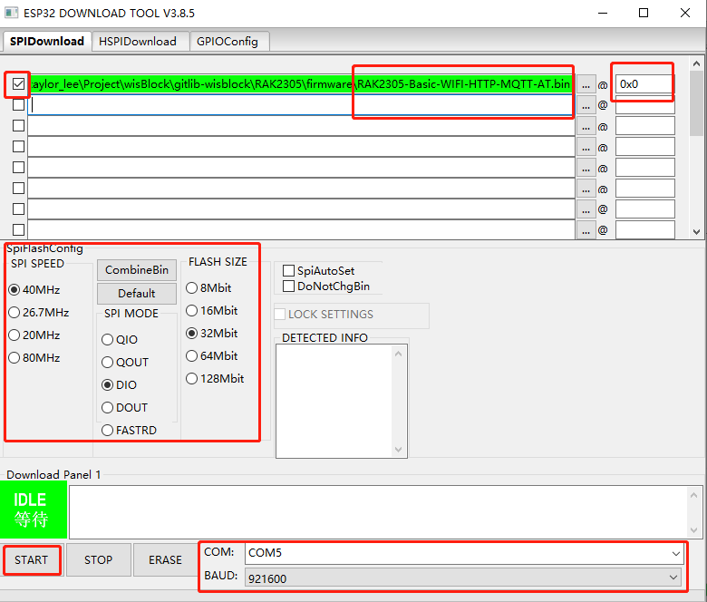
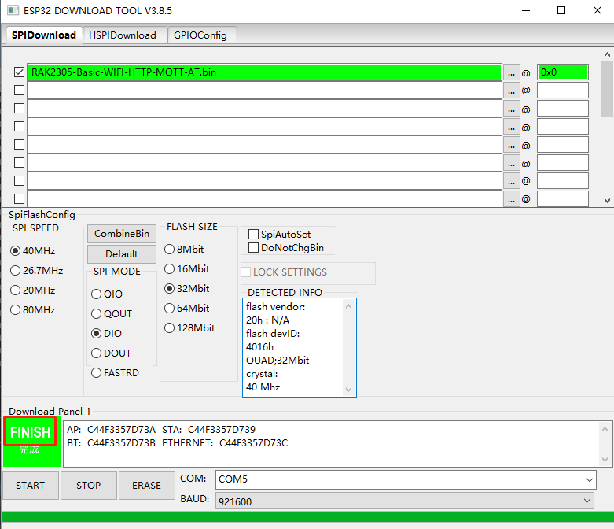

# Burn firmware to RAK2305

RAK2305 has two firmwares.

[RAK2305-Basic-WIFI-BLE-AT.bin](./RAK2305-Basic-WIFI-BLE-AT.bin) with AT commands of Basic, Wifi and BLE. It is a factory firmware.

[RAK2305-Basic-WIFI-HTTP-MQTT-AT.bin](./RAK2305-Basic-WIFI-HTTP-MQTT-AT.bin) with AT commands of Basic, WiFi, HTTP and MQTT. It  is not including BLE Commands. If you want to use MQTT and HTTP commands, you should download this firmware to RAK2305 firstly.

The download steps are as below.

1. Connect the USB-convert-Serial tool with RAK2305.

2. Download [ESP32 Flash Download Tool]([Tools | Espressif Systems](https://www.espressif.com/en/support/download/other-tools)) and install it.

3. Open download tool.

4. Select firmware and configure the tool.

5. Click 'start' and wait until the download finished.

