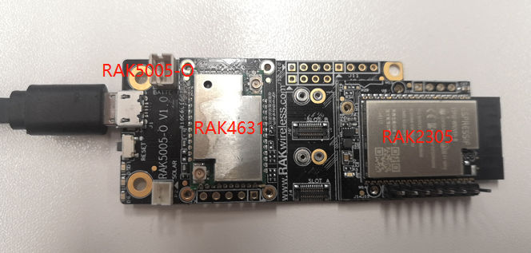
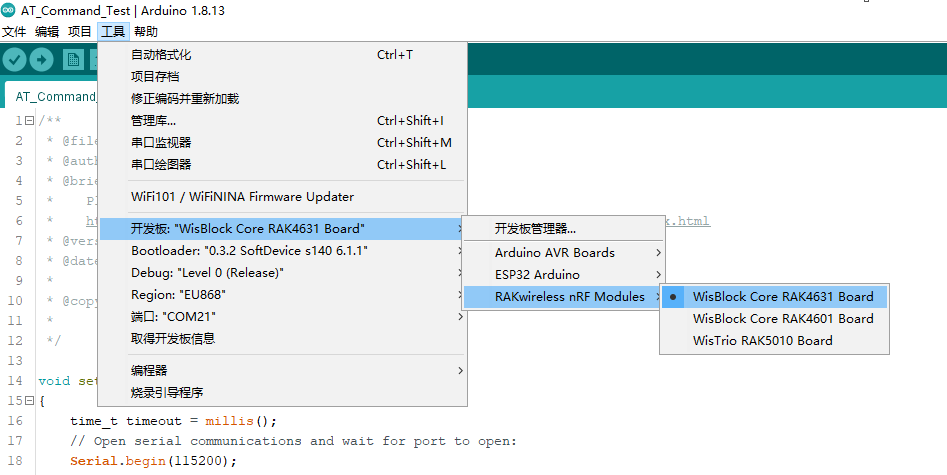
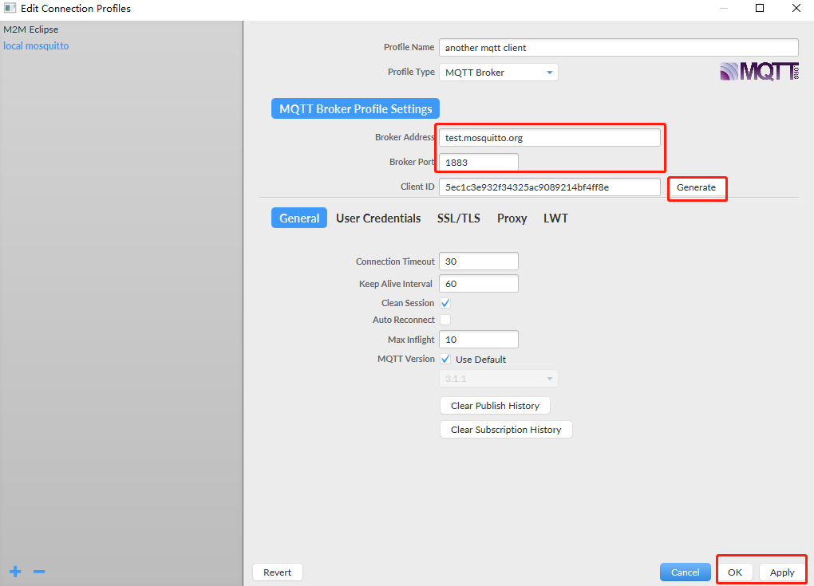
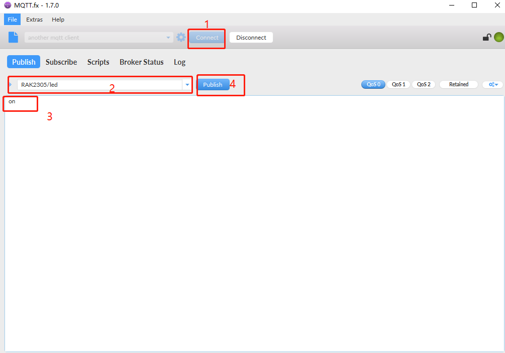
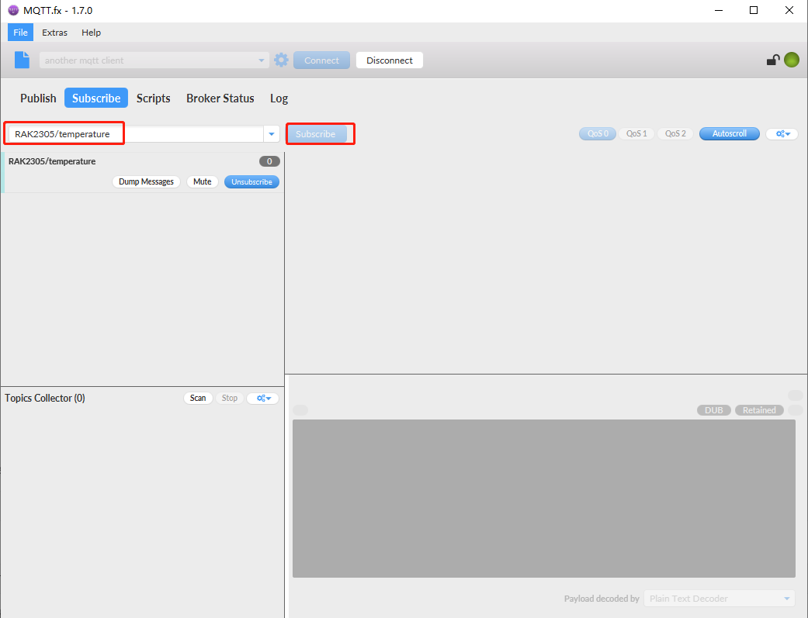
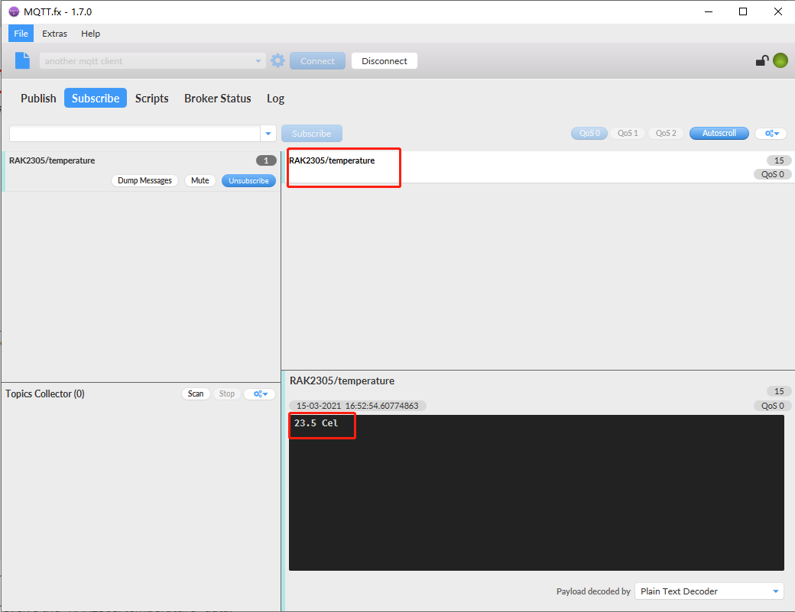

## RAK2305 AT commands test

RAK2305 is a ESP32 AT module which can only recognize AT commands from serial port. So we need a master MCU to send AT commands and receive response. Currently, the WISCore supported by RAK2305 is RAK4631.



## Software

RAK4631 burns a serial port transmission program, receives AT commands from PC and returns the results to serial port monitoring software on PC.

```
void setup()
{
    time_t timeout = millis();
    // Open serial communications and wait for port to open:
    Serial.begin(115200);
    while (!Serial)
    {
        if ((millis() - timeout) < 5000)
        {
            delay(100);
        }
        else
        {
            break;
        }
    }

    Serial.println("================================");
    Serial.println("RAK2305 AT CMD TEST!");
    Serial.println("================================");
    
    //esp32 init
    Serial1.begin(115200);

}

void loop()
{
    uint8_t resp;
    uint8_t snd;

    // wait for response from esp32
    while (Serial1.available() > 0)
    {
        resp = (uint8_t)(Serial1.read());
        Serial.write(resp);
    }
    
    // wait for AT cmd which user send with serial tool
    while (Serial.available() > 0)
    {
        snd = (uint8_t)(Serial.read());
        Serial1.write(snd);
    }

}
```

Select "WisBlock Core RAK4631 Board" and upload software to RAK4631.




## Test

Test the AT commands through the serial tool of the Arduino IDE. AT commands are referred to the ESP32 AT commands. 

### [Basic AT Commands]([Basic AT Commands — ESP-AT User Guide documentation (espressif.com)](https://docs.espressif.com/projects/esp-at/en/latest/AT_Command_Set/Basic_AT_Commands.html))

1. Restart Module

```
AT+RST
```

2. Restore Factory Default Settings

```
AT+RESTORE
```

The test results are as follows：

```
16:06:05.546 -> AT+RST
16:06:05.546 -> 
16:06:05.546 -> OK
16:06:07.185 -> 
16:06:07.185 -> ready
16:06:45.253 -> AT+RESTORE
16:06:45.673 -> 
16:06:45.673 -> OK
16:06:47.498 -> 
16:06:47.498 -> ready
```


### [WiFi AT Commands](https://docs.espressif.com/projects/esp-at/en/latest/AT_Command_Set/Wi-Fi_AT_Commands.html)

1. Set RAK2305 as AP and STA role.

```
AT+CWMODE=3
```

2. Query the softAP SSID of ESP32

```
AT+CWSAP?
```

3. ESP32 disconnect from AP

```
AT+CWQAP
```

4. List the available AP.

```
AT+CWLAP
```

5. Connect AP.

```
AT+CWJAP="SSID","Password"
```

6. Obtain the IP address of the ESP32 Station

```
AT+CIPSTA?
```

7. Test network with ping command.

```
AT+PING="8.8.8.8"
```


The test results are as follows：

```
[14:50:06.382]←ESP32 AT CMD TEST!

[14:50:13.332]→◇AT+CWMODE=3
□
[14:50:13.336]←◆AT+CWMODE=3

OK

[14:50:18.780]→◇AT+CWSAP?
□
[14:50:18.783]←◆AT+CWSAP?
+CWSAP:"ESP_57E062","",1,0,4,0

OK

[14:50:24.332]→◇AT+CWQAP
□
[14:50:24.335]←◆AT+CWQAP
WIFI DISCONNECT

OK

[14:50:30.148]→◇AT+CWLAP
□
[14:50:30.151]←◆AT+CWLAP

[14:50:32.155]←◆+CWLAP:(3,"Axon M",-50,"b0:c1:9e:76:24:e9",1)
+CWLAP:(0,"RAK7249_F835",-53,"60:c5:a8:76:f8:35",1)
+CWLAP:(3,"DIRECT-SWDESKTOP-FB8REVBmsWL",-56,"08:1f:71:30:95:06",11)
+CWLAP:(3,"Room-905",-58,"b4:fb:e4:4a:35:b2",1)
+CWLAP:(4,"clpc-Network",-64,"d8:15:0d:42:72:c0",1)
+CWLAP:(0,"",-67,"12:74:9c:a9:ef:09",11)
+CWLAP:(5,"chinalife-wifi",-69,"06:74:9c:a9:ef:09",11)
+CWLAP:(0,"chinalife-sales",-69,"0a:74:9c:a9:ef:09",11)
+CWLAP:(0,"chinalife-guest",-70,"0e:74:9c:a9:ef:09",11)
+CWLAP:(0,"chinalife-sales",-74,"0a:74:9c:a9:e8:f5",6)
+CWLAP:(0,"chinalife-guest",-74,"0e:74:9c:a9:e8:f5",6)
+CWLAP:(0,"",-76,"12:74:9c:a9:89:35",11)
+CWLAP:(5,"chinalife-wifi",-77,"06:74:9c:a9:89:35",11)
+CWLAP:(0,"chinalife-guest",-77,"0e:74:9c:a9:89:35",11)
+CWLAP:(0,"chinalife-sales",-78,"0a:74:9c:a9:89:35",11)
+CWLAP:(2,"",-90,"da:00:74:c0:d5:0c",1)
+CWLAP:(4,"ChinaNet-wKgD",-92,"9a:00:74:c0:d5:0c",1)

OK

[14:50:59.700]发→AT+CWJAP="Room-905","Mxjmxj_905"
□
[14:50:59.706]收←AT+CWJAP="Room-905","Mxjmxj_905"

[14:50:59.878]收←WIFI CONNECTED

[14:51:00.899]收←WIFI GOT IP

OK

[14:51:08.484]→◇AT+CIPSTA?
□
[14:51:08.489]←◆AT+CIPSTA?
+CIPSTA:ip:"172.31.204.97"
+CIPSTA:gateway:"172.31.204.1"
+CIPSTA:netmask:"255.255.255.0"

OK

[14:51:14.036]→◇AT+PING="8.8.8.8"
□
[14:51:14.043]←◆AT+PING="8.8.8.8"

[14:51:14.199]←◆+PING:149

OK
```


### [HTTP AT Commands]([HTTP AT Commands — ESP-AT User Guide documentation (espressif.com)](https://docs.espressif.com/projects/esp-at/en/latest/AT_Command_Set/HTTP_AT_Commands.html))

To test the HTTP AT Commands, we should burn new firmware named [RAK2305-Basic-WIFI-HTTP-MQTT-AT.bin](./RAK2305-Basic-WIFI-HTTP-MQTT-AT.bin) of RAK2305 firstly. And WiFi connected is needed too.

1. Send HTTP Client Request

```
AT+HTTPCLIENT=1,0,"http://httpbin.org/get",,,0

AT+HTTPCLIENT=3,0,"http://httpbin.org/post","httpbin.org","/post",1,"field1=value1&field2=value2"
```

The test results are as follows：

```
16:12:14.100 -> AT+CWQAP
16:12:14.233 -> WIFI DISCONNECT
16:12:14.533 -> 
16:12:14.533 -> OK
16:12:22.741 -> AT+CWMODE=1
16:12:22.741 -> 
16:12:22.741 -> OK
16:12:40.737 -> AT+CWJAP="Room-905","Mxjmxj_905"
16:12:43.031 -> WIFI CONNECTED
16:12:44.532 -> WIFI GOT IP
16:12:44.532 -> 
16:12:44.532 -> OK

16:13:02.399 -> AT+HTTPCLIENT=1,0,"http://httpbin.org/get",,,0
16:13:03.053 -> +HTTPCLIENT:35, Date: Mon, 15 Mar 2021 08:13:02 GMT
16:13:03.053 -> +HTTPCLIENT:30, Content-Type: application/json
16:13:03.053 -> +HTTPCLIENT:19, Content-Length: 328
16:13:03.053 -> +HTTPCLIENT:22, Connection: keep-alive
16:13:03.053 -> +HTTPCLIENT:23, Server: gunicorn/19.9.0
16:13:03.053 -> +HTTPCLIENT:30, Access-Control-Allow-Origin: *
16:13:03.053 -> +HTTPCLIENT:38, Access-Control-Allow-Credentials: true
16:13:03.053 -> 
16:13:03.053 -> OK

16:14:31.440 -> AT+HTTPCLIENT=3,0,"http://httpbin.org/post","httpbin.org","/post",1,"field1=value1&field2=value2"
16:14:32.469 -> +HTTPCLIENT:282,{
16:14:32.469 ->   "args": {}, 
16:14:32.469 ->   "data": "", 
16:14:32.469 ->   "files": {}, 
16:14:32.469 ->   "form": {
16:14:32.469 ->     "field1": "value1", 
16:14:32.469 ->     "field2": "value2"
16:14:32.469 ->   }, 
16:14:32.469 ->   "headers": {
16:14:32.469 ->     "Content-Length": "27", 
16:14:32.469 ->     "Content-Type": "application/x-www-form-urlencoded", 
16:14:32.469 ->     "Host": "httpbin.org", 
16:14:32.516 ->     "User-Agent": "ESP32 HTTP Client/1
16:14:32.516 -> +HTTPCLIENT:162,.0", 
16:14:32.516 ->     "X-Amzn-Trace-Id": "Root=1-604f1767-274c131256222edf4ebc89b6"
16:14:32.516 ->   }, 
16:14:32.516 ->   "json": null, 
16:14:32.516 ->   "origin": "117.36.50.186", 
16:14:32.516 ->   "url": "http://httpbin.org/post"
16:14:32.516 -> }
16:14:32.516 -> 
16:14:32.516 -> 
16:14:32.516 -> OK

```


### [MQTT AT Commands]([MQTT AT Commands — ESP-AT User Guide documentation (espressif.com)](https://docs.espressif.com/projects/esp-at/en/latest/AT_Command_Set/MQTT_AT_Commands.html))

To test the MQTT AT Commands, we should burn new firmware named [RAK2305-Basic-WIFI-HTTP-MQTT-AT.bin](./RAK2305-Basic-WIFI-HTTP-MQTT-AT.bin) of RAK2305 firstly. .And WiFi connected is needed too.

1. Set MQTT User Configuration

```
AT+MQTTUSERCFG=0,1,"32b624ac00104bd3b9aa19d6b1f70075","","",0,0,""
```

2. Set Configuration of MQTT Connection

```
AT+MQTTCONN=0,"test.mosquitto.org",1883,0
```

3. Connect to MQTT Brokers

```
AT+MQTTCONN?
```

4. Subscribe to MQTT Topics

```
AT+MQTTSUB=0,"RAK2305/led",1
```

5. List all MQTT topics that have been already subscribed.

```
AT+MQTTSUB?
```


The test results are as follows：

The test results are as follows：

```
16:32:14.100 -> AT+CWQAP
16:32:14.233 -> WIFI DISCONNECT
16:32:14.533 -> 
16:32:14.533 -> OK
16:32:22.741 -> AT+CWMODE=1
16:32:22.741 -> 
16:32:22.741 -> OK
16:32:40.737 -> AT+CWJAP="Room-905","Mxjmxj_905"
16:32:43.031 -> WIFI CONNECTED
16:32:44.532 -> WIFI GOT IP
16:32:44.532 -> 
16:32:44.532 -> OK

16:34:17.688 -> AT+MQTTUSERCFG=0,1,"32b624ac00104bd3b9aa19d6b1f70075","","",0,0,""
16:34:17.688 -> 
16:34:17.688 -> OK
16:34:27.989 -> AT+MQTTCONN=0,"test.mosquitto.org",1883,0
16:34:28.551 -> +MQTTCONNECTED:0,1,"test.mosquitto.org","1883","",0
16:34:28.551 -> 
16:34:28.551 -> OK
16:34:35.203 -> AT+MQTTCONN?
16:34:35.203 -> +MQTTCONN:0,4,1,"test.mosquitto.org","1883","",0
16:34:35.203 -> 
16:34:35.203 -> OK
16:34:50.601 -> AT+MQTTSUB=0,"RAK2305/led",1
16:34:50.835 -> 
16:34:50.835 -> OK
16:35:28.948 -> AT+MQTTSUB?
16:35:28.948 -> +MQTTSUB:0,6,"RAK2305/led",1
16:35:28.948 -> 
16:35:28.948 -> OK
```

Now, we use [mqtt.fx]([Download (jensd.de)](http://www.mqttfx.jensd.de/index.php/download)) as another client to publish "RAK2305/led" topic. 

configure mqtt.fx.



connect to mqtt broker and publish "RAK2305/led" with data.




Messages received of the serial tool of Arduino is as follows:

```
16:42:21.761 -> +MQTTSUBRECV:0,"RAK2305/led",2,on
```

6. Publish MQTT Messages in String

```
AT+MQTTPUB=0,"RAK2305/temperature","23.5 Cel",2,0
```

To test the command above, we need subscribe the topic "RAK2305/temperature" at mqtt.fx.



Then send AT command `AT+MQTTPUB=0,"RAK2305/temperature","23.5 Cel",2,0` by serial tool. 

mqtt.fx reveive the "RAK2305/temperature" data.



7. Close MQTT Connections

```
AT+MQTTCLEAN=0
```

The test results are as follows：

```
16:54:21.167 -> AT+MQTTCLEAN=0
16:54:22.150 -> 
16:54:22.150 -> OK
```

