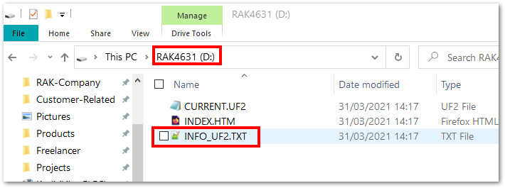
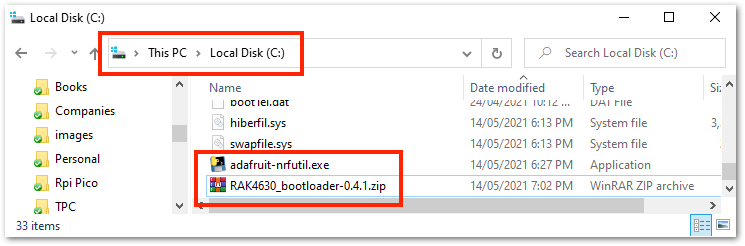
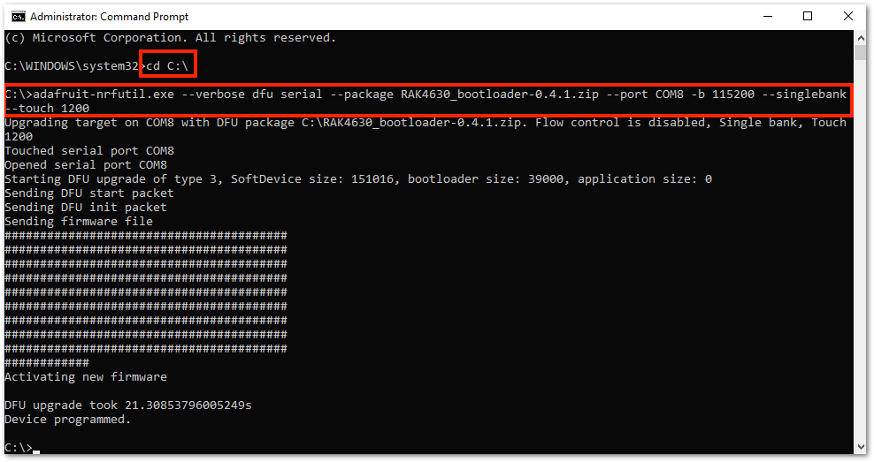
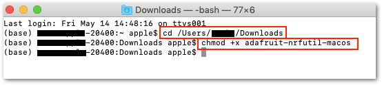
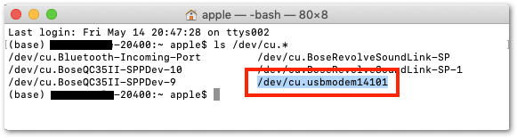
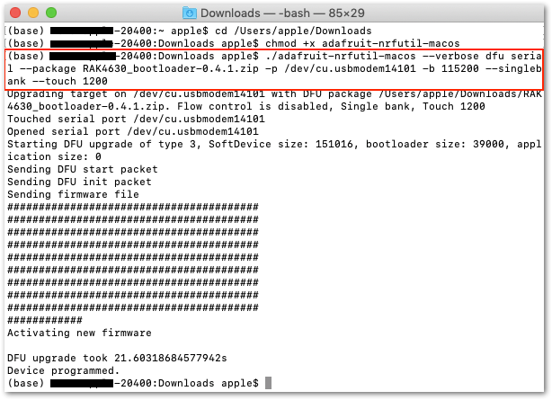
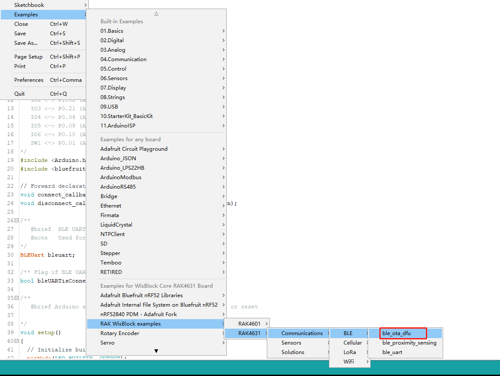
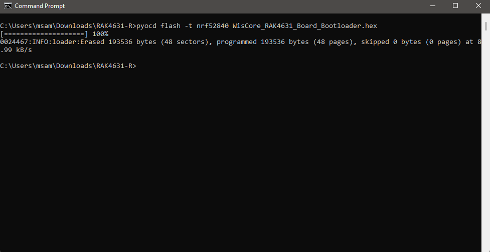

# Bootloader Update Manual 

## Overview

This guide describes how to download the bootloader of RAK4630 in case of any crash or erase during use. The below is important:

- Bootloader includes softdevice and boot of nRF52840. 
- Version is V0.4.2 with softdevice version 140.6.1.1
- Download of Arduino depends on this bootloader
- Every board contains bootloader after leaving factory, so user does not need to flash it.

To flash the bootloader, there are four options:

[Update over USB](#update-over-usb)    
[Update over BLE](#update-over-ble)    
[Update over Jlink/SWD](#update-over-jlink)   
[Update over RAKDAP1](#update-over-rakdap1)   

## How to Check if You Have the Updated RAK4631 Bootloader

You need to connect the RAK4631 to the PC via USB cable and double click reset button on the WisBlock Base.

There will be a new drive named `RAK4631` that will be shown on your folder explorer. Inside this drive, there will a text file named `INFO_UF2.TXT`, as shown below.



If you open `INFO_UF2.TXT`, you'll see 
```txt
UF2 Bootloader 0.4.2 lib/nrfx (v2.0.0) lib/tinyusb (0.10.1-293-gaf8e5a90) lib/uf2 (remotes/origin/configupdate-9-gadbb8c7)
Model: WisBlock RAK4631 Board
Board-ID: WisBlock-RAK4631-Board
Date: Dec  1 2021
SoftDevice: S140 6.1.1
```

If you have a different drive name or older date, it means you do not have the updated RAK4631 Bootloader and you need to update it. 

----

## Update over USB

### Hardware and Tools Required

Required:

- WisBlock Base RAK5005-O
- WisBlock Core RAK4631
- The latest bootloader (V0.4.2 - WisCore_RAK4631_Board_Bootloader.zip)
- Adafruit-nrfutil application depending on your OS version     
- USB cable

Different steps are required depending on your OS.

#### For Windows

Download the [adafruit-nrfutil.exe](https://github.com/adafruit/Adafruit_nRF52_nrfutil/releases/download/%24(APPVEYOR_REPO_TAG_NAME)/adafruit-nrfutil.exe) and the latest [RAK4631 bootloader firmware](https://github.com/RAKWireless/WisBlock/releases).

Once you downloaded these files, you need to put them on a same directory/folder in your computer.

For simplicity, this guide will assume the files are in C: drive.



When the files are ready, you need to open Windows Command Prompt application. Then you need to change the location to C:\.

`cd C:\`

After that, you can now execute the update using this command.

`adafruit-nrfutil.exe --verbose dfu serial --package WisCore_RAK4631_Board_Bootloader.zip --port COM8 -b 115200 --singlebank --touch 1200`



You need to determine the right COM port number of your device. COM8 on the command above is only for illustration. You will get an error if you are not connected to the right COM port number.

##### For Linux

You can get and install adafruit-nrfutil via pip3.

`sudo pip3 install adafruit-nrfutil`

or

`pip3 install --user adafruit-nrfutil`

Then download the latest [RAK4631 bootloader firmware](https://github.com/RAKWireless/WisBlock/releases).

You also need to determine the port name of the RAK4631 using the command:

`ls /dev/tty*`

After determining the port name, go to the directory where the bootloader FW file `WisCore_RAK4631_Board_Bootloader.zip` is located.

Then execute the following command:

`adafruit-nrfutil --verbose dfu serial --package WisCore_RAK4631_Board_Bootloader.zip -p /dev/ttyACM0 -b 115200 --singlebank --touch 1200`


##### For macOS

The same with Windows and Linux procedures, download the latest [RAK4631 bootloader firmware](https://github.com/RAKWireless/WisBlock/releases).

There are two ways to update the RAK4631 bootloader in macOS.

- If you have Python installed, you can follow the same steps for Linux.

- Another way is by creating a macOS executable. To do this method, download [adafruit-nrfutil-macos](https://github.com/adafruit/Adafruit_nRF52_nrfutil/releases/download/%24(APPVEYOR_REPO_TAG_NAME)/adafruit-nrfutil-macos) and make it executable.

Usually, the `adafruit-nrfutil-macos` file will go to the downloads folder. 

The next step after downloading the file is to open the terminal and go to the downloads directory or the location where you put the downloaded file.

`cd /Users/username/Downloads`

And then execute this command:

`chmod +x adafruit-nrfutil-macos`



You also need to determine the port name of the RAK4631 using the command:

`ls /dev/cu.*`.



After all these steps, you can now upload the latest RAK4631 Bootloader Firmware by executing this command:

`./adafruit-nrfutil-macos --verbose dfu serial --package WisCore_RAK4631_Board_Bootloader.zip -p /dev/cu.usbmodem411 -b 115200 --singlebank --touch 1200`



Your RAK4631 will now have the updated Bootloader Firmware.


## Update over BLE

### Hardware and Tools Required

Required:

- WisBlock Base RAK5005-O
- WisBlock Core RAK4631
- The latest bootloader (V0.4.2 - WisCore_RAK4631_Board_Bootloader.zip)
- [nRF Connect for Mobile](https://www.nordicsemi.com/Software-and-tools/Development-Tools/nRF-Connect-for-mobile)
- RAK4631 flashed with a firmware that supports OTA DFU, e.g. [ble_ota_dfu](https://github.com/RAKWireless/WisBlock/tree/master/examples/RAK4630/communications/BLE/ble_ota_dfu)

### Open the example app BLE OTA DFU to the RAK4631



### Flash the example to the RAK4631


### Open nRF Connect for Mobile and connect the BLE named "RAK4631_OTA"


### Click DFU button and select the upgrade Zip package.


### After selecting upgrade package, upgrade starts, we wait until 100% is finished, and the upgrade is complete. If there is power failure or upgrade failure, please follow the previous steps again.

 

### Now that the upgrade is successful, we can use Arduino to download the application.

## Update over JLINK

### Hardware and Tools Required

Required:

- WisBlock Base RAK5005-O
- WisBlock Core RAK4631
- The latest bootloader (V0.4.2 - WisCore_RAK4631_Board_Bootloader.zip)
- J-Link Debugger
- JFlash application

### Install Segger

According to your version of J-Link, install the Segger software from https://www.segger.com/downloads/jlink/ . It includes many good tools for debugging  the embedded device.

### Connect JLink adapter to SWD of the module

Connect the swd  port to PC via Jlink like below


### Download the new bootloader

Steps as below:

- Open J-Flash
- Create a new project. Choose the board as below
- Go into Target->Connect
- Download the booloader from [RAK4631 bootloader firmware](https://github.com/RAKWireless/WisBlock/releases)
- Drag the HEX to the J-Flash
- Select Target->Production Programming. 


## Update over RAKDAP1

### Hardware and Tools Required

Required:

- WisBlock Base RAK5005-O
- WisBlock Core RAK4631
- The latest bootloader (V0.4.2 - WisCore_RAK4631_Board_Bootloader.zip)
- [RAKDAP1 tool](https://store.rakwireless.com/products/daplink-tool)
- pyOCD

### Install pyOCD

pyOCD is an open source Python package for programming and debugging microcontrollers. Refer to [Quick Start Guide](https://docs.rakwireless.com/Product-Categories/Accessories/RAKDAP1-Flash-and-Debug-Tool/Quickstart/#installation) for detailed instructions on how to install the pyOCD tool.

Install the RAK4631 module support package, using the following command:
```c
pyocd pack --install nrf52
```
### Connect RAKDAP1 adapter to SWD of the module

Use the figure below as a guide to connect RAKDAP1 SWD to RAK4631.


### Download the new bootloader

Download the latest [RAK4631 bootloader firmware as hex file](https://github.com/RAKWireless/WisBlock/releases)


Open the command prompt and change the folder where you have saved the bootloader.

After that, you can flash the bootloader using the command:

```c
pyocd flash -t nrf52840 WisCore_RAK4631_Board_Bootloader.hex
```

