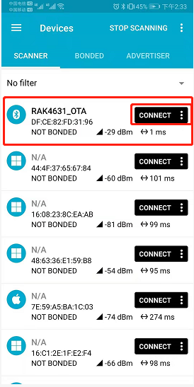
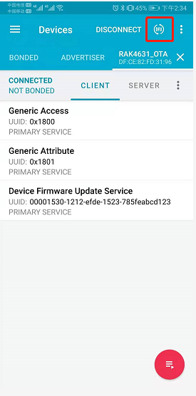
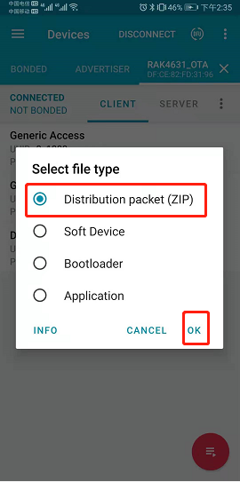

# Upgrade new bootloader with BLE OTA DFU to RAK4631

This document is about using BLE OTA DFU to upgrade bootloader. 

If you want to use jFlash to burn firmware, please select the [specified firmware](./RAK4630_bootloader-0.4.1.hex) and do not need to read this document.

## Requirements

- [Firmware upgrade Zip package](./RAK4630_bootloader-0.4.1.zip)
- [nRF Connect for Mobile](https://www.nordicsemi.com/Software-and-tools/Development-Tools/nRF-Connect-for-mobile)
- RAK4631 + RAK5005 +USB Cable + BLE antenna

	

## Upgrade

1. Choose example of BLE OTA DFU

2. Burn the example to RAK4631

   

3. Open nRF Connect for Mobile and connect the BLE named "RAK4631_OTA"

   	

   4. Click DFU button and select the upgrade Zip package.

      		

   5. After selecting upgrade package, upgrade starts, we wait until 100% is finished, and the upgrade is complete. If there is power failure or upgrade failure, please follow the previous steps again.

      	

   6. Now that the upgrade is successful, we can use Arduino to download the application.

