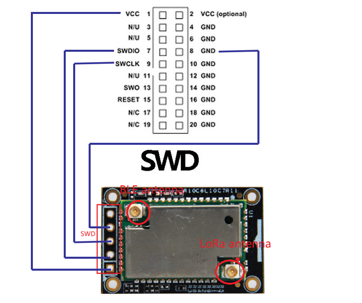
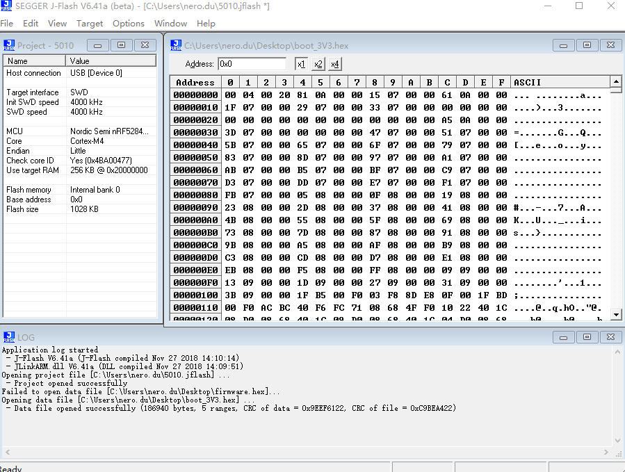

# Bootloader Manual 

# 1. Overview

This guide describes how to download bootloader of RAK4630 in case of any crash or erase during use. The below is important:

- Bootloader includes softdevice and boot of nRF52840. 
- Version is 140.6.1.1
- Download of Arduino depends on this bootloader
- Every board contains bootloader after leaving factory, so user no needs to download again.

# 2. Hardware Required

To Download the bootloader, below are needed

- WisBlock Base RAK5005-O
- WisBlock Core RAK4630
- J-Link Debugger

The RAK4630 is a core which can be connected to CPU SLOT of Wisblock via pin to pin groove like below. Besides, it provides SWD port to download via Jlink. Two antenna (BLE and LoRa). Screws of four corners help stabilize connection with Wisblock.

# 3. Software Required

### 3.1 Install Segger

According to your version of J-Link, install the Segger software from https://www.segger.com/downloads/jlink/ . It includes many good tools for debugging  the embedded device.

### 3.2 Connect

Connect the swd  port to PC via Jlink like below

### 3.3 Download 

Steps as below:

- Open J-Flash
- Create a new project. Choose the board as below
- Go into Target->Connect
- Download the booloader from [here](/bootloader/RAK4630_bootloader.hex)
- Drag the HEX to the J-Flash
- Select Target->Production Programming. 

