# WisBlock Quick Start Guide

<center></center>

## Content
- [Introduction](#introduction)    
- [Safety information](#safety-information)    
- [Hardware Setup](#hardware-setup)
- [Arduino IDE BSP Installation](#arduino-ide-bsp-installation)
- [PlatformIO Installation](#installation-of-board-support-package-in-platformio)


## Introduction

WisBlock is an amazing product built by RAK company for IoT industry. It can build circuits like building blocks quickly to realize your idea, and through high-speed connectors and fasteners interconnection, it can directly compose the reliable industrial products.

WisBlock consists of WisBlock Base, WisBlock Core, WisBlock Sensor, and WisBlock IO.

RAK5005-O is the WisBlock Base board which can be connected with WisBlock Core and WisBlock IO through the connector of the board, and provides direct data bus interconnection. WisBlock Base module also integrates the power supply circuit to realize low power battery power supply. In order to facilitate users, WisBlock Base has reserved USB ports, indicator lights, keys and extended IO interfaces.

RAK4631 is the WisBlock Core board which consists of nRF52840 and SX1262. It supports LoRa® and BLE functions, and supply a rich resource MCU so that you can program it if you want.

WisBlock is not only functional testability product in product development verification stage, but also industrial products oriented to mass production. It uses a high-speed connector to ensure the integrity of the signal. At the same time, it is equipped with fastening screw, which can be used in vibration environment. And WisBlock can be used reliably in various civil and industrial scenarios through rigorous reliability tests.

WisBlock uses a compact stacked hardware design, which integrates various computing, connecting and sensor circuits in the size of 60*30mm. The compact size makes it easy for users to build in various customized housings to achieve complete products. RAK also have a series of housings for WisBlock modules, which can meet the requirements of various protection levels.

More details about WisBlock hardware, please have a look at the document:

https://docs.rakwireless.com/Product-Categories/WisBlock/

## Safety information

Please read the following items carefully so that WisBlock can be used safely.

### Hardware

1) Please use WisBlock according to its hardware specification, including the power supply, the temperature of using, the battery, and so on.

2) Don't submerge WisBlock in liquids, and don't place WisBlock where water can reach.

3) Don't power WisBlock using other power sources which RAK hasn't suggested.


### Software

1)  There is already a bootloader in every WisBlock core board MCU when you receive the device, so that you needn't to flash the bootloader again. Normally, you only need to use it directly or upload new code into it through Arduino IDE. If you accidentally erase the bootloader, please contact with us on RAK forum: forum.rakwireless.com.

2) Please don't unplug any hardware connector when you are uploading code into it, otherwise WisBlock may become unresponsive.


## Hardware Setup

### WisBlock Base Board--- RAK5005-O

RAK5005-O is the WisBlock Base board which can connect with the core board and other sensor boards through some slots. RAK5005-O has an USB interface which connect with the core MCU's USB pins so that you can use Arduino IDE to upload and debug it directly.

<center></center>

Please note: as you see, there are 6 slots on RAK5005-O, "CPU SLOT" is used for the core board which has the main MCU, "IO SLOT" is used for IO extension, for example, RS485 board, 4-20mA/0-5V board, Wi-Fi board, Cellular board. "SLOT A", "SLOT B", "SLOT C", and "SLOT D" are used to connect with I2C board, while "SLOT A" can be used for GPS board too.

You can have a look at the datasheet for more information:

https://docs.rakwireless.com/Product-Categories/WisBlock/RAK5005-O/Datasheet/#wisblock-overview

The RAK5005-O board offers several GPIO's on solder pads or on the WisBlock Sensor or WisBlock IO modules. These GPIO's are named IO1 to IO6 and SW1. These GPIO's are connected to GPIO's of the RAK4631 module.    
**RAK5005-O GPIO mapping to RAK4631 GPIO ports**
 * IO1 <-> P0.17 (Arduino GPIO number 17)
 * IO2 <-> P1.02 (Arduino GPIO number 34)
 * IO3 <-> P0.21 (Arduino GPIO number 21)
 * IO4 <-> P0.04 (Arduino GPIO number 4)
 * IO5 <-> P0.09 (Arduino GPIO number 9)
 * IO6 <-> P0.10 (Arduino GPIO number 10)
 * SW1 <-> P0.01 (Arduino GPIO number 1)

### WisBlock Core board --- RAK4631

RAK4631 is the WisBlock Core board, because the MCU stay on this board.

<center></center>

<center></center>

RAK4631 consists of a nRF52840 MCU and a SX1262 LoRa® chip mainly. The final Arduino  code will be uploaded into nRF52840 actually. This core board supports BLE and LoRa® features. You can connect it with RAK5005-O base board with slot, and program it through the USB interface on RAK5005-O through Arduino IDE.

https://docs.rakwireless.com/Product-Categories/WisBlock/RAK4631/Datasheet/#overview

<center></center>


### WisBlock Sensor Boards

#### Temperature & Humidity sensor board --- RAK1901

RAK1901 is a Temperature & Humidity sensor board with an I2C interface, which means it can be connected with RAK5005-O through the I2C slot (SLOT A/B/C/D).

<center>  </center>

More information about RAK1901, please have a look at the following link:

https://docs.rakwireless.com/Product-Categories/WisBlock/RAK1901/Overview/#product-description


#### Pressure sensor board --- RAK1902

RAK1902 is a pressure sensor board with an I2C interface, which means it can be connected with RAK5005-O through the I2C slot (SLOT A/B/C/D).

<center> </center>

More information about RAK1902, please have a look at the following link:

https://docs.rakwireless.com/Product-Categories/WisBlock/RAK1902/Overview/#product-description


#### Optical sensor board --- RAK1903

RAK1903 is an optical sensor board with an I2C interface, which means it can be connected with RAK5005-O through the I2C slot (SLOT A/B/C/D).

<center> </center>

More information about RAK1903, please have a look at the following link:

https://docs.rakwireless.com/Product-Categories/WisBlock/RAK1903/Overview/#product-description


#### 3-axis acceleration sensor board --- RAK1904

RAK1904 is a 3-axis acceleration sensor board with an I2C interface, which means it can be connected with RAK5005-O through the I2C slot (SLOT A/B/C/D).

<center> </center>

More information about RAK1904, please have a look at the following link:

https://docs.rakwireless.com/Product-Categories/WisBlock/RAK1904/Overview/


#### Environment sensor board --- RAK1906

RAK1906 is an environment sensor board with I2C interface, which means it can be connected with RAK5005-O through the I2C slot (SLOT A/B/C/D).

<center> </center>

More information about RAK1906, please have a look at the following link:

https://docs.rakwireless.com/Product-Categories/WisBlock/RAK1906/Overview/#product-description


#### GPS board --- RAK1910

RAK1910 is a GPS board with UART interface, which means it can only be connected with RAK5005-O through SLOT A.

<center> </center>

<center></center>

More information about RAK1910, please have a look at the following link:

https://docs.rakwireless.com/Product-Categories/WisBlock/RAK1910/Overview/#product-description


### WisBlock IO Boards

#### WiFi board --- RAK2305

RAK2305 is a WiFi board which is ESP32 module actually, and it can only be connected with RAK5005-O through the IO SLOT.

<center>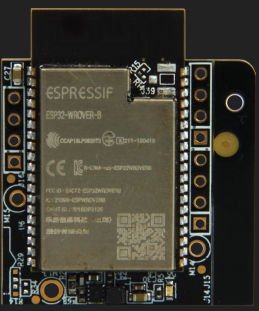 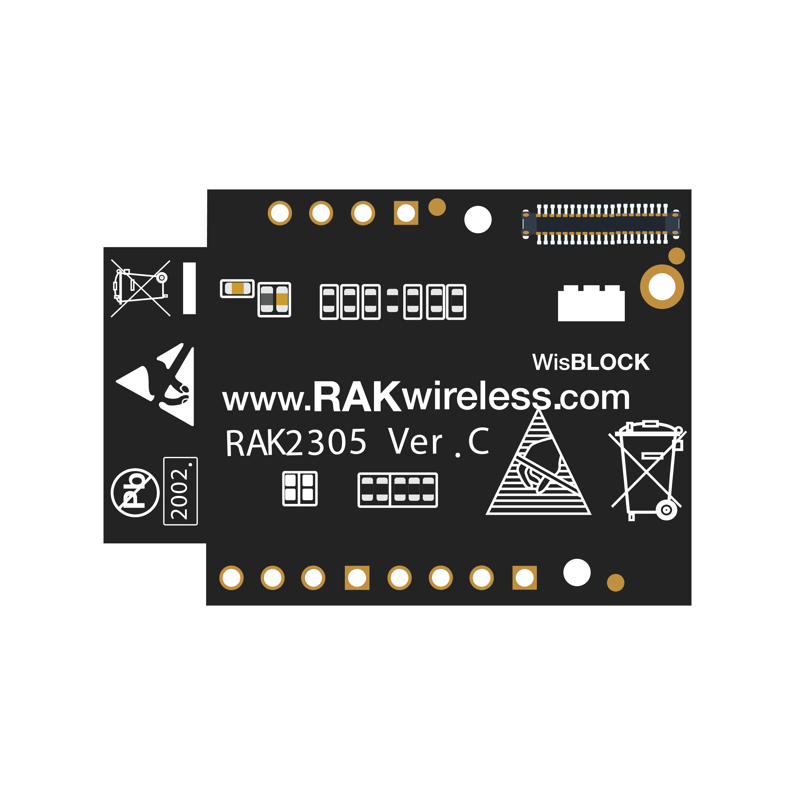</center>

<center>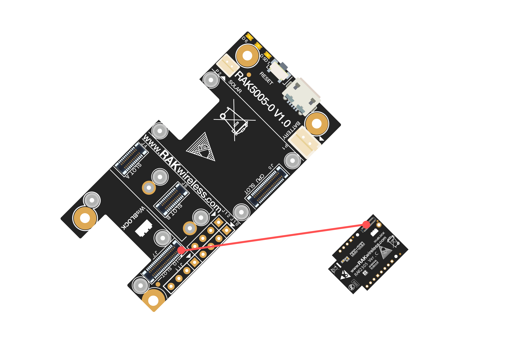</center>

More information about RAK2305, please have a look at the following link:

https://docs.rakwireless.com/Product-Categories/WisBlock/RAK2305/Overview/#product-description


#### Cellular board --- RAK5860

RAK5860 is a cellular board which uses Quectel BG77 module actually, and it can only be connected with RAK5005-O through IO SLOT.

<center> </center>

<center></center>

More information about RAK5860, please have a look at the following link:

https://docs.rakwireless.com/Product-Categories/WisBlock/RAK5860/Overview/#product-description


#### 4~20mA board --- RAK5801

RAK5801 is an IO board which can connect with any 4~20mA sensors. This board can only be connected with RAK5005-O through IO SLOT.

<center></center>

More information about RAK5801, please have a look at the following link:

https://docs.rakwireless.com/Product-Categories/WisBlock/RAK5801/Overview/#product-description


#### 0~5V board --- RAK5811

RAK5811 is an IO board which can connect with any 0~5V sensors. This board can only be connected with RAK5005-O through IO SLOT.

<center></center>

More information about RAK5811, please have a look at the following link:

https://docs.rakwireless.com/Product-Categories/WisBlock/RAK5811/Overview/#product-description


#### RS485 board --- RAK5802

RAK5802 is an IO board which can connect with any RS485 sensors. This board can only be connected with RAK5005-O through IO SLOT.

<center></center>

More information about RAK5802, please have a look at the following link:

https://docs.rakwireless.com/Product-Categories/WisBlock/RAK5802/Overview/#product-description


#### IO extension board --- RAK5804

RAK5804 is an IO extension board which is used to extent more IO interface, and it can only be connected with RAK5005-O through IO SLOT.

<center></center>

More information about RAK5804, please have a look at the following link:

https://docs.rakwireless.com/Product-Categories/WisBlock/RAK5804/Overview/#product-description


#### Sensor conversion board --- RAK1920

RAK1920 is a sensor conversion board which can connect with any Microbus, Grove, or Qwiic sensors. This board can only be connected with RAK5005-O through IO SLOT.

<center></center>

More information about RAK1920, please have a look at the following link:

https://docs.rakwireless.com/Product-Categories/WisBlock/RAK1920/Overview/#product-description


#### OLED --- RAK1921

RAK1921 is an OLED board which uses SSD1306(128*64, I2C) actually.

<center></center>

https://docs.rakwireless.com/Product-Categories/WisBlock/RAK1921/Overview/#product-description


### Antennas

#### BLE antenna:

<center>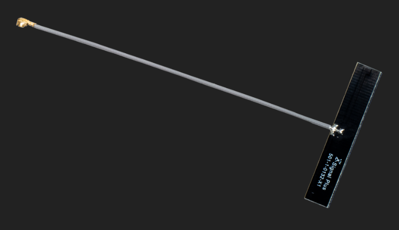</center>

#### LoRa® antenna:

<center>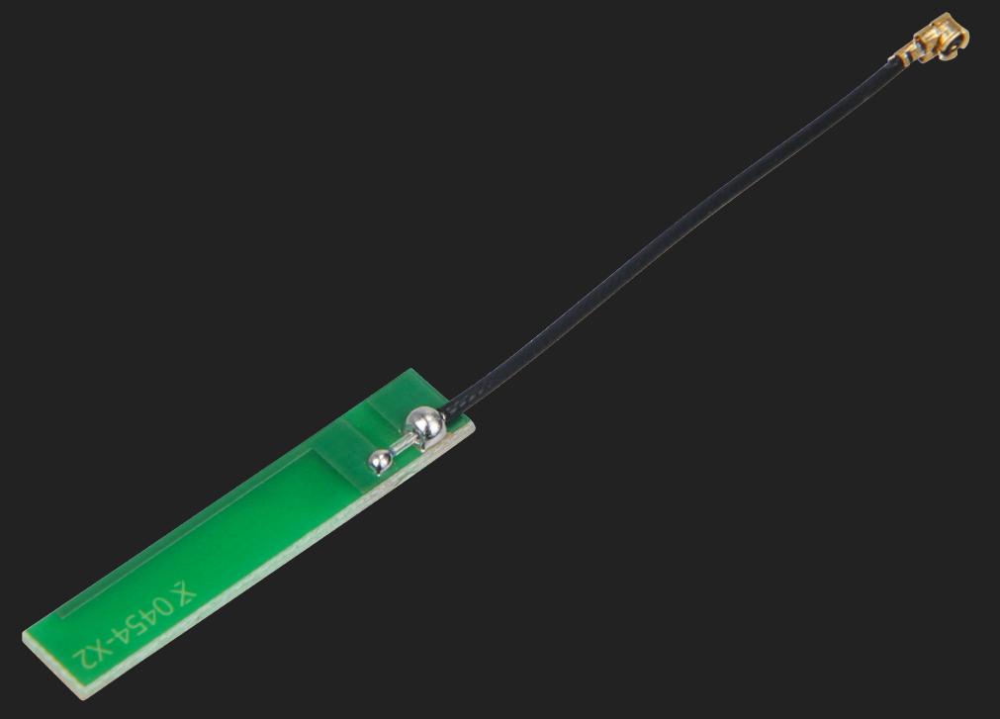</center>

#### GPS antenna:

<center></center>

Just connect them to the IPEX connector of the RAK4631 or RAK1910.


### Battery

Please use the battery which RAK suggest, and connect the battery with RAK5005-O as follow:

<center></center>

# When connecting the battery make sure the polarity is correct. Not all connectors are wired the same.
# Ground pole should be close to the PCB boarder.
# Plus pole should be close to USB connector.

Battery specification

| No.  | Items                     | Specifications           |
| ---- | ------------------------- | ------------------------ |
| 1    | Charge Cut-off Voltage    | 4.2V                     |
| 2    | Nominal Voltage           | 3.7V                     |
| 3    | Discharge Cut-off Voltage | 2.75V                    |
| 4    | Typical Capacity          | 2650mAh                  |
| 5    | Max Discharge Current     | 0.5C at 25℃-45℃          |
| 6    | PH Connector              | 2.0mm pitch              |
| 7    | Cable Length              | 110.0±3.0mm              |
| 8    | Cable Color               | Red: VBAT+, Black: VBAT- |

### Solar panel

You can connect the solar panel with RAK5005-O as follow:

<center></center>


Solar panel specification

| No.  | Items            | specifications                         |
| ---- | ---------------- | -------------------------------------- |
| 1    | Nominal  Voltage | 5V                                     |
| 2    | Typical Current  | 80mA                                   |
| 3    | Size             | Length: 60mm, Width: 60mm, Height: 2mm |
| 4    | Connector        | 1.5mm pitch                            |
| 5    | Cable color      | Red: VCC, Black: GND                   |

### Enclosures
| Outdoor | Indoor |
| :-: | :-: |
| 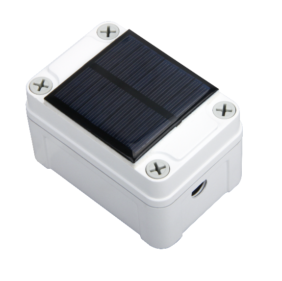 | 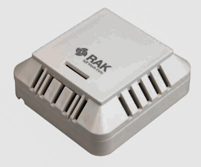 |
|  | 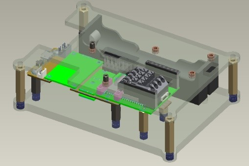 |


## Arduino IDE BSP Installation

You can use Arduino IDE for WisBlock coding and programming.

Please follow the installation instructions in [RAK-nRF52-Arduino](https://github.com/RAKWireless/RAK-nRF52-Arduino#bsp-installation) 
<!--
Please download the Arduino IDE on the Arduino official website:

https://www.arduino.cc/en/Main/Software 

You can see the current version of Arduino IDE is V1.8.13, and there are several versions for Windows, Linux, and Mac OS X.


Just download the correct version of Arduino IDE from here.


### Install in Windows

Now, let's install the Arduino IDE, which you just download, on a Windows PC.


"I Agree"


"Next"

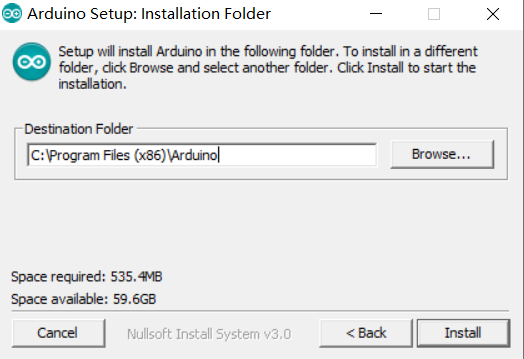

"Install"

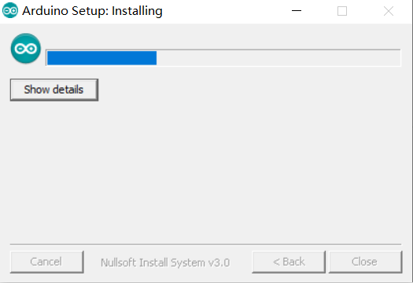

After 100% progress, Arduino IDE has been installed successfully.


### Install in Linux

In Linux, there is no install process actually, just a process of uncompression, then you can open Arduino IDE successfully.


### Install in Mac OS X

In Mac OS X, it is almost same with Linux, there is no install process actually, just a process of uncompression, then you can open Arduino IDE successfully.


### Open Arduino IDE

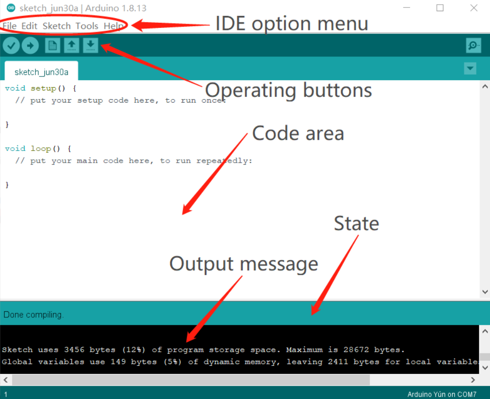

As you see, Arduino IDE has mainly 5 parts:

1) IDE option menu

You can configure some general parameters such as the serial port, the board information, the libraries, the edit parameters, and so on.

2) Operating buttons

You can verify/compile source code, upload the compiled code into WisBlock, open a new Arduino IDE window, open an exist application, or save the current application. 

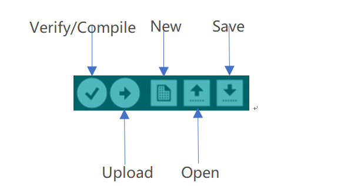


3) Code area

You can edit the source code which will be compiled and uploaded into WisBlock later in this area.

4) State area

5) Output message area

You can see the output message in this area, no matter failed information and success information.


### Configuration On Arduino IDE

Once Arduino IDE has been installed successfully, and you've understood the mainly parts of Arduino IDE, we can do some configuration changes on Arduino IDE so that it can be adapted to WisBlock.

We use https://github.com/RAKWireless/RAK-nRF52-Arduino and do as below:

- Open Arduino IDE

- Go into Preferences

  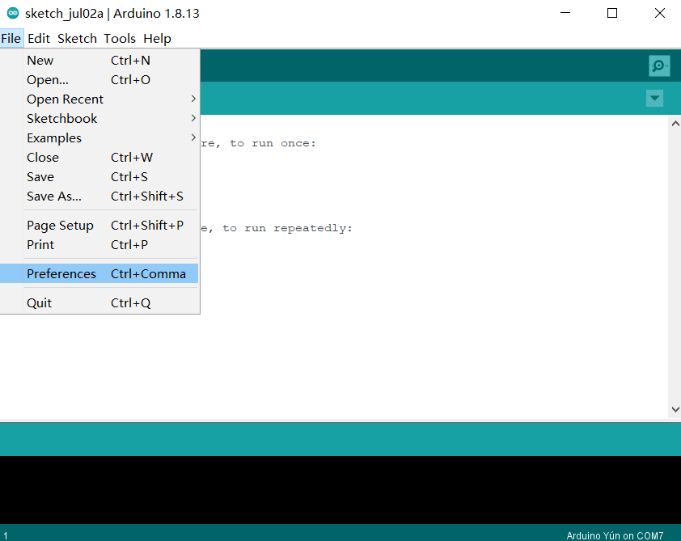

- Add https://downloads.rakwireless.com/Arduino/BSP/package_raknrf_index.json as an 'Additional Board Manager URL':

  

- Restart the Arduino IDE

- Open the Boards Manager from the Tools -> Board menu

  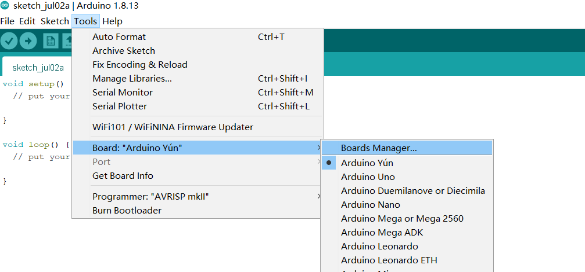

- Search and install "RAK" as the following image shows, and install it. It is the BSP actually.

  


- After installing BSP successfully, just restart Arduino IDE, and select "WisBlock Core RAK4631 Board" as follow:

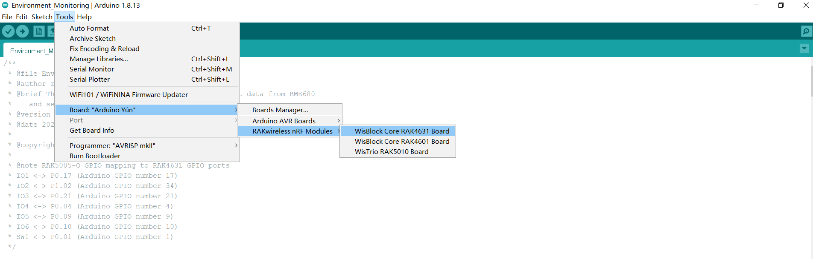

OK, we've configured Arduino IDE correctly and install the BSP successfully!
-->

### Load Examples

RAK has supplied many examples source code on Github for WisBlock:

| Communication Examples | Sensor and IO Examples | Solutions |
| --                     | --                     | --        |
| [LoRaWAN](/examples/communications/LoRa/LoRaWAN/) | [RAK1901 Temperature&Humidity SHTC3](/examples/sensors/RAK1901_Temperature_Humidity_SHTC3/) | [BLE Gateway](/examples/solutions/BLE_Gateway/) |
| [BLE Proximity Sensing](/examples/communications/BLE/ble_proximity_sensing/) | [RAK1902 Pressure LPS22HB](/examples/sensors/RAK1902_Pressure_LPS22HB/) | [Hydraulic Pressure Monitoring](/examples/solutions/Hydraulic_Pressure_Monitoring/) |
| [BLE OTA DFU](/examples/communications/BLE/ble_ota_dfu/) | [RAK1903 Optical OPT3001](/examples/sensors/RAK1903_Optical_OPT3001/) | [Environment Monitoring](/examples/solutions/Environment_Monitoring/) |
| [BLE UART](/examples/communications/BLE/ble_uart/) | [RAK1906 Environment BME680](/examples/sensors/RAK1906_Environment_BEM680/) | [Water Level Monitoring](/examples/solutions/Water_Level_Monitoring/) |
| [WiFi](/examples/communications/WiFi/) | [RAK1910 GPS UBLOX7](/examples/sensors/RAK1910_GPS_UBLOX7/) | [Weather Monitoring](/examples/solutions/Weather_Monitoring/) |
| [Cellular](/examples/communications/Cellular/) | [RAK1920 MikroBUS Temperature TMP102](/examples/sensors/RAK1920_MikroBUS_Temperature_TMP102/) | [GPS Tracker](/examples/solutions/GPS_Tracker/) |
|  | [RAK1920 QWIIC AirQuality SGP30](/examples/sensors/RAK1920_QWIIC_AirQuality_SGP30/) | [PAR Monitoring](/examples/solutions/PAR_Monitoring/) |
|  | [RAK1920 Grove PIR AS312](/examples/sensors/RAK1920_Grove_PIR_AS312/) | [Soil Conductivity Monitoring](/examples/solutions/Soil_Conductivity_Monitoring/) |
|  | [RAK1920 Grove Color TCS3472](/examples/sensors/RAK1920_Grove_Color_TCS3472/) | [Soil pH Monitoring](/examples/solutions/Soil_pH_Monitoring/) |
|  | [RAK1921 OLED SSD1306](/examples/sensors/RAK1921_OLED_SSD1306/) | [Wind Speed Monitoring](/examples/solutions/Wind_Speed_Monitoring/) |
|  | [RAK1921 Moving Logo SSD1306](/examples/sensors/RAK1921_Moving_Logo_SSD1306/) | [Intelligent Agriculture](/examples/solutions/Inteligence_Agriculture/) |
|  | [RAK1921 Jumping Ball SSD1306](/examples/sensors/RAK1921_Jumping_Ball_SSD1306/) |  |
|  | [RAK5802 RS485](/examples/sensors/RAK5802_RS485/) |  |
|  | [RAK5801 4-20mA](/examples/sensors/RAK5801_4-20mA/) |  |
|  | [RAK5811 0-5V](/examples/sensors/RAK5811_0-5V/) |  |
|  | [RAK4630 Battery Level](/examples/sensors/RAK4630_Battery_Level_Detect/) |  |
<!-- 
|  | [RAK4630 NOR Flash](/examples/sensors/RAK4630_NOR-Flash/) |  |
->

<!--
https://github.com/RAKWireless/WisBlock/tree/master/examples

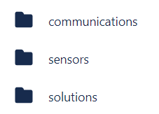

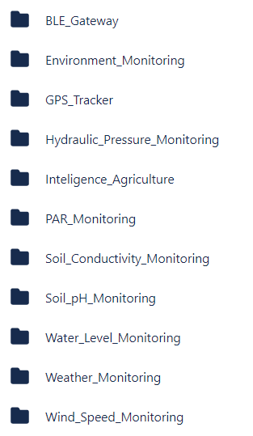
-->
You can use WisBlock directly or make their customized code according to these examples source code. What you need to do is just to load one of these examples into Arduino IDE by opening a .ino file in RAK examples, in this document, we use "ble_proximity_sensing.ino":    
    


----
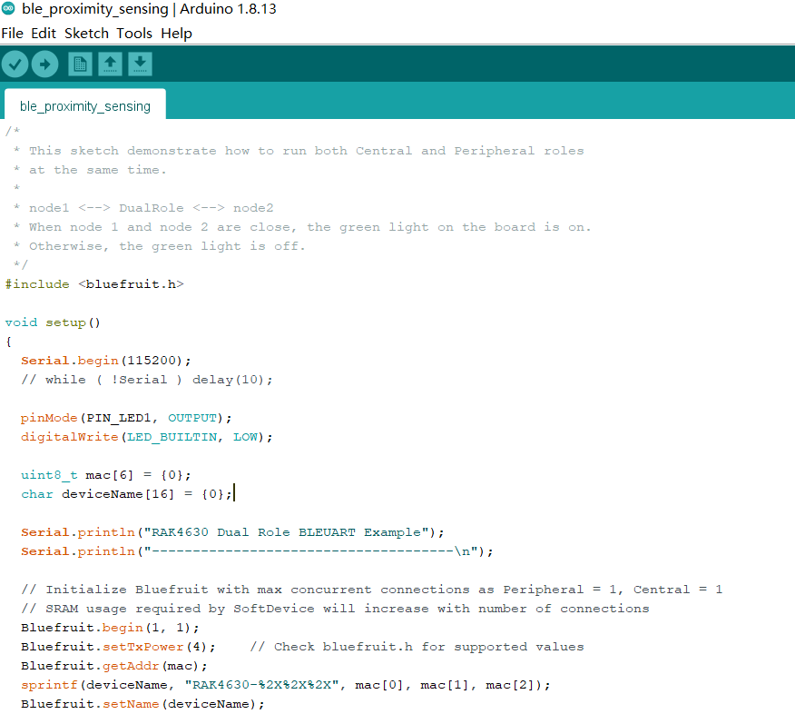

Now, we can compile it directly according to the [Compiling Project](#compiling-project), or do some customized code before compiling it if you want.

About customization code, you can have a look at the section 9 for more details.


### Compiling Project

The compiling process is very easy, what you need to do is just to click the Verify/Compile button on Arduino IDE:

----


Then it will start to compile:

----
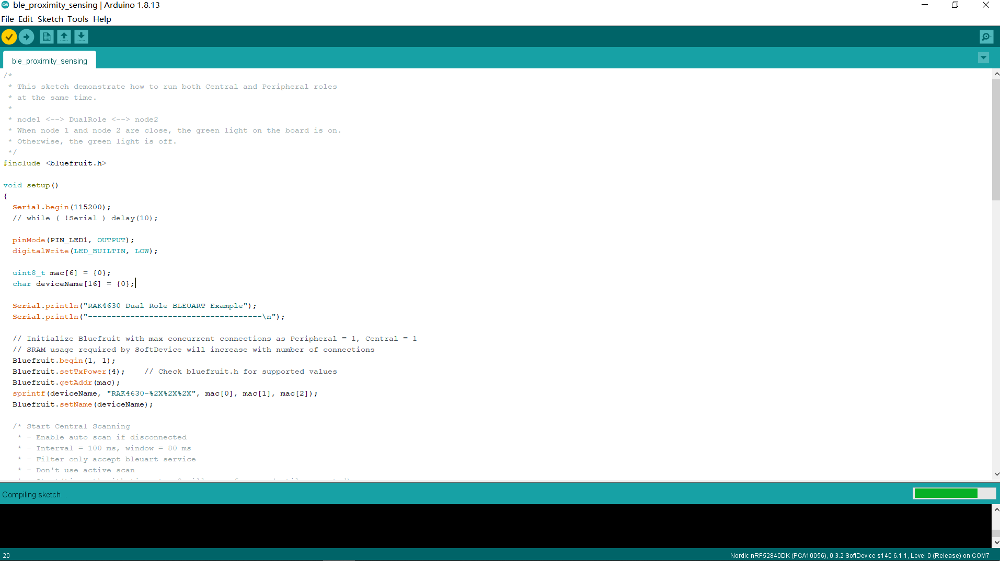

After compiling successfully, you can see some information in the output message area, and the state is "Done compiling":

----


Now, you can connect your WisBlock hardware with your PC, and upload the code into it.

### Uploading to WisBlock

Before uploading, please make sure that your WisBlock hardware has been connected with your PC correctly, and your PC has recognized WisBlock hardware successfully. If it is, you can select the port now as the following image shows:

----


Then click the "Upload" button to start it:

----


After uploading successfully, you can see some information as the following image shows in the output message area:

----


Great! That means you've uploaded the code into WisBlock successfully.

Now, enjoy you WisBlock and have an amazing play time!


### Customized Code

As you know, RAK has supplied some examples source code for reference so that you can learn some code level method about how to do an application for WisBlock. Meanwhile, RAK has supplied a set of tutorials too, which has introduced the ability of WisBlock software and shown the development process of these RAK examples so that you can understand better about how to do some customized code.

All of these tutorials can be found in every example folder:

https://github.com/RAKWireless/WisBlock/tree/master/examples


## Installation of Board Support Package in PlatformIO

### Install PlatformIO

First of all, install VS code which is a great and open source tool, and you can download it here:

https://code.visualstudio.com/

After installing VS code, you can search PlatformIO and install it in the Extensions item:


### Install Nordic nRF52 Arduino framework 

After installing PlatformIO, you can see the PlatformIO icon and open it as follow:


Open "Platforms" in PlatformIO and search "Nordic" as follow:


You can see there are several items, just click "Nordic nRF52" item and "Install" it as follow:


### Get patch files for RAK WisBlock Core boards 

Download the PlatformIO folder from:

https://github.com/RAKWireless/WisBlock/tree/master/PlatformIO/

and save it on your computer.

### Add WisBlock Core RAK4631 to the platform

Copy the file **`wiscore_rak4631.json`** to the boards folder of the nordicnrf52 platform folder.

The path maybe like: 

 - Windows: %USER%\.platformio\platforms\nordicnrf52\boards

Then, create a new project in PlatformIO:


Choose "WisCore RAK4631 Board (RAKwireless)" for "Board" item, and choose "Arduino" for "Framework" item as follow:


After creating successfully, you can see the project:


### Add WisBlock Core RAK4631 to the package

Now, Copy the complete folder "WisCore_RAK4631_Board" in the "PlatformIO" folder which you just downloaded to the framework-arduinoadafruitnrf52 package variants folder. The path maybe like:
 - Windows: %USER%\.platformio\packages\framework-arduinoadafruitnrf52\variants

Finally, restart the PlatformIO.

OK, you've install and configure PlatformIO for WisBlock successfully.

### First example code

Now, let's try to compile an example of WisBlock using PlatformIO. We use the LoRaWAN® OTAA example in this document:

https://github.com/RAKWireless/WisBlock/tree/master/examples/communications/LoRa/LoRaWAN/LoRaWAN_OTAA/

Just copy the source code of the .ino file into the main.cpp of the PlatformIO project we just created:


Then we need to install the LoRaWAN® library "SX126x-Arduino" in PlatformIO firstly because this example is built based on this library. Just search "SX126x" in "Libraries" item of PlatformIO, and you can see "SX126x-Arduino" as follow:


Just click it and "Install" this library as follow:


To define your LoRaWan regional settings, open the file `platformio.ino` and set the region as a build-flag. In this example we set it to US915:

```ini
build_flags = 
    -DREGION_US915
```

And here we set the region to EU868:

```ini
build_flags = 
    -DREGION_EU868
```

 

Then compile it by click the compiling icon at the bottom tool bar as follow:

 


Great! We've compiled this example successfully!

Same as in Arduino IDE, there is an upload icon (green circle) on the right of the compiling icon (red circle) which can be used to upload the compiled firmware into your device.

