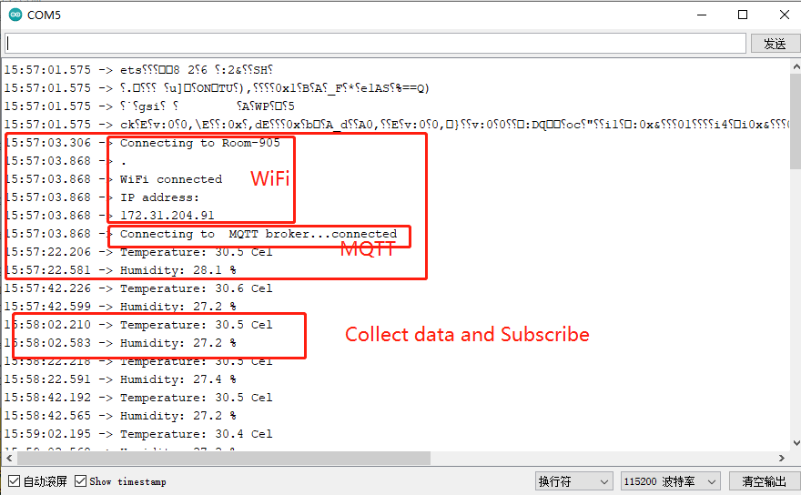
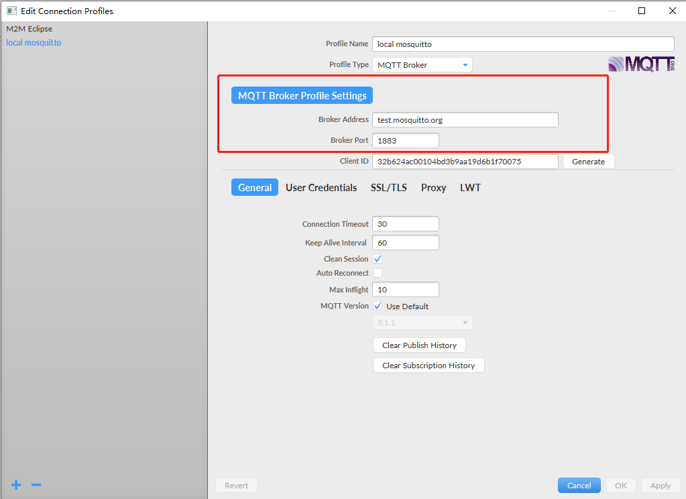
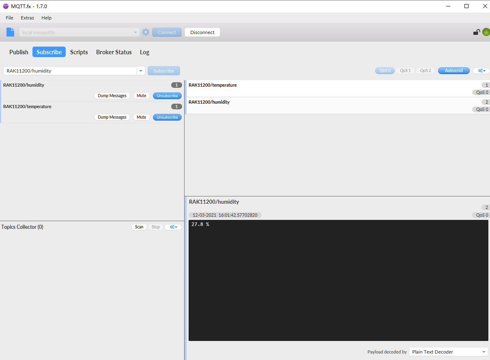
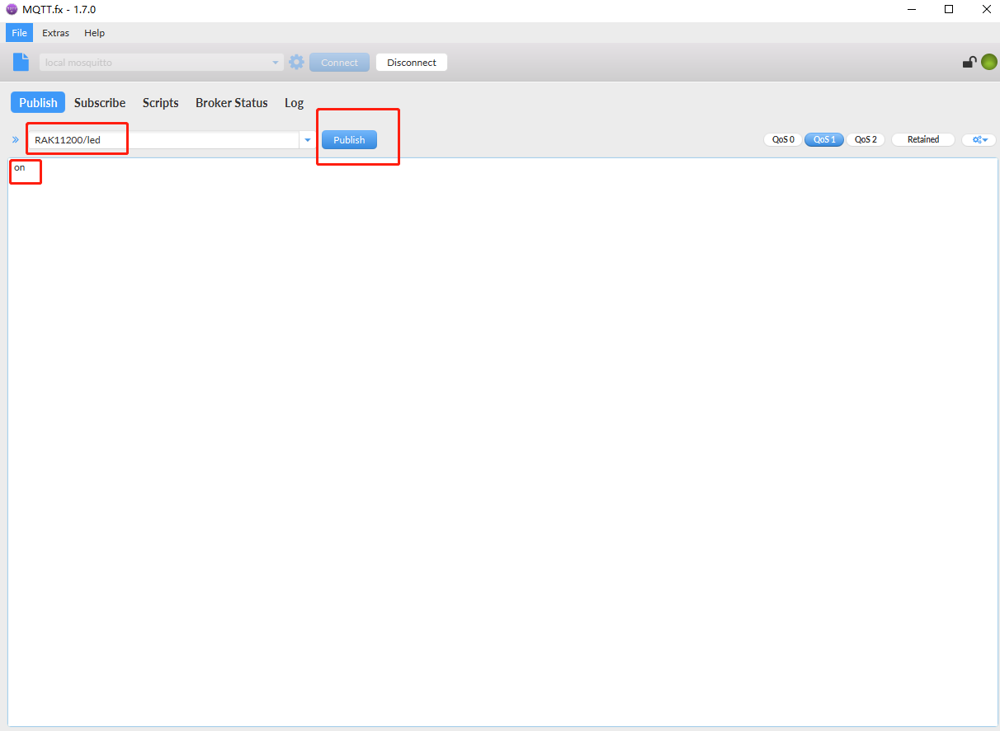
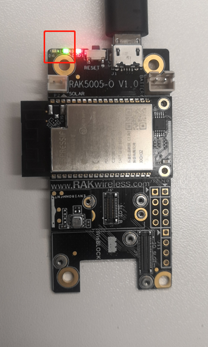
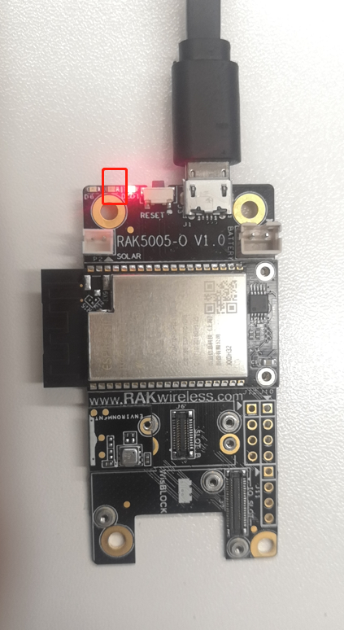
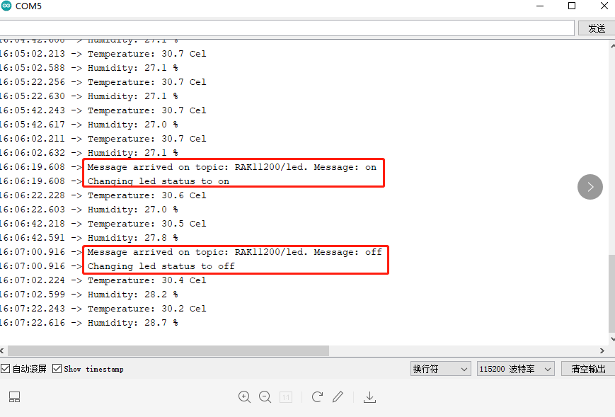

When the device is powered on, the log is as follows:

configure [mqtt.fx]([Download (jensd.de)](http://www.mqttfx.jensd.de/index.php/download)) to connect mqtt broker.

configure mqtt.fx to subscribe specific topics.

Publish topic to control LED on/off.

Publish topic to control LED off.

Arduino log is as follows.

