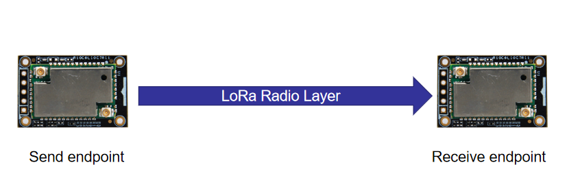
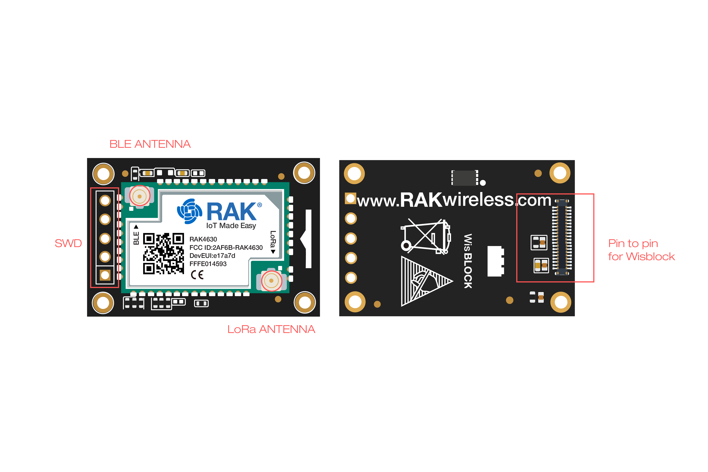
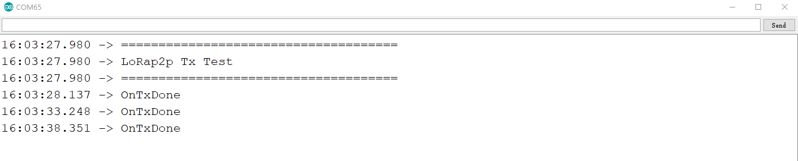
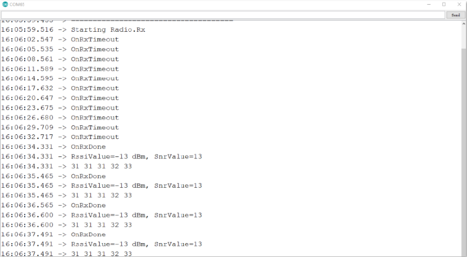

# LoRa® point to point communication examples

## 1. Overview

This example shows how to setup two WisBlock to communicate with each other over LoRa®.  Different to LoRaWan®, when using the low-level communication functions as below



The application has to take care that both nodes are initialized to use the same frequency, datarate, spreading factor, coding rates, ....   Please check below code explanation for information about these settings.         


| Parameters       | Unit                                                        |
| ---------------- | ----------------------------------------------------------- |
| Frequency        | Hz                                                          |
| Bandwidth        | 0: 125KHz  1: 250KHz  2: 500KHz                             |
| Codeingrate      | 1: 4/5  2: 4/6  3: 4/7  4: 4/8                              |
| Spreading Factor | 6: 64  7: 128  8: 256  9: 512  10: 1024  11: 2048  12: 4096 |
| PowerdBm         | dBm, -3~22                                                  |

## 2. Hardware Required

To build the LoRa® system. With just one WisBlock Core RAK4631 plugged into the WisBlock Base RAK5005-O board the system is ready to be used.

- WisBlock Base RAK5005-O * 2
- WisBlock Core RAK4631 * 2

The RAK4631 is the WisBlock Core which can be connected to CPU SLOT of WisBlock via pin to pin groove like below. Besides, it provides SWD port to download via J-Link. Two antenna (BLE and LoRa®). Screws of four corners help stabilize connection with WisBlock.



## 3. Software Required

After install Arduino IDE and BSP according to the Quick Start Guide, you can install LoRaWAN® library now. Step as below:

- Start the Arduino IDE
- Open Library Manager, search for sx126x-Arduino, and install


## 4. TX mode

After download Tx demo, it will send '12345' per 5s.



P2P code is similar with LoRaWAN®. The difference is directly using radio part, rather than mac layer. User can attach serveral callbacks to radioevents.

```
// Initialize LoRa chip.
  lora_rak4630_init();

	// Initialize Serial for debug output
  Serial.begin(115200);
  while(!Serial){delay(10);}
	Serial.println("=====================================");
	Serial.println("LoRap2p Tx Test");
	Serial.println("=====================================");

	// Initialize the Radio callbacks
	RadioEvents.TxDone = OnTxDone;
	RadioEvents.RxDone = NULL;
	RadioEvents.TxTimeout = OnTxTimeout;
	RadioEvents.RxTimeout = NULL;
	RadioEvents.RxError = NULL;
	RadioEvents.CadDone = NULL;

	// Initialize the Radio
	Radio.Init(&RadioEvents);

	// Set Radio channel
	Radio.SetChannel(RF_FREQUENCY);

	// Set Radio TX configuration
	Radio.SetTxConfig(MODEM_LORA, TX_OUTPUT_POWER, 0, LORA_BANDWIDTH,
					  LORA_SPREADING_FACTOR, LORA_CODINGRATE,
					  LORA_PREAMBLE_LENGTH, LORA_FIX_LENGTH_PAYLOAD_ON,
					  true, 0, 0, LORA_IQ_INVERSION_ON, TX_TIMEOUT_VALUE);
```

-  OnTxDone: If finish sending successfully, the radio layer will call this. User can add job here.
-  OnTxTimeout: If send unsuccessfully. After tx timeout, the radio layer will call this. User can send again here.

Complete code as below

```
#include <Arduino.h>
#include <SX126x-RAK4630.h>
#include <SPI.h>

// Function declarations
void OnTxDone(void);
void OnTxTimeout(void);


#ifdef NRF52_SERIES
#define LED_BUILTIN 35
#endif

// Define LoRa parameters
#define RF_FREQUENCY 868300000  // Hz
#define TX_OUTPUT_POWER 22		// dBm
#define LORA_BANDWIDTH 0		// [0: 125 kHz, 1: 250 kHz, 2: 500 kHz, 3: Reserved]
#define LORA_SPREADING_FACTOR 7 // [SF7..SF12]
#define LORA_CODINGRATE 1		// [1: 4/5, 2: 4/6,  3: 4/7,  4: 4/8]
#define LORA_PREAMBLE_LENGTH 8  // Same for Tx and Rx
#define LORA_SYMBOL_TIMEOUT 0   // Symbols
#define LORA_FIX_LENGTH_PAYLOAD_ON false
#define LORA_IQ_INVERSION_ON false
#define RX_TIMEOUT_VALUE 3000
#define TX_TIMEOUT_VALUE 3000

static RadioEvents_t RadioEvents;
static uint8_t TxdBuffer[64];


void setup()
{

  // Initialize LoRa chip.
  lora_rak4630_init();

	// Initialize Serial for debug output
  Serial.begin(115200);
  while(!Serial){delay(10);}
	Serial.println("=====================================");
	Serial.println("LoRap2p Tx Test");
	Serial.println("=====================================");

	// Initialize the Radio callbacks
	RadioEvents.TxDone = OnTxDone;
	RadioEvents.RxDone = NULL;
	RadioEvents.TxTimeout = OnTxTimeout;
	RadioEvents.RxTimeout = NULL;
	RadioEvents.RxError = NULL;
	RadioEvents.CadDone = NULL;

	// Initialize the Radio
	Radio.Init(&RadioEvents);

	// Set Radio channel
	Radio.SetChannel(RF_FREQUENCY);

	// Set Radio TX configuration
	Radio.SetTxConfig(MODEM_LORA, TX_OUTPUT_POWER, 0, LORA_BANDWIDTH,
					  LORA_SPREADING_FACTOR, LORA_CODINGRATE,
					  LORA_PREAMBLE_LENGTH, LORA_FIX_LENGTH_PAYLOAD_ON,
					  true, 0, 0, LORA_IQ_INVERSION_ON, TX_TIMEOUT_VALUE);
  send();
}

void loop()
{
	// Handle Radio events
	Radio.IrqProcess();

	// We are on FreeRTOS, give other tasks a chance to run
	delay(100);
	yield();
}

/**@brief Function to be executed on Radio Tx Done event
 */
void OnTxDone(void)
{
	Serial.println("OnTxDone");
  delay(5000);
  send();
}


/**@brief Function to be executed on Radio Tx Timeout event
 */
void OnTxTimeout(void)
{
	Serial.println("OnTxTimeout");
}

void send()
{
    TxdBuffer[0] = 'H';
    TxdBuffer[1] = 'e';
    TxdBuffer[2] = 'l';
    TxdBuffer[3] = 'l';
    TxdBuffer[4] = 'o';
    Radio.Send(TxdBuffer, 5);  
}
```


## 5. RX mode

After download Rx demo, it will keep listening forever (please wait for stable after serveral seconds later). If receive some data, it will print related information, like receive data(ASCII), RSSI and SNR. The Arduino Serial Monitor responses slowly sometimes. This will lead no receive data log in it. You can choose other serial tools (must support DTR).




Same as above, There are three related callbacks:

-  OnRxDone: If receive successfully, the radio layer will call this. User can get receive data, RSSI, SNR here.
-  OnRxTimeout: If no data receive. After rx timeout, the radio layer will call this. And restart to listen.
-  OnRxError: If any receive error, the radio layer will call this.  And restart to listen.

Complete code as below:

```
#include <Arduino.h>
#include <SX126x-RAK4630.h>
#include <SPI.h>

// Function declarations
void OnRxDone(uint8_t *payload, uint16_t size, int16_t rssi, int8_t snr);
void OnRxTimeout(void);
void OnRxError(void);


#ifdef NRF52_SERIES
#define LED_BUILTIN 35
#endif

// Define LoRa parameters
#define RF_FREQUENCY 868300000  // Hz
#define TX_OUTPUT_POWER 22		// dBm
#define LORA_BANDWIDTH 0		// [0: 125 kHz, 1: 250 kHz, 2: 500 kHz, 3: Reserved]
#define LORA_SPREADING_FACTOR 7 // [SF7..SF12]
#define LORA_CODINGRATE 1		// [1: 4/5, 2: 4/6,  3: 4/7,  4: 4/8]
#define LORA_PREAMBLE_LENGTH 8  // Same for Tx and Rx
#define LORA_SYMBOL_TIMEOUT 0   // Symbols
#define LORA_FIX_LENGTH_PAYLOAD_ON false
#define LORA_IQ_INVERSION_ON false
#define RX_TIMEOUT_VALUE 3000
#define TX_TIMEOUT_VALUE 3000

static RadioEvents_t RadioEvents;

static uint8_t RcvBuffer[64];

void setup()
{

  // Initialize LoRa chip.
  lora_rak4630_init();

	// Initialize Serial for debug output
  Serial.begin(115200);
  while(!Serial){delay(10);}
	Serial.println("=====================================");
	Serial.println("LoRaP2P Rx Test");
	Serial.println("=====================================");


	// Initialize the Radio callbacks
	RadioEvents.TxDone = NULL;
	RadioEvents.RxDone = OnRxDone;
	RadioEvents.TxTimeout = NULL;
	RadioEvents.RxTimeout = OnRxTimeout;
	RadioEvents.RxError = OnRxError;
	RadioEvents.CadDone = NULL;

	// Initialize the Radio
	Radio.Init(&RadioEvents);

	// Set Radio channel
	Radio.SetChannel(RF_FREQUENCY);

	// Set Radio RX configuration
	Radio.SetRxConfig(MODEM_LORA, LORA_BANDWIDTH, LORA_SPREADING_FACTOR,
					  LORA_CODINGRATE, 0, LORA_PREAMBLE_LENGTH,
					  LORA_SYMBOL_TIMEOUT, LORA_FIX_LENGTH_PAYLOAD_ON,
					  0, true, 0, 0, LORA_IQ_INVERSION_ON, true);

	// Start LoRa
	Serial.println("Starting Radio.Rx");
	Radio.Rx(RX_TIMEOUT_VALUE);
}

void loop()
{
	// Handle Radio events
	Radio.IrqProcess();

	// We are on FreeRTOS, give other tasks a chance to run
	delay(100);
	yield();
}


/**@brief Function to be executed on Radio Rx Done event
 */
void OnRxDone(uint8_t *payload, uint16_t size, int16_t rssi, int8_t snr)
{
	Serial.println("OnRxDone");
	delay(10);
	memcpy(RcvBuffer, payload, size);

	Serial.printf("RssiValue=%d dBm, SnrValue=%d\n", rssi, snr);

	for (int idx = 0; idx < size; idx++)
	{
		Serial.printf("%02X ", RcvBuffer[idx]);
	}
	Serial.println("");
  Radio.Rx(RX_TIMEOUT_VALUE);
}

/**@brief Function to be executed on Radio Rx Timeout event
 */
void OnRxTimeout(void)
{
	Serial.println("OnRxTimeout");
  Radio.Rx(RX_TIMEOUT_VALUE);
}

/**@brief Function to be executed on Radio Rx Error event
 */
void OnRxError(void)
{
	Serial.println("OnRxError");
	Radio.Rx(RX_TIMEOUT_VALUE);
}
```

LoRa® is a registered trademark or service mark of Semtech Corporation or its affiliates. LoRaWAN® is a licensed mark.