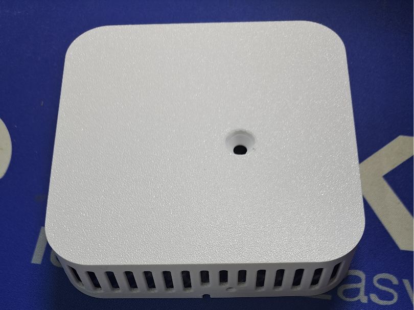
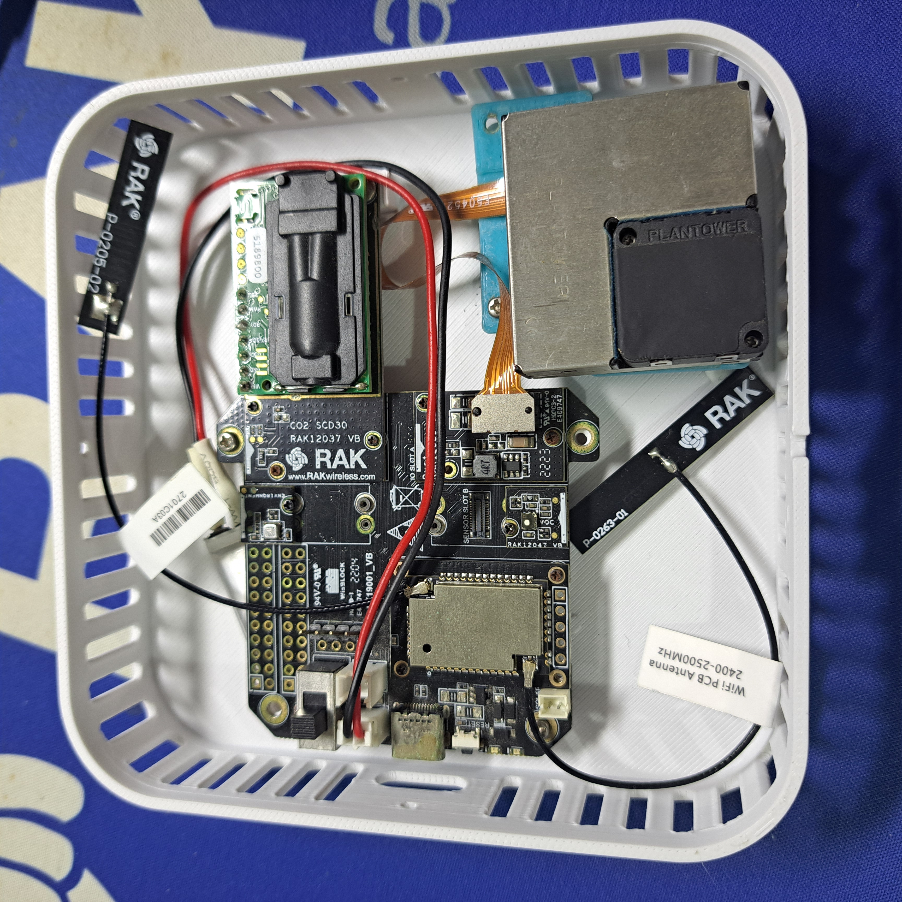

# LoRa P2P gateway to MQTT with RAK3312

This example shows how to receive P2P packets and forward them to a MQTT broker over WiFi.

WiFi credentials and LoRa P2P settings have to be set with AT commands over the USB port of the RAK3312

P2P payloads need to have a unique device ID and sensor data in Cayenne LPP format.

This example includes as well a wide range of WisBlock Sensor Modules:

[RAK1901 Temperature and humidity sensor](https://store.rakwireless.com/products/rak1901-shtc3-temperature-humidity-sensor)    
[RAK1902 Barometric pressure sensor](https://store.rakwireless.com/products/rak1902-kps22hb-barometric-pressure-sensor)    
[RAK1903 Light sensor](https://store.rakwireless.com/products/rak1903-opt3001dnpr-ambient-light-sensor)    
[RAK1906 Bosch IAQ sensor with temperature, humidity, barometric pressure and gas resistance](https://store.rakwireless.com/products/rak1906-bme680-environment-sensor)    
[RAK12002 RTC clock](https://store.rakwireless.com/products/rtc-module-rak12002)    
[RAK12004 MQ2 Gas sensor](https://store.rakwireless.com/products/mq2-gas-sensor-module-rak12004)    
[RAK12009 MQ3 Gas sensor](https://store.rakwireless.com/products/wisblock-mq3-gas-sensor-rak12009)    
[RAK12010 Light sensor](https://store.rakwireless.com/products/wisblock-ambient-light-sensor-rak12010)    
[RAK12019 UV light sensor](https://store.rakwireless.com/products/rak12019-wisblock-uv-sensor)    
[RAK12037 CO2 sensor](https://store.rakwireless.com/products/co2-sensor-sensirion-scd30-rak12037)    
[RAK12039 Particulate Matter sensor](https://store.rakwireless.com/products/particle-matter-sensor-plantower-pmsa003i-rak12039)    
[RAK12047 VOC sensor](https://store.rakwireless.com/products/rak12047-voc-sensor-sensirion-sgp40)    

For DIY, a [3D printable enclosure](https://makerworld.com/en/models/1643861-rakwireless-home-iaq#profileId-1737228) is available. The enclosure is made for the Dual IO Slot Base Board RAK19001 and has plenty of space for all sensors and a backup-battery.




## AT commands

AT commands are compatible with RUI3 (99%)    
P2P settings can be setup with    
Example for    
frequency 916 MHz    
SF 7    
BW 0 (125KHz)    
CR 0 (CR 4/5)    
Preamble Length 8    
TX power 22dbm    

```log
AT+P2P=916000000:7:0:0:8:22
```

WiFi credentials can be setup with _**`AT+WIFI=nnnnn`**_ with nnnnn being two SSIDs, two passwords, MQTT URL, MQTT username, MQTT password

```log
ATC+WIFI=SSID_1:PW_1:SSID2:PW_2:MQTT_URL:MQTT_USER:MQTT_PW:
```
