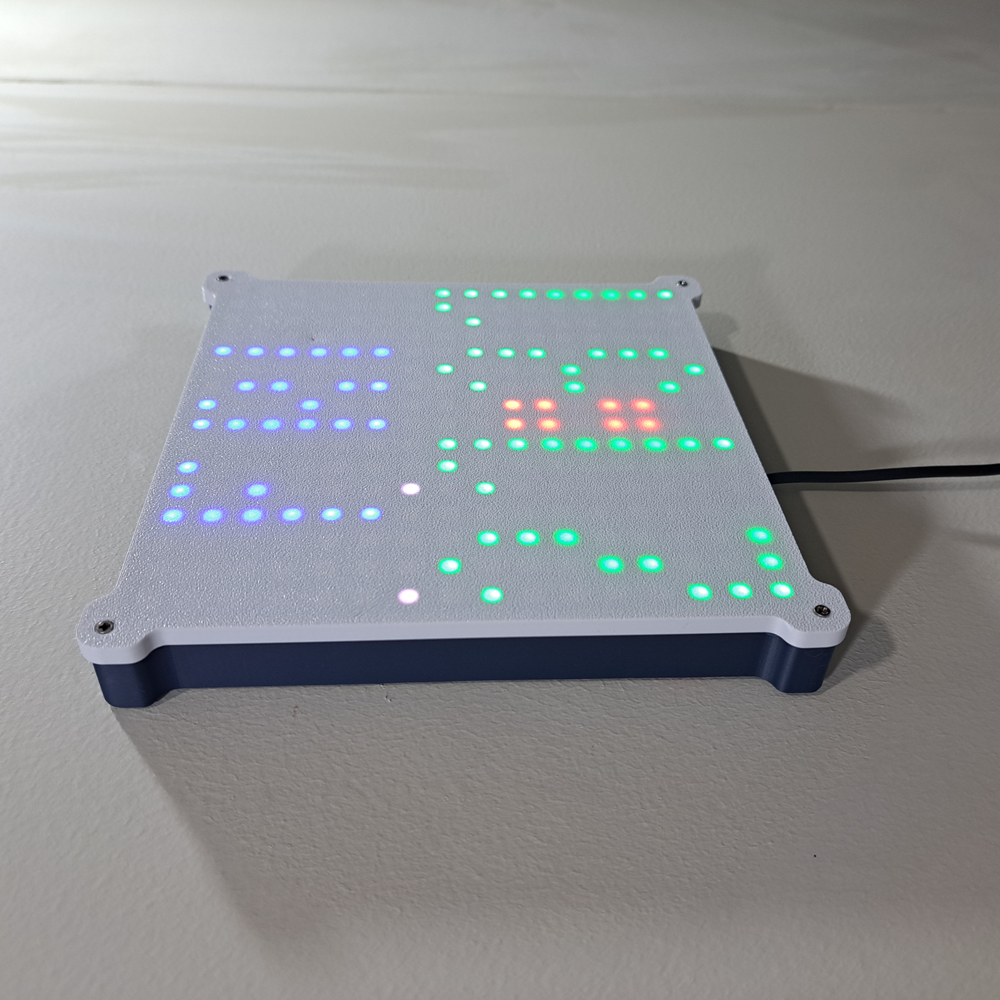
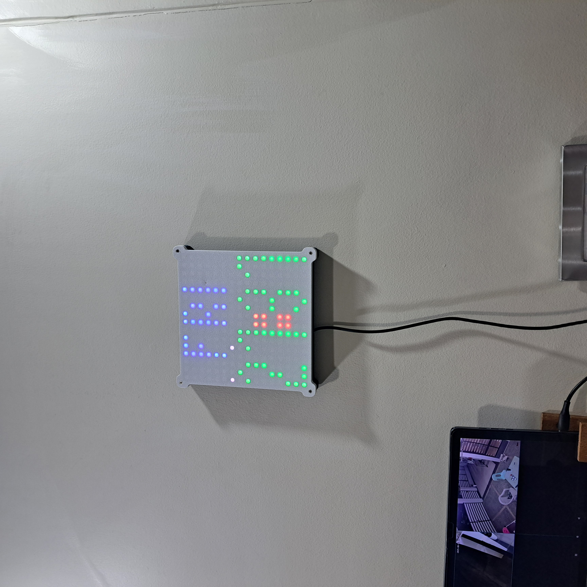

# WisBlock RAK14012 - 16x16 Matrix Wall Clock with WiFi time update  

| 

  | 

 | 

 | 

  |
| -- | -- | -- | -- |

----

Want a large wall clock that is easy to read?    
This code is for a 16x16 matrix LED wall clock. Built with the WisBlock RAK3312 Core Module (Espressif ESP32-S3) and the WisBlock RAK14012 LED Matrix Module.
A matching enclosure can be found on [MakerWorld](https://makerworld.com/en/collections/8038419-rakwireless-origins):

The firmware supports as well a WisBlock RAK12013 Radar Sensor, but in the first built, I did not include it. Using both the LED Matrix module and the Radar module will require to switch the RAK19001 Base Board, as it requires two IO slots.

The time and date are retrieved from an NTP server over WiFi and displayed using the 16x16 LED matrix.

Optional a WisBlock Radar Sensor Module can be used to switch off the clock display if the room is not occupied.

_**REMARK**_
This project is made with PlatformIO!

_**Recoomendation**_
Use the RAK14012 with an extra 5V power supply for flicker-free results.

----

## Hardware 

The system is build with modules from the [RAKwireless WisBlock](https://docs.rakwireless.com/Product-Categories/WisBlock/) product line. 
- [WisBlock RAK19007](https://docs.rakwireless.com/Product-Categories/WisBlock/RAK19007/Overview/) Base board
- [WisBlock RAK3312](https://docs.rakwireless.com/Product-Categories/WisBlock/RAK3312/Overview/) Core module.
- [WisBlock RAK14012](https://docs.rakwireless.com/Product-Categories/WisBlock/RAK14012/Overview) 16 x 16 LED Matrix Module
- [optional WisBlock RAK12013](https://docs.rakwireless.com/Product-Categories/WisBlock/RAK12013/Overview) Radar Sensor Module

For the enclosure I designed one for 3D printing.

The 3D files for this enclosure can be found on [MakerWorld](https://makerworld.com/en/collections/8038419-rakwireless-origins)    

----

## Software
The software on the RAK3312      

### IDE, BSP's and libraries:
- [PlatformIO](https://platformio.org/install)
- [Espressif ESP32 BSP](https://docs.platformio.org/en/latest/boards/index.html#espressif-32)
- [Patch to use RAK3312 with PlatformIO](https://github.com/RAKWireless/WisBlock/tree/master/PlatformIO)
- [NeoPixelBus library](https://github.com/Makuna/NeoPixelBus)

The libraries are installed automatically by PlatformIO.    

----

# Setting up WiFi credentials
The application uses MultiWiFi class to search for up to three WiFi networks and connect to the one with the better signal quality.
The three WiFi networks can be hard-coded in [src/wifi.cpp line 44](./src/wifi.cpp).

