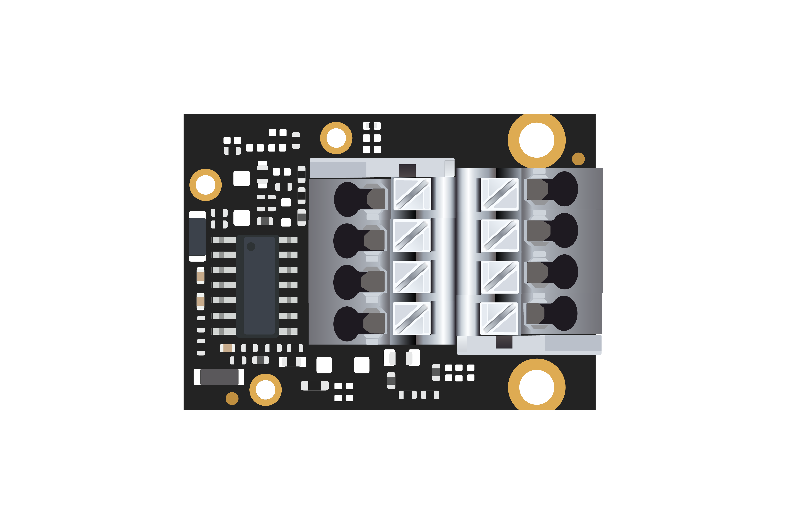
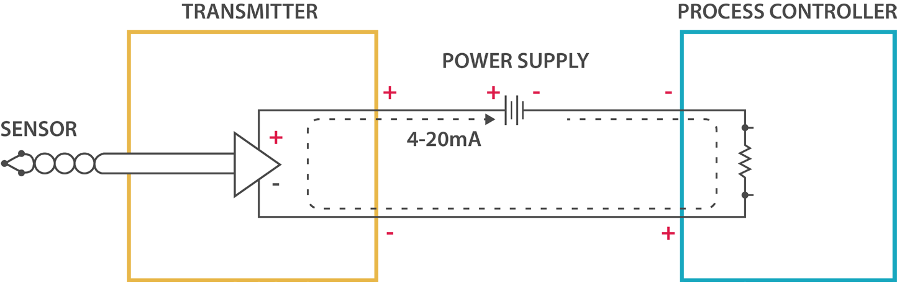
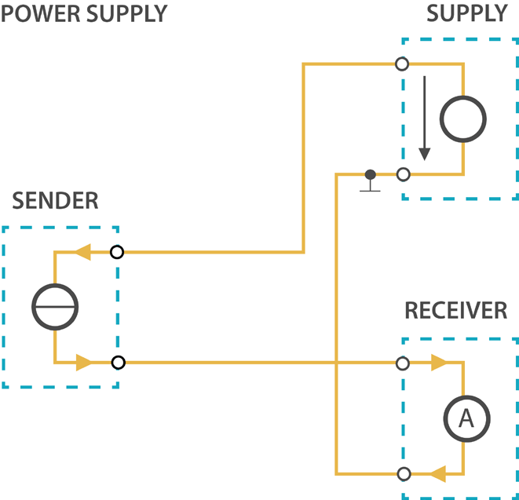
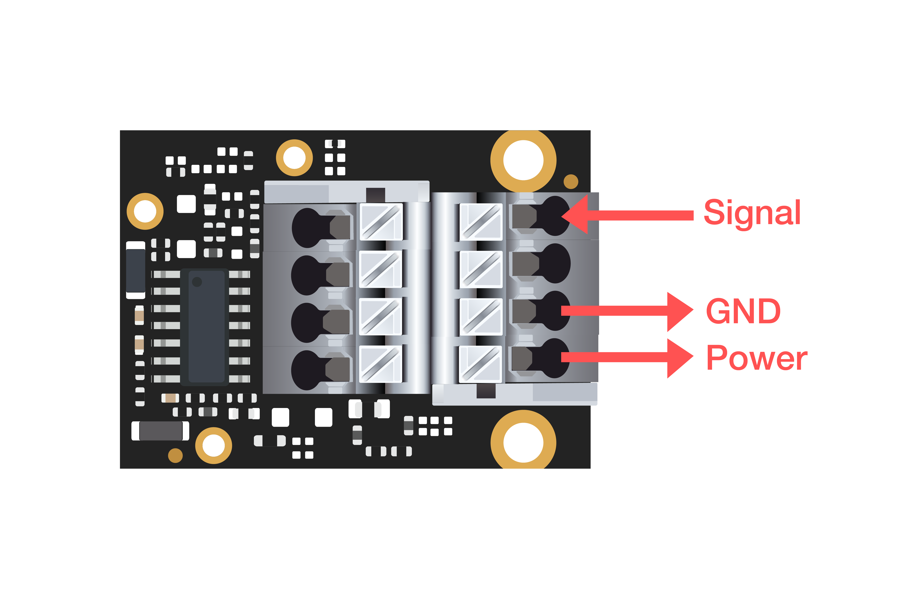
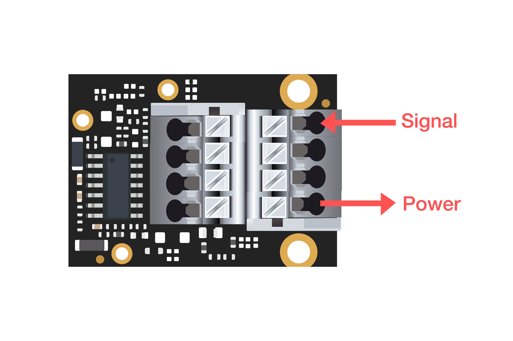

# WisBlock IO RAK5801 4-20mA Board Programming Guide

[TOC]

## 1.Introduction

This guide introduces the 4-20mA current loop and shows how to connect this module and the transmitter and explains how to program. This module was designed for WisBlock Base RAK5005-O.



### 1.1. The standard

The 4-20 mA current loop is one of the most robust sensor signaling standard. Current loops are ideal for data transmission
because of their inherent insensitivity to electrical noise. In a 4-20 mA current loop, all the signaling current flows through all
components; the same current flows even if the wire terminations are less than perfect. All the components in the loop drop
voltage due to the signaling current flowing through them. The signaling current is not affected by these voltage drops as long
as the power supply voltage is greater than the sum of the voltage drops around the loop at the maximum signaling current of
20 mA.
Transmitting sensor information via a current loop is particularly useful when the information has to be sent to a remote location
over long distances (500 meters, or more). The loop’s operation is straightforward: a sensor’s output voltage is first converted to
a proportional current, with 4 mA normally representing the sensor’s zero-level output, and 20 mA representing the sensor’s full
scale output. Then, a receiver at the remote end converts the 4-20 mA current back into a voltage which in turn can be further
processed by a computer or display module.
This list is typical application of the standard:

- Sensors and instruments
- Remote transducers

- Monitoring processes
- Data transmission in industrial ambients



### 1.2.Transmitter Wiring

#### 1.2.1. 2-Wire

2-Wire transmitters are energized by the current loop, where the supply voltage is included in the receptor. The transmitter is
floating and the ground is in the receptor.



#### 1.2.2. 3-Wire

3-Wire transmitters have 3 wires powered by the source voltage in them. In this case the transmitter is the power source for the
current loop. The transmitter common is connected to the common of the receptor.


#### 1.2.3. 4-Wire

4-Wire transmitters have 4 wires powered by the source voltage in them. The transmitter powers the current loop and the
receptor acts a floating load.


### 1.3.Signal conversion

As well know, Generally, the ADC integrated in the MCU can only collect analog voltage signals, and then convert the voltage signals into digital signals. So the WisBlock IO RAK5801 4-20mA board has converted the current signal which can not be collected by the MCU into a voltage signal which can be collected by the MCU(WisBlock Core RAK4631). 

The conversion formula is as follows:

​																				**I(A) = U(V) / 149.9**

*Note: Please refer to the schematic for details of the conversion method.*

### 2.1.Hardware required

To build this system the WisBlock Core RAK4631 microcontroller is using the RAK5801 module. With just two WisBlock plugged into the WisBlock Base RAK5005-O board the system is ready to be used.

- WisBlock Base RAK5005-O    


- WisBlock Core RAK4631    

  

  

- WisBlock IO RAK5801    

  

### 2.2.Electrical characteristics

- Output voltage max: +12 V
- Temperature Range: [-40 °C, 125 °C]

### 2.3. Powering sensors from the WisBlock IO RAK5801 4-20mA board

The 4-20mA Module includes a 12 V power which is controlled by MCU,GPIO 0.17. This GPIO must be set to **HIGH** before sampling. The power also can be used as power supply for sensors. The majority of 4-20 mA sensor works in the 9-24 V range. Before connecting a sensor to the 4-20 mA module, you must be sure that 12 V fits the sensor’s range of the power supply. 

### 2.4. Connection diagram

The 4-20 mA Module for WisBlock Core RAK4631 has one input channels which allow the user to convert signals that come from sensors or devices with this industrial standard. The 4-20 mA Module works with 2, 3 and 4 wire current transmitters. 

2.4.1. 2-wire connection


2.4.2. 3-wire connection



2.4.3. 4-wire connection

*Note: The transmitter and 4-20mA module use separate power supplies. It is assumed that the power to drive the 4-20mA loop is derived from the control panel.*



## 3.How to program based on Arduino

### 3.1.Software required

- [ArduinoIDE](https://www.arduino.cc/en/Main/Software)
- [RAK4630 BSP](https://github.com/RAKWireless/RAK-nRF52-Arduino)    

### 3.2.Initializes WisBlock IO 4-20mA board

```c
{
	/*
  	* WisIO RAK5811 Power On
  	*/
    pinMode(17, OUTPUT);
    digitalWrite(17, HIGH);
}
```

### 3.3.Get ADC results

```c
{
    int sensor_pin = A1;
    int result;
    result = analogRead(sensor_pin);
}
```

### 3.4.Calculate the current value

```c
{
    voltage_ain = result * 3.6 /1024;  				//Reference voltage 3.6v / 10bit ADC 
    current_sensor = 1000 * voltage_ain / 149.9;		//WisIO RAK5801 I=U/149(A) <==> I = 1000 *U/149(mA) 
}
```


## 4. Code examples

```c
#include <Arduino.h>

void setup()
{
	/*
  	 * WisBLOCK RAK5801 Power On
  	 */
    pinMode(17, OUTPUT);
    digitalWrite(17, HIGH);

    // Initialize Serial for debug output
    Serial.begin(115200);
    while(!Serial){delay(10);}
}


void loop()
{
    int i;

    int sensor_pin = A1;   // select the input pin for the potentiometer
    int mcu_ain_value = 0;  

    int pressure;         //KPa as unit
    int average_value;  
    float voltage_ain;
    float current_sensor; // variable to store the value coming from the sensor

    for (i = 0; i < 10; i++)
    {
        mcu_ain_value += analogRead(sensor_pin);
    }

    average_value = mcu_ain_value / i;
    voltage_ain = average_value * 3.6 /1024;  	  //raef 3.6v / 10bit ADC
    current_sensor = voltage_ain / 149.9 * 1000;    //WisBlock RAK5801 I=U/149.9\*1000 (mA)

  //Convert to millivolt. 3.95mA is the default output from sensor
  //0.01mA <==> 6.25KPa
  pressure =  (current_sensor - 3.95) * 100 * 2.5; 
                    
  Serial.printf("-------average_value------ = %d\n", average_value);
  Serial.printf("-------current_sensor------ = %f\n", current_sensor);
  Serial.printf("-------pressure------ = %d KPa\n", pressure);

  delay(2000);

}
```

