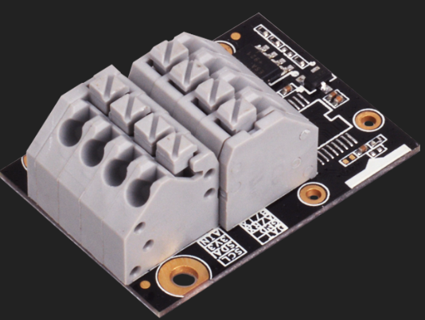
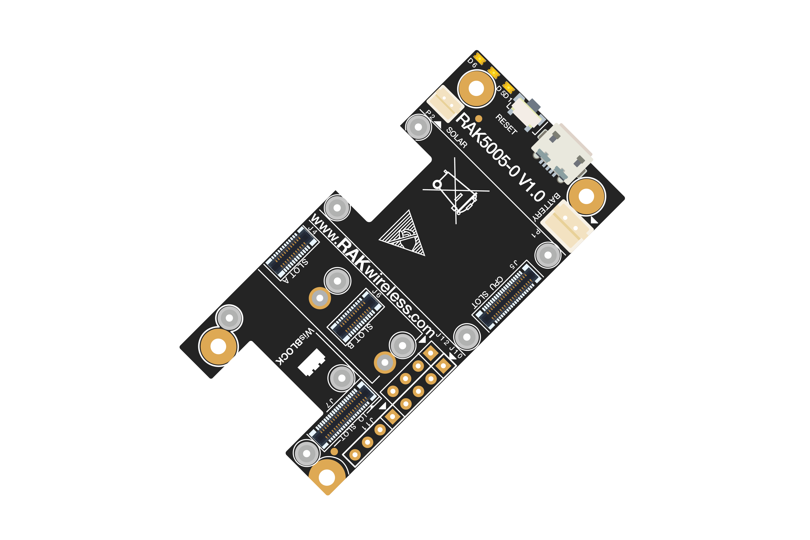
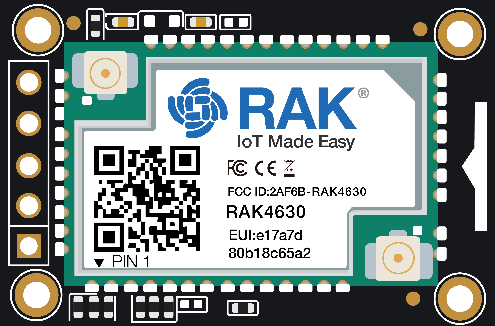
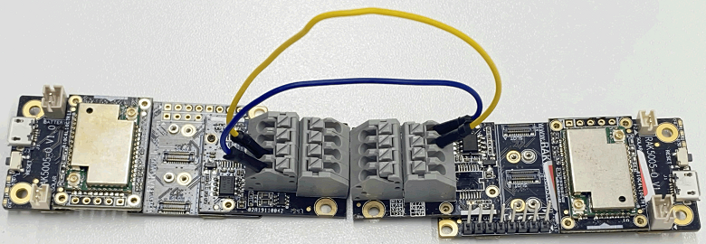

# WisBlock IO RAK5802 RS485 board Programming Guide

[TOC]

## 1.Introduction

This guide introduces the WisBlock IO RAK5802 RS485 board features and explains how to program, communicate with two this modules. This module was designed for WisBlock Base RAK5005-O. 
You can get more information about using the Modbus Protocol on the document “WisBlock IO RS485 Application Tutorial(*<u>There needs to be a link here</u>*)”.



### 1.1 RS485 standard

**RS-485**, also known as **TIA-485(-A)** or **EIA-485**, is a standard defining the electrical characteristics of drivers and receivers for use in serial communications systems. Electrical signaling is balanced, and multipoint systems are supported. The standard is jointly published by the [Telecommunications Industry Association](https://en.wikipedia.org/wiki/Telecommunications_Industry_Association) and [Electronic Industries Alliance](https://en.wikipedia.org/wiki/Electronic_Industries_Alliance) (TIA/EIA). Digital communications networks implementing the standard can be used effectively over long distances and in electrically noisy environments. Multiple receivers may be connected to such a network in a linear, multidrop bus. These characteristics make RS-485 useful in industrial control systems and similar applications.

## 2.Hardware

### 2.1.Hardware required

To build this system the WisBlock Core RAK4631 microcontroller is using the RAK5802 module. With just two WisBlock plugged into the WisBlock Base RAK5005-O board the system is ready to be used.

- WisBlock Base RAK5005-O     

  

- WisBlock Core RAK4631     

  

  

- WisBlock IO RAK5802     

  

  

### 2.2.FEATURES

- Exceeds Requirements of EIA-485 Standard

- Data Rate: Up to 250 kbps

- Temperature range: [-40 °C, 125 °C]

- Full Fail-safe (Open, Short, Terminated)Receivers

- Up to 256 Nodes on a Bus (1/8 unit load)

- Wide Supply Voltage 3V to 5.5V

- Bus-Pin Protection：±12 kV HBM protection

### 2.3.Connection diagram



## 3.How to program based on Arduino

### 3.1.Software required

- [ArduinoIDE](https://www.arduino.cc/en/Main/Software)
- [RAK4630 BSP](https://github.com/RAKWireless/RAK-nRF52-Arduino)
- [Arduino RS485 library](https://www.arduino.cc/en/Reference/ArduinoRS485)
- [ArduinoModbus library](https://www.arduino.cc/en/ArduinoModbus/ArduinoModbus) (if you use Modbus protocol)

### 3.2.Install RS485 Arduino Library

We need to install this Arduino IDE library to control the WisBlock IO RAK5802 RS485 board.

The Arduino Library Manager was added starting with Arduino IDE versions 1.5 and greater (1.6.x). It is found in the 'Sketch' menu under 'Include Library', 'Manage Libraries...'


When you open the Library Manager you will find a large list of libraries ready for one-click install. To find a library for your product, search for a keyword such as 'RS485', and the library 'Arduino RS485' should show up. Click on the desired library, and the 'Install' button will appear. Click that button, and the library should install automatically. When installation finishes, close the Library Manager.


### 3.3. Initializes the RS485 communication speed

```c
{
	RS485.begin(9600);
}
```

### 3.4. Send a String

```c
{
    RS485.beginTransmission();
    RS485.write("hello ");
    RS485.endTransmission();
}
```

or

```c
{
    RS485.beginTransmission();
    RS485.print("hello ");
    RS485.endTransmission();
}
```

### 3.5. Send a byte

```c
{
    RS485.beginTransmission();
    RS485.write(0xFF);
    RS485.endTransmission();
}
```

### 3.6. Send series of bytes

```c
{
	char send_buf[]={0x01,0x02,0x03,0x04,0x05};
    RS485.beginTransmission();
    RS485.write(send_buf, sizeof(send_buf));
    RS485.endTransmission();
}
```

### 3.7.Determine whether there is data from the RS485 port

```c
{
	if (RS485.available())
}
```

### 3.8. Read incoming data

```c
{
	RS485.read()
}
```

### 3.9. RS485 Power on

```
  pinMode(34, OUTPUT); 
  digitalWrite(34, HIGH);
  delay(500);
```

### 3.10. RS485 Power off

```
  pinMode(34, OUTPUT); 
  digitalWrite(34, LOW);
  delay(500);
```

## 4 Code examples

RS485 Sender: send data ,hello, every second

```c
#include <ArduinoRS485.h>

int counter = 0;

void setup() {
  RS485.begin(9600);
}

void loop() {
  RS485.beginTransmission();
  /* IO2 HIGH  3V3_S ON */
  pinMode(34, OUTPUT); 
  digitalWrite(34, HIGH);
  delay(300);
  /* IO2 HIGH  3V3_S ON */
    
  RS485.write("hello world\n");
  RS485.endTransmission();
  /* IO2 LOW  3V3_S OFF */
  pinMode(34, OUTPUT); 
  digitalWrite(34, LOW);
  delay(300);
  /* IO2 LOW  3V3_S OFF */    

  delay(1000);
}
```

RS485 Receiver:

```c
#include <ArduinoRS485.h>

void setup() {
  Serial.begin(9600);
  while (!Serial);

  RS485.begin(9600);
  /* IO2 HIGH  3V3_S ON */
  pinMode(34, OUTPUT); 
  digitalWrite(34, HIGH);
  delay(500);
  /* IO2 HIGH  3V3_S ON */
  // enable reception, can be disabled with: RS485.noReceive();
  RS485.receive();
}

void loop() {
  if (RS485.available()) {
    Serial.write(RS485.read());
  }
}
```