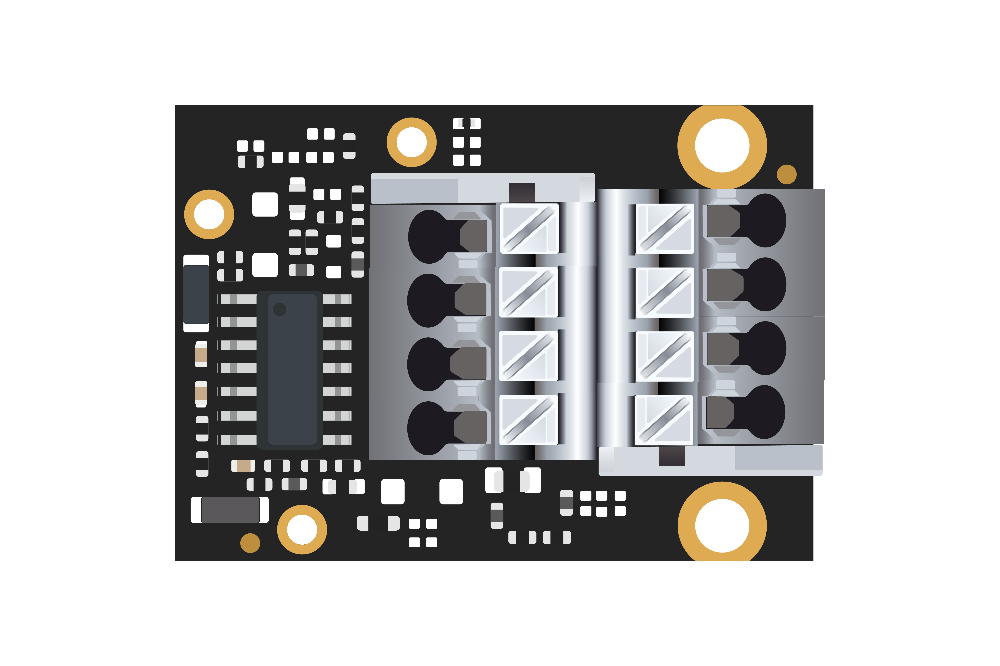
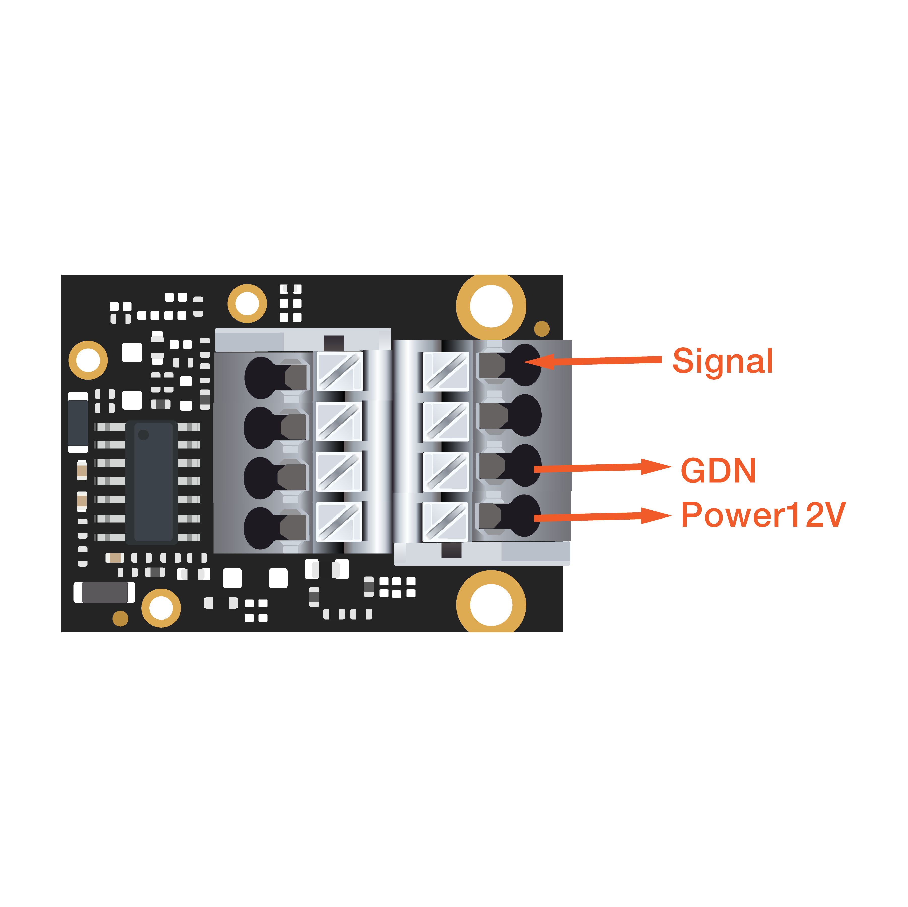

# WisBlock IO RAK5811 0-5V Board Programming Guide

[TOC]

## 1.Introduction

This guide introduces the WisBlock IO RAK5811 0-5V board features and explains how to program with it.

### 1.1.Voltage conversion

The reference voltage of the ADC in the RAK4631 is 3.0 volts, so this is the maximum voltage that the RAK4631 can measure. In order to expand the measurement range to 0-5 volts, the RAK5801 module reduces the voltage signal to be measured to the range of 0-3.0 volts. 

The conversion formula is as follows:

##### 																	 																			**Uout=Uin*0.6 (V)**

*Note: Please refer to the [schematic]() for details of the conversion method.*

### 2.1.Hardware required

To build this system the WisBlock Core RAK4631 microcontroller is using the RAK5811 module. With just two WisBlock plugged into the WisBlock Base RAK5005-O board the system is ready to be used.

- WisBlock Base RAK5005-O    


- WisBlock Core RAK4631    


- WisBlock IO RAK5811




### 2.2.Electrical characteristics

- Output voltage max: +12 V
- Temperature Range: [-40 °C, 125 °C]

### 2.3. Powering sensors from the WisBlock IO RAK5811 0-5V board

The Module includes a 12 V power which is controled by RAK4631,GPIO 0.17. This GPIO must be set to **HIGH** before sampling. The power also can be used as power supply for sensors. The majority of sensor works in the 9-24 V range. Before connecting a sensor to the 0-5V module, you must be sure that 12 V fits the sensor’s range of the power supply. 

### 2.4. Connection diagram



## 3.How to program based on Arduino

### 3.1.Software required

- [ArduinoIDE](https://www.arduino.cc/en/Main/Software)
- [RAK4630 BSP](https://github.com/RAKWireless/RAK-nRF52-Arduino)

### 3.2.Initializes module

```c
{
	/*
  	* WisIO RAK5801 Power On
  	*/
    pinMode(17, OUTPUT);
    digitalWrite(17, HIGH);
}
```

### 3.3.Get ADC results

```c
{
    int sensor_pin = A1;
    int result;
    result = analogRead(sensor_pin);
}
```

### 3.4.Calculate the current value

```c
{
    voltage_ain = result * 3.0 /1024; //Reference voltage 3.0v / 10bit ADC
    voltage_sensor = voltage_ain/0.6; //WisBlock RAK5811 (0 ~ 5V).   Input signal reduced to 6/10 and output
}
```


## 4. Code examples

```c
#include <Arduino.h>

#define ULB6_SENSOR

void setup()
{
 /*
  * WisBLOCK 5811 Power On
  */
    pinMode(17, OUTPUT);
    digitalWrite(17, HIGH);

    pinMode(A1, INPUT_PULLDOWN);
    analogReference(AR_INTERNAL_3_0);
    analogOversampling(128);
    
	// Initialize Serial for debug output
    Serial.begin(115200);
    while(!Serial){delay(10);}
}

void loop()
{
  int i;
  
  int sensor_pin = A1;   // the input pin A1 for the potentiometer
  int mcu_ain_value = 0;  

  int depths;         // variable to store the value of oil depths
  int average_value;  
  float voltage_ain; 
  float voltage_sensor; // variable to store the value coming from the sensor

  for (i = 0; i < 5; i++)
  {
    mcu_ain_value += analogRead(sensor_pin);
  }
  average_value = mcu_ain_value / i;
  
  voltage_ain = average_value * 3.0 /1024;  //raef 3.0v / 10bit ADC 
  
  voltage_sensor = voltage_ain/0.6;   //WisBlock RAK5811 (0 ~ 5V).   Input signal reduced to 6/10 and output
  
  depths = (voltage_sensor*1000 - 574)*2.5; //Convert to millivolt. 574mv is the default output from sensor
  
  Serial.printf("-------average_value------ = %d\n", average_value);
  Serial.printf("-------voltage_sensor------ = %f\n", voltage_sensor);
  Serial.printf("-------depths------ = %d mm\n", depths);

  delay(2000);
}
```

