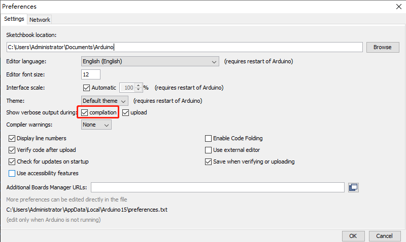
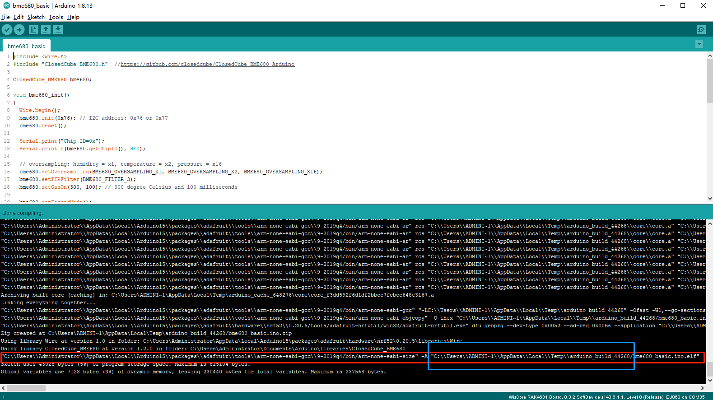
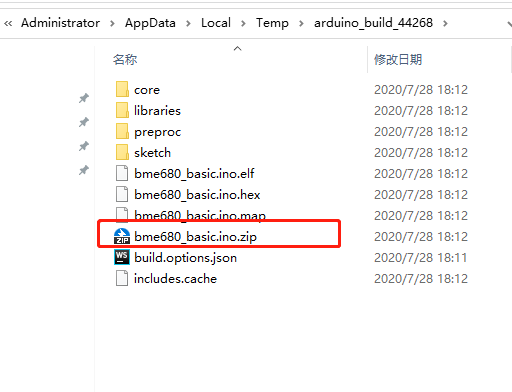
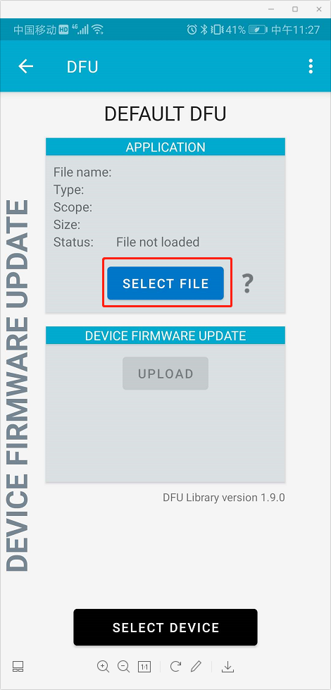
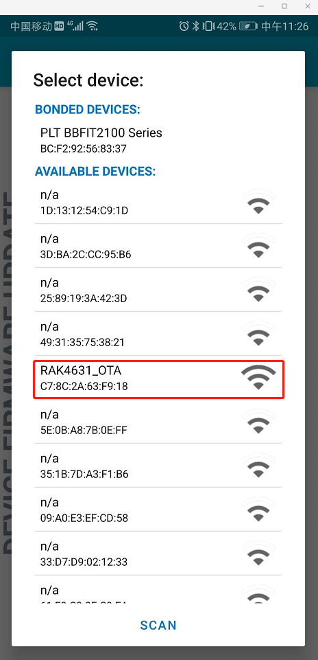
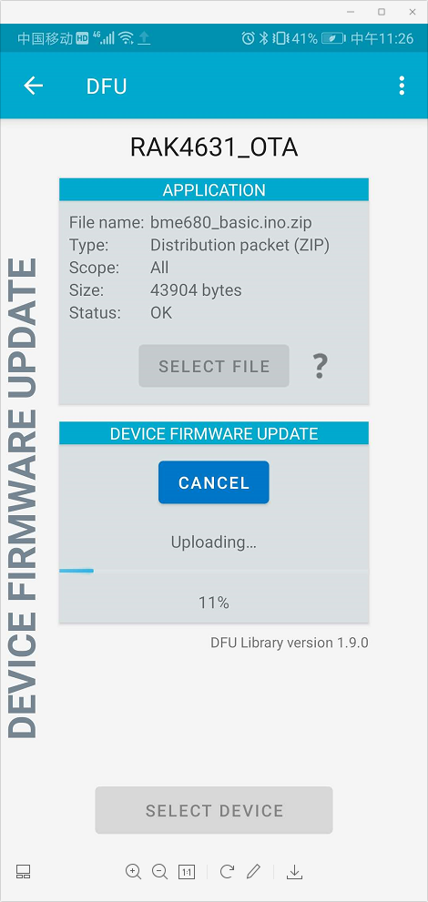

# BLE OTA DFU example
This example shows how to initialize BLE on the RAK4631 module. Furthermore it shows how to setup OTA DFU BLE services.

- BLE OTA DFU

- Firmware upgrade of the RAK4631 over BLE
  
    - The OTA DFU functions itself are embedded in the bootloader. All that the application has to do is to advertise the OTA services.

----
## Hardware required
To test OTA DFU the following hardware is required

- WisBlock Base RAK5005-O
- WisBlock Core  RAK4631
- BLE capable phone (e.g. Android phone)

The assemble of RAK5005-O and RAK4631 is as bellow.


----
## Software required
The following software are required in this example.

- [ArduinoIDE](https://www.arduino.cc/en/Main/Software)
- [RAK4630 BSP](https://github.com/RAKWireless/RAK-nRF52-Arduino)    
- [nRF Toolbox for BLE](https://play.google.com/store/apps/details?id=no.nordicsemi.android.nrftoolbox)

----
## BLE OTA DFU source codes
The code to implement BLE OTA DFU is quite simple.

Declare the DFU objects
```cpp
/**
   @brief  BLE DFU service
   @note   Used for DFU OTA upgrade
*/
BLEDfu bledfu;
```
Initialize the BLE server with the service for OTA DFU.
```cpp
  // Config the peripheral connection with maximum bandwidth
  // more SRAM required by SoftDevice
  // Note: All config***() function must be called before begin()
  Bluefruit.configPrphBandwidth(BANDWIDTH_MAX);
  Bluefruit.configPrphConn(92, BLE_GAP_EVENT_LENGTH_MIN, 16, 16);

  Bluefruit.begin(1, 0);
  // Set max power. Accepted values are: -40, -30, -20, -16, -12, -8, -4, 0, 4
  Bluefruit.setTxPower(4);
  // Set the BLE device name
  Bluefruit.setName("RAK4631_OTA_DFU");

  Bluefruit.Periph.setConnectCallback(connect_callback);
  Bluefruit.Periph.setDisconnectCallback(disconnect_callback);

  // To be consistent OTA DFU should be added first if it exists
  bledfu.begin();
```
And start BLE advertising
```cpp
  // Set up and start advertising
  // Advertising packet
  Bluefruit.Advertising.addFlags(BLE_GAP_ADV_FLAGS_LE_ONLY_GENERAL_DISC_MODE);
  Bluefruit.Advertising.addTxPower();
  Bluefruit.Advertising.addName();

  /* Start Advertising
     - Enable auto advertising if disconnected
     - Interval:  fast mode = 20 ms, slow mode = 152.5 ms
     - Timeout for fast mode is 30 seconds
     - Start(timeout) with timeout = 0 will advertise forever (until connected)

     For recommended advertising interval
     https://developer.apple.com/library/content/qa/qa1931/_index.html
  */
  Bluefruit.Advertising.restartOnDisconnect(true);
  Bluefruit.Advertising.setInterval(32, 244); // in unit of 0.625 ms
  Bluefruit.Advertising.setFastTimeout(30); // number of seconds in fast mode
  Bluefruit.Advertising.start(0);       // 0 = Don't stop advertising after n seconds
```
There are two callback functions that are called when a client connects or disconnects. Here we just set a flag to let the main loop now if a BLE client is available
```cpp
/**
   @brief  Callback when client connects
   @param  conn_handle: Connection handle id
*/
void connect_callback(uint16_t conn_handle)
{
  (void)conn_handle;

  Serial.println("BLE client connected");
}

/**
   @brief  Callback invoked when a connection is dropped
   @param  conn_handle: connection handle id
   @param  reason: disconnect reason
*/
void disconnect_callback(uint16_t conn_handle, uint8_t reason)
{
  (void)conn_handle;
  (void)reason;

  Serial.println("BLE client disconnected");
}
```
In the main loop we do nothing.
```cpp
/**
   @brief Arduino loop. Runs forever until power off or reset
*/
void loop()
{
}
```

----
## BLE OTA DFU testing
1. **Burn the test program.**

   Connect the hardware with PC by USB, Open the test program, select the "WisBlock Core RAK4631 Board" board and Port. Then do **upload**.

   

2. **Generate DFU file and copy it to your phone.**

   In the Arduino software: go to **File** -> **Preferences** and then select **Show verbose output during** -> **compilation**.



​	Finally, when you are compiling, the program will show you the path at last lines. 



 In this example we use a the following demo zip file as the DFU file.

​		


​		Copy the file to your phone.  

​		Then on your phone you can use the [nRF Toolbox for BLE](https://play.google.com/store/apps/details?id=no.nordicsemi.android.nrftoolbox) app to upgrade the firmware on the RAK4631 without using the USB port.

3. **Connect BLE and Upgrade**

   Open the nRF Toolbox and select DFU.

   	

​		Select the DFU file you have copied to phone.

​		    

​		Select the BLE device By device name which is advertised.

​		    
​		Click "UPLOAD" button to start upgrade and wait until success.

​		    

4. **Check the upgrade result**

   Reset the board and connect the PC, we can find the log as bellow on the serial port tool. It indicates that the program has been upgraded to BME680 program successfully.

```
[10:27:49.779] T=28.27C, RH=67.00%, P=951.77hPa, G=100773 Ohms

[10:27:54.786] T=28.28C, RH=66.00%, P=951.75hPa, G=114418 Ohms

[10:27:59.790] T=28.29C, RH=65.00%, P=951.75hPa, G=274820 Ohms

[10:28:04.798] T=28.30C, RH=65.00%, P=951.75hPa, G=89896 Ohms

[10:28:09.802] T=28.30C, RH=64.00%, P=951.75hPa, G=100572 Ohms

[10:28:14.807] T=28.30C, RH=64.00%, P=951.75hPa, G=108287 Ohms

[10:28:19.812] T=28.30C, RH=64.00%, P=951.75hPa, G=115368 Ohms

[10:28:24.818] T=28.29C, RH=64.00%, P=951.77hPa, G=119943 Ohms

[10:28:29.823] T=28.28C, RH=64.00%, P=951.75hPa, G=124896 Ohms

[10:28:34.829] T=28.27C, RH=65.00%, P=951.77hPa, G=128692 Ohms

[10:28:39.834] T=28.27C, RH=65.00%, P=951.77hPa, G=130276 Ohms
```

