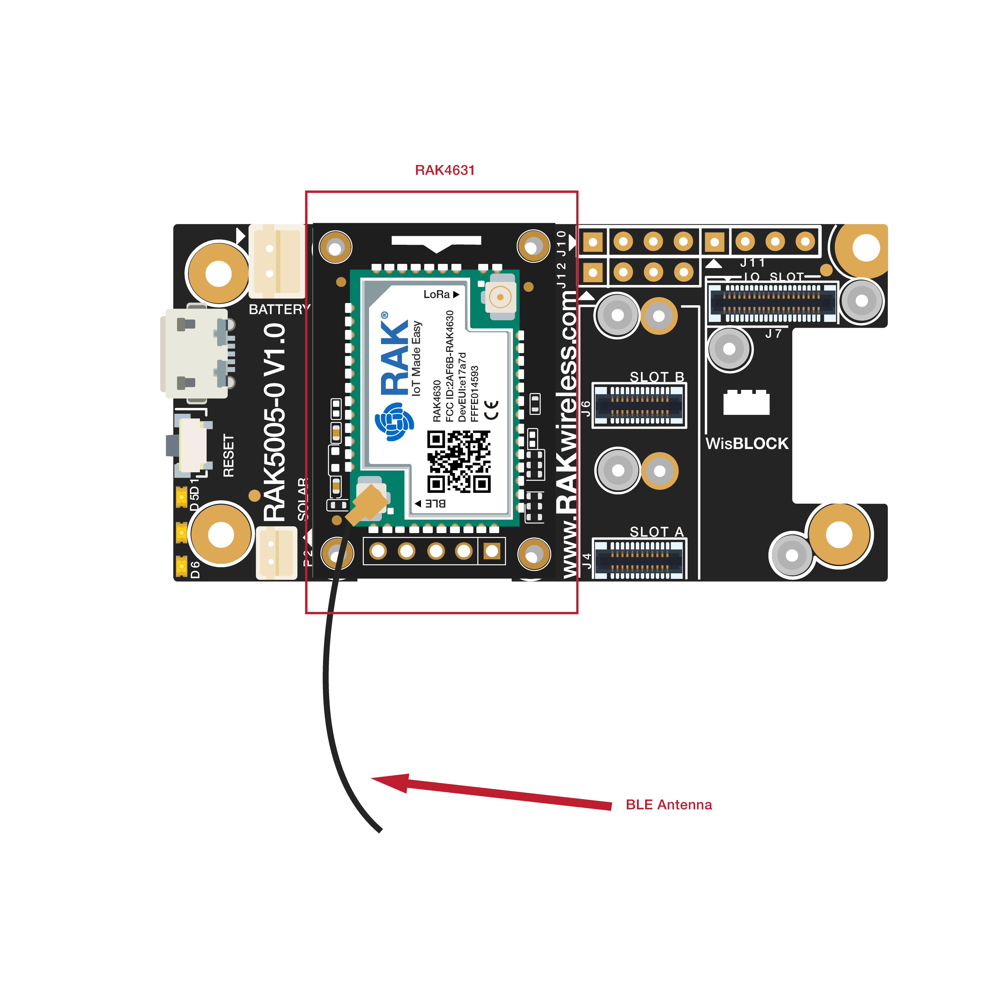
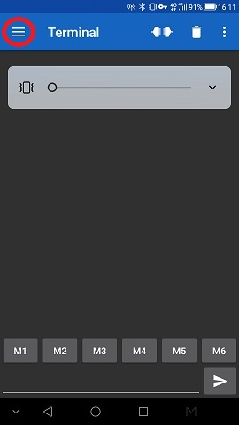
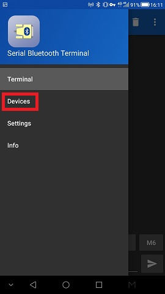
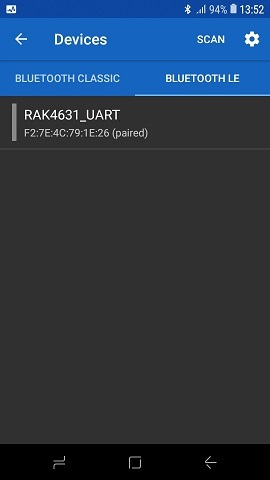

# BLE UART example
This example shows how to initialize BLE on the RAK4631 module. Furthermore it shows how to setup  BLE UART service.

- BLE UART
- Serial communication over BLE.

----
## Hardware required
To test BLE UART the following hardware is required

- WisBlock Base RAK5005-O
- WisBlock Core  RAK4631
- BLE capable phone (e.g. Android phone)

The assemble of RAK5005-O and RAK4631 is as bellow.



----
## Software required
To test the WisBlock IO RAK2305 which is a WiFi board, The following software is required.

- [ArduinoIDE](https://www.arduino.cc/en/Main/Software)
- RAK4630 BSP
- On the phone
    - a BLE UART application like [Serial Bluetooth Terminal](https://play.google.com/store/apps/details?id=de.kai_morich.serial_bluetooth_terminal) to test BLE UART communication

----
## BLE UART source codes
The code to implement BLE UART is quite simple.

Declare the DFU and UART objects
```cpp
/**
   @brief  BLE UART service
   @note   Used for BLE UART communication
*/
BLEUart bleuart;
```
Initialize the BLE UART service.
```cpp
  // Config the peripheral connection with maximum bandwidth
  // more SRAM required by SoftDevice
  // Note: All config***() function must be called before begin()
  Bluefruit.configPrphBandwidth(BANDWIDTH_MAX);
  Bluefruit.configPrphConn(92, BLE_GAP_EVENT_LENGTH_MIN, 16, 16);

  Bluefruit.begin(1, 0);
  // Set max power. Accepted values are: -40, -30, -20, -16, -12, -8, -4, 0, 4
  Bluefruit.setTxPower(4);
  // Set the BLE device name
  Bluefruit.setName("RAK4631_UART");

  Bluefruit.Periph.setConnectCallback(connect_callback);
  Bluefruit.Periph.setDisconnectCallback(disconnect_callback);

  // Configure and Start BLE Uart Service
  bleuart.begin();
```
And start BLE advertising
```cpp
  // Set up and start advertising
  // Advertising packet
  Bluefruit.Advertising.addFlags(BLE_GAP_ADV_FLAGS_LE_ONLY_GENERAL_DISC_MODE);
  Bluefruit.Advertising.addTxPower();
  Bluefruit.Advertising.addName();

  /* Start Advertising
     - Enable auto advertising if disconnected
     - Interval:  fast mode = 20 ms, slow mode = 152.5 ms
     - Timeout for fast mode is 30 seconds
     - Start(timeout) with timeout = 0 will advertise forever (until connected)

     For recommended advertising interval
     https://developer.apple.com/library/content/qa/qa1931/_index.html
  */
  Bluefruit.Advertising.restartOnDisconnect(true);
  Bluefruit.Advertising.setInterval(32, 244); // in unit of 0.625 ms
  Bluefruit.Advertising.setFastTimeout(30); // number of seconds in fast mode
  Bluefruit.Advertising.start(0);       // 0 = Don't stop advertising after n seconds
```
There are two callback functions that are called when a client connects or disconnects. Here we just set a flag to let the main loop now if a BLE client is available
```cpp
/**
   @brief  Callback when client connects
   @param  conn_handle: Connection handle id
*/
void connect_callback(uint16_t conn_handle)
{
  (void)conn_handle;
  bleUARTisConnected = true;

  Serial.println("BLE client connected");
}

/**
   @brief  Callback invoked when a connection is dropped
   @param  conn_handle: connection handle id
   @param  reason: disconnect reason
*/
void disconnect_callback(uint16_t conn_handle, uint8_t reason)
{
  (void)conn_handle;
  (void)reason;
  bleUARTisConnected = false;

  Serial.println("BLE client disconnected");
}
```
In the main loop we just wait for characters to arrive either on the BLE UART or on the USB Serial and forward it.
```cpp
/**
   @brief Arduino loop. Runs forever until power off or reset
*/
void loop()
{
  // Forward anything received from USB Serial to BLE UART
  if (Serial.available() && bleUARTisConnected)
  {
    bleuart.print(Serial.readString());
  }
  
  // Forward anything received from BLE UART to USB Serial 
  if (bleuart.available())
  {
    Serial.print(bleuart.readString());
  }
}
```

----
## BLE UART testing
To test the BLE UART function upload the sketch to the RAK4631 and connect to it from the BLE UART app on your phone. 

 

 

    

Then you can send characters from the Arduino terminal to the BLE UART terminal on the phone and back.

    

Output in the Arduino terminal:

```log
14:12:55.634 -> ================================
14:12:55.634 -> RAK4631 BLE UART example
14:12:55.634 -> ================================
14:13:03.782 -> BLE client connected
14:13:28.123 -> hello from ble
14:14:04.458 -> I am good
14:14:14.506 -> BLE client disconnected
```

----
