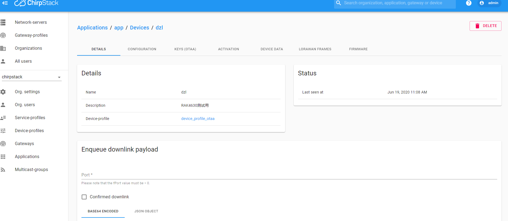

# LoRaWan® examples

## 1. Overview

If you are working on a battery powered solution and want to minimize the power consumption of the WisBlock, please have a look at [Low Power Example](Low_Power_Example.md). There is a separate example that concentrates on low power consumption.

This example shows how to setup the WisBlock as a LoRaWan® sensor node. There are two examples available, one for nodes with ABP network join function and one for nodes using the OTAA network join function. If you want to use LoRaWan® communication you need to define a region. The defined region tells the library which frequency and which channels should be used. Valid regions are:

- LORAMAC_REGION_AS923
- LORAMAC_REGION_AU915
- LORAMAC_REGION_CN470
- LORAMAC_REGION_CN779
- LORAMAC_REGION_EU433
- LORAMAC_REGION_EU868
- LORAMAC_REGION_IN865
- LORAMAC_REGION_KR920
- LORAMAC_REGION_US915

The region is selected while calling `lmh_init`. Example:      
```c++  
err_code = lmh_init(&g_lora_callbacks, g_lora_param_init, TRUE, CLASS_A, LORAMAC_REGION_US915);
```

In addition you need keys to register the device.

### ALL KEYS ARE MSB!

Keys required for OTAA
- Device EUI if you want to use ABP registration of the device
- Application EUI
- Application Key, the AES encryption/decryption cipher application key

Keys required for ABP

- Device address
- Network Session Key
- App Session Key

The devices must be registered on your LoRaWan® server before they can send and receive data. The above mentioned EUIs and keys can be obtained from your LoRaWan® server. If you use a RAK gateway with an integrated LoRaWan® server or want to use TheThingsNetwork server you can find a tutorial [here](https://doc.rakwireless.com/rak7258-micro-gateway/overview)     

## 2. Hardware Required

To build the LoRa® system. With just one WisBlock Core RAK4631 plugged into the WisBlock Base RAK5005-O board the system is ready to be used.

- WisBlock Base RAK5005-O
- WisBlock Core RAK4631

The RAK4631 is the WisBlock Core which can be connected to CPU SLOT of WisBlock via pin to pin groove like below. Besides, it provides SWD port to download via Jlink. Two antenna (BLE and LoRa®). Screws of four corners help stabilize connection with WisBlock.


## 3. Software Required

### 3.1 Install LoRaWAN library

After install Arduino IDE and BSP according to the Quick Start Guide, you can install LoRaWAN® library now. Step as below:

- Start the Arduino IDE
- Open Library Manager, search for sx126x-Arduino, and install


### 3.2 Feature of SX126x_Arduino_base library

The library is an excellent library, supports below:

- LoRaWAN® protocol V1.0.2
- Class A and Class C
- Region EU868/US915/AU915/KR920/AS923/IN865
- OTAA and ABP
- Dutycycle
- ADR/Datarate/Tx power configuration
- Confirm/Unconfirm
- DevEUI/AppEUI/AppKey/DevAddr/NwsKey/AppsKey configuration
- Send data port 

### 3.3 Run a simple example

RAKwireless provides a lot of example based on this library. Here choose a simple example to show how to develop a LoRaWAN® application.

#### 3.3.1 Scene description

Download the example from https://github.com/RAKWireless/WisBlock/tree/master/examples/communications/LoRa/LoRaWAN/LoRaWAN_OTAA/ . The example will communicate with server in EU868, join type in OTAA. And send "hello" to server period.

#### 3.3.2 Gateway configuration

To test the example, we build node like below in ChirpStack (open-source LoRaWAN® Network Server stack, TTN is also supported and tested). And we can obtain the DeviceEUI, AppEUI, AppKey, copy them. The detailed parameters is below:

- Region: EU868
- Join Type: OTAA
- Class: A



#### 3.3.3 Node configuration

Then open the example in Arduino, fill the DeviceEUI, AppEUI, AppKey in the code like below:

```cpp
//OTAA keys !!!! ALL KEYS ARE MSB !!!
uint8_t nodeDeviceEUI[8] = {0x88, 0x88, 0x88, 0x88, 0x88, 0x88, 0x33, 0x33};
uint8_t nodeAppEUI[8] = {0xB8, 0x27, 0xEB, 0xFF, 0xFE, 0x39, 0x00, 0x00};
uint8_t nodeAppKey[16] = {0x88, 0x88, 0x88, 0x88, 0x88, 0x88, 0x88, 0x88, 0x88, 0x88, 0x88, 0x33, 0x33, 0x33, 0x33, 0x33};
```

#### 3.3.4 Compile and download

There is a USB port on WisBlock. It is a debug port for RAK4631 with three function:

- Power supply
- Download port in Arduino
- Communication with RAK4631, incluing log print and command from PC

Connect WisBlock to PC via USB. Arduino will recognize the board. The red led is on means power up. Go into tools and choose like below. 

Then click Upload (arrow button), it will compile and download to RAK4631 automatically. The blue led is on means download ok.


#### 3.3.5 Log print and server data

Go into Tools, choose the port (Adafruit Feather nRF52840 Express), open Serial Monitor. Log will show as below. It will join automatically and send 'hello!' to server per 20s :


At the same time, server will show the data from RAK4631.


It is a very easy way for users to finish their first LoRaWAN® trip. But most users want to apply LoRaWAN® to their own application. RAKwireless also provide a efficient way for them.

<!--
### 3.4 LoRaWAN® example analyze

Here will analyze the example above in details, other examples are based on this.

#### 3.4.1 Header files

```
#include <Arduino.h>
#include <LoRaWan-RAK4630.h>
#include <SPI.h>
```

Above files are necessary for all LoRaWAN® example.

#### 3.4.2 LEDs

```
// RAK4630 supply two LED
#ifndef LED_BUILTIN
#define LED_BUILTIN 35
#endif

#ifndef LED_BUILTIN2
#define LED_BUILTIN2 36
#endif
```

WisBlock Provides three LEDs, Red for power sign. The rest are for users.

#### 3.4.3 LoRaWAN® software configuration 

```
bool doOTAA = true;   // OTAA is used by default.
#define SCHED_MAX_EVENT_DATA_SIZE APP_TIMER_SCHED_EVENT_DATA_SIZE /**< Maximum size of scheduler events. */
#define SCHED_QUEUE_SIZE 60										  /**< Maximum number of events in the scheduler queue. */
#define LORAWAN_DATERATE DR_0									  /*LoRaMac datarates definition, from DR_0 to DR_5*/
#define LORAWAN_TX_POWER TX_POWER_5							/*LoRaMac tx power definition, from TX_POWER_0 to TX_POWER_15*/
#define JOINREQ_NBTRIALS 3										  /**< Number of trials for the join request. */
DeviceClass_t g_CurrentClass = CLASS_A;					/* class definition*/
LoRaMacRegion_t g_CurrentRegion = LORAMAC_REGION_EU868;    /* Region:EU868*/
lmh_confirm g_CurrentConfirm = LMH_UNCONFIRMED_MSG;				  /* confirm/unconfirm packet definition*/
uint8_t gAppPort = LORAWAN_APP_PORT;							        /* data port*/

/**@brief Structure containing LoRaWan parameters, needed for lmh_init()
*/
static lmh_param_t g_lora_param_init = {LORAWAN_ADR_ON, LORAWAN_DATERATE, LORAWAN_PUBLIC_NETWORK, JOINREQ_NBTRIALS, LORAWAN_TX_POWER, LORAWAN_DUTYCYCLE_OFF};


```

Above is LoRaWAN® software configuration. lora_param_init is struct of user configuration, coordinate with lmh_init. User can change any configuration here. More details is in Section 3.7.

#### 3.4.4 User callbacks

```
// Foward declaration
static void lorawan_has_joined_handler(void);
static void lorawan_rx_handler(lmh_app_data_t *app_data);
static void lorawan_confirm_class_handler(DeviceClass_t Class);
static void send_lora_frame(void);

/**@brief Structure containing LoRaWan callback functions, needed for lmh_init()
*/
static lmh_callback_t lora_callbacks = {BoardGetBatteryLevel, BoardGetUniqueId, BoardGetRandomSeed,
										lorawan_rx_handler, lorawan_has_joined_handler, lorawan_confirm_class_handler};
```

lora_callbacks is struct of user callback in LoRaWAN®. There are mainly three callbacks:

- lorawan_rx_handler: when receive data, stack will call this
- lorawan_has_joined_handler: when node join to server successfully, stack will call this
- lorawan_confirm_class_handler: when node changes Class type successfully, stack will call this

#### 3.4.5 OTAA  Keys

```
//OTAA keys !!!! ALL KEYS ARE MSB !!!
uint8_t nodeDeviceEUI[8] = {0x88, 0x88, 0x88, 0x88, 0x88, 0x88, 0x22, 0x22};
uint8_t nodeAppEUI[8] = {0xB8, 0x27, 0xEB, 0xFF, 0xFE, 0x39, 0x00, 0x00};
uint8_t nodeAppKey[16] = {0x88, 0x88, 0x88, 0x88, 0x88, 0x88, 0x88, 0x88,0x88, 0x88, 0x88, 0x88, 0x22, 0x22, 0x22, 0x22};
```

Fill in the keys of node on server in MSB.  Only AppKey of TTN is LSB.

#### 3.4.6 Hardware initialization

```
void setup()
{
	...
	lora_rak4630_init();
	...
	
    err_code = timers_init();
	...
}
```

hardware initialization, including RTC, sx1262. And create a timer with 20s period which will send test data to server after join successfully.

#### 3.4.7 Software initialization

```
void setup()
{
	...
	err_code = lmh_init(&g_lora_callbacks, g_lora_param_init, TRUE, CLASS_A, LORAMAC_REGION_US915);
	...
	
}
```

This part is LoRaWAN® initialization with user's configuration,join type and callbacks.

#### 3.4.8 Join

```
void setup()
{
	...
	lmh_join();
	...
}
```

Final step in setup() is join to server.

#### 3.4.9 loop

```
void loop()
{
	// Handle Radio events
	Radio.IrqProcess();
}
```

The main loop is a handle for LoRaWAN® interrupt. Do not add any time consuming task here or any other code here. To keep LoRaWAN® stack have a swift response. We advise to start timer to finish user's work.

#### 3.4.10  Join callback

```
void lorawan_has_joined_handler(void)
{
  Serial.println("OTAA Mode, Network Joined!");

  lmh_error_status ret = lmh_class_request(gCurrentClass);
  if(ret == LMH_SUCCESS)
  {
    delay(1000);
  	TimerSetValue(&appTimer, LORAWAN_APP_INTERVAL);
  	TimerStart(&appTimer);
  }
}
```

If node joins successfully, the stack will call this. User can add what they need here. For example, call lmh_class_request to change Class type. In this example, it starts the timer created before to send data.

#### 3.4.11 Receive callback

```
void lorawan_rx_handler(lmh_app_data_t *app_data)
{
	Serial.printf("LoRa Packet received on port %d, size:%d, rssi:%d, snr:%d, data:%s\n",
				  app_data->port, app_data->buffsize, app_data->rssi, app_data->snr, app_data->buffer);

}
```

If node receive data from server, the stack will call this. User can add what they need here. For example, print receive data, RSSI and SNR.

#### 3.4.12 Class confirm callback

```
void lorawan_confirm_class_handler(DeviceClass_t Class)
{
    Serial.printf("switch to class %c done\n", "ABC"[Class]);
    // Informs the server that switch has occurred ASAP
    m_lora_app_data.buffsize = 0;
    m_lora_app_data.port = gAppPort;
    lmh_send(&m_lora_app_data, gCurrentConfirm);
}
```

This callback coordinates with lmh_class_request in Class C. When node needs change to Class C, this will be called after  Class C exchange. And send a uplink to server. Notify server node has changed OK.

#### 3.4.13 Send data

```
void send_lora_frame(void)
{
	if (lmh_join_status_get() != LMH_SET)
	{
		//Not joined, try again later
		return;
	}

	uint32_t i = 0;
  memset(m_lora_app_data.buffer, 0, LORAWAN_APP_DATA_BUFF_SIZE);
	m_lora_app_data.port = gAppPort;
	m_lora_app_data.buffer[i++] = 'H';
	m_lora_app_data.buffer[i++] = 'e';
	m_lora_app_data.buffer[i++] = 'l';
	m_lora_app_data.buffer[i++] = 'l';
	m_lora_app_data.buffer[i++] = 'o';
  m_lora_app_data.buffer[i++] = '!';
	m_lora_app_data.buffsize = i;

    lmh_error_status error = lmh_send(&m_lora_app_data, gCurrentConfirm);
    if (error == LMH_SUCCESS)
    {
        count++;
        Serial.printf("lmh_send ok count %d\n", count);
    }
    else
    {
        count_fail++;
        Serial.printf("lmh_send fail count %d\n", count_fail);
    }
}
```

This function will fill in the packet and send data to server. m_lora_app_data is from LoRaWAN® library and size is no more than 242 bytes. For example, User can call this in a timer handle. 

#### 3.4.14 Complete code

```cpp
#include <Arduino.h>
#include <LoRaWan-RAK4630.h> //http://librarymanager/All#SX126x
#include <SPI.h>

// RAK4630 supply two LED
#ifndef LED_BUILTIN
#define LED_BUILTIN 35
#endif

#ifndef LED_BUILTIN2
#define LED_BUILTIN2 36
#endif

bool doOTAA = true;   // OTAA is used by default.
#define SCHED_MAX_EVENT_DATA_SIZE APP_TIMER_SCHED_EVENT_DATA_SIZE /**< Maximum size of scheduler events. */
#define SCHED_QUEUE_SIZE 60										  /**< Maximum number of events in the scheduler queue. */
#define LORAWAN_DATERATE DR_0									  /*LoRaMac datarates definition, from DR_0 to DR_5*/
#define LORAWAN_TX_POWER TX_POWER_5							/*LoRaMac tx power definition, from TX_POWER_0 to TX_POWER_15*/
#define JOINREQ_NBTRIALS 3										  /**< Number of trials for the join request. */
DeviceClass_t g_CurrentClass = CLASS_A;					/* class definition*/
LoRaMacRegion_t g_CurrentRegion = LORAMAC_REGION_EU868;    /* Region:EU868*/
lmh_confirm g_CurrentConfirm = LMH_UNCONFIRMED_MSG;				  /* confirm/unconfirm packet definition*/
uint8_t gAppPort = LORAWAN_APP_PORT;							        /* data port*/

/**@brief Structure containing LoRaWan parameters, needed for lmh_init()
*/
static lmh_param_t g_lora_param_init = {LORAWAN_ADR_ON, LORAWAN_DATERATE, LORAWAN_PUBLIC_NETWORK, JOINREQ_NBTRIALS, LORAWAN_TX_POWER, LORAWAN_DUTYCYCLE_OFF};

// Foward declaration
static void lorawan_has_joined_handler(void);
static void lorawan_join_failed_handler(void);
static void lorawan_rx_handler(lmh_app_data_t *app_data);
static void lorawan_confirm_class_handler(DeviceClass_t Class);
static void send_lora_frame(void);

/**@brief Structure containing LoRaWan callback functions, needed for lmh_init()
*/
static lmh_callback_t g_lora_callbacks = {BoardGetBatteryLevel, BoardGetUniqueId, BoardGetRandomSeed,
                                        lorawan_rx_handler, lorawan_has_joined_handler, lorawan_confirm_class_handler, lorawan_join_failed_handler
                                       };
//OTAA keys !!!! KEYS ARE MSB !!!!
uint8_t nodeDeviceEUI[8] = {0x88, 0x88, 0x88, 0x88, 0x88, 0x88, 0x33, 0x33};
uint8_t nodeAppEUI[8] = {0xB8, 0x27, 0xEB, 0xFF, 0xFE, 0x39, 0x00, 0x00};
uint8_t nodeAppKey[16] = {0x88, 0x88, 0x88, 0x88, 0x88, 0x88, 0x88, 0x88, 0x88, 0x88, 0x88, 0x88, 0x88, 0x88, 0x88, 0x88};

// ABP keys
uint32_t nodeDevAddr = 0x260116F8;
uint8_t nodeNwsKey[16] = {0x7E, 0xAC, 0xE2, 0x55, 0xB8, 0xA5, 0xE2, 0x69, 0x91, 0x51, 0x96, 0x06, 0x47, 0x56, 0x9D, 0x23};
uint8_t nodeAppsKey[16] = {0xFB, 0xAC, 0xB6, 0x47, 0xF3, 0x58, 0x45, 0xC7, 0x50, 0x7D, 0xBF, 0x16, 0x8B, 0xA8, 0xC1, 0x7C};

// Private defination
#define LORAWAN_APP_DATA_BUFF_SIZE 64                     /**< buffer size of the data to be transmitted. */
#define LORAWAN_APP_INTERVAL 20000                        /**< Defines for user timer, the application data transmission interval. 20s, value in [ms]. */
static uint8_t m_lora_app_data_buffer[LORAWAN_APP_DATA_BUFF_SIZE];            //< Lora user application data buffer.
static lmh_app_data_t m_lora_app_data = {m_lora_app_data_buffer, 0, 0, 0, 0}; //< Lora user application data structure.

TimerEvent_t appTimer;
static uint32_t timers_init(void);
static uint32_t count = 0;
static uint32_t count_fail = 0;

void setup()
{
  pinMode(LED_BUILTIN, OUTPUT);
  digitalWrite(LED_BUILTIN, LOW);

  // Initialize LoRa chip.
  lora_rak4630_init();

  // Initialize Serial for debug output
  time_t timeout = millis();
  Serial.begin(115200);
  while (!Serial)
  {
    if ((millis() - timeout) < 5000)
    {
      delay(100);
    }
    else
    {
      break;
    }
  }
  Serial.println("=====================================");
  Serial.println("Welcome to RAK4630 LoRaWan!!!");
  if (doOTAA)
  {
    Serial.println("Type: OTAA");
  }
  else
  {
    Serial.println("Type: ABP");
  }

  switch (g_CurrentRegion)
  {
    case LORAMAC_REGION_AS923:
      Serial.println("Region: AS923");
      break;
    case LORAMAC_REGION_AU915:
      Serial.println("Region: AU915");
      break;
    case LORAMAC_REGION_CN470:
      Serial.println("Region: CN470");
      break;
    case LORAMAC_REGION_EU433:
      Serial.println("Region: EU433");
      break;
    case LORAMAC_REGION_IN865:
      Serial.println("Region: IN865");
      break;
    case LORAMAC_REGION_EU868:
      Serial.println("Region: EU868");
      break;
    case LORAMAC_REGION_KR920:
      Serial.println("Region: KR920");
      break;
    case LORAMAC_REGION_US915:
      Serial.println("Region: US915");
      break;
  }
  Serial.println("=====================================");
  
  //creat a user timer to send data to server period
  uint32_t err_code;
  err_code = timers_init();
  if (err_code != 0)
  {
    Serial.printf("timers_init failed - %d\n", err_code);
    return;
  }

  // Setup the EUIs and Keys
  if (doOTAA)
  {
    lmh_setDevEui(nodeDeviceEUI);
    lmh_setAppEui(nodeAppEUI);
    lmh_setAppKey(nodeAppKey);
  }
  else
  {
    lmh_setNwkSKey(nodeNwsKey);
    lmh_setAppSKey(nodeAppsKey);
    lmh_setDevAddr(nodeDevAddr);
  }

  // Initialize LoRaWan
  err_code = lmh_init(&g_lora_callbacks, g_lora_param_init, doOTAA, g_CurrentClass, g_CurrentRegion);
  if (err_code != 0)
  {
    Serial.printf("lmh_init failed - %d\n", err_code);
    return;
  }

  // Start Join procedure
  lmh_join();
}

void loop()
{
  // Put your application tasks here, like reading of sensors,
  // Controlling actuators and/or other functions. 
}

/**@brief LoRa function for handling HasJoined event.
 */
void lorawan_has_joined_handler(void)
{
  Serial.println("OTAA Mode, Network Joined!");

  lmh_error_status ret = lmh_class_request(g_CurrentClass);
  if (ret == LMH_SUCCESS)
  {
    delay(1000);
    TimerSetValue(&appTimer, LORAWAN_APP_INTERVAL);
    TimerStart(&appTimer);
  }
}
/**@brief LoRa function for handling OTAA join failed
*/
static void lorawan_join_failed_handler(void)
{
  Serial.println("OTAA join failed!");
  Serial.println("Check your EUI's and Keys's!");
  Serial.println("Check if a Gateway is in range!");
}
/**@brief Function for handling LoRaWan received data from Gateway
 *
 * @param[in] app_data  Pointer to rx data
 */
void lorawan_rx_handler(lmh_app_data_t *app_data)
{
  Serial.printf("LoRa Packet received on port %d, size:%d, rssi:%d, snr:%d, data:%s\n",
          app_data->port, app_data->buffsize, app_data->rssi, app_data->snr, app_data->buffer);
}

void lorawan_confirm_class_handler(DeviceClass_t Class)
{
  Serial.printf("switch to class %c done\n", "ABC"[Class]);
  // Informs the server that switch has occurred ASAP
  m_lora_app_data.buffsize = 0;
  m_lora_app_data.port = gAppPort;
  lmh_send(&m_lora_app_data, g_CurrentConfirm);
}

void send_lora_frame(void)
{
  if (lmh_join_status_get() != LMH_SET)
  {
    //Not joined, try again later
    return;
  }

  uint32_t i = 0;
  memset(m_lora_app_data.buffer, 0, LORAWAN_APP_DATA_BUFF_SIZE);
  m_lora_app_data.port = gAppPort;
  m_lora_app_data.buffer[i++] = 'H';
  m_lora_app_data.buffer[i++] = 'e';
  m_lora_app_data.buffer[i++] = 'l';
  m_lora_app_data.buffer[i++] = 'l';
  m_lora_app_data.buffer[i++] = 'o';
  m_lora_app_data.buffer[i++] = '!';
  m_lora_app_data.buffsize = i;

  lmh_error_status error = lmh_send(&m_lora_app_data, g_CurrentConfirm);
  if (error == LMH_SUCCESS)
  {
    count++;
    Serial.printf("lmh_send ok count %d\n", count);
  }
  else
  {
    count_fail++;
    Serial.printf("lmh_send fail count %d\n", count_fail);
  }
}

/**@brief Function for handling user timerout event.
 */
void tx_lora_periodic_handler(void)
{
  TimerSetValue(&appTimer, LORAWAN_APP_INTERVAL);
  TimerStart(&appTimer);
  Serial.println("Sending frame now...");
  send_lora_frame();
}

/**@brief Function for the Timer initialization.
 *
 * @details Initializes the timer module. This creates and starts application timers.
 */
uint32_t timers_init(void)
{
  TimerInit(&appTimer, tx_lora_periodic_handler);
  return 0;
}
```


​	

### 3.5 Parameters configuration

For users, application is different and complicated. Although RAKwireless provide abundant application examples, it can't satisfy every people. In allusion to this, RAKwireless provides a efficient way to config all parameters about LoRaWAN®.

#### 3.5.1 Region configuration

The region is selected while calling `lmh_init`. Example:      
```c++  
err_code = lmh_init(&g_lora_callbacks, g_lora_param_init, doOTAA, CLASS_A, LORAMAC_REGION_US915);
```

#### 3.5.2 OTAA/ABP configuration

In *.ino,  LoRaWAN® software configuration part, true means OTAA, false means ABP.

```
bool doOTAA = true;
```

#### 3.5.3 Dutycycle configuration

In *.ino,  fill in with **LORAWAN_DUTYCYCLE_OFF** or **LORAWAN_DUTYCYCLE_ON**

```
static lmh_param_t lora_param_init = {LORAWAN_ADR_ON , LORAWAN_DATERATE, LORAWAN_PUBLIC_NETWORK, JOINREQ_NBTRIALS, LORAWAN_TX_POWER, LORAWAN_DUTYCYCLE_OFF};

```

#### 3.5.4 Network configuration

In *.ino,  fill in with **LORAWAN_PUBLIC_NETWORK** or **LORAWAN_PRIVAT_NETWORK**

```
static lmh_param_t lora_param_init = {LORAWAN_ADR_ON , LORAWAN_DATERATE, LORAWAN_PUBLIC_NETWORK, JOINREQ_NBTRIALS, LORAWAN_TX_POWER, LORAWAN_DUTYCYCLE_OFF};
```

#### 3.5.5 Keys configuration

So if want to develop own application, better based on examples of RAKwireless in https://github.com/RAKWireless/WisBlock/tree/master/examples/communications/LoRa/LoRaWAN/ . Open in Arduino, change the OTAA/ABP keys according to user's server configuration (TTN and ChirpStack are same with MSB first, only AppKey of TTN is LSB. This part should be pay more attention):

```cpp
//OTAA keys !!!! ALL KEYS ARE MSB !!!
uint8_t nodeDeviceEUI[8] = {0x88, 0x88, 0x88, 0x88, 0x88, 0x88, 0x33, 0x33};
uint8_t nodeAppEUI[8] = {0xB8, 0x27, 0xEB, 0xFF, 0xFE, 0x39, 0x00, 0x00};
uint8_t nodeAppKey[16] = {0x88, 0x88, 0x88, 0x88, 0x88, 0x88, 0x88, 0x88, 0x88, 0x88, 0x88, 0x33, 0x33, 0x33, 0x33, 0x33};

//ABP keys !!!! ALL KEYS ARE MSB !!!
uint32_t nodeDevAddr = 0x11111111;
uint8_t nodeNwsKey[16] = {0x11, 0x11, 0x11, 0x11, 0x11, 0x11, 0x11, 0x11, 0x11, 0x11, 0x11, 0x11, 0x11, 0x11, 0x11, 0x11};
uint8_t nodeAppsKey[16] = {0x11, 0x11, 0x11, 0x11, 0x11, 0x11, 0x11, 0x11, 0x11, 0x11, 0x11, 0x11, 0x11, 0x11, 0x11, 0x11};
```

#### 3.5.6 ADR configuration

In *.ino,  fill in with **LORAWAN_ADR_ON** or **LORAWAN_ADR_OFF**

```
static lmh_param_t lora_param_init = {LORAWAN_ADR_ON , LORAWAN_DATERATE, LORAWAN_PUBLIC_NETWORK, JOINREQ_NBTRIALS, LORAWAN_TX_POWER, LORAWAN_DUTYCYCLE_OFF};
```

#### 3.5.7 Datarate configuration

Same in Arduino project, *.ino. Datarate can be set from **DR_0** to **DR_5**:

#define LORAWAN_DATERATE  DR_0 /*LoRaMac datarates definition, from DR_0 to DR_5*/

#### 3.5.8 Tx power configuration

Same in Arduino project, *.ino. Tx power can be set from **TX_POWER_0** to **TX_POWER_15**:

#define LORAWAN_TX_POWER TX_POWER_5 /*LoRaMac tx power definition, from TX_POWER_0 to TX_POWER_15*/

#### 3.5.9 Class configuration

Same in Arduino project, *.ino. Class type  can be set to **CLASS_A** or **CLASS_C**:

DeviceClass_t gCurrentClass = CLASS_A; /* class definition*/

Remember to set node application to Class C in the TTN or ChirpStack when set to Class C.

#### 3.5.10 Packet type configuration

Same in Arduino project, *.ino. Packet type  can be set to **LMH_CONFIRMED_MSG** or **LMH_UNCONFIRMED_MSG**:

lmh_confirm gCurrentConfirm = LMH_CONFIRMED_MSG; /* confirm/unconfirm packet definition*/

#### 3.5.11 Packet port configuration

Same in Arduino project, *.ino. LoRaWAN application port  can be set from **0~255** (do not use 224. It is reserved for certification):

uint8_t gAppPort = 2;   /* data port*/

-->
LoRa® is a registered trademark or service mark of Semtech Corporation or its affiliates. LoRaWAN® is a licensed mark.