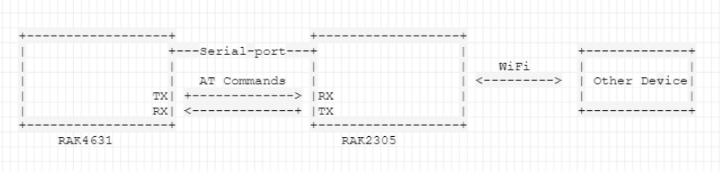
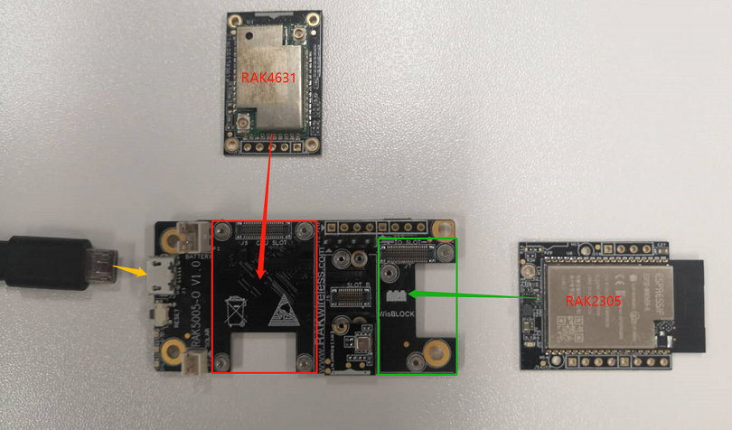
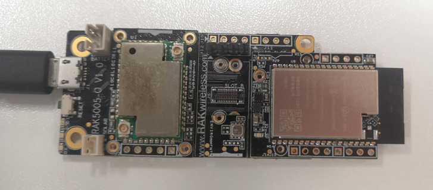

# WisBlock WiFi Programming Guide

This example shows how to use WisBlock IO RAK2305 WiFi board.

The WisBlock IO RAK2305 communicates with RAK4631 by AT commands.  The input of  AT commands and respond will be printed over the USB debug port of the WisBlock Base board.



----
## Hardware required
----
To test the WisBlock IO RAK2305 WiFi board, The following hardware is required.

- WisBlock Base RAK5005-O  *  1pcs
- WisBlock Core RAK4631  *  1pcs
- WisBlock IO RAK2305      *  1pcs

Hardware is shown as follows:



Assembled as follows:



For stable connection, please use screws to tighten.

----
## Software required
----
To test the WisBlock IO RAK2305 WiFi board, The following software is required.

- [ArduinoIDE](https://www.arduino.cc/en/Main/Software)
- [RAK4630 BSP](https://github.com/RAKWireless/RAK-nRF52-Arduino)    
----
## AT commands test
Test the AT commands through the serial tool of the Arduino IDE. AT commands are referred to the [ESP32 AT commands](https://docs.espressif.com/projects/esp-at/en/latest/AT_Command_Set/Wi-Fi_AT_Commands.html). 

The test software is written as follows:

```
void setup()
{
  // Open serial communications and wait for port to open:
  Serial.begin(115200);
  while ( !Serial ) delay(10);
  Serial.println("ESP32 AT CMD TEST!");

  //esp32 init
  Serial1.begin(115200);
}

void loop()
{
  String str = "";
  char cArr[128] = {0};

  uint8_t resp;
  uint8_t snd;

  while(Serial1.available() > 0)
  {
    resp = (uint8_t)(Serial1.read());
    Serial.write(resp);
  }

  while (Serial.available() > 0)
  {
    snd = (uint8_t)(Serial.read());
    Serial1.write(snd);
  }
}
```


The test commands of the example are as follows:

1. Set RAK2305 as AP and STA role.

```
AT+CWMODE=3
```

2. Query the softAP SSID of ESP32

```
AT+CWSAP?
```

3. ESP32 disconnect from AP

```
AT+CWQAP
```

4. List the available AP.

```
AT+CWLAP
```

5. Connect AP.

```
AT+CWJAP="SSID","Password"
```

6. Obtain the IP address of the ESP32 Station

```
AT+CIPSTA?
```

7. Test network with ping command.

```
AT+PING="8.8.8.8"
```


The test results are as follows：

```
[14:50:06.382]←ESP32 AT CMD TEST!

[14:50:13.332]→◇AT+CWMODE=3
□
[14:50:13.336]←◆AT+CWMODE=3

OK

[14:50:18.780]→◇AT+CWSAP?
□
[14:50:18.783]←◆AT+CWSAP?
+CWSAP:"ESP_57E062","",1,0,4,0

OK

[14:50:24.332]→◇AT+CWQAP
□
[14:50:24.335]←◆AT+CWQAP
WIFI DISCONNECT

OK

[14:50:30.148]→◇AT+CWLAP
□
[14:50:30.151]←◆AT+CWLAP

[14:50:32.155]←◆+CWLAP:(3,"Axon M",-50,"b0:c1:9e:76:24:e9",1)
+CWLAP:(0,"RAK7249_F835",-53,"60:c5:a8:76:f8:35",1)
+CWLAP:(3,"DIRECT-SWDESKTOP-FB8REVBmsWL",-56,"08:1f:71:30:95:06",11)
+CWLAP:(3,"Room-905",-58,"b4:fb:e4:4a:35:b2",1)
+CWLAP:(4,"clpc-Network",-64,"d8:15:0d:42:72:c0",1)
+CWLAP:(0,"",-67,"12:74:9c:a9:ef:09",11)
+CWLAP:(5,"chinalife-wifi",-69,"06:74:9c:a9:ef:09",11)
+CWLAP:(0,"chinalife-sales",-69,"0a:74:9c:a9:ef:09",11)
+CWLAP:(0,"chinalife-guest",-70,"0e:74:9c:a9:ef:09",11)
+CWLAP:(0,"chinalife-sales",-74,"0a:74:9c:a9:e8:f5",6)
+CWLAP:(0,"chinalife-guest",-74,"0e:74:9c:a9:e8:f5",6)
+CWLAP:(0,"",-76,"12:74:9c:a9:89:35",11)
+CWLAP:(5,"chinalife-wifi",-77,"06:74:9c:a9:89:35",11)
+CWLAP:(0,"chinalife-guest",-77,"0e:74:9c:a9:89:35",11)
+CWLAP:(0,"chinalife-sales",-78,"0a:74:9c:a9:89:35",11)
+CWLAP:(2,"",-90,"da:00:74:c0:d5:0c",1)
+CWLAP:(4,"ChinaNet-wKgD",-92,"9a:00:74:c0:d5:0c",1)

OK

[14:50:59.700]发→AT+CWJAP="Room-905","Mxjmxj_905"
□
[14:50:59.706]收←AT+CWJAP="Room-905","Mxjmxj_905"

[14:50:59.878]收←WIFI CONNECTED

[14:51:00.899]收←WIFI GOT IP

OK

[14:51:08.484]→◇AT+CIPSTA?
□
[14:51:08.489]←◆AT+CIPSTA?
+CIPSTA:ip:"172.31.204.97"
+CIPSTA:gateway:"172.31.204.1"
+CIPSTA:netmask:"255.255.255.0"

OK

[14:51:14.036]→◇AT+PING="8.8.8.8"
□
[14:51:14.043]←◆AT+PING="8.8.8.8"

[14:51:14.199]←◆+PING:149

OK
```

## Connect an AP

The above test demo is running by inputting AT commands one by one manually. Now we write a function to connect a known AP and PING the IP "8.8.8.8" every 5 seconds. 

The SSID and password of WIFI must be correct to connect the known AP.

The test software is written as follows:

```
/**
   @brief  execute at command
   @param  at: the at command you want to execute
   @param  expect: the respond you want to get
   @param  timeout: the timout of receive respond
*/
void execute_at(char *at, char *expect = NULL, int32_t timeout = 1000)
{
  String resp = "";

  Serial1.write(at);
  delay(10);

  while(timeout--){
      if(Serial1.available())
      {
         resp += Serial1.readString();
      }
      delay(1);
  }

  Serial.println(resp);
  if(expect != NULL)
  {
    if(resp.indexOf(expect) != -1)
    {
      Serial.println("Execute OK.");
    }
    else
    {
      Serial.println("Execute Fail.");
    }
  }
  resp="";
}

/**
   @brief Arduino setup function. Called once after power on or reset
*/
void setup()
{
  // Open serial communications and wait for port to open:
  Serial.begin(115200);
  while ( !Serial ) delay(10);

  Serial.println("================================");
  Serial.println("RAK2305 WiFI example");
  Serial.println("================================");
 
  Serial1.begin(115200);
  delay(1000);

  // Set RAK2305 as AP and STA role
  execute_at("AT+CWMODE=3\r\n", "OK");

  // Set contry code
  execute_at("AT+CWCOUNTRY=0,\"CN\",1,13\r\n", "OK");

  // Connect AP with ssid and password
  execute_at("AT+CWJAP=\"Room-905\",\"Mxjmxj_905\"\r\n", "OK");
}

/**
   @brief Arduino loop. Runs forever until power off or reset
*/
void loop()
{
  Serial1.println("AT+PING=\"8.8.8.8\"");
  execute_at("AT+QPING=1,\"8.8.8.8\"\r\n", "OK");
  delay(5000);
}
```

The test results are as follows:

```
17:49:23.477 -> ================================
17:49:23.477 -> RAK2305 WiFI example
17:49:23.477 -> ================================
17:49:26.442 -> AT+CWMODE=3
17:49:26.442 -> 
17:49:26.442 -> OK
17:49:26.442 -> 
17:49:26.442 -> Execute OK.
17:49:28.442 -> AT+CWCOUNTRY=0,"CN",1,13
17:49:28.442 -> 
17:49:28.442 -> OK
17:49:28.442 -> 
17:49:28.442 -> Execute OK.
17:49:31.555 -> AT+CWJAP="Room-905","Mxjmxj_905"
17:49:31.555 -> WIFI DISCONNECT
17:49:31.555 -> WIFI CONNECTED
17:49:31.555 -> WIFI GOT IP
17:49:31.555 -> 
17:49:31.555 -> OK
17:49:31.555 -> 
17:49:31.555 -> Execute OK.
17:49:33.705 -> AT+PING="8.8.8.8"
17:49:33.705 -> 
17:49:33.705 -> busy p...
17:49:33.705 -> +PING:131
17:49:33.705 -> 
17:49:33.705 -> OK
17:49:33.705 -> 
17:49:33.705 -> Execute OK.
17:49:40.754 -> AT+PING="8.8.8.8"
17:49:40.754 -> 
17:49:40.754 -> busy p...
17:49:40.754 -> +PING:72
17:49:40.754 -> 
17:49:40.754 -> OK
17:49:40.754 -> 
17:49:40.754 -> Execute OK.
17:49:47.901 -> AT+PING="8.8.8.8"
17:49:47.901 -> 
17:49:47.901 -> busy p...
17:49:47.901 -> +PING:170
17:49:47.901 -> 
17:49:47.901 -> OK
17:49:47.901 -> 
17:49:47.901 -> Execute OK.
17:49:55.922 -> AT+PING="8.8.8.8"
17:49:55.922 -> 
17:49:55.922 -> busy p...
17:49:55.922 -> +PING:TIMEOUT
17:49:55.922 -> 
17:49:55.922 -> ERROR
17:49:55.922 -> 
17:49:55.922 -> Execute Fail.
17:50:03.099 -> AT+PING="8.8.8.8"
17:50:03.099 -> 
17:50:03.099 -> busy p...
17:50:03.099 -> +PING:211
17:50:03.099 -> 
17:50:03.099 -> OK
17:50:03.099 -> 
17:50:03.099 -> Execute OK.
17:50:10.173 -> AT+PING="8.8.8.8"
17:50:10.173 -> 
17:50:10.173 -> busy p...
17:50:10.173 -> +PING:65
17:50:10.173 -> 
17:50:10.173 -> OK
17:50:10.173 -> 
17:50:10.173 -> Execute OK.

```


