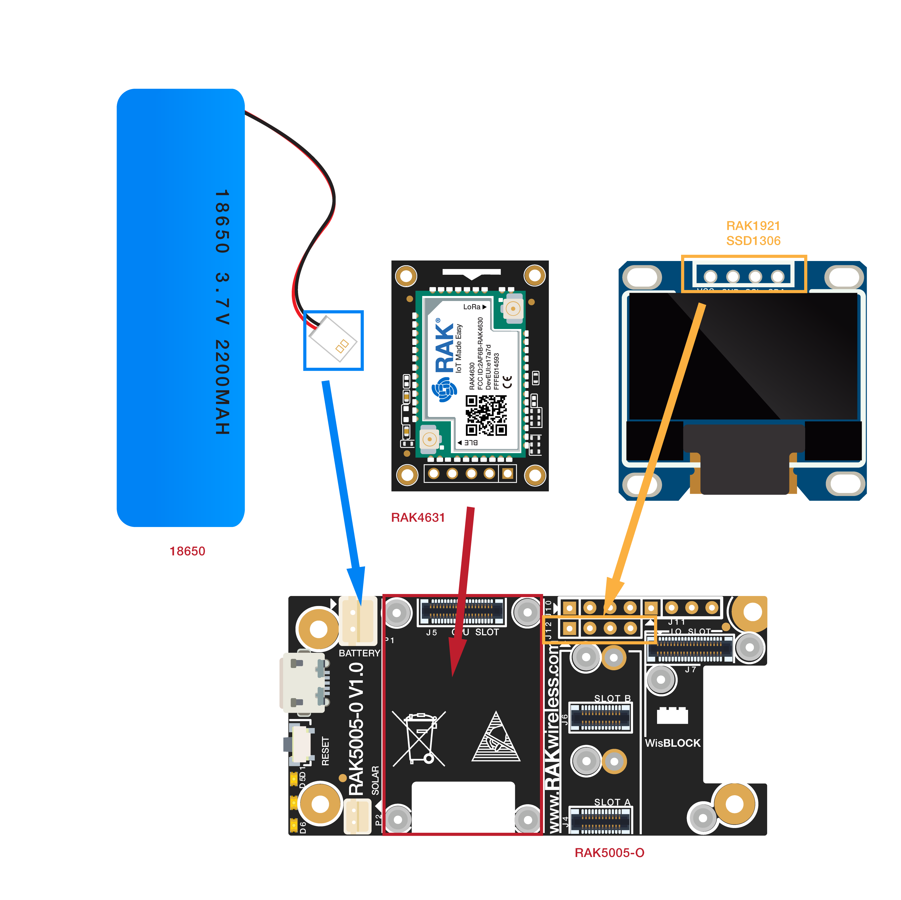
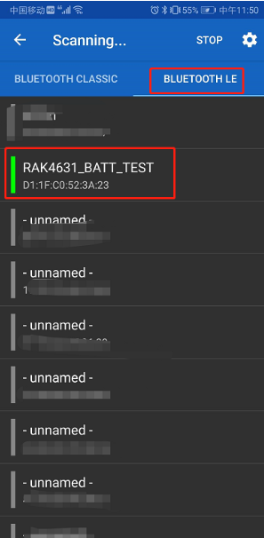

# RAK4630 Battery Level Detect
----
This example calculates the battery level, displays it on an OLED display and sends it over BLE UART to a connected BLE device.
It includes as well the OTA DFU functionality

## Required hardware
- WisBlock Base RAK5005-O    
- WisBlock Core RAK4631    
- WisBlock IO RAK1921    
- LiPo battery    

The hardware is connected like this:


## Required software
- [ArduinoIDE](https://www.arduino.cc/en/Main/Software)
- [RAK4630 BSP](https://github.com/RAKWireless/RAK-nRF52-Arduino)
- nRF52_OLED library


- On the phone
  - a BLE UART application like [Serial Bluetooth Terminal](https://play.google.com/store/apps/details?id=de.kai_morich.serial_bluetooth_terminal) to test BLE UART communication

Connect the assembled hardware to the PC with a USB cable, open the Arduino, and select the development board and port in the tool menu.


## Source codes

This program consists of three files.

- [Read_Bettery_Level](Read_Battery_Level/Read_Battery_Level.ino) - Main program which detect battery level and call the API of OLED and BLE UART
- [display](Read_Battery_Level/display.ino) - Display the battery level on SSD1306
- [ble](Read_Battery_Level/ble.ino) - Send the data by BLE UART service

#### Read_Battery_Level.ino
The usual includes
```cpp
#include <Arduino.h>
#include <bluefruit.h>
```
Define fixed values for the conversion of the analog value to the battery voltage. The compensation factor VBAT_DIVIDER_COMP might require adjustment, depending on the battery used. 
```cpp
#define PIN_VBAT A0

uint32_t vbat_pin = PIN_VBAT;

#define VBAT_MV_PER_LSB (0.73242188F) // 3.0V ADC range and 12-bit ADC resolution = 3000mV/4096
#define VBAT_DIVIDER (0.4F)        // 1.5M + 1M voltage divider on VBAT = (1.5M / (1M + 1.5M))
#define VBAT_DIVIDER_COMP (1.73)    // (1.403F) // Compensation factor for the VBAT divider

#define REAL_VBAT_MV_PER_LSB (VBAT_DIVIDER_COMP * VBAT_MV_PER_LSB)
```
Includes and forward declarations for Bluetooth Low Energy
```cpp
#include <bluefruit.h>
void initBLE();
extern bool bleUARTisConnected;
extern BLEUart bleuart;

char bleString[256] = {0};
```
Includes and forward declarations for the display
```cpp
void initDisplay(void);
void dispAddLine(char *line);
char dispText[256] = {0};
```
The function readVBAT reads the analog value from the pin A0. This pin is connected to the battery with a voltage divider. The value is then converted to the real battery voltage.
```cpp
float readVBAT(void)
{
  float raw;

  // Get the raw 12-bit, 0..3000mV ADC value
  raw = analogRead(vbat_pin);

  // // Set the ADC back to the default settings
  // analogReference(AR_DEFAULT);
  // analogReadResolution(10);

  // Convert the raw value to compensated mv, taking the resistor-
  // divider into account (providing the actual LIPO voltage)
  // ADC range is 0..3000mV and resolution is 12-bit (0..4095)
  return raw * REAL_VBAT_MV_PER_LSB;
}
```
The function mvToPercent converts the battery voltage into a percentage value
```cpp
uint8_t mvToPercent(float mvolts)
{
  if (mvolts < 3300)
    return 0;

  if (mvolts < 3600)
  {
    mvolts -= 3300;
    return mvolts / 30;
  }
```
  In the LoRaWan specification, a device can transmit its battery level on request from the LoRaWan server. The expected battery level value ranges from 0 (no battery) to 255 (100% battery charge). The function mvToLoRaWanBattVal converts the battery voltage to a value between 0 and 255
  ```cpp
  uint8_t mvToLoRaWanBattVal(float mvolts)
{ // * 2.55
  if (mvolts < 3300)
    return 0;

  if (mvolts < 3600)
  {
    mvolts -= 3300;
    return mvolts / 30 * 2.55;
  }

  mvolts -= 3600;
  return (10 + (mvolts * 0.15F)) * 2.55;
}
  ```
In the setup routine we initialize the display, the Serial USB connection and setup the AD converter of the nRF52840
```cpp
void setup()
{
  initDisplay();

  Serial.begin(115200);
  dispAddLine("Waiting for Serial");
  time_t serialTimeout = millis();
  while (!Serial)
  {
    delay(10); // for nrf52840 with native usb
    if ((millis()-serialTimeout) > 5000)
    {
      break;
    }
  }

  Serial.println("=====================================");
  Serial.println("RAK4631 Battery test");
  Serial.println("=====================================");

  // Start BLE
  dispAddLine("Init BLE");
  initBLE();

  // Set the analog reference to 3.0V (default = 3.6V)
  analogReference(AR_INTERNAL_3_0);

  // Set the resolution to 12-bit (0..4095)
  analogReadResolution(12); // Can be 8, 10, 12 or 14

  // Let the ADC settle
  delay(1);

  // Get a single ADC sample and throw it away
  readVBAT();
}
```
In the loop function we read the battery level every 1 second and show the level on the display. If a BLE client is connected, we send the battery level as well over BLE to the BLE client using BLE UART.
```cpp
void loop()
{
  // Get a raw ADC reading
  float vbat_mv = readVBAT();

  // Convert from raw mv to percentage (based on LIPO chemistry)
  uint8_t vbat_per = mvToPercent(vbat_mv);

  // Display the results

  snprintf(dispText, 255, "%.3fV \t %d%%", vbat_mv/1000, vbat_per);
  dispAddLine(dispText);

  Serial.print("LIPO = ");
  Serial.print(vbat_mv);
  Serial.print(" mV (");
  Serial.print(vbat_per);
  Serial.print("%) LoRaWan Batt ");
  Serial.println(mvToLoRaWanBattVal(vbat_mv));

  if (bleUARTisConnected)
  {
    if (bleUARTisConnected)
    {
      snprintf(bleString, 255, "%.0fmV %d%% %d/255\n", vbat_mv, vbat_per, mvToLoRaWanBattVal(vbat_mv));
      bleuart.print(bleString);
    }
  }
  delay(1000);
}
```
#### ble.ino
For better code readability, the BLE functions are in a separate code file.

First some includes, forward declarations and declarations of instances and variables
```cpp
#include <bluefruit.h>

void startAdv(void);
void connect_callback(uint16_t conn_handle);
void disconnect_callback(uint16_t conn_handle, uint8_t reason);

/**
 * @brief  BLE DFU service
 * @note   Used for DFU OTA updates
 */
BLEDfu bledfu;
/**
 * @brief  BLE UART service
 * @note   Used for BLE UART communication
 */
BLEUart bleuart;

/**
 * @brief  Flag if BLE UART client is connected
 */
bool bleUARTisConnected = false;
```
The function initBLE initializes the BLE services (characteristics) we want to support, sets the signal strength and starts the BLE server
```cpp
void initBLE(void)
{
  // Config the peripheral connection with maximum bandwidth
  // more SRAM required by SoftDevice
  // Note: All config***() function must be called before begin()
  Bluefruit.configPrphBandwidth(BANDWIDTH_MAX);
  Bluefruit.configPrphConn(92, BLE_GAP_EVENT_LENGTH_MIN, 16, 16);

  Bluefruit.begin(1, 0);
  // Set max power. Accepted values are: -40, -30, -20, -16, -12, -8, -4, 0, 4
  Bluefruit.setTxPower(4);

  Bluefruit.setName("RAK4631_BATT_TEST");

  Bluefruit.Periph.setConnectCallback(connect_callback);
  Bluefruit.Periph.setDisconnectCallback(disconnect_callback);

  // To be consistent OTA DFU should be added first if it exists
  bledfu.begin();

  // Configure and Start BLE Uart Service
  bleuart.begin();

  // Set up and start advertising
  startAdv();
}
```
To be able to connect from a phone to the BLE services, the RAK4631 needs to advertise itself over BLE. This is initiated in the startAdv function
```cpp
void startAdv(void)
{
  // Advertising packet
  Bluefruit.Advertising.addFlags(BLE_GAP_ADV_FLAGS_LE_ONLY_GENERAL_DISC_MODE);
  Bluefruit.Advertising.addTxPower();
  Bluefruit.Advertising.addName();

  /* Start Advertising
   * - Enable auto advertising if disconnected
   * - Interval:  fast mode = 20 ms, slow mode = 152.5 ms
   * - Timeout for fast mode is 30 seconds 
   * - Start(timeout) with timeout = 0 will advertise forever (until connected)
   * 
   * For recommended advertising interval
   * https://developer.apple.com/library/content/qa/qa1931/_index.html   
   */
  Bluefruit.Advertising.restartOnDisconnect(true);
  Bluefruit.Advertising.setInterval(32, 244); // in unit of 0.625 ms
  Bluefruit.Advertising.setFastTimeout(30); // number of seconds in fast mode
  Bluefruit.Advertising.start(0);       // 0 = Don't stop advertising after n seconds
}
```
If a phone connects to the RAK4631 or disconnects, the BLE library provides two callback functions to notify the application about it. We use these callback functions to set a flag that tells our main loop if we have to send the battery levels over BLE
```cpp
void connect_callback(uint16_t conn_handle)
{
  (void)conn_handle;
  bleUARTisConnected = true;
}

void disconnect_callback(uint16_t conn_handle, uint8_t reason)
{
  (void)conn_handle;
  (void)reason;
  bleUARTisConnected = false;
}
```
#### display.ino
For better code readability, the display functions are in a separate code file.

First some includes, definitions for the display proportions and declaration of instances and variables
```cpp
#include <Arduino.h>

#include <nRF_SSD1306Wire.h>

void dispShow(void);
void dispWriteHeader(void);

#define OLED_WIDTH 128
#define OLED_HEIGHT 64
#define STATUS_BAR_HEIGHT 11
#define LINE_HEIGHT 10
#define MARGIN 3

/** Number of message lines */
#define NUM_OF_LINES (OLED_HEIGHT - STATUS_BAR_HEIGHT) / LINE_HEIGHT

/** Line buffer for messages */
char buffer[NUM_OF_LINES][32] = {0};

/** Current line used */
uint8_t currentLine = 0;

SSD1306Wire display(0x3c, PIN_WIRE_SDA, PIN_WIRE_SCL, GEOMETRY_128_64);

char text[32];
```
initDisplay initializes the display, clears the screen and calls dispWriteHeader to write the header (top text row) to the display.
```cpp
void initDisplay(void)
{
  LOG_LV2(,"DISPLAY"."Display init with h %d w %d lines %d", OLED_HEIGHT, OLED_WIDTH, NUM_OF_LINES);

  delay(500); // Give display reset some time
  display.setI2cAutoInit(true);
  display.init();
  display.displayOff();
  display.clear();
  display.displayOn();
  display.flipScreenVertically();
  display.setContrast(128);
  display.setFont(ArialMT_Plain_10);

  dispWriteHeader();

  display.display();
}
```
dispWriteHeader writes the header (top text row) to the display 
```cpp
void dispWriteHeader(void)
{
  display.setFont(ArialMT_Plain_10);

  // clear the status bar
  display.setColor(BLACK);
  display.fillRect(0, 0, OLED_WIDTH, STATUS_BAR_HEIGHT);

  display.setColor(WHITE);
  display.setTextAlignment(TEXT_ALIGN_LEFT);
  display.drawString(0, 0, "RAK4631 Battery test");

  display.drawLine(0, 12, 128, 12);
  display.display();
}
```
to achieve an automatic scrolling of the display content we use a buffer of 5 lines. If the main loop wants to write something to the display, it does not write the text directly. Instead it calls dispAddLine, which adds the text to the buffer and scrolls the content if required. Then it writes the complete buffer to the display to update the content
```cpp
void dispAddLine(char *line)
{
  LOG_LV2("DISPLAY","Adding line %d", currentLine);

  if (currentLine == NUM_OF_LINES)
  {
    LOG_LV2("DISPLAY", "Shifting buffer up");
    // Display is full, shift text one line up
    for (int idx = 0; idx < NUM_OF_LINES; idx++)
    {
      memcpy(buffer[idx], buffer[idx + 1], 32);
    }
    currentLine--;
  }
  snprintf(buffer[currentLine], 32, "%s", line);

  if (currentLine != NUM_OF_LINES)
  {
    currentLine++;
  }
  LOG_LV2("DISPLAY", "Added line %d with %s", currentLine - 1, line);

  dispShow();
}
```
The dispShow functions writes the content of the line buffer to the display. It first clears the display below the header (which is static) before writing the new content.
```cpp
void dispShow(void)
{
  display.setColor(BLACK);
  display.fillRect(0, STATUS_BAR_HEIGHT + 1, OLED_WIDTH, OLED_HEIGHT);

  display.setFont(ArialMT_Plain_10);
  display.setColor(WHITE);
  display.setTextAlignment(TEXT_ALIGN_LEFT);
  for (int line = 0; line < currentLine; line++)
  {
    LOG_LV2("DISPLAY", "Writing %s to line %d which starts at %d",
        buffer[line],
        line,
        (line * LINE_HEIGHT) + STATUS_BAR_HEIGHT + 1);
    display.drawString(0, (line * LINE_HEIGHT) + STATUS_BAR_HEIGHT + 1, buffer[line]);
  }
  display.display();
}
```

## Test result

The battery level displays on RAK1921 is as bellow.


Open the [Serial Bluetooth Terminal](https://play.google.com/store/apps/details?id=de.kai_morich.serial_bluetooth_terminal) on the phone, scan the BLE "**RAK4631_BATT_TEST**" and connect it.



Then the battery level display on the phone as bellow.


