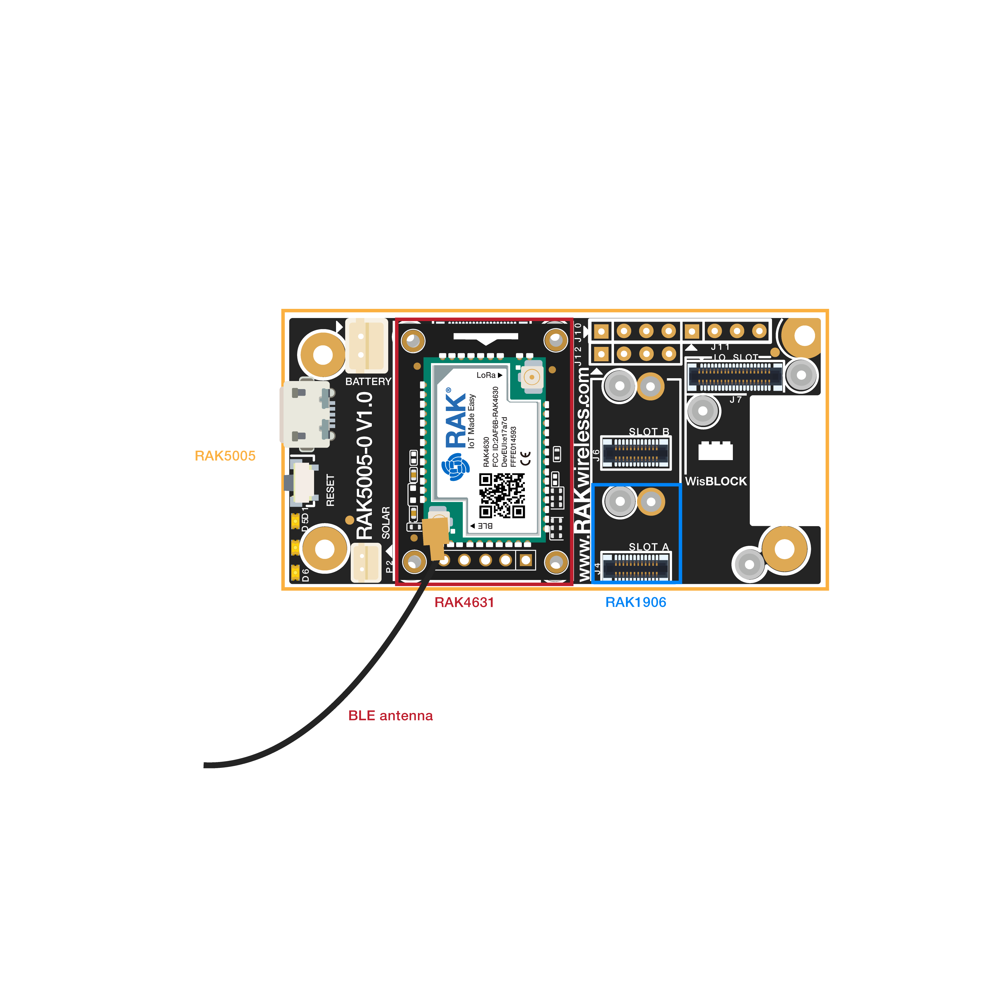
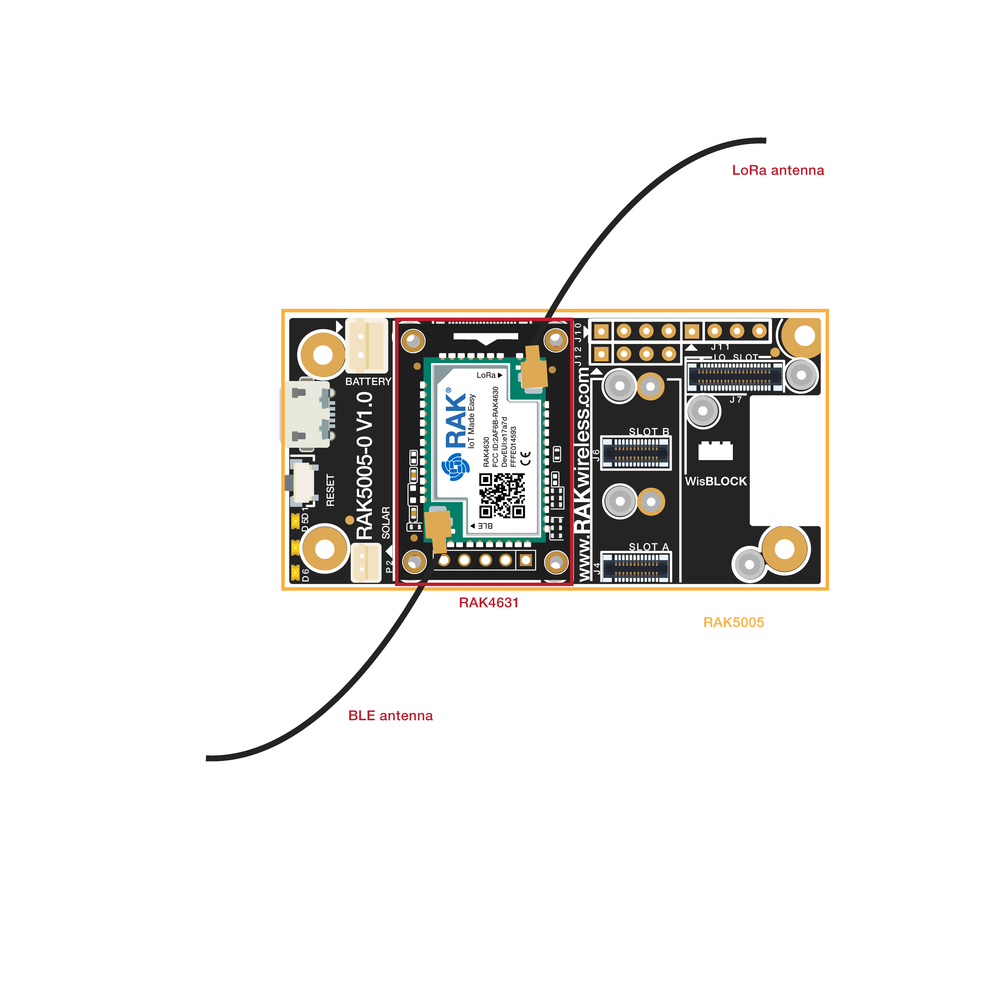

# BLE Gateway
----
This example shows how to setup two WisBlock devices. Device A acts as a environmental condition sensor and sends its sensor data over BLE. Device  B acts as a gateway between the BLE sensor and LoRaWan®. With this solution we demonstrate how the communication range of BLE sensors can be extended by forwarding sensor data from BLE to LoRaWan®. 


## Hardware required
----
To build this system two WisBlock Base RAK5005-O and WisBlock Core RAK4631 are required.
The sensor node uses a WisBlock Core RAK4631 microcontroller and the WisBlock Sensor RAK1906 environment board. 

- WisBlock Base RAK5005-O    \* 2pcs
- WisBlock Core RAK4631   \* 2pcs
- WisBlock Sensor RAK1906   \* 1pcs

The assembly of sensor node is as follows:




The gateway uses a WisBlock Core RAK4631 microcontroller and no additional modules are required. 

The assembly of gateway is as follows:



For stable connection, please use screws to tighten.

----
## Software required
----

- [ArduinoIDE](https://www.arduino.cc/en/Main/Software)
- [RAK4630 BSP](https://github.com/RAKWireless/RAK-nRF52-Arduino)
- CloseCube_BME680 library


- SX126x-Arduino

  

----

The code for the sensors node can be found in the [sketch file](https://github.com/RAKWireless/WisBlock/blob/master/examples/RAK4630/solutions/BLE_Gateway/ble_environment_node/ble_environment_node.ino)

<!--
The code of sensors node is as follows:

```
/**
 * @file ble_environment_node.ino
 * @author rakwireless.com
 * @brief This sketch demonstrate how to get environment data from BME680
 *    and send the data to ble gateway with ble gatt.
 *    ble environment node <- ble -> ble gateway <- lora -> lora gateway < -- > lora server
 * @version 0.1
 * @date 2020-07-28
 * 
 * @copyright Copyright (c) 2020
 * 
 */

#include <bluefruit.h>
#include <Wire.h>
#include "ClosedCube_BME680.h" //https://github.com/closedcube/ClosedCube_BME680_Arduino

ClosedCube_BME680 bme680;

float temperature = 0;
float humidity = 0;
float pressure = 0;

/* Environment Service Definitions
   Environment Monitor Service:  0x181A
   Pressure Measurement Char: 0x2A6D
   Temperature Measurement Char: 0x2A6E
   humidity Measurement Char: 0x2A6F
*/
BLEService        envms = BLEService(UUID16_SVC_ENVIRONMENTAL_SENSING);
BLECharacteristic pressuremc = BLECharacteristic(0x2A6D);
BLECharacteristic temprtmc = BLECharacteristic(UUID16_CHR_TEMPERATURE);
BLECharacteristic humidmc = BLECharacteristic(0x2A6F); // humidity

BLEDis bledis;    // DIS (Device Information Service) helper class instance
BLEBas blebas;    // BAS (Battery Service) helper class instance

void bme680_init()
{
  Wire.begin();
  bme680.init(0x76); // I2C address: 0x76 or 0x77
  bme680.reset();

  Serial.print("Chip ID=0x");
  Serial.println(bme680.getChipID(), HEX);

  // oversampling: humidity = x1, temperature = x2, pressure = x16
  bme680.setOversampling(BME680_OVERSAMPLING_X1, BME680_OVERSAMPLING_X2, BME680_OVERSAMPLING_X16);
  bme680.setIIRFilter(BME680_FILTER_3);
  bme680.setGasOn(300, 100); // 300 degree Celsius and 100 milliseconds

  bme680.setForcedMode();
}

void startAdv(void)
{
  // Advertising packet
  Bluefruit.Advertising.addFlags(BLE_GAP_ADV_FLAGS_LE_ONLY_GENERAL_DISC_MODE);
  Bluefruit.Advertising.addTxPower();

  // Include Environment Service UUID
  Bluefruit.Advertising.addService(envms);

  // Include Name
  Bluefruit.Advertising.addName();

  /* Start Advertising
     - Enable auto advertising if disconnected
     - Interval:  fast mode = 20 ms, slow mode = 152.5 ms
     - Timeout for fast mode is 30 seconds
     - Start(timeout) with timeout = 0 will advertise forever (until connected)

     For recommended advertising interval
     https://developer.apple.com/library/content/qa/qa1931/_index.html
  */
  Bluefruit.Advertising.restartOnDisconnect(true);
  Bluefruit.Advertising.setInterval(160, 244);    // in unit of 0.625 ms
  Bluefruit.Advertising.setFastTimeout(30);      // number of seconds in fast mode
  Bluefruit.Advertising.start(0);                // 0 = Don't stop advertising after n seconds
}

void setupEnvm(void)
{
  // Configure the Environment service
  // See: https://www.bluetooth.com/specifications/assigned-numbers/environmental-sensing-service-characteristics/
  // Supported Characteristics:
  // Name                         UUID    Requirement Properties
  // ---------------------------- ------  ----------- ----------
  // Pressure Measurement: 0x2A6D
  // Temperature Measurement: 0x2A6E
  // humidity Measurement: 0x2A6F
  envms.begin();

  // Note: You must call .begin() on the BLEService before calling .begin() on
  // any characteristic(s) within that service definition.. Calling .begin() on
  // a BLECharacteristic will cause it to be added to the last BLEService that
  // was 'begin()'ed!

  // Configure the Environment Measurement characteristic
  // See: https://www.bluetooth.com/xml-viewer/?src=https://www.bluetooth.com/wp-content/uploads/Sitecore-Media-Library/Gatt/Xml/Characteristics/org.bluetooth.characteristic.pressure.xml
  // Properties = Notify

  pressuremc.setProperties(CHR_PROPS_NOTIFY);
  pressuremc.setPermission(SECMODE_OPEN, SECMODE_NO_ACCESS);
  pressuremc.setFixedLen(4);
  pressuremc.setCccdWriteCallback(cccd_callback);  // Optionally capture CCCD updates
  pressuremc.begin();
	uint8_t pressuredata[4] = {0x00};
  pressuremc.write(pressuredata, 4);

  // Configure the Environment Measurement characteristic
  // See: https://www.bluetooth.com/xml-viewer/?src=https://www.bluetooth.com/wp-content/uploads/Sitecore-Media-Library/Gatt/Xml/Characteristics/org.bluetooth.characteristic.temperature.xml
  // Properties = Notify
  temprtmc.setProperties(CHR_PROPS_NOTIFY);
  temprtmc.setPermission(SECMODE_OPEN, SECMODE_NO_ACCESS);
  temprtmc.setFixedLen(2);
  temprtmc.setCccdWriteCallback(cccd_callback);  // Optionally capture CCCD updates
  temprtmc.begin();
	uint8_t tmpdata[2] = {0x00}; // Set the characteristic to use 8-bit values, with the sensor connected and detected
  temprtmc.write(tmpdata, 2);

  // Configure the Environment Measurement characteristic
  // See: https://www.bluetooth.com/xml-viewer/?src=https://www.bluetooth.com/wp-content/uploads/Sitecore-Media-Library/Gatt/Xml/Characteristics/org.bluetooth.characteristic.humidity.xml
  // Properties = Notify
  humidmc.setProperties(CHR_PROPS_NOTIFY);
  humidmc.setPermission(SECMODE_OPEN, SECMODE_NO_ACCESS);
  humidmc.setFixedLen(2);
  humidmc.setCccdWriteCallback(cccd_callback);  // Optionally capture CCCD updates
  humidmc.begin();
	uint8_t humiddata[2] = {0x00}; // Set the characteristic to use 8-bit values, with the sensor connected and detected
  humidmc.write(humiddata, 2);
}

void connect_callback(uint16_t conn_handle)
{
  // Get the reference to current connection
	BLEConnection *connection = Bluefruit.Connection(conn_handle);

	char central_name[32] = {0};
  connection->getPeerName(central_name, sizeof(central_name));

  Serial.print("Connected to ");
  Serial.println(central_name);
}

/**
   Callback invoked when a connection is dropped
   @param conn_handle connection where this event happens
   @param reason is a BLE_HCI_STATUS_CODE which can be found in ble_hci.h
*/
void disconnect_callback(uint16_t conn_handle, uint8_t reason)
{
	(void)conn_handle;
	(void)reason;

	Serial.print("Disconnected, reason = 0x");
	Serial.println(reason, HEX);
  Serial.println("Advertising!");
}

void cccd_callback(uint16_t conn_hdl, BLECharacteristic *chr, uint16_t cccd_value)
{
  // Display the raw request packet
  Serial.print("CCCD Updated: ");
  //Serial.printBuffer(request->data, request->len);
  Serial.print(cccd_value);
  Serial.println("");

  // Check the characteristic this CCCD update is associated with in case
  // this handler is used for multiple CCCD records.
	if (chr->uuid == pressuremc.uuid)
	{
		if (chr->notifyEnabled(conn_hdl))
		{
      Serial.println("Temperature Measurement 'Notify' enabled");
		}
		else
		{
      Serial.println("Temperature Measurement 'Notify' disabled");
    }
  }
	else if (chr->uuid == temprtmc.uuid)
	{
		if (chr->notifyEnabled(conn_hdl))
		{
      Serial.println("Temperature Measurement 'Notify' enabled");
		}
		else
		{
      Serial.println("Temperature Measurement 'Notify' disabled");
    }
  }
	else if (chr->uuid == humidmc.uuid)
	{
		if (chr->notifyEnabled(conn_hdl))
		{
      Serial.println("Humidity Measurement 'Notify' enabled");
		}
		else
		{
      Serial.println("Humidity Measurement 'Notify' disabled");
    }
  }
}

void setup()
{
  Serial.begin(115200);
  // while ( !Serial ) delay(10);   // for nrf52840 with native usb

  /* bme680 init */
  bme680_init();

  Serial.println("RAK Wisnode EnvM Example");
  Serial.println("-----------------------\n");

  // Initialise the Bluefruit module
  Serial.println("Initialise the Bluefruit module");
  Bluefruit.begin();

  // Set the advertised device name (keep it short!)
  Serial.println("Setting Device Name to 'RAKwisnode EnvM'");
  Bluefruit.setName("RAKwisnode EnvM");

  Bluefruit.setTxPower(4);

  // Set the connect/disconnect callback handlers
  Bluefruit.Periph.setConnectCallback(connect_callback);
  Bluefruit.Periph.setDisconnectCallback(disconnect_callback);

  // Configure and Start the Device Information Service
  Serial.println("Configuring the Device Information Service");
  bledis.setManufacturer("Adafruit Industries");
  bledis.setModel("Bluefruit Feather52");
  bledis.begin();

  // Start the BLE Battery Service and set it to 100%
  Serial.println("Configuring the Battery Service");
  blebas.begin();
  blebas.write(100);

  // Setup the Environment service using
  // BLEService and BLECharacteristic classes
  Serial.println("Configuring the Environment Monitor Service");
  setupEnvm();

  // Setup the advertising packet(s)
  Serial.println("Setting up the advertising payload(s)");
  startAdv();

  Serial.println("\nAdvertising");
}

void loop()
{
	digitalToggle(LED_GREEN);

	if (Bluefruit.connected())
	{
        temperature = bme680.readTemperature();
    pressure = bme680.readPressure();
        humidity = bme680.readHumidity();

		uint8_t tmpdata[2] = {0x0}; // little-endian
    tmpdata[1] = (uint8_t)(((int)(temperature * 100) & 0xff00) >> 8);
    tmpdata[0] = (uint8_t)((int)(temperature * 100) & 0xff);

		uint8_t humiddata[2] = {0x0}; // little-endian
    humiddata[1] = (uint8_t)(((int)(humidity * 100) & 0xff00) >> 8);
    humiddata[0] = (uint8_t)((int)(humidity * 100) & 0xff);

		uint8_t pressuredata[4] = {0x0}; // little-endian
    pressuredata[3] = (uint8_t)(((int)(pressure * 1000) & 0xff000000) >> 24);
    pressuredata[2] = (uint8_t)(((int)(pressure * 1000) & 0xff0000) >> 16);
    pressuredata[1] = (uint8_t)(((int)(pressure * 1000) & 0xff00) >> 8);
    pressuredata[0] = (uint8_t)((int)(pressure * 1000) & 0xff);

    // Note: We use .notify instead of .write!
    // If it is connected but CCCD is not enabled
    // The characteristic's value is still updated although notification is not sent
		if (pressuremc.notify(pressuredata, sizeof(pressuredata)))
		{
			Serial.print("Pressure Measurement updated to: ");
			Serial.println(pressure);
    }
		if (temprtmc.notify(tmpdata, sizeof(tmpdata)))
		{
			Serial.print("Temperature Measurement updated to: ");
			Serial.println(temperature);
    }
		if (humidmc.notify(humiddata, sizeof(humiddata)))
		{
			Serial.print("Humidityrature Measurement updated to: ");
			Serial.println(humidity);
    }
  }

  delay(20000);
}
```
-->

The code for the gateway can be found in the [sketch file](https://github.com/RAKWireless/WisBlock/blob/master/examples/RAK4630/solutions/BLE_Gateway/ble_gateway/ble_gateway.ino)

<!--
The code of gateway is as follows:

```
/*
   This sketch demonstrate how to get the environment data from ble environment node.
   And send the data to lora® gateway.

   ble environment node < -ble- > ble gateway < -lora®- > lora® gateway < -- > lora® server

*/
#include <Arduino.h>
#include <LoRaWan-RAK4630.h>
#include <SPI.h>
#include <bluefruit.h>

// RAK4630 supply two LED
#ifndef LED_BUILTIN
#define LED_BUILTIN 35
#endif

#ifndef LED_BUILTIN2
#define LED_BUILTIN2 36
#endif

bool doOTAA = true;
#define SCHED_MAX_EVENT_DATA_SIZE APP_TIMER_SCHED_EVENT_DATA_SIZE /**< Maximum size of scheduler events. */
#define SCHED_QUEUE_SIZE 60  /**< Maximum number of events in the scheduler queue. */
#define LORAWAN_DATERATE DR_0 /*LoRaMac datarates definition, from DR_0 to DR_5*/
#define LORAWAN_TX_POWER TX_POWER_5 /*LoRaMac tx power definition, from TX_POWER_0 to TX_POWER_15*/
#define JOINREQ_NBTRIALS 3 /**< Number of trials for the join request. */
DeviceClass_t gCurrentClass = CLASS_A; /* class definition*/
lmh_confirm gCurrentConfirm = LMH_CONFIRMED_MSG; /* confirm/unconfirm packet definition*/
uint8_t gAppPort = LORAWAN_APP_PORT;   /* data port*/

/**@brief Structure containing LoRaWan® parameters, needed for lmh_init()
 */
static lmh_param_t lora_param_init = {LORAWAN_ADR_ON , LORAWAN_DATERATE, LORAWAN_PUBLIC_NETWORK, JOINREQ_NBTRIALS, LORAWAN_TX_POWER, LORAWAN_DUTYCYCLE_OFF};

// Foward declaration
static void lorawan_has_joined_handler(void);
static void lorawan_rx_handler(lmh_app_data_t *app_data);
static void lorawan_confirm_class_handler(DeviceClass_t Class);
static void send_lora_frame(void);

/**@brief Structure containing LoRaWan callback functions, needed for lmh_init()
*/
static lmh_callback_t lora_callbacks = {BoardGetBatteryLevel, BoardGetUniqueId, BoardGetRandomSeed,
										lorawan_rx_handler, lorawan_has_joined_handler, lorawan_confirm_class_handler};


//OTAA keys
uint8_t nodeDeviceEUI[8] = {0x88, 0x88, 0x88, 0x88, 0x88, 0x88, 0x33, 0x33};
uint8_t nodeAppEUI[8] = {0xB8, 0x27, 0xEB, 0xFF, 0xFE, 0x39, 0x00, 0x00};
uint8_t nodeAppKey[16] = {0x88, 0x88, 0x88, 0x88, 0x88, 0x88, 0x88, 0x88,0x88, 0x88, 0x88, 0x33, 0x33, 0x33, 0x33, 0x33};


// Private defination
#define LORAWAN_APP_DATA_BUFF_SIZE 64  /**< buffer size of the data to be transmitted. */
static uint8_t m_lora_app_data_buffer[LORAWAN_APP_DATA_BUFF_SIZE]; //< Lora user application data buffer.
static lmh_app_data_t m_lora_app_data = {m_lora_app_data_buffer, 0, 0, 0, 0}; //< Lora user application data structure.

static uint32_t count = 0;
static uint32_t count_fail = 0;

void setup()
{
  pinMode(LED_BUILTIN, OUTPUT);
  digitalWrite(LED_BUILTIN, LOW);

  // Initialize LoRa® chip.
  lora_rak4630_init();

  // Initialize Serial for debug output
  Serial.begin(115200);
  while(!Serial){delay(10);}
  Serial.println("=====================================");
  Serial.println("Welcome to RAK4630 LoRaWan!!!");
  Serial.println("Type: OTAA");


#if defined(REGION_AS923)
  Serial.println("Region: AS923");
#elif defined(REGION_AU915)
  Serial.println("Region: AU915");
#elif defined(REGION_CN470)
  Serial.println("Region: CN470");
#elif defined(REGION_CN779)
  Serial.println("Region: CN779");
#elif defined(REGION_EU433)
  Serial.println("Region: EU433");
#elif defined(REGION_IN865)
  Serial.println("Region: IN865");
#elif defined(REGION_EU868)
  Serial.println("Region: EU868");
#elif defined(REGION_KR920)
  Serial.println("Region: KR920");
#elif defined(REGION_US915)
  Serial.println("Region: US915");
#elif defined(REGION_US915_HYBRID)
  Serial.println("Region: US915_HYBRID");
#else
  Serial.println("Please define a region in the compiler options.");
#endif
  Serial.println("=====================================");

  // Setup the EUIs and Keys
  lmh_setDevEui(nodeDeviceEUI);
  lmh_setAppEui(nodeAppEUI);
  lmh_setAppKey(nodeAppKey);

  // Initialize LoRaWan
  uint32_t err_code = lmh_init(&lora_callbacks, lora_param_init, doOTAA);
  if (err_code != 0)
  {
    Serial.printf("lmh_init failed - %d\n", err_code);
  }

  // Start Join procedure
  lmh_join();
}

void loop()
{
  // Handle Radio events
  Radio.IrqProcess();
}

/**@brief LoRa function for handling HasJoined event.
*/
void lorawan_has_joined_handler(void)
{
  Serial.println("OTAA Mode, Network Joined!");

  lmh_error_status ret = lmh_class_request(gCurrentClass);
  if (ret == LMH_SUCCESS)
  {
    delay(1000);
    start_ble();
  }
}

/**@brief Function for handling LoRaWan received data from Gateway
   @param[in] app_data  Pointer to rx data
*/
void lorawan_rx_handler(lmh_app_data_t *app_data)
{
  Serial.printf("LoRa Packet received on port %d, size:%d, rssi:%d, snr:%d, data:%s\n",
                app_data->port, app_data->buffsize, app_data->rssi, app_data->snr, app_data->buffer);

}

void lorawan_confirm_class_handler(DeviceClass_t Class)
{
  Serial.printf("switch to class %c done\n", "ABC"[Class]);
  // Informs the server that switch has occurred ASAP
  m_lora_app_data.buffsize = 0;
  m_lora_app_data.port = gAppPort;
  lmh_send(&m_lora_app_data, gCurrentConfirm);
}

/* Environment Service Definitions
   Environment Monitor Service:  0x181A
   Pressure Measurement Char: 0x2A6D
   Temperature Measurement Char: 0x2A6E
   Temperature Measurement Char: 0x2A6F
*/
BLEClientService        envms(UUID16_SVC_ENVIRONMENTAL_SENSING);
BLEClientCharacteristic pressuremc(0x2A6D);// pressure
BLEClientCharacteristic temprtmc(UUID16_CHR_TEMPERATURE);
BLEClientCharacteristic humidmc(0x2A6F);// humidity

void start_ble()
{
  // Initialize Bluefruit with maximum connections as Peripheral = 0, Central = 1
  // SRAM usage required by SoftDevice will increase dramatically with number of connections
  Bluefruit.begin(0, 1);
  Bluefruit.setName("RAKwisnode Central");
  Bluefruit.setTxPower(4);

  // Initialize environment client
  envms.begin();

  // Initialize client characteristics of environment.
  // Note: Client Char will be added to the last service that is begin()ed.
  // set up callback for receiving measurement
  pressuremc.setNotifyCallback(environment_notify_callback);
  pressuremc.begin();

  temprtmc.setNotifyCallback(environment_notify_callback);
  temprtmc.begin();

  humidmc.setNotifyCallback(environment_notify_callback);
  humidmc.begin();

  // Increase Blink rate to different from PrPh advertising mode
  Bluefruit.setConnLedInterval(250);

  // Callbacks for Central
  Bluefruit.Central.setDisconnectCallback(disconnect_callback);
  Bluefruit.Central.setConnectCallback(connect_callback);

  /* Start Central Scanning
     - Enable auto scan if disconnected
     - Interval = 100 ms, window = 80 ms
     - Don't use active scan
     - Filter only accept envms service
     - Start(timeout) with timeout = 0 will scan forever (until connected)
  */
  Bluefruit.Scanner.setRxCallback(scan_callback);
  Bluefruit.Scanner.restartOnDisconnect(true);
  Bluefruit.Scanner.setInterval(160, 80); // in unit of 0.625 ms
  Bluefruit.Scanner.useActiveScan(true);
  Bluefruit.Scanner.filterUuid(envms.uuid);
  Bluefruit.Scanner.start(0); // 0 = Don't stop scanning after n seconds

}

/**
   Callback invoked when scanner pick up an advertising data
   @param report Structural advertising data
*/
void scan_callback(ble_gap_evt_adv_report_t* report)
{
  // Since we configure the scanner with filterUuid()
  // Scan callback only invoked for device with envms service advertised
  // Connect to device with envms service in advertising
  Bluefruit.Central.connect(report);
}

/**
   Callback invoked when an connection is established
   @param conn_handle
*/
void connect_callback(uint16_t conn_handle)
{
  Serial.println("Connected");
  Serial.print("Discovering envms Service ... ");

  // If envms is not found, disconnect and return
  if ( !envms.discover(conn_handle) )
  {
    Serial.println("Found NONE");

    // disconnect since we couldn't find envms service
    Bluefruit.disconnect(conn_handle);

    return;
  }

  // Once envms service is found, we continue to discover its characteristic
  Serial.println("Found it");

  Serial.println("Discovering Measurement characteristic ... ");
  if ( !pressuremc.discover() || !temprtmc.discover() || !humidmc.discover())
  {
    // Measurement chr is mandatory, if it is not found (valid), then disconnect
    Serial.println("Measurement characteristic is mandatory but not found");
    Bluefruit.disconnect(conn_handle);
    return;
  }
  else
  {
    Serial.println("Found measurement characteristic.");
  }

  // Reaching here means we are ready to go, let's enable notification on measurement chr
  if ( pressuremc.enableNotify() )
  {
    Serial.println("Ready to receive Pressure value.");
  }
  else
  {
    Serial.println("Couldn't enable notify for Pressure characteristic.");
  }
  if ( temprtmc.enableNotify() )
  {
    Serial.println("Ready to receive Temperature value.");
  }
  else
  {
    Serial.println("Couldn't enable notify for Temperature characteristic.");
  }
  if ( humidmc.enableNotify() )
  {
    Serial.println("Ready to receive Humidity value.");
  }
  else
  {
    Serial.println("Couldn't enable notify for Humidity characteristic.");
  }
}

/**
   Callback invoked when a connection is dropped
   @param conn_handle
   @param reason is a BLE_HCI_STATUS_CODE which can be found in ble_hci.h
*/
void disconnect_callback(uint16_t conn_handle, uint8_t reason)
{
  (void) conn_handle;
  (void) reason;

  Serial.print("Disconnected, reason = 0x"); Serial.println(reason, HEX);
}


/**
   Hooked callback that triggered when a measurement value is sent from peripheral
   @param chr   Pointer client characteristic that even occurred,
                in this example it should be humidity, pressure or temperature
   @param data  Pointer to received data
   @param len   Length of received data
*/
uint8_t temperature_flag = 0;
uint8_t humdity_flag = 0;
uint8_t pressure_flag = 0;
int16_t temperature;
int32_t pressure;
uint16_t humidity;
void environment_notify_callback(BLEClientCharacteristic* chr, uint8_t* data, uint16_t len)
{
  //https://www.bluetooth.com/xml-viewer/?src=https://www.bluetooth.com/wp-content/uploads/Sitecore-Media-Library/Gatt/Xml/Characteristics/org.bluetooth.characteristic.pressure.xml

  switch (chr->uuid._uuid.uuid) {
    case 0x2A6D:
      {
        if ( len == 4 )
        {
          memcpy(&pressure, data, len);
          Serial.printf("Pressure data: %.1f Pa\n", (float)pressure * 0.1);
          pressure_flag = 1;
        }
        else
        {
          Serial.printf("Invalid pressure data\n");
        }
      } break;
    case 0x2A6E:
      {
        if ( len == 2 )
        {
          memcpy(&temperature, data, len);
          Serial.printf("Temperature data: %.2f Cel\n", (float)temperature * 0.01);
          temperature_flag = 1;
        }
        else
        {
          Serial.printf("Invalid temperature data\n");
        }
      } break;
    case 0x2A6F:
      {
        if ( len == 2 )
        {
          memcpy(&humidity, data, len);
          Serial.printf("Humidity data: %.2f %%\n", (float)humidity * 0.01);
          humdity_flag = 1;
        }
        else
        {
          Serial.printf("Invalid humidity data\n");
        }
      } break;
    default: break;
  }

  if (temperature_flag == 1 && humdity_flag == 1 && pressure_flag == 1)
  {
    uint32_t i = 0;
    memset(m_lora_app_data.buffer, 0, LORAWAN_APP_DATA_BUFF_SIZE);
    m_lora_app_data.port = gAppPort;
    m_lora_app_data.buffer[i++] = 0x01;// temperature
    m_lora_app_data.buffer[i++] = (uint8_t)(temperature >> 8) & 0xff;
    m_lora_app_data.buffer[i++] = (uint8_t)(temperature) & 0xff;

    m_lora_app_data.buffer[i++] = 0x03;// humidity
    m_lora_app_data.buffer[i++] = (uint8_t)(humidity >> 8) & 0xff;
    m_lora_app_data.buffer[i++] = (uint8_t)(humidity) & 0xff;

    m_lora_app_data.buffer[i++] = 0x04;// pressure
    m_lora_app_data.buffer[i++] = (uint8_t)(pressure >> 24) & 0xff;
    m_lora_app_data.buffer[i++] = (uint8_t)(pressure >> 16) & 0xff;
    m_lora_app_data.buffer[i++] = (uint8_t)(pressure >> 8) & 0xff;
    m_lora_app_data.buffer[i++] = (uint8_t)(pressure) & 0xff;

    m_lora_app_data.buffsize = i;

    lmh_error_status error = lmh_send(&m_lora_app_data, gCurrentConfirm);
    Serial.printf("lmh_send count %d\n", ++count);
    if (error != LMH_SUCCESS)
    {
      Serial.printf("lmh_send fail count %d\n", ++count_fail);
    }
    else
    {
      digitalWrite(LED_BUILTIN, HIGH);
      delay(100);
      digitalWrite(LED_BUILTIN, LOW);
    }
    temperature_flag = 0;
    humdity_flag = 0;
    pressure_flag = 0;
  }
}
```

-->

## Test Results

When we burn the above examples to device a and device B respectively through Arduino IDE, and connect them to the PC through USB, open the serial port tool on the PC, set the baud rate to 115200, and connect to the two devices respectively, we will see the log printed on the serial port tool. 


The log of device A which is set as sensor node is as follows:

```

[19:26:09.638]Connected to RAKwisnode Central
CCCD Updated: 1
Temperature Measurement 'Notify' enabled
CCCD Updated: 1
Temperature Measurement 'Notify' enabled
CCCD Updated: 1
Humidity Measurement 'Notify' enabled

[19:26:09.707]Pressure Measurement updated to: 679.35
Temperature Measurement updated to: 32.60
Humidityrature Measurement updated to: 100.00

[19:26:29.821]Pressure Measurement updated to: 954.88
Temperature Measurement updated to: 28.62
Humidityrature Measurement updated to: 57.95

[19:26:49.916]Pressure Measurement updated to: 954.88
Temperature Measurement updated to: 28.60
Humidityrature Measurement updated to: 58.48

[19:27:10.030]Pressure Measurement updated to: 954.89
Temperature Measurement updated to: 28.58
Humidityrature Measurement updated to: 58.96

[19:27:30.125]Pressure Measurement updated to: 954.91
Temperature Measurement updated to: 28.55
Humidityrature Measurement updated to: 59.30

[19:27:50.239]Pressure Measurement updated to: 954.88
Temperature Measurement updated to: 28.52
Humidityrature Measurement updated to: 59.65

[19:28:10.354]Pressure Measurement updated to: 954.90
Temperature Measurement updated to: 28.47
Humidityrature Measurement updated to: 60.07

[19:28:30.469]Pressure Measurement updated to: 954.89
Temperature Measurement updated to: 28.43
Humidityrature Measurement updated to: 60.45

[19:28:50.563]Pressure Measurement updated to: 954.92
Temperature Measurement updated to: 28.38
Humidityrature Measurement updated to: 60.64

```


The log of device B which is set as gateway is as follows:

```

[19:25:56.543]=====================================
Welcome to RAK4630 LoRaWan!!!
Type: OTAA
Region: EU868
=====================================

[19:26:01.752]OTAA Mode, Network Joined!

[19:26:03.047]Connected
Discovering envms Service ... Found it
Discovering Measurement characteristic ... 

[19:26:03.309]Found measurement characteristic.
Ready to receive Pressure value.
Ready to receive Temperature value.
Ready to receive Humidity value.

[19:26:09.647]Pressure data: 67935.0 Pa

[19:26:09.687]Temperature data: 32.59 Cel

[19:26:09.727]Humidity data: 100.00 %
lmh_send count 1

[19:26:29.762]Pressure data: 95488.0 Pa

[19:26:29.801]Temperature data: 28.62 Cel

[19:26:29.842]Humidity data: 57.95 %
lmh_send count 2

[19:26:49.856]Pressure data: 95488.0 Pa

[19:26:49.895]Temperature data: 28.59 Cel

[19:26:49.936]Humidity data: 58.47 %
lmh_send count 3

[19:27:09.970]Pressure data: 95488.9 Pa

[19:27:10.010]Temperature data: 28.58 Cel

[19:27:10.051]Humidity data: 58.95 %
lmh_send count 4

[19:27:30.065]Pressure data: 95491.0 Pa

[19:27:30.105]Temperature data: 28.55 Cel

[19:27:30.145]Humidity data: 59.30 %
lmh_send count 5

[19:27:50.179]Pressure data: 95488.0 Pa

[19:27:50.219]Temperature data: 28.51 Cel

[19:27:50.260]Humidity data: 59.64 %
lmh_send count 6

[19:28:10.294]Pressure data: 95489.9 Pa

[19:28:10.333]Temperature data: 28.47 Cel

[19:28:10.374]Humidity data: 60.07 %
lmh_send count 7

[19:28:30.408]Pressure data: 95488.9 Pa

[19:28:30.448]Temperature data: 28.43 Cel

[19:28:30.489]Humidity data: 60.44 %
lmh_send count 8

[19:28:50.502]Pressure data: 95492.0 Pa

[19:28:50.542]Temperature data: 28.38 Cel

[19:28:50.583]Humidity data: 60.64 %
lmh_send count 9

[19:29:10.596]Pressure data: 95491.0 Pa

[19:29:10.636]Temperature data: 28.33 Cel

[19:29:10.677]Humidity data: 60.79 %
lmh_send count 10

```

------

> LoRa® is a registered trademark or service mark of Semtech Corporation or its affiliates. LoRaWAN® is a licensed mark.
