# WisBlock Goes Blues
|  |  |  |    
| :-: | :-: | :-: | 

----

While WisBlock is usually associated with _**LoRa**_ and _**LoRaWAN**_, this time we are diving into the cellular data transmission using the Blues.IO Notecard. To make it more interesting, we are mixing LoRa P2P communication and cellular communication into one project.

# Overview
When I got a [Blues Notecard](https://blues.io/products/notecard/) for some testing, the first thing was of course to connect it to the WisBlock modules. After some initial testing like connecting the Notecard to my cellular provider and sending some sensor data, I was hungry for more.    

Browsing through the Blues website I found their very interesting product [Sparrow Development Kit](https://blues.io/products/sparrow-iot-sensor-clusters-over-lora/). What caught my interest was the fact that it combines LoRa and Cellular communication in a simple way.    

Inspired by _**Sparrow**_ and after browsing through the open source code of it on [Github](https://github.com/blues/sparrow-reference-firmware) I decided to build a similar system with WisBlock sensors.

----

# Principles of Blues Sparrow    
Sparrow connects multiple sensors nodes over LoRa P2P to a "gateway" sensor node that is equipped with a Blues Notecard. The sensor nodes register themselves on the gateway and send their sensor data in assigned timeslots to the gateway. The gateway then forwards the sensor data to the Blues Notehub. From there you can send the data either to the Sparrow example web application (you have to setup this by yourself) or to another visualization platform.    
This is a very interesting combination of LoRa and Cellular communication.

----

# Principles of the WisBlock Hummingbird Concept of Proof
The WisBlock Hummingbird CoP transfers the idea of Blues Sparrow to the WisBlock world. It uses WisBlock modules for both the sensor nodes and the gateway that is connected to the Blues Notecard. The sensor nodes are sending their data over LoRa P2P to the gateway node which then forwards the data to the Blues Notehub.    

----

# Differences between Blues Sparrow and WisBlock Hummingbird
I looked into the protocol and data flow of Sparrow and (of course) found some things that I wanted to change to make it easier to integrate my existing sensors to the sensor network.    
1) Most of my WisBlock examples can be switched between LoRaWAN and LoRa P2P communication, but Sparrow uses their "Notes" format (data in JSON format) to transmit the sensor data. This would require a change in the source codes of my existing sensor applications. I prefer to keep my existing data format, which is Cayenne LPP. This allows me to basically connect any of my exising sensor devices to the Hummingbird gateway without any code changes. The only thing that has to be done is to switch the LoRa protocol from LoRaWAN to LoRa P2P and setup the same parameters as on the gateway.
2) Sparrow requires that the sensor nodes are registering themselves on the gateway and submit their sensor data format as a template to the gateway. As I am sending data from the nodes to the gateway in Cayenne LPP format, this registration with a template is not required. Instead I implemented in the gateway firmware a parser for the data that can basically understand the data sent from any sensor that uses Cayenne LPP format.
3) Sparrow assignes a timeslot to each sensor where they are allowed to send their sensor data. I skipped this time slot assignment, as I want to connect as well sensors that want to send a data packet on an event, e.g. a door status switched (house alarm system) or an alarm for water leaking. Instead of the timeslots, I implemented Semtech SX1262's CAD feature. CAD (channel activity detection) helps to prevent collision of data sent from different devices on the same frequency at the same time. It does check for activity on the frequency before it starts sending the data packet. This is not 100% preventing packet collision in the air, but it works quite well for me.
4) Sparrow uses different _**Note**_ definitions for the different devices, like _**motion.qo**_ for motion sensors, _**sensors.qo**_ for environment sensors. In this PoC I used only one _**Note**_ type, the _**sensors.qo**_ and the differentiation between the different sensors is done in the end.point.
5) Blues offers an open source [reference web application](https://sparrowstarter.netlify.app/) to visualize the data of the Sparrow sensor nodes. They have as well easy to follow [guides](https://github.com/blues/sparrow-reference-web-app#cloud-deployment) how to deploy the reference web application in the cloud with e.g. [Netlify](https://www.netlify.com/) or [Vercel](https://vercel.com). But as I don't have a Sparrow system and (despite the very good documentation) I struggled to get the reference web app to life, I instead switched for the visualization to my favorite [Datacake](https://datacake.co/).    

----

# How to use WisBlock Hummingbird

----

## Hummingbird Gateway
The only thing that requires some work is to setup the WisBlock system with the Blues Notecard. At the moment there is no WisBlock IO module available to plug-in the Notecard, but luckily, with a [Notecarrier-A](https://blues.io/products/notecarrier/notecarrier-a/) or [Notecarrier-B](https://blues.io/products/notecarrier/notecarrier-b/) only 3 wires (I2C bus + GND) are required to connect my WisBlock Core with the Notecard on the Notecarrier. Of course this requires that both the Notecarrier and the WisBlock Base Board are supplied by separate power supplies. This is on the to-do-list for the next improvements.     
<center>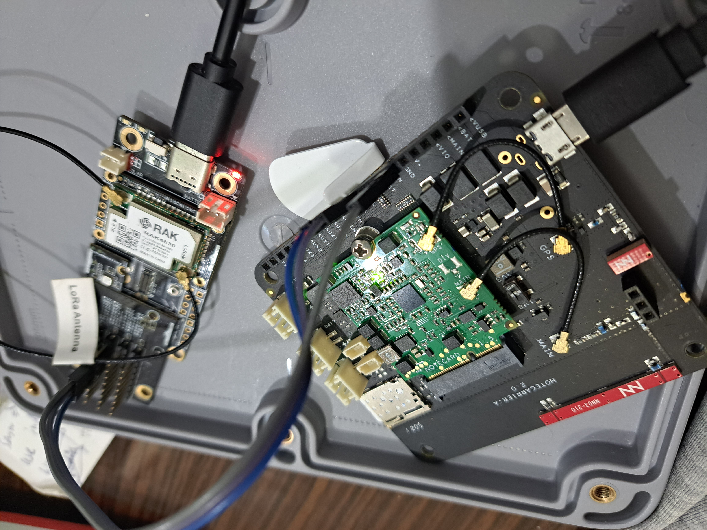</center>
The code in this repository is for the Hummingbird Gateway and supports beside of the communication to the Blues Notecard a RAK1906 environment sensor. The code can be used as well for a simple sensor node with a RAK1906 sensor without the Blues Notecard.

### ⚠️ _IMPORTANT 1_ ⚠️    
You have to setup your Notecard at Blues.IO before it can be used. This setup is not scope of this README, please follow the very good [Quickstart](https://dev.blues.io/quickstart/) guides provided by Blues.    

### ⚠️ _IMPORTANT 2_ ⚠️        
To connect the Blues Notecard, a _**Product UID**_ is required. This product UID is created while you setup your Notecard in the Notehub following the above mentioned Quickstart. Of course I am not sharing my Product UID here. The Product UID is defined in a file named _**`product_uid.h`**_ that you have to create in the src file of the project. The content of this file is like this:    
```cpp
#ifndef PRODUCT_UID
#define PRODUCT_UID "<YOUR_PRODUCT_UID_NEEDS_TO_BE_HERE>" // "com.my-company.my-name:my-project"
#pragma message "PRODUCT_UID is not defined in this example. Please ensure your Notecard has a product identifier set before running this example or define it in code here. More details at https://dev.blues.io/tools-and-sdks/samples/product-uid"
#endif
```
You have to replace _**`<YOUR_PRODUCT_UID_NEEDS_TO_BE_HERE>`**_ with your own product UID.    

### ⚠️ _IMPORTANT 3_ ⚠️    
In the file _**blues.cpp**_ the firmware is setting up the APN and the connection mode.    
1) if using the eSIM card from Blues.IO, there is no need to do this and this code part can be removed.
2) if using an external SIM card, this needs to be done only _**ONCE**_ and it is usually done in the initial setup of the Notecard and you can remove this code part.

**Code part to be removed:** ==> [blues.cpp](https://github.com/beegee-tokyo/Hummingbird-Blues-Gateway/blob/44b5093bf170faf65016ae071a5598281e6a899b/src/blues.cpp#L49)
```cpp
	/*************************************************/
	/* If the Notecard is properly setup, there is   */
	/* need to setup the APN and card mode on every  */
	/* restart! It will reuse the APN and mode that  */
	/* was originally setup.                         */
	/*************************************************/
	/* If using the built-in eSIM card from Blues.IO */
	/* These code lines should be complete removed!  */
	/*************************************************/
	MYLOG("BLUES", "Set APN");
	// {“req”:”card.wireless”}
	req = notecard.newRequest("card.wireless");
	// For SMART
	// JAddStringToObject(req, "apn", "internet");
	// JAddStringToObject(req, "mode", "a");
	// For Monogoto
	JAddStringToObject(req, "apn", "data.mono");
	JAddStringToObject(req, "mode", "a");
	// if (!notecard.sendRequest(req))
	if (!blues_send_req())
	{
		MYLOG("BLUES", "card.wireless request failed");
		return false;
	}
```
----

## Hummingbird Sensor    

As I am using the "standard" data format of my WisBlock examples, many of my existing WisBlock example application can be used without any changes:    

- [WisBlock-Seismic-Sensor](https://github.com/beegee-tokyo/WisBlock-Seismic-Sensor)
- [WisBlock-Seismic-Sensor](https://github.com/beegee-tokyo/WisBlock-Seismic-Sensor/tree/main/PIO-Arduino-Seismic-Sensor) (only the Arduino version of the application, the RUI3 version needs some changes)
- [RUI3 door/window status](https://github.com/beegee-tokyo/RUI3-RAK13011)
- [RAK4631-Kit-4-RAK1906](https://github.com/beegee-tokyo/RAK4631-Kit-4-RAK1906)
- [RAK4631-Kit-1-RAK1901-RAK1902-RAK1903](https://github.com/beegee-tokyo/RAK4631-Kit-1-RAK1901-RAK1902-RAK1903)
- [WisBlock Indoor Air Quality Sensor](https://github.com/beegee-tokyo/WisBlock-IAQ-PM-CO2-VOC-EPD)

For other (older) example codes, it is required to add the LoRa P2P send functionality and/or extend the CayenneLPP data packet with the device identifier. I use the DevEUI of the device as unique device identifier, as every WisBlock Core has the unique DevEUI printed on its label.     
In my examples, I use the [CayenneLPP library from ElectronicCats](https://github.com/ElectronicCats/CayenneLPP) with my own class extension. When using this library, the data packet is generated in **`WisCayenne g_solution_data(255);`**. The unique device identifier (the DevEUI) is added at the start of the existing data packet using this few lines of code:

----

### ⚠️ Using WisBlock-API-V2: ⚠️    
```cpp
// Add unique identifier in front of the P2P packet, here we use the DevEUI
uint8_t p2p_buffer[g_solution_data.getSize() + 8];
memcpy(p2p_buffer, g_lorawan_settings.node_device_eui, 8);
// Add the packet data
memcpy(&p2p_buffer[8], g_solution_data.getBuffer(), g_solution_data.getSize());
```    
before sending the packet with
```cpp
send_p2p_packet(p2p_buffer, g_solution_data.getSize() + 8);
```
----
### ⚠️ Using RUI3: ⚠️
```cpp
uint8_t packet_buffer[g_solution_data.getSize() + 8];
if (!api.lorawan.deui.get(packet_buffer, 8))
{
	MYLOG("UPLINK", "Could not get DevEUI");
}

memcpy(&packet_buffer[8], g_solution_data.getBuffer(), g_solution_data.getSize());

for (int idx = 0; idx < g_solution_data.getSize() + 8; idx++)
{
	Serial.printf("%02X", packet_buffer[idx]);
}
Serial.println("");
```    
before sending the packet with
```cpp
api.lorawan.psend(g_solution_data.getSize() + 8, packet_buffer);
```
----

# Hummingbird in Action

----

## Hummingbird Gateway    

After doing the hardware setup, flashing the firmware and following Blues Quickstart guides to setup my Notehub and the Notecard, my existing sensors are able to send data to the Hummingbird Gateway.

Here is an example log output with the result of the CayenneLPP data parsing then the packet sent from the gateway over the Notecard:
<center>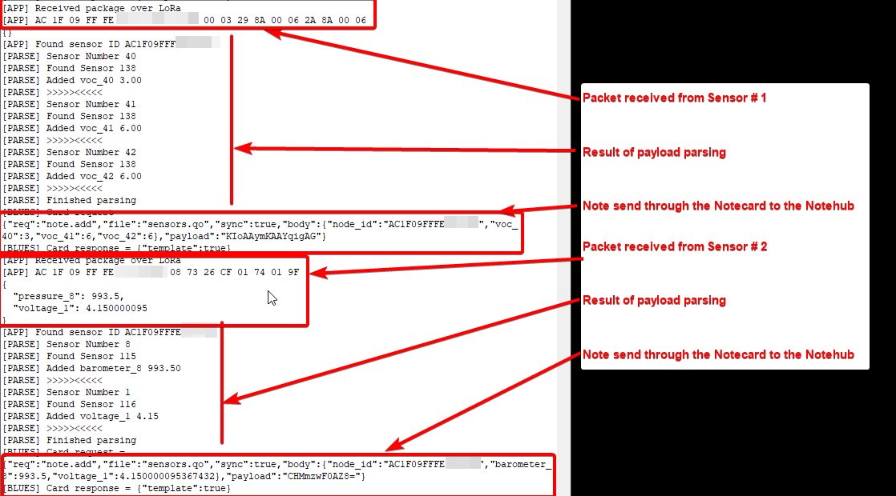</center>

----

## Blues Notehub 
The notes send to the Blues Notehub can be seen in the _**Events**_ listing of the Nothub
<center>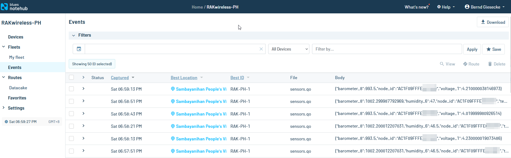</center>

----

To forward the messages to Datacake, a _**Route**_ has to be defined in the Notehub. There are many easy to follow tutorials available in the Blues documentation, in this case I used of course the [Datacake Tutorial](https://dev.blues.io/guides-and-tutorials/routing-data-to-cloud/datacake/) to setup the routing.

Once the route has been setup, the Notefiles used in this route have to been selected. As all sensor nodes data are sent as _**sensor.qo**_, this _**Note**_ has to be enabled.

### ⚠️ INFO ⚠️    
Different to the tutorial steps, I did not use the Transform Data option !!!!

<center>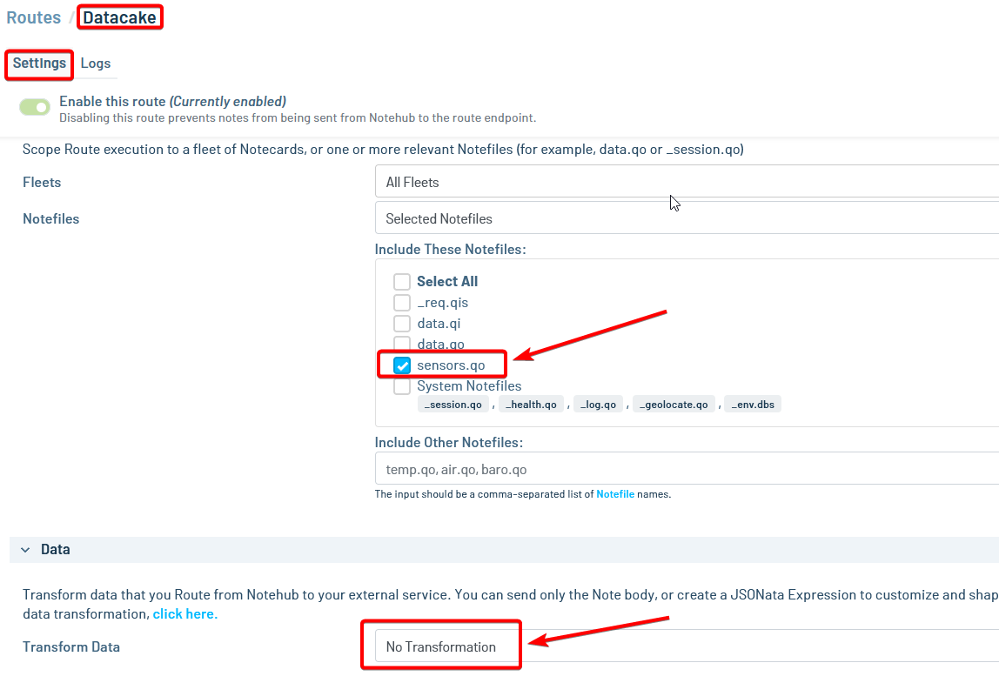</center>

----

Now the routing events are shown in the Routes log view:
<center>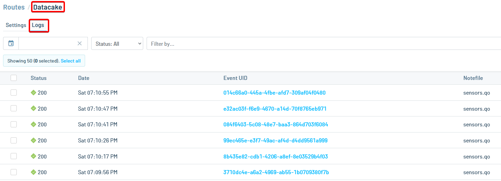</center>

----

When opening one of these events, the sensor data can be seen in the Body view:
<center>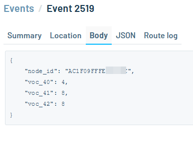</center>

----

## Datacake

To visualize the data in Datacake a matching device has to be defined, as it is described in the [Datacake Tutorial](https://dev.blues.io/guides-and-tutorials/routing-data-to-cloud/datacake/).

### ⚠️ INFO ⚠️    
As Hummingbird is sending sensor data from different sensor nodes to one end-point, a different payload decoder is required !!!!

I wrote a payload decoder that separates the incoming sensor data depending on the sensor node ID into different fields. This is required to distinguish between the data of the sensor nodes. The Datacake decoder for this task is the file [Decoder.js](./Decoder.js) in this repository.    
The content of this file has to be copied into the _**HTTP Payload Decoder**_ of Datacake:    
<center>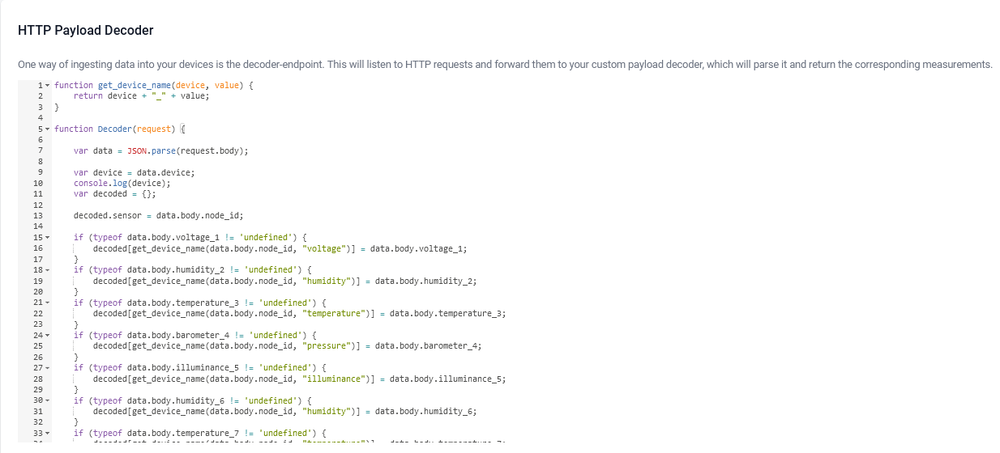</center>

----

Then the matching fields for the sensor data have to been created. The easiest way to do this is to wait for incoming data from the sensors. If no matching field is existing, the data will be shown in the _**Suggested Fields**_ list in the configuration:
<center>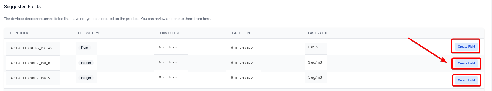</center>    

The sensor data can be easily assigned to fields using the _**Create Field**_ button.    

----

Once all the sensor data is assigned to fields, we can start with the visualization of the data.     
<center>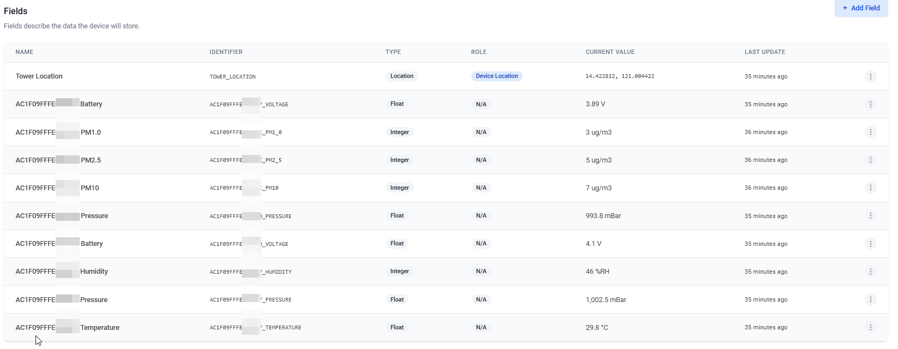</center>
As you can see, there are multiple fields for battery, temperature, humidity, ..., but each field has a leading device ID!    

----

Datacake has two options, the first one is the _**Device Dashboard**_, but as we expect a lot of data from different devices, it would be quite crowded and difficult to distinguish between the different devices. To make it easier to view the data per devices, I instead created a device independent _**Dashboard**_ that allows me to create tabs to separate the data from the different sensors. Such Dashboards can be created with _**Add Dashboard**_ on the left side of the Datacake panel:
<center>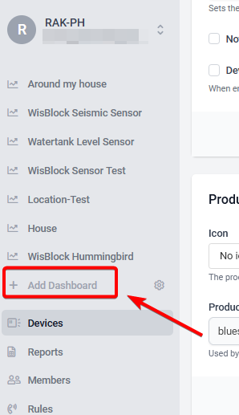</center>

----

After creating the _**Dashboard**_ I clicked on the button on the right side to enable editing, then on _**Edit Dashboard Meta**_. 
<center>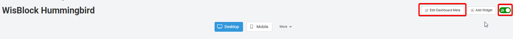</center>
In the opening window I added a tab for each of my Hummingbird sensor devices:
<center>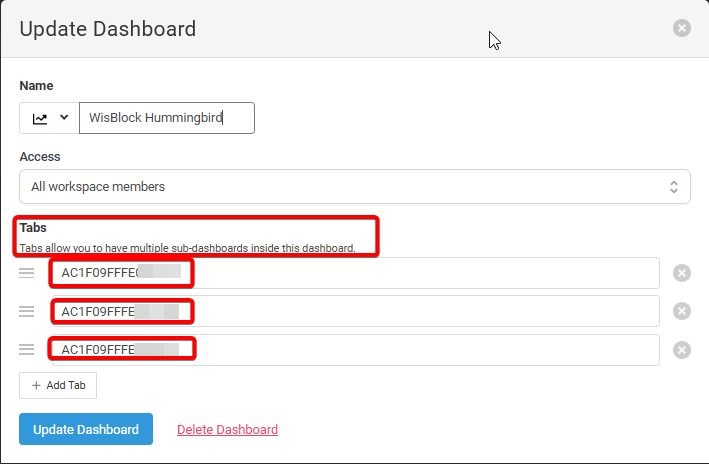</center>

This allows me to sort the data from the different sensor nodes into these tabs.    

----

I will not go into details how to create visualization widgets in Datacake, this step is handled in other tutorials already.    

----

The final result for the two sensors and the sensor gateway that are sending sensor data looks like this:

_**Sensor Device 1 is a particulate matter sensor**_
<center>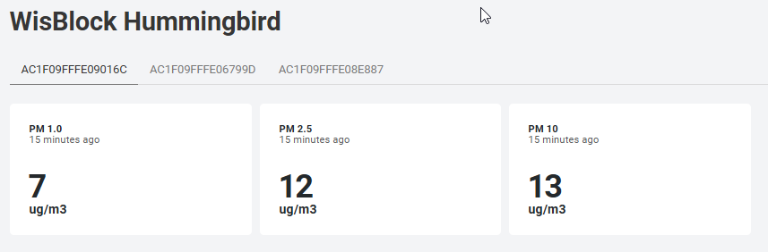</center>    

_**Sensor Device 2 is a barometric pressure sensor**_
<center>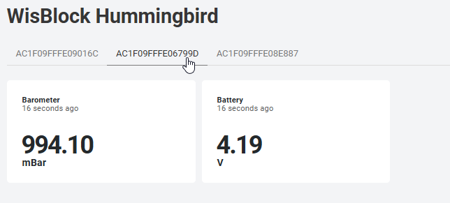</center>

_**Sensor Device 3 is the Hummingbird gateway that I enquipped with an environment sensor**_    
<center>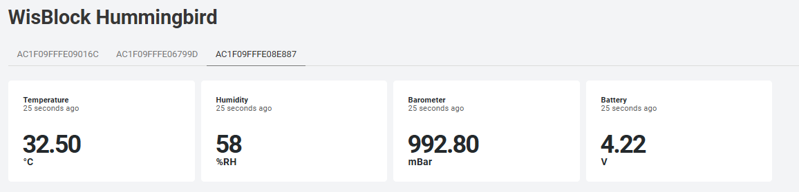</center>    

----
----

# LoRa® is a registered trademark or service mark of Semtech Corporation or its affiliates. 


# LoRaWAN® is a licensed mark.

----
----