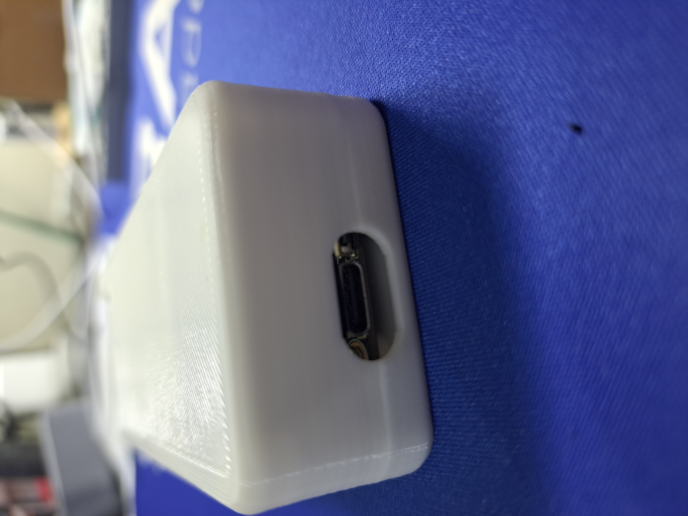

# WisBlock Goes Blues
|  |  |  |    
| :-: | :-: | :-: | 

----

While WisBlock is usually associated with _**LoRa**_ and _**LoRaWAN**_, this time we are diving into the cellular data transmission using the Blues.IO Notecard. This project is about building a location tracker that can connect to both LoRaWAN and a cellular connection with a [Blues NoteCard](https://blues.io/products/notecard/)↗️.

# Overview
When I got a [Blues Notecard](https://blues.io/products/notecard/)↗️ for some testing, the first thing was of course to connect it to the WisBlock modules. After some initial testing like connecting the Notecard to my cellular provider and sending some sensor data, I was hungry for more.    

One of the requirements that often come up for location trackers is to have a combined LoRaWAN and cellular connectivity, both working as a fallback connection for the other.

So, after building the [Hummingbird Sensor Network](https://github.com/beegee-tokyo/Hummingbird-Blues-Gateway)↗️, the logical next step was to crate a location tracker. 

----

# Setup the WisBlock Blues Location Tracker

----

## Hardware
The only thing that requires some work is to setup the WisBlock system with the Blues Notecard using the [RAK13102 NoteCarrier](https://store.rakwireless.com/collections/wisblock-wireless)↗️. The RAK13102 plugs into the WisBlock Base Board IO slot, so only the RAK19007, RAK19001, RAK19010 or RAK19011 Base Boards can be used. 
The RAK13102 module blocks the Sensor Slots A and B, but it has a mirror of these two slots, so they still can be used.     
Optional you can add a RAK1906 environment sensor to the WisBlock Base Board.

The code in this repository supports beside of the communication to the Blues Notecard, the LoRaWAN connection and a RAK1906 environment sensor.

| Module | Function | Storepage |
| --- | --- | --- |
| Blues NoteCard | Cellular modem | [Choose one for your region](https://shop.blues.io/collections/notecard?_gl=1*1ikl0yz*_ga*MTA3NTk4Nzc2My4xNjg5NzI0NjI3*_ga_PJ7RGMWWBX*MTY5MzY0NjI5NS4xMzguMS4xNjkzNjQ2OTg2LjU2LjAuMA..&_ga=2.90751256.308929740.1693641831-1075987763.1689724627) ↗️ |
| RAK4631 | MCU & LoRa transceiver | [RAK4630](https://store.rakwireless.com/products/rak4631-lpwan-node) ↗️ |
| RAK13102 | WisBlock NoteCarrier for Blues NoteCard | [RAK13102](https://store.rakwireless.com/collections/wisblock-wireless) ↗️ |
| RAK1906 (optional) | Temperature and humidity sensor | [RAK1906](https://store.rakwireless.com/products/rak1906-bme680-environment-sensor) ↗️ |

<center></center>

The enclosure is 3D printed and the STEP files are available in the [Enclosure folder](./Enclosure)↗️ in this repo.    
The latest version has an additional opening on the side for a small slider switch. This slider switch does disconnect the battery from the WisBlock to shut the device complete down.    

## Setup

You have to setup your Notecard at Blues.IO before it can be used. There are two options to setup the NoteCard.     

Option one is to follow the very good [Quickstart](https://dev.blues.io/quickstart/)↗️ guides provided by Blues.    

Option two is to setup the device with AT commands directly through the WisBlock's USB. 

### Option one, NoteCard Setup through the USB of the RAK13102 NoteCard        

Connect the RAK13102 NoteCarriers USB to your computer (WisBlock has to be powered separate!) and use the [Blues Quickstart](https://dev.blues.io/quickstart/)↗️

### Option two, setup through AT commands     

#### ⚠️ IMPORTANT ⚠️        
If setting up the NoteCard through AT commands, these settings will always override settings that are stored in the NoteCard.    
To remove settings saved from AT commands use the AT command _**`ATC+BR`**_ to delete all settings saved from AT commands before.    

Connect the WisBlock USB port to your computer and connect a serial terminal application to the COM port.

#### Setup the Product UID
To connect the Blues Notecard to the NoteHub, a _**Product UID**_ is required. This product UID is created when you create your project in NoteHub as shown in [Set up Notehub](https://dev.blues.io/quickstart/notecard-quickstart/notecard-and-notecarrier-f/#set-up-notehub)↗️.    

Get the Product UID from your NoteHub project:
<center></center>

Then use the ATC+BEUI command to save the Product UID in the WisBlock:

_**`ATC+BEUI=com.my-company.my-name:my-project`**_

Replace `com.my-company.my-name:my-project` with your project EUI.

The current product UID can be queried with

_**`ATC+BEUI=?`**_

#### Select SIM card    
There are two options for the Blues NoteCard to connect. The primary option is to use the eSIM that is already on the NoteCard. However, there are countries where the eSIM is not working yet. In this case you need to use an external SIM card in the RAK13102 WisBlock module. This can be a SIM card from you local cellular provider or a IoT data SIM card like for example a SIM card from [Monogoto](https://monogoto.io/)↗️ or from another provider. You can purchase a MonoGoto card together with the Blues Notecard from the RAKwireless store [IoT SIM card for WisNode Modules](https://store.rakwireless.com/products/iot-sim-card-for-wisnode-modules?variant=42658018787526)     

Use the AT command ATC+BSIM to select the SIM card to be used.    

The syntax is _**`ATC+BSIM=<SIM>:<APN>`**_    
`<SIM>` == 0 to use the eSIM of the NoteCard    
`<SIM>` == 1 to use the external SIM card of the RAK13102 NoteCarrier    

If the external SIM card is selected, the next parameter is the APN that is required to connect the NoteCard
`<APN>` e.g. _**`internet`**_ to use with the Filipino network provider SMART.    
Several carriers will have a website dedicated to manually configuring devices, while other can be discovered using APN discovery websites like [apn.how](https://apn.how/)↗️ 

The current settings can be queried with    
_**`AT+BSIM=?`**_

#### Select NoteCard connection mode    
The Blues NoteCard supports different connection modes. For testing purposes it might be required to have the NoteCard connected continuously to the cellular network, but in an battery powered application, the prefered connection type would be minimal, which connects to the cellular network only when data needs to be transfered.

The connection mode can be setup with the AT command AT+BMOD.

The syntax is _**`AT+BMOD=<mode>`**_    
`<mode>` == 0 to use the minimal connection mode    
`<mode>` == 1 to use the continuous connection mode    

Default is to use minimal connection mode.

The current status can be queried with    
_**`AT+BMOD=?`**_.    

#### Select NoteCard location send trigger
##### ⚠️ _Motion trigger mode is not implemented yet_ ⚠️    

There are two location transmission modes. Either in a defined timer interval or triggered by motion of the device.     
The transmission mode can be set with the AT+BTRIG command.

The syntax is _**`AT+BTRIG=<mode>`**_    
`<mode>` == 0 to use the time interval set with the AT command _**AT+SENDINT**_    
`<mode>` == 1 to use the continuous connection mode

Default is to use time interval mode.

The current status can be queried with    
_**`AT+BTRIG=?`**_.    

#### Delete Blues NoteCard settings    
If required all stored Blues NoteCard settings can be deleted from the WisBlock Core module with the AT+BR command.    
##### ⚠️ _Requires restart or power cycle of the device_ ⚠️      

The syntax is _**`AT+BR`**_     

### ⚠️ _LoRaWAN Setup_ ⚠️    
Beside of the cellular connection, you need to setup as well the LoRaWAN connection. The WisBlock solutions can be connected to any LoRaWAN server like Helium, Chirpstack, TheThingsNetwork or others. Details how to setup the device on a LNS are available in the [RAK Documentation Center]().

On the device itself, the required setup with AT commands is
```log
        // Setup AppEUI
AT+APPEUI=70b3d57ed00201e1
        // Setup DevEUI
AT+DEVEUI=ac1f09fffe03efdc
        // Setup AppKey
AT+APPKEY=2b84e0b09b68e5cb42176fe753dcee79
        // Set automatic send interval in seconds
AT+SENDINT=60
        // Set data rate
AT+DR=3
        // Set LoRaWAN region (here US915)
AT+BAND=5
        // Reset node to save the new parameters
ATZ
        // After reboot, start join request
AT+JOIN=1,0,8,10
```
A detailed manual for the AT commands are in the [AT-Command-Manual](https://docs.rakwireless.com/RUI3/Serial-Operating-Modes/AT-Command-Manual/) ↗️

----

## Using the WisBlock Blues Tracker    

Once the WisBlock Blues Tracker is setup for both cellular and LoRaWAN connection, it will connect to the cellular network and join the LoRaWAN server.    
Independent of a successful connection it will start acquiring the location with the GNSS engine that is built into the NoteCards cellular modem.    

The current application is not yet (work in progress) sending data based on movement, only in the specified time interval. The send interval can be setup with an AT command as well:

_**`ATC+SENDINT=300`**_    
will set the sendinterval to 300 seconds.    

The current send interval can be queried with    
_**`ATC+SENDINT=?`**_

### ⚠️ _Inaccurate location_ ⚠️     
As with most location trackers, an accurate location requires that the GNSS antenna can actually receive signals from the satellites. This means that it is working badly or not at all inside buildings.    
If there is no GNSS location available, the device is using the tower location information from the Blues NoteCard instead!

----


# WisBlock Blues Tracker in Action

----

## LoRaWAN server    

For testing, I used Chirpstack V4 as LoRaWAN server. The tracker has to be setup with it's DevEUI and AppEUI in an application on the Chirpstack LNS.    
Optional you can add a payload decoder in the Device Profile. Then you can see the decoded payload in the Events list of the device.    
Here is an example log output with the result of the CayenneLPP data parson the LNS before it is sent to the Blues NoteHub:
<center></center>

Within the Chirpstack LNS application an integration is needed to forward the data to Datacake, the tool I chose for the visualization. The integration is a simple web hook to Datacake:    
<center></center>

You can of course use as well other LoRaWAN servers like TTN or Helium for the devices LoRaWAN connection.    
For the location visualization, only the Datacake solution is explained here. If you want to use another location visualization, you need to figure out how to connect one device through both LoRaWAN and cellular connections.

----

## Blues Notehub 
The notes sent to the Blues Notehub can be seen in the _**Events**_ listing of the Nothub
<center></center>

The location and sensor data is sent as binary payload, so there is nothing to see here in the body field.    

Next step is to create the _**Route**_ in NoteHub that forwards the data to Datacake.    
Instead of the default URL for the Datacake route, we use the URL for LoRaWAN devices (read on below why we do this).   
And the note we want to forward is the _**`data.qo`**_ note.

<center></center>

### ⚠️ INFO ⚠️    
At this point it is getting a little bit complicate. Because the location data sent to Datacake can come _**EITHER**_ from the LoRaWAN server _**OR**_ from NoteHub.IO. The JSON object sent by the two looks of course very different.    

Because of the different formats, we use a very appreciated feature available in the NoteHub Routes, the JSONata Expression. With this data transformation option, we make the JSON packet coming from the NoteHub to look like a packet coming from a LoRaWAN server. I suggest to read the Blues documentation about [JSONata](https://dev.blues.io/guides-and-tutorials/notecard-guides/using-jsonata-to-transform-json/?_gl=1*15bxcs8*_ga*MTA3NTk4Nzc2My4xNjg5NzI0NjI3*_ga_PJ7RGMWWBX*MTY5MzcyMDAwNi4xNDAuMS4xNjkzNzIwMDExLjU1LjAuMA..&_ga=2.15364470.1351755121.1693639635-1075987763.1689724627#using-jsonata-to-transform-json) to understand how it actually works.

The JSONata expression needed is very simple, we can simulate a LoRaWAN packet format with just a few JSON fields:
```JSON
{
    "deviceInfo": {
       "tenantName":"ChirpStack",
       "devEui": body.dev_eui
    },
    "fPort": 6,
    "data": payload
}
```

In the Route setup scroll down to the Data section.    
Select JSONata Expression to transform the data, then copy the JSONata expression into the entry field.    
<center></center>

The JSONata is pulling the required info from the Blues JSON data packet to build the "fake" LoRaWAN packet. You can check the functionality with the JSONata Exerciser:
<center></center>

The resulting JSON object is then sent to Datacake, which handles it as if it comes from a LoRaWAN server.    

The routing events are shown in the Routes log view:
<center></center>

----

## Datacake

To visualize the data in Datacake a matching device has to be defined. As the data can come from two different paths, but we transformed the packet forward in NoteHub to be look like a LoRaWAN packet, the device _**must**_ be a LoRaWAN device. 

### ⚠️ INFO ⚠️    
On the device the payload is formatted in Cayenne LPP format. Both the LoRaWAN server and NoteHub are forwarding this format, so a single payload decoder can be used.    
To distinguish whether the data is coming from the LNS or from NoteHub, a different fPort is used in the packets.    
fPort 5 ==> data coming from the LNS    
fPort 6 ==> data coming from NoteHub (see above in the JSONata expression that it sets the fPort to 6)    

The payload decoder I used can be found in the file [Decoder.js](./Decoder.js)↗️ in this repository.    
The content of this file has to be copied into the _**Payload Decoder**_ of the device configuration in Datacake:    
<center></center>

----

Then the matching fields for the sensor data have to been created. The easiest way to do this is to wait for incoming data from the sensors. If no matching field is existing, the data will be shown in the _**Suggested Fields**_ list in the configuration.
<center></center>    

The sensor data can be easily assigned to fields using the _**Create Field**_ button.    

It will take some time before the suggested fields are listed complete. Instead of using the suggested fields, you can as well just create the following fields manually:

| Name | Identifier | Type | Role |
| --- | --- | --- | --- |
| Voltage | VOLTAGE_1 | Float | Device Battery |
| Source | SOURCE | String | Primary |
| Islorawan | ISLORAWAN | Boolean | N/A |
| Location | LOCATION_10 | Location | Device Location |
| Temperature (only if RAK1906 is present) | TEMPERATURE | Float | Secondary |
| Humidity (only if RAK1906 is present) | HUMIDITY | Float | N/A |
| Barometer (only if RAK1906 is present) | BAROMETER | Float | N/A |

<center></center>
----

Once all the sensor data is assigned to fields, we can start with the visualization of the data.     
<center></center>


----

In Datacake each device has it's own _**Device Dashboard**_ which we will use to display the location data.    
I will not go into details how to create visualization widgets in Datacake, this step is handled in other tutorials already.    

----

The final result for the WisBlock Blues Tracker:

You can see life data on my [public dashboard](https://app.datacake.de/pd/7bb04747-c5a1-42c3-8dc1-ee5de45ee610)↗️       
In the top part of the dashboard are the locations of the device (history enabled) on the map and device sensor values on the side (temperature, humidity are only available if a RAK1906 is present).
<center></center>    

In the lower part a chart is showing at what times the sensor used LoRaWAN to transmit data and when it used the cellular connection: 
<center></center>    

----
----

# LoRa® is a registered trademark or service mark of Semtech Corporation or its affiliates. 


# LoRaWAN® is a licensed mark.

----
----