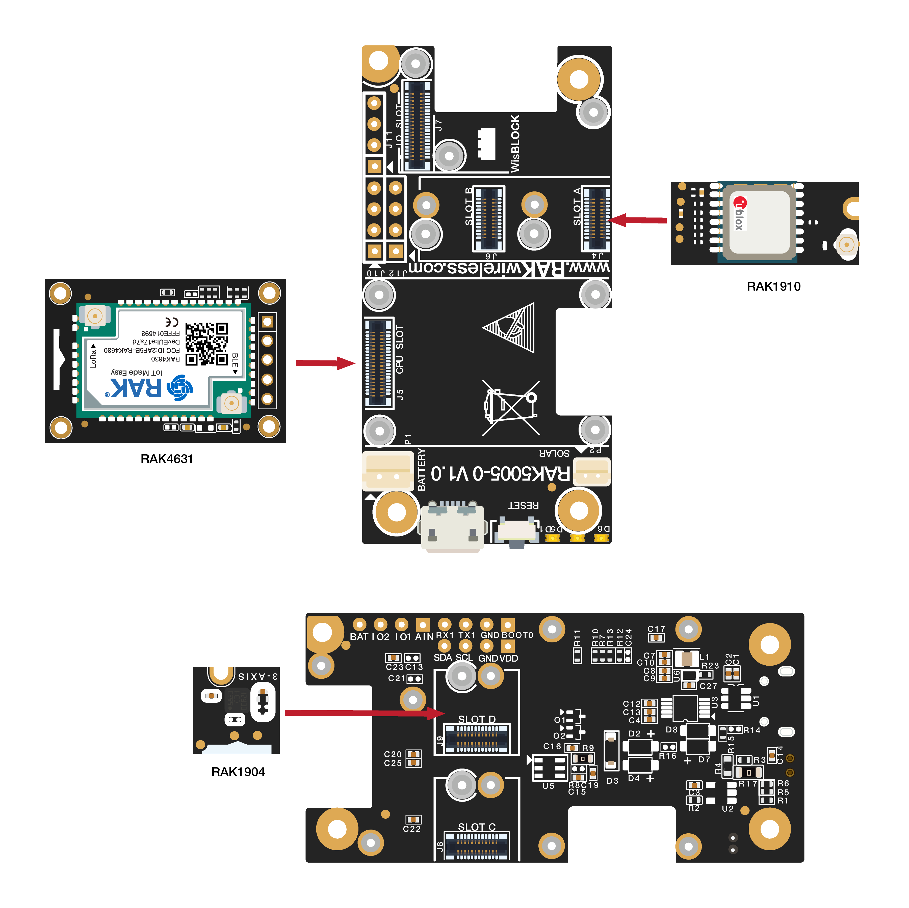
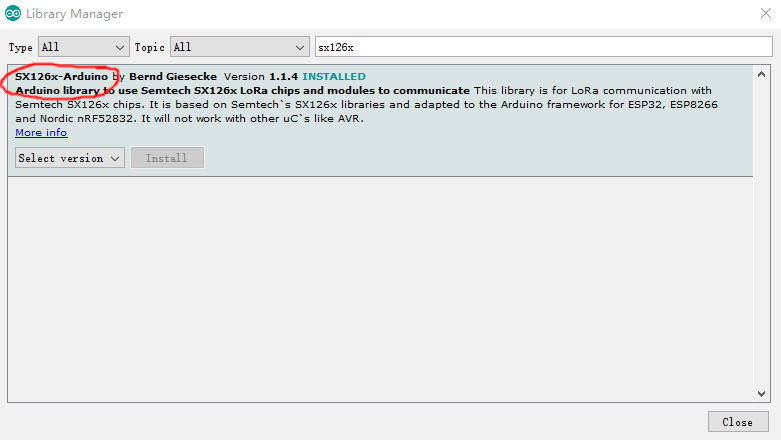
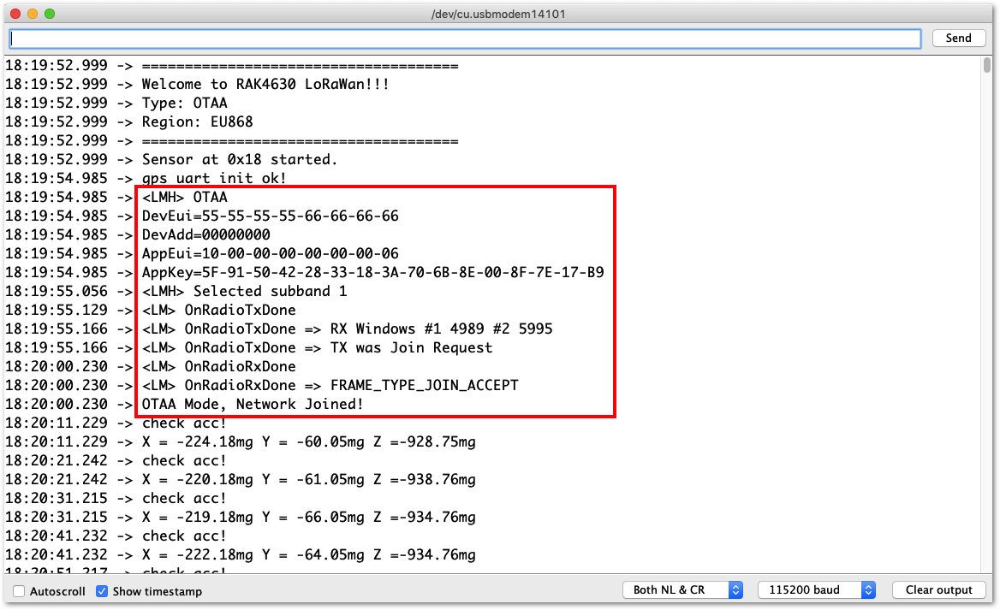
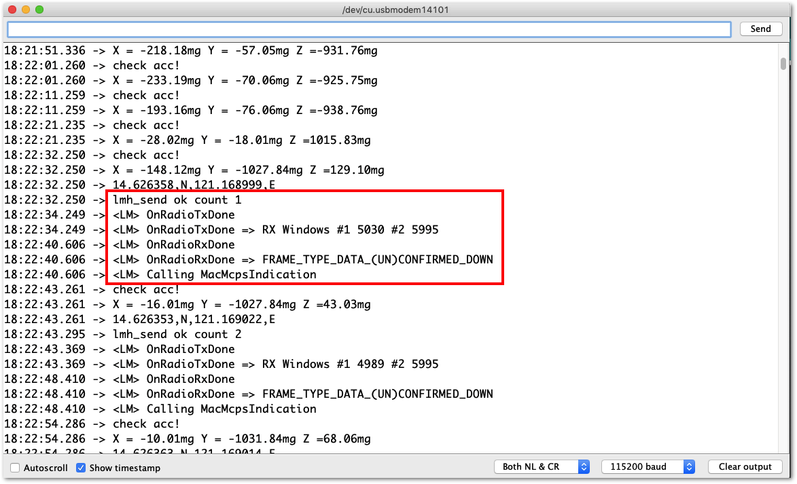
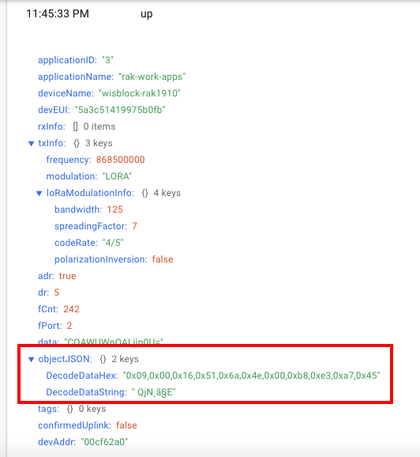
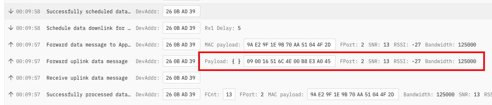
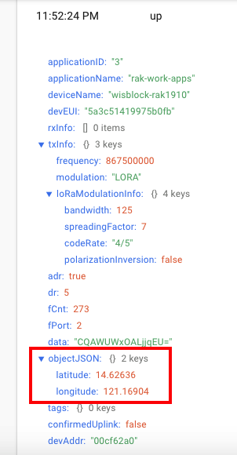
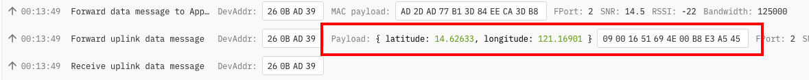

# GPS Tracker over LoRaWAN®
This solution shows how to create an LoRaWAN GPS tracker using WisBlock RAK1910 GPS module together with RAK4631 WisBlock Core and a RAK1904 WisBlock accelerometer module. After a successful join to the LoRaWAN network server, the RAK4631 will check the orientation of the board using the RAK1904 accelerometer module. The orientation of the board is checked every 10 seconds and if it is on the trigger position, it will transmits GPS information to the LoRaWan® network server. This guide will cover both TTN V3 and Chirpstack.

## Prerequisites

### Hardware required
To build this system, the following hardware are required:

- WisBlock Base Board * 1 pc
- WisBlock Core RAK4631 * 1pc   
- WisBlock Sensor RAK1904 * 1pc    
- WisBlock Sensor RAK1910 * 1pc   
- USB Cable
- Li-Ion or Li-Po battery (optional)



Other important things you need to do.

- You must ensure that the hardware are properly connected. Check the quick start guide of RAK1910 [hardware setup section](https://docs.rakwireless.com/Product-Categories/WisBlock/RAK1910/Quickstart/#hardware-setup).
- You need to be in a vicinity of an active LoRaWAN gateway and have access to the LoRaWAN network server where it transfers the LoRa packets. We, at RAKwireless, offers great selections of [LoRaWAN gateways](https://store.rakwireless.com/collections/wisgate) you can buy. Our gateways also have with built-in network server as well.
- You need to be outdoor or near the open window to receive GPS signal. The GPS module will not work if you are testing it indoor.

This example code is also compatible to the following LoRaWAN GPS Tracker Kits that you can purchase:

* [LoRaWAN Tracker Kit](https://store.rakwireless.com/collections/kits-bundles/products/wisblock-kit-3-gps-tracker)
* [LoRaWAN Tracker Kit with Solar Panel](https://store.rakwireless.com/collections/kits-bundles/products/wisblock-kit-2-lora-based-gps-tracker-with-solar-panel)

### Software required

- [Arduino IDE](https://www.arduino.cc/en/Main/Software)
- [RAKwireless Arduino BSP](https://github.com/RAKWireless/RAKwireless-Arduino-BSP-Index)    
- SparkFun LIS3DH Arduino library


- SX126x-Arduino library



## How to use the sample code.


- You need to select the right frequency band/region. By default, the example code uses EU868 but you can change it to US915, AU915 and etc. depending on your location.
- Change the following keys related to OTAA. You must use the DEVEUI printed on the sticker of the WisBlock Core.

```
// Device EUI
uint8_t nodeDeviceEUI[8] = {0x00, 0x95, 0x64, 0x1F, 0xDA, 0x91, 0x19, 0x0B};
// Application EUI
uint8_t nodeAppEUI[8] = {0x70, 0xB3, 0xD5, 0x7E, 0xD0, 0x02, 0x01, 0xE1};
// Application key for AES encryption
uint8_t nodeAppKey[16] = {0x07, 0xC0, 0x82, 0x0C, 0x30, 0xB9, 0x08, 0x70, 0x0C, 0x0F, 0x70, 0x06, 0x00, 0xB0, 0xBE, 0x09};
```
- After all the configurations, you can now upload the firmware to RAK4631 WisBlock Core and check the serial output.

### Serial Logs

If your code is successfully upload, you should see the following output on your Serial Monitor/Terminal. It shows that you are properly activated via OTAA.



The next step is to reorient the whole module.

The following part of the code will trigger the sending of LoRaWAN packets.

```if (abs(x - z) < 400)``` 

If the absolute value of the difference between the X-axis and Z-axis of the accelerometer is less than 400, the LoRaWAN packets will be transmitted to the network server. Physically, you can trigger this condition by positioning the WisBlock upright with the USB connector either at the top or at the bottom. You can create your own conditions too when to transmit the LoRaWAN Payload.

Take note that there will be no LoRaWAN transmissions if there is no GPS signal found and if the accelerometer is not in the right orientation.

GPS signal can take few seconds or minutes to get a good fix depending on your location and situation.

If all are successful after waiting for the GPS signal, you should now see this on the serial monitor/terminal.



The packet should also arrive to the LoRaWAN® network server. 

If you are using Chirpstack:



And if you are using TTN V3:



The payload is not decoded yet so you can't see the actual GPS coordinates.

### Data Format 

Data sent to LoRaWan® server of this example code has the following formet:

- **Buffer[0]** - 0x09 (Header indicator that the data is the GPS coordinate).
- **Buffer[1-4]** - Latitude value in integer. To get the actual latitude value in float, this integer must be divided by 10000. This can be done on the payload decoder side.
- **Buffer[5]** - It can be 'S' or 'N' which pertains to geographical location.
- **Buffer[6-9]** - Latitude value in integer. To get the actual latitude value in float, this integer must be divided by 10000. This can be done on the payload decoder side.
- **Buffer[10]** - It can be 'E' or 'W' which pertains to geographical location. 

#### Chirpstack Decoder

Here's the payload decoder that you can use for Chirpstack.

``` 
function Decode(fport, bytes) 
{
  var longitude_int, latitude_int;
  var decoded = {"latitude":"","longitude":""};
  
  if (fport === 2)
  {
    if(bytes[0]==9) // check if the header byte is 9.
    {
      latitude_int = (bytes[1] << 24) | (bytes[2] << 16) | (bytes[3] << 8) | (bytes[4]);
      decoded.latitude = latitude_int / 100000;
      longitude_int = (bytes[6] << 24) | (bytes[7] << 16) | (bytes[8] << 8) | (bytes[9]);
      decoded.longitude = longitude_int / 100000;
      return decoded;
    }
  }
}

```

After modifying the decoder in Chirpstack, you can now see the GPS coordinates value of latitude and longitude.



#### TTN V3 Decoder

Here's the payload decoder that you can use for TTN V3.

``` 
function Decoder(bytes, port) 
{
  var longitude_int, latitude_int;
  var decoded = {};
  
  if (port === 2)
  {
    if(bytes[0]==9) // check if the header byte is 9.
    {
      latitude_int = (bytes[1] << 24) | (bytes[2] << 16) | (bytes[3] << 8) | (bytes[4]);
      decoded.latitude = latitude_int / 100000;
      longitude_int = (bytes[6] << 24) | (bytes[7] << 16) | (bytes[8] << 8) | (bytes[9]);
      decoded.longitude = longitude_int / 100000;
      return decoded;
    }
  }
}

```

After modifying the decoder in TTN V3, you can now see the GPS coordinates value of latitude and longitude.




### Timing

In this solution example, checking of accelerometer is in period of 10 seconds. On actual LoRaWAN deployment, this should be much higher to follow the regulations stated on the LoRaWAN Regional Parameters specifications.

If there's no GPS coordinate transmission even if you are sure that the accelerometer is already in the right trigger orientation `if (abs(x - z) < 400)`, then you need to check the RAK1910 GPS module if you can get GPS signal. Please have a look on this [initial RAK1910 quick test](https://docs.rakwireless.com/Product-Categories/WisBlock/RAK1910/Quickstart/#initial-test-of-the-rak1910-wisblock-module).


LoRa® is a registered trademark or service mark of Semtech Corporation or its affiliates. LoRaWAN® is a licensed mark.

