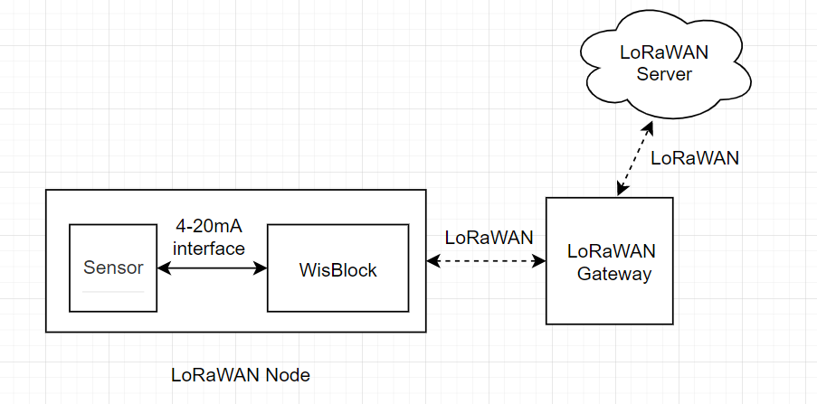
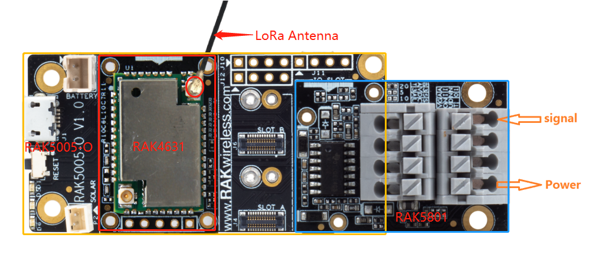

## Hydraulic Pressure Monitoring over LoRaWAN®


This solution shows how to create an hydraulic pressure monitor node. The monitor node measures hydraulic pressure from a sensor with a 4-20mA interface. It then transmits this data frequently over LoRaWan® to a LoRaWan® server.    
At the LoRaWan® server the data arrives in the following format    

| Byte1 | Byte2 | Byte3 |
| -     | -     | -     |
| 4     | P1    | P2    |
where
  - Byte 1 is a marker for the data type, here always 4    
  - Pressure is sent as **`P1P2`** e.g. 1009 kPa (would be 0x03 0xF1 in the data package)

### Hardware required
To build this system, the following hardware are required:  

- WisBlock Base RAK5005-O * 1pcs    
- WisBlock Core RAK4631 * 1pcs    
- WisBlock IO RAK5801 * 1pcs    
- [SUP-P300](https://en.supmea.com/cpdetail_28_296_264.html) - a hydraulic pressure sensor with 4-20mA interface * 1pcs


>  **Note:** To send the data of sensor node to LoRaWan® server,  a  LoRaWan® gateway is also needed. If you don't have one, we recommend you use [RAK7243](https://store.rakwireless.com/products/rak7243c-pilot-gateway).


The assembly of sensor node is as follows:



We choose a 2-wire hydraulic pressure sensor in this example, So we only need to connect the signal and power as the picture above.

The test scenario is shown as follows:


### Software required
- [Arduino IDE](https://www.arduino.cc/en/Main/Software)
- [RAK4630 BSP](https://github.com/RAKWireless/RAK-nRF52-Arduino)    
- SX126x-Arduino library


The code for the hydraulic pressure sensor node can be found in the [sketch file](https://github.com/RAKWireless/WisBlock/blob/master/examples/RAK4630/solutions/Hydraulic_Pressure_Monitoring/Hydraulic_Pressure_Monitoring.ino)

<!--
The code for the hydraulic pressure sensor node is as follows:
```cpp
#include <Arduino.h>
#include <LoRaWan-RAK4630.h>
#include <SPI.h>

#define P300_SENSOR


#ifndef LED_BUILTIN
#define LED_BUILTIN 35
#endif

#ifndef LED_BUILTIN2
#define LED_BUILTIN2 36
#endif

bool doOTAA = true;
#define SCHED_MAX_EVENT_DATA_SIZE APP_TIMER_SCHED_EVENT_DATA_SIZE /**< Maximum size of scheduler events. */
#define SCHED_QUEUE_SIZE 60  /**< Maximum number of events in the scheduler queue. */
#define LORAWAN_DATERATE DR_0
#define LORAWAN_TX_POWER TX_POWER_0
#define JOINREQ_NBTRIALS 3 /**< Number of trials for the join request. */
DeviceClass_t gCurrentClass = CLASS_A;
lmh_confirm gCurrentConfirm = LMH_CONFIRMED_MSG;
uint8_t gAppPort = LORAWAN_APP_PORT;

/**@brief Structure containing LoRaWan parameters, needed for lmh_init()
 */
static lmh_param_t lora_param_init = {LORAWAN_ADR_ON , LORAWAN_DATERATE, LORAWAN_PUBLIC_NETWORK, JOINREQ_NBTRIALS, LORAWAN_TX_POWER, LORAWAN_DUTYCYCLE_OFF};

// Foward declaration
static void lorawan_has_joined_handler(void);
static void lorawan_rx_handler(lmh_app_data_t *app_data);
static void lorawan_confirm_class_handler(DeviceClass_t Class);
static void send_lora_frame(void);

/**@brief Structure containing LoRaWan callback functions, needed for lmh_init()
*/
static lmh_callback_t lora_callbacks = {BoardGetBatteryLevel, BoardGetUniqueId, BoardGetRandomSeed,
										lorawan_rx_handler, lorawan_has_joined_handler, lorawan_confirm_class_handler};

//OTAA keys
uint8_t nodeDeviceEUI[8] = {0x67, 0x79, 0x6e, 0xad, 0xf6, 0xab, 0xd2, 0x16};
uint8_t nodeAppEUI[8] = {0xB8, 0x27, 0xEB, 0xFF, 0xFE, 0x39, 0x00, 0x00};
uint8_t nodeAppKey[16] = {0x77, 0x77, 0x77, 0x77, 0x77, 0x77, 0x77, 0x77, 0x77, 0x77, 0x77, 0x77, 0x77, 0x77, 0x77, 0x77};


// Private defination
#define LORAWAN_APP_DATA_BUFF_SIZE 64  /**< buffer size of the data to be transmitted. */
#define LORAWAN_APP_INTERVAL 20000 /**< Defines for user timer, the application data transmission interval. 20s, value in [ms]. */
static uint8_t m_lora_app_data_buffer[LORAWAN_APP_DATA_BUFF_SIZE]; //< Lora user application data buffer.
static lmh_app_data_t m_lora_app_data = {m_lora_app_data_buffer, 0, 0, 0, 0}; //< Lora user application data structure.

TimerEvent_t appTimer;
static uint32_t timers_init(void);

static uint32_t count = 0;
static uint32_t count_fail = 0;

void setup()
{
	pinMode(LED_BUILTIN, OUTPUT);
	digitalWrite(LED_BUILTIN, LOW);

  /*
  * WisBLOCK 5811 Power On
  */
  pinMode(17, OUTPUT);
  digitalWrite(17, HIGH);

  // Initialize LoRa chip.
  lora_rak4630_init();

	// Initialize Serial for debug output
	Serial.begin(115200);
  while(!Serial){delay(10);}
	Serial.println("=====================================");
	Serial.println("Welcome to RAK4630 LoRaWan!!!");
  Serial.println("Type: OTAA");


#if defined(REGION_AS923)
    Serial.println("Region: AS923");
#elif defined(REGION_AU915)
    Serial.println("Region: AU915");
#elif defined(REGION_CN470)
    Serial.println("Region: CN470");
#elif defined(REGION_CN779)
    Serial.println("Region: CN779");
#elif defined(REGION_EU433)
    Serial.println("Region: EU433");
#elif defined(REGION_IN865)
    Serial.println("Region: IN865");
#elif defined(REGION_EU868)
    Serial.println("Region: EU868");
#elif defined(REGION_KR920)
    Serial.println("Region: KR920");
#elif defined(REGION_US915)
    Serial.println("Region: US915");
#elif defined(REGION_US915_HYBRID)
    Serial.println("Region: US915_HYBRID");
#else
    Serial.println("Please define a region in the compiler options.");
#endif
    Serial.println("=====================================");


	//creat a user timer to send data to server period
  uint32_t err_code;
  err_code = timers_init();
	if (err_code != 0)
	{
		Serial.printf("timers_init failed - %d\n", err_code);
	}

	// Setup the EUIs and Keys
	lmh_setDevEui(nodeDeviceEUI);
	lmh_setAppEui(nodeAppEUI);
	lmh_setAppKey(nodeAppKey);

	// Initialize LoRaWan
	err_code = lmh_init(&lora_callbacks, lora_param_init,doOTAA);
	if (err_code != 0)
	{
		Serial.printf("lmh_init failed - %d\n", err_code);
	}

	// Start Join procedure
	lmh_join();
}

void loop()
{
	// Handle Radio events
	Radio.IrqProcess();
}

/**@brief LoRa function for handling HasJoined event.
 */
void lorawan_has_joined_handler(void)
{
  Serial.println("OTAA Mode, Network Joined!");

  lmh_error_status ret = lmh_class_request(gCurrentClass);
  if(ret == LMH_SUCCESS)
  {
    delay(1000);
  	TimerSetValue(&appTimer, LORAWAN_APP_INTERVAL);
  	TimerStart(&appTimer);
  }
}

/**@brief Function for handling LoRaWan received data from Gateway
 *
 * @param[in] app_data  Pointer to rx data
 */
void lorawan_rx_handler(lmh_app_data_t *app_data)
{
	Serial.printf("LoRa Packet received on port %d, size:%d, rssi:%d, snr:%d, data:%s\n",
				  app_data->port, app_data->buffsize, app_data->rssi, app_data->snr, app_data->buffer);

}

void lorawan_confirm_class_handler(DeviceClass_t Class)
{
    Serial.printf("switch to class %c done\n", "ABC"[Class]);
    // Informs the server that switch has occurred ASAP
    m_lora_app_data.buffsize = 0;
    m_lora_app_data.port = gAppPort;
    lmh_send(&m_lora_app_data, gCurrentConfirm);
}

#ifdef P300_SENSOR

int get_pressure(void)
{
  int i;
  
  int sensor_pin = A1;   // select the input pin for the potentiometer
  int mcu_ain_value = 0;  // variable to store the value coming from the sensor

  int pressure;         //KPa as unit
  int average_value;  
  float voltage_ain, current_sensor;

  for (i = 0; i < 5; i++)
  {
    mcu_ain_value += analogRead(sensor_pin);
  }
  average_value = mcu_ain_value / i;
  
  voltage_ain = average_value * 3.6 /1024;  //raef 3.6v / 10bit ADC 

  current_sensor = voltage_ain / 149 * 1000;          //WisBlock RAK5801 (0 ~ 20mA) I=U/149*1000 (mA)

  //Convert to millivolt. 3.95mA is the default output from sensor
  //0.01mA == 6.25KPa
  pressure =  (current_sensor - 3.95) * 100 * 2.5; 
                    
  Serial.printf("-------pressure------ = %d KPa\n", pressure);

  return pressure;
}
#endif

void send_lora_frame(void)
{
  int p;
  
	if (lmh_join_status_get() != LMH_SET)
	{
		//Not joined, try again later
		return;
	}

  p = get_pressure();      //Pressure range: (0 ~ 10000KPa)
  
	uint32_t i = 0;

	m_lora_app_data.port = gAppPort;
	m_lora_app_data.buffer[i++] = 0x04;
	m_lora_app_data.buffer[i++] = (p >> 8) & 0xFF;
	m_lora_app_data.buffer[i++] = p & 0xFF;
	m_lora_app_data.buffsize = i;

  lmh_error_status error = lmh_send(&m_lora_app_data, gCurrentConfirm);
  if (error == LMH_SUCCESS)
  {
      count++;
      Serial.printf("lmh_send ok count %d\n", count);
  }
  else
  {
      count_fail++;
      Serial.printf("lmh_send fail count %d\n", count_fail);
  }
}

/**@brief Function for handling user timerout event.
 */
void tx_lora_periodic_handler(void)
{
   TimerSetValue(&appTimer, LORAWAN_APP_INTERVAL);
   TimerStart(&appTimer);
   Serial.println("Sending frame now...");
   send_lora_frame();
}

/**@brief Function for the Timer initialization.
 *
 * @details Initializes the timer module. This creates and starts application timers.
 */
uint32_t timers_init(void)
{
    TimerInit(&appTimer, tx_lora_periodic_handler);
    return 0;
}
```

-->

The log of sensor node is shown as follows:

```
16:16:09.893 -> =====================================
16:16:09.893 -> Welcome to RAK4630 LoRaWan!!!
16:16:09.893 -> Type: OTAA
16:16:09.893 -> Region: EU868
16:16:09.893 -> =====================================
16:16:15.083 -> OTAA Mode, Network Joined!
16:16:36.105 -> Sending frame now...
16:16:36.105 -> -------pressure------ = 9 KPa
16:16:36.105 -> lmh_send ok count 1
16:16:56.108 -> Sending frame now...
16:16:56.108 -> -------pressure------ = 15 KPa
16:16:56.108 -> lmh_send ok count 2
16:17:16.107 -> Sending frame now...
16:17:16.107 -> -------pressure------ = 15 KPa
16:17:16.107 -> lmh_send ok count 3
16:17:36.108 -> Sending frame now...
16:17:36.108 -> -------pressure------ = 15 KPa
16:17:36.143 -> lmh_send ok count 4
16:17:56.113 -> Sending frame now...
16:17:56.113 -> -------pressure------ = 15 KPa
16:17:56.148 -> lmh_send ok count 5
16:18:16.132 -> Sending frame now...
16:18:16.132 -> -------pressure------ = 15 KPa
16:18:16.132 -> lmh_send ok count 6
```


We use Chirpstack as LoRaWAN® server in this solution, the data sent to LoRaWAN® server is shown as follows:


> LoRa® is a registered trademark or service mark of Semtech Corporation or its affiliates. LoRaWAN® is a licensed mark.
