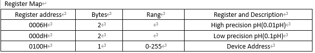
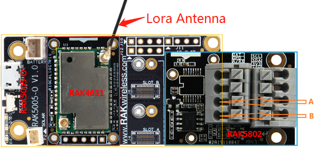
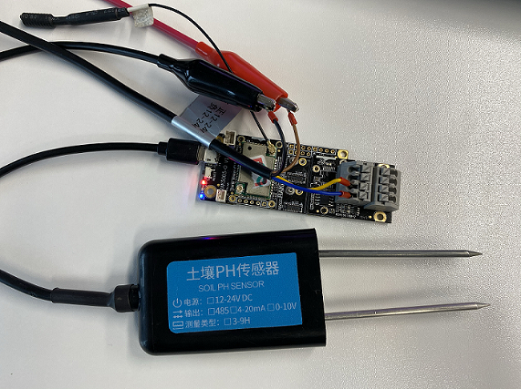
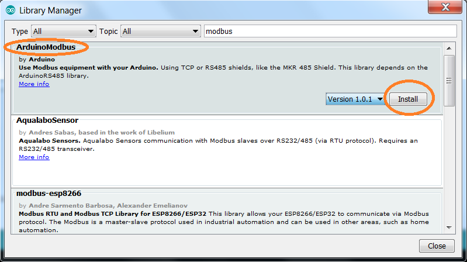
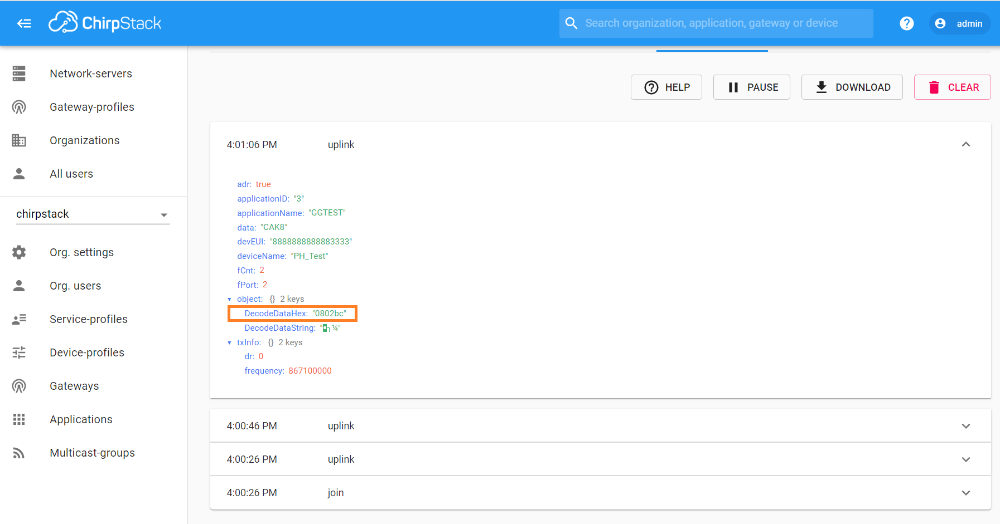

## Soil PH Monitoring over LoRaWAN®
[TOC]

### 1. Introduction


This solution shows how to create an agriculture soil pH value sensor node. The sensor node measures the soil pH value from a sensor with a RS485 interface. It then transmits this data frequently over LoRaWAN®to a LoRaWAN® server.    
At the LoRaWAN® server the data arrives in the following format    

| Byte1 | Byte2 | Byte3 | Byte4 | Byte5 | Byte6 | Byte7 |
| -     | -     | -     | -     | -     | -     | -     |
| 8     | CON1  | CON2  | T1    | T2    | H1    | H2    |
where
  - Byte 1 is a marker for the data type, here always 8    
  - pH value is sent as **`PH1PH2`** e.g. 45 (would be 0x00 0x2D in the data package)    

>### Attention
>If this examples is implemented for the Region US915, DR0 cannot be used because the   package size is too large to fit into the allowed payload.    

#### 1.1 LoRaWAN®

If you want to know how to use the LoRa® communication with WisBlock. You can refer to the following document.

[LoRaWAN® ](/examples/RAK4630/communications/LoRa/LoRaWAN® /) 

#### 1.2 Modbus

[Modbus](https://www.modbus.org/docs/Modbus_Application_Protocol_V1_1b3.pdf) has become a standard communications protocol and is now the most commonly available means of communicating with industrial electronic devices. In this case, the wind speed sensor supports Modbus protocol over RS-485 physical layers.

All Modbus devices include a register map with the location and a description of the data stored in the registers. Modbus functions operate on register map to monitor, configure, and control the device’s inputs and outputs. You have to refer to the register map of your device to gain a better understanding of its operation. Modbus registers are organized into reference types identified by the leading number of the reference address. You can see below an example of how to read and write data in a Modbus device.



In our example, we are going to read the high precision pH value from our device. We can see in the register map on above, the default Device Address is 1, the pH value is stored in the register 0006H, and is accessible with the function ModbusRTUClient.requestFrom(), and is stored in 16 bits format (2 bytes).

ModbusRTUClient.requestFrom(1, HOLDING_REGISTERS, 0x0006, 2)

> HOLDING_REGISTERS is 0x03. To get more detail, Please refer to [Modbus protocol specification](https://www.modbus.org/docs/Modbus_Application_Protocol_V1_1b3.pdf) 

If result is 0x0047.

0x0047(H) = 308 => pH is 3.08

### 2. Hardware required

To build this system, the following hardware are required:

[WisBlock Base RAK5005-O](https://store.rakwireless.com) * 1pcs 

[WisBlock Core RAK4631](https://store.rakwireless.com) * 1pcs

[WisBlock IO RAK5802](https://store.rakwireless.com) * 1pcs 

[JXBS-3001-PH-RS](https://detail.tmall.com/item.htm?spm=a230r.1.14.69.31f22dd6v5WgvD&id=586691566673&ns=1&abbucket=7&skuId=3986448261419) * 1pcs

> **Note:** To send the data of sensor node to LoRaWan® server,  a  LoRaWan® gateway is also needed. If you don't have, we recommend you use [RAK7243](https://store.rakwireless.com/products/rak7243c-pilot-gateway).

The assembly of sensor node is as follows:






### 3. Software required

- [Arduino IDE](https://www.arduino.cc/en/Main/Software)
- [RAK4630 BSP](https://github.com/RAKWireless/RAK-nRF52-Arduino)    
- [Arduino RS485 library](https://www.arduino.cc/en/Reference/ArduinoRS485)
- [Arduino Modbus library](https://www.arduino.cc/en/ArduinoModbus/ArduinoModbus)
- [SX126x-Arduino library](https://github.com/beegee-tokyo/SX126x-Arduino/)

#### 3.1 Install library





### 4. Example

The code for the agriculture pH value sensor node can be found in the [sketch file](https://github.com/RAKWireless/WisBlock/blob/master/examples/RAK4630/solutions/Soil_pH_Monitoring/Soil_pH_Monitoring.ino)

<!--
The code for the agriculture pH value sensor node is as follows:
```cpp
#include <ArduinoModbus.h>    //Click here to get the library: http://librarymanager/All#ArduinoModbus
  
#include <ArduinoRS485.h>     //Click here to get the library: http://librarymanager/All#ArduinoRS485

#include <Arduino.h>
#include <LoRaWan-RAK4630.h>
#include <SPI.h>


// RAK4630 supply two LED
#ifndef LED_BUILTIN
#define LED_BUILTIN 35
#endif

#ifndef LED_BUILTIN2
#define LED_BUILTIN2 36
#endif

bool doOTAA = true;
#define SCHED_MAX_EVENT_DATA_SIZE APP_TIMER_SCHED_EVENT_DATA_SIZE /**< Maximum size of scheduler events. */
#define SCHED_QUEUE_SIZE 60  /**< Maximum number of events in the scheduler queue. */
#define LORAWAN_DATERATE DR_0 /*LoRaMac datarates definition, from DR_0 to DR_5*/
#define LORAWAN_TX_POWER TX_POWER_5 /*LoRaMac tx power definition, from TX_POWER_0 to TX_POWER_15*/
#define JOINREQ_NBTRIALS 3 /**< Number of trials for the join request. */
DeviceClass_t gCurrentClass = CLASS_A; /* class definition*/
lmh_confirm gCurrentConfirm = LMH_CONFIRMED_MSG; /* confirm/unconfirm packet definition*/
uint8_t gAppPort = LORAWAN_APP_PORT;   /* data port*/

/**@brief Structure containing LoRaWan parameters, needed for lmh_init()
 */
static lmh_param_t lora_param_init = {LORAWAN_ADR_ON , LORAWAN_DATERATE, LORAWAN_PUBLIC_NETWORK, JOINREQ_NBTRIALS, LORAWAN_TX_POWER, LORAWAN_DUTYCYCLE_OFF};

// Foward declaration
static void lorawan_has_joined_handler(void);
static void lorawan_rx_handler(lmh_app_data_t *app_data);
static void lorawan_confirm_class_handler(DeviceClass_t Class);
static void send_lora_frame(void);

/**@brief Structure containing LoRaWan callback functions, needed for lmh_init()
*/
static lmh_callback_t lora_callbacks = {BoardGetBatteryLevel, BoardGetUniqueId, BoardGetRandomSeed,
										lorawan_rx_handler, lorawan_has_joined_handler, lorawan_confirm_class_handler};


//OTAA keys
uint8_t nodeDeviceEUI[8] = {0x88, 0x88, 0x88, 0x88, 0x88, 0x88, 0x33, 0x33};
uint8_t nodeAppEUI[8] = {0xB8, 0x27, 0xEB, 0xFF, 0xFE, 0x39, 0x00, 0x00};
uint8_t nodeAppKey[16] = {0x88, 0x88, 0x88, 0x88, 0x88, 0x88, 0x88, 0x88,0x88, 0x88, 0x88, 0x88, 0x88, 0x88, 0x33, 0x33};


// Private defination
#define LORAWAN_APP_DATA_BUFF_SIZE 64  /**< buffer size of the data to be transmitted. */
#define LORAWAN_APP_INTERVAL 20000 /**< Defines for user timer, the application data transmission interval. 20s, value in [ms]. */
static uint8_t m_lora_app_data_buffer[LORAWAN_APP_DATA_BUFF_SIZE]; //< Lora user application data buffer.
static lmh_app_data_t m_lora_app_data = {m_lora_app_data_buffer, 0, 0, 0, 0}; //< Lora user application data structure.

TimerEvent_t appTimer;
static uint32_t timers_init(void);
static uint32_t count = 0;
static uint32_t count_fail = 0;

void setup()
{
	pinMode(LED_BUILTIN, OUTPUT);
	digitalWrite(LED_BUILTIN, LOW);

  // Initialize LoRa chip.
  lora_rak4630_init();

	// Initialize Serial for debug output
	Serial.begin(115200);
  while(!Serial){delay(10);}
	Serial.println("=====================================");
	Serial.println("Welcome to RAK4630 LoRaWan!!!");

  if (!ModbusRTUClient.begin(9600)) {
    Serial.println("Failed to start Modbus RTU Client!");
    while (1);
  }
  
  Serial.println("Type: OTAA");


#if defined(REGION_AS923)
    Serial.println("Region: AS923");
#elif defined(REGION_AU915)
    Serial.println("Region: AU915");
#elif defined(REGION_CN470)
    Serial.println("Region: CN470");
#elif defined(REGION_CN779)
    Serial.println("Region: CN779");
#elif defined(REGION_EU433)
    Serial.println("Region: EU433");
#elif defined(REGION_IN865)
    Serial.println("Region: IN865");
#elif defined(REGION_EU868)
    Serial.println("Region: EU868");
#elif defined(REGION_KR920)
    Serial.println("Region: KR920");
#elif defined(REGION_US915)
    Serial.println("Region: US915");
#elif defined(REGION_US915_HYBRID)
    Serial.println("Region: US915_HYBRID");
#else
    Serial.println("Please define a region in the compiler options.");
#endif
    Serial.println("=====================================");

  Scheduler.startLoop(loop2);
  
	// Initialize Scheduler and timer
    uint32_t err_code;

  err_code = timers_init();
	if (err_code != 0)
	{
		Serial.printf("timers_init failed - %d\n", err_code);
	}

	// Setup the EUIs and Keys
	lmh_setDevEui(nodeDeviceEUI);
	lmh_setAppEui(nodeAppEUI);
	lmh_setAppKey(nodeAppKey);

	// Initialize LoRaWan
	err_code = lmh_init(&lora_callbacks, lora_param_init,doOTAA);
	if (err_code != 0)
	{
		Serial.printf("lmh_init failed - %d\n", err_code);
	}

	// Start Join procedure
	lmh_join();
}

void loop2()
{
  unsigned short raw_ph;
  uint32_t i = 0;

  raw_ph = get_ph();
  Serial.printf("-----raw_ph = 0x%x-----\n", raw_ph);
  m_lora_app_data.port = gAppPort;
  m_lora_app_data.buffer[i++] = 0x08;
  m_lora_app_data.buffer[i++] = (raw_ph >> 8) & 0x00FF;
  m_lora_app_data.buffer[i++] = raw_ph & 0x00FF;
  m_lora_app_data.buffsize = i;
  delay(10000);
}

void loop()
{
	 // Handle Radio events
	 Radio.IrqProcess();
}

/**@brief LoRa function for handling HasJoined event.
 */
void lorawan_has_joined_handler(void)
{
  Serial.println("OTAA Mode, Network Joined!");

  lmh_error_status ret = lmh_class_request(gCurrentClass);
  if(ret == LMH_SUCCESS)
  {
    delay(1000);
  	TimerSetValue(&appTimer, LORAWAN_APP_INTERVAL);
  	TimerStart(&appTimer);
  }
}

/**@brief Function for handling LoRaWan received data from Gateway
 *
 * @param[in] app_data  Pointer to rx data
 */
void lorawan_rx_handler(lmh_app_data_t *app_data)
{
	Serial.printf("LoRa Packet received on port %d, size:%d, rssi:%d, snr:%d, data:%s\n",
				  app_data->port, app_data->buffsize, app_data->rssi, app_data->snr, app_data->buffer);

}

void lorawan_confirm_class_handler(DeviceClass_t Class)
{
    Serial.printf("switch to class %c done\n", "ABC"[Class]);
    // Informs the server that switch has occurred ASAP
    m_lora_app_data.buffsize = 0;
    m_lora_app_data.port = gAppPort;
    lmh_send(&m_lora_app_data, gCurrentConfirm);
}

void send_lora_frame(void)
{
	if (lmh_join_status_get() != LMH_SET)
	{
		//Not joined, try again later
		return;
	}


    lmh_error_status error = lmh_send(&m_lora_app_data, gCurrentConfirm);
    if (error == LMH_SUCCESS)
    {
        count++;
        Serial.printf("lmh_send ok count %d\n", count);
    }
    else
    {
        count_fail++;
        Serial.printf("lmh_send fail count %d\n", count_fail);
    }
    TimerSetValue(&appTimer, LORAWAN_APP_INTERVAL);
    TimerStart(&appTimer);
}

unsigned short get_ph(void)
{
  unsigned short rawph;
  float ph;

  /* RS485 Power On */
  pinMode(34, OUTPUT); 
  digitalWrite(34, HIGH);
  delay(100);
  /* RS485 Power On */
    
  if (!ModbusRTUClient.requestFrom(1, HOLDING_REGISTERS, 0x0006, 1)) {
    Serial.print("failed to read registers! ");
    Serial.println(ModbusRTUClient.lastError());
  } else {
    // If the request succeeds, the sensor sends the readings, that are
    // stored in the holding registers. The read() method can be used to
    // get the par values.
    rawph = ModbusRTUClient.read();

    // To get the ph reading as a percentage, divide the raw value by 100.00.
    ph = rawph / 100.00;
    ph = (int)(ph / 0.01) * 0.01;
    Serial.printf("-------ph------ = %02f\n", ph);
  }
  
  /* RS485 Power Off */
  pinMode(34, OUTPUT); 
  digitalWrite(34, LOW);
  delay(100);
  /* RS485 Power Off */
    
  return rawph;
}

/**@brief Function for handling user timerout event.
 */
void tx_lora_periodic_handler(void)
{
  send_lora_frame();
}

/**@brief Function for the Timer initialization.
 *
 * @details Initializes the timer module. This creates and starts application timers.
 */
uint32_t timers_init(void)
{
    TimerInit(&appTimer, tx_lora_periodic_handler);
    return 0;
}
```

-->

The logs of sensor node is as follows:

```
=====================================
Welcome to RAK4630 LoRaWan!!!
Type: OTAA
Region: EU868
=====================================
-------ph------ = 7.000000
-----raw_ph = 0x2bc-----
OTAA Mode, Network Joined!
-------ph------ = 7.000000
-----raw_ph = 0x2bc-----
-------ph------ = 7.000000
-----raw_ph = 0x2bc-----
lmh_send ok count 1
-------ph------ = 7.000000
-----raw_ph = 0x2bc-----
-------ph------ = 7.000000
-----raw_ph = 0x2bc-----
lmh_send ok count 2
-------ph------ = 7.000000
-----raw_ph = 0x2bc-----
-------ph------ = 7.000000
-----raw_ph = 0x2bc-----
lmh_send ok count 3
-------ph------ = 7.000000
-----raw_ph = 0x2bc-----
```

The logs of LoRaWAN® Server is as follows:



LoRa® is a registered trademark or service mark of Semtech Corporation or its affiliates. LoRaWAN® is a licensed mark.