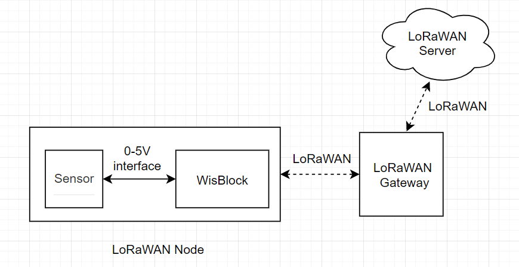
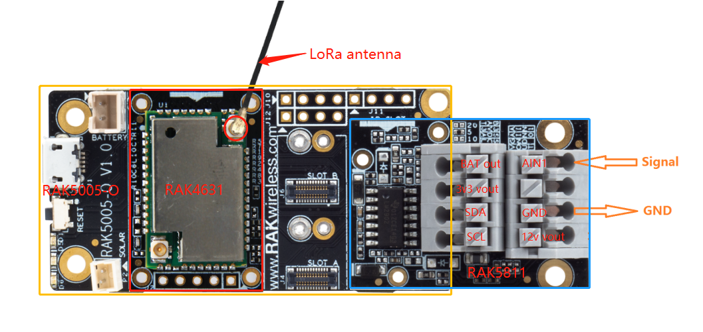
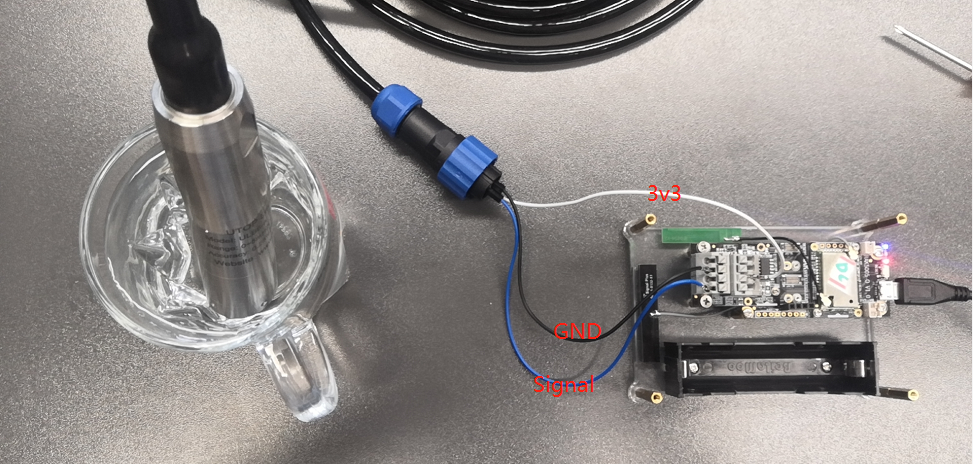
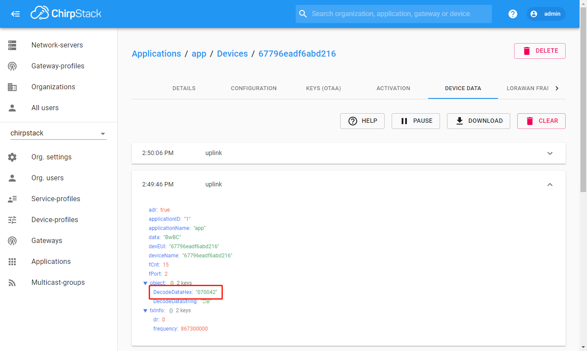

## Water Level Monitoring over LoRaWAN®


This solution shows how to create a water level monitor node. The monitor node measures the water level from a sensor with a 0 to 5V analog interface. It then transmits this data frequently over LoRaWan® to a LoRaWan® server. 

At the LoRaWan® server the data arrives in the following format 

| Byte1 | Byte2 | Byte3 |
| -     | -     | -     |
| 7     | D1    | D2    |
where
  - Byte 1 is a marker for the data type, here always 7    
  - Pressure is sent as **`D1D2`** e.g. 1009 cm (would be 0x03 0xF1 in the data package)

### Hardware required
To build this system, the following hardware are required:

- WisBlock Base RAK5005-O * 1pcs

- WisBlock Core RAK4631 * 1pcs 

- WisBlock IO RAK5811 * 1pcs 
- [ULB16](https://www.utopsensors.com/pressure-measurement/level-transmitter/water-level-sensor.html) - A Water Level sensor with 0-5V interface * 1pcs


> **Note:** To send the data of sensor node to LoRaWan® server,  a  LoRaWan® gateway is also needed. If you don't have one, we recommend you use [RAK7243](https://store.rakwireless.com/products/rak7243c-pilot-gateway).


The assembly of sensor node is as follows:



We chose a water level sensor with a voltage of 3v3, so we can use the board to supply power directly.  The test scenario is shown as follows:




### Software required

- [Arduino IDE](https://www.arduino.cc/en/Main/Software)
- [RAK4630 BSP](https://github.com/RAKWireless/RAK-nRF52-Arduino)
- SX126x-Arduino library


The code for the water level monitor node can be found in the [sketch file](https://github.com/RAKWireless/WisBlock/blob/master/examples/RAK4630/solutions/Water_Level_Monitoring/Water_Level_Monitoring.ino)

<!--
The code for the water level monitor node is as follows:
```cpp
#include <Arduino.h>
#include <LoRaWan-RAK4630.h>
#include <SPI.h>
#define ULB6_SENSOR

// Check if the board has an LED port defined
#ifndef LED_BUILTIN
#define LED_BUILTIN 35
#endif

#ifndef LED_BUILTIN2
#define LED_BUILTIN2 36
#endif

bool doOTAA = true;
#define SCHED_MAX_EVENT_DATA_SIZE APP_TIMER_SCHED_EVENT_DATA_SIZE /**< Maximum size of scheduler events. */
#define SCHED_QUEUE_SIZE 60  /**< Maximum number of events in the scheduler queue. */

#define LORAWAN_DATERATE DR_0
#define LORAWAN_TX_POWER TX_POWER_0
#define JOINREQ_NBTRIALS 3 /**< Number of trials for the join request. */
DeviceClass_t gCurrentClass = CLASS_A;
lmh_confirm gCurrentConfirm = LMH_CONFIRMED_MSG;
uint8_t gAppPort = LORAWAN_APP_PORT;

/**@brief Structure containing LoRaWan parameters, needed for lmh_init()
*/
static lmh_param_t lora_param_init = {LORAWAN_ADR_ON , LORAWAN_DATERATE, LORAWAN_PUBLIC_NETWORK, JOINREQ_NBTRIALS, LORAWAN_TX_POWER, LORAWAN_DUTYCYCLE_OFF};

// Foward declaration
static void lorawan_has_joined_handler(void);
static void lorawan_rx_handler(lmh_app_data_t *app_data);
static void lorawan_confirm_class_handler(DeviceClass_t Class);
static void send_lora_frame(void);

/**@brief Structure containing LoRaWan callback functions, needed for lmh_init()
*/
static lmh_callback_t lora_callbacks = {BoardGetBatteryLevel, BoardGetUniqueId, BoardGetRandomSeed,
                                        lorawan_rx_handler, lorawan_has_joined_handler, lorawan_confirm_class_handler
                                       };


//OTAA keys
uint8_t nodeDeviceEUI[8] = {0x67, 0x79, 0x6e, 0xad, 0xf6, 0xab, 0xd2, 0x16};
uint8_t nodeAppEUI[8] = {0xB8, 0x27, 0xEB, 0xFF, 0xFE, 0x39, 0x00, 0x00};
uint8_t nodeAppKey[16] = {0x77, 0x77, 0x77, 0x77, 0x77, 0x77, 0x77, 0x77, 0x77, 0x77, 0x77, 0x77, 0x77, 0x77, 0x77, 0x77};


// Private defination
#define LORAWAN_APP_DATA_BUFF_SIZE 64  /**< buffer size of the data to be transmitted. */
#define LORAWAN_APP_INTERVAL 20000 /**< Defines for user timer, the application data transmission interval. 20s, value in [ms]. */
static uint8_t m_lora_app_data_buffer[LORAWAN_APP_DATA_BUFF_SIZE]; //< Lora user application data buffer.
static lmh_app_data_t m_lora_app_data = {m_lora_app_data_buffer, 0, 0, 0, 0}; //< Lora user application data structure.

TimerEvent_t appTimer;
static uint32_t timers_init(void);

static uint32_t count = 0;
static uint32_t count_fail = 0;


void setup()
{
  pinMode(LED_BUILTIN, OUTPUT);
  digitalWrite(LED_BUILTIN, LOW);

  /*
     WisBLOCK 5811 Power On
  */
  pinMode(17, OUTPUT);
  digitalWrite(17, HIGH);

  pinMode(A1, INPUT_PULLDOWN);
  analogReference(AR_INTERNAL_3_0);
  analogOversampling(128);

  // Initialize LoRa chip.
  lora_rak4630_init();


  // Initialize Serial for debug output
  Serial.begin(115200);
  while (!Serial) {
    delay(10);
  }
  Serial.println("=====================================");
  Serial.println("Welcome to RAK4630 LoRaWan!!!");
  Serial.println("Type: OTAA");


#if defined(REGION_AS923)
  Serial.println("Region: AS923");
#elif defined(REGION_AU915)
  Serial.println("Region: AU915");
#elif defined(REGION_CN470)
  Serial.println("Region: CN470");
#elif defined(REGION_CN779)
  Serial.println("Region: CN779");
#elif defined(REGION_EU433)
  Serial.println("Region: EU433");
#elif defined(REGION_IN865)
  Serial.println("Region: IN865");
#elif defined(REGION_EU868)
  Serial.println("Region: EU868");
#elif defined(REGION_KR920)
  Serial.println("Region: KR920");
#elif defined(REGION_US915)
  Serial.println("Region: US915");
#elif defined(REGION_US915_HYBRID)
  Serial.println("Region: US915_HYBRID");
#else
  Serial.println("Please define a region in the compiler options.");
#endif
  Serial.println("=====================================");


  //creat a user timer to send data to server period
  uint32_t err_code;
  err_code = timers_init();
  if (err_code != 0)
  {
    Serial.printf("timers_init failed - %d\n", err_code);
  }

  // Setup the EUIs and Keys
  lmh_setDevEui(nodeDeviceEUI);
  lmh_setAppEui(nodeAppEUI);
  lmh_setAppKey(nodeAppKey);

  // Initialize LoRaWan
  err_code = lmh_init(&lora_callbacks, lora_param_init, doOTAA);
  if (err_code != 0)
  {
    Serial.printf("lmh_init failed - %d\n", err_code);
  }

  // Start Join procedure
  lmh_join();
}

void loop()
{
  // Handle Radio events
  Radio.IrqProcess();
}

/**@brief LoRa function for handling HasJoined event.
*/
void lorawan_has_joined_handler(void)
{
  Serial.println("OTAA Mode, Network Joined!");

  lmh_error_status ret = lmh_class_request(gCurrentClass);
  if (ret == LMH_SUCCESS)
  {
    delay(1000);
    TimerSetValue(&appTimer, LORAWAN_APP_INTERVAL);
    TimerStart(&appTimer);
  }
}

/**@brief Function for handling LoRaWan received data from Gateway

   @param[in] app_data  Pointer to rx data
*/
void lorawan_rx_handler(lmh_app_data_t *app_data)
{
  Serial.printf("LoRa Packet received on port %d, size:%d, rssi:%d, snr:%d, data:%s\n",
                app_data->port, app_data->buffsize, app_data->rssi, app_data->snr, app_data->buffer);

}

void lorawan_confirm_class_handler(DeviceClass_t Class)
{
  Serial.printf("switch to class %c done\n", "ABC"[Class]);
  // Informs the server that switch has occurred ASAP
  m_lora_app_data.buffsize = 0;
  m_lora_app_data.port = gAppPort;
  lmh_send(&m_lora_app_data, gCurrentConfirm);
}

#ifdef ULB6_SENSOR

int get_depths(void)
{
  int i;

  int sensor_pin = A1;   // select the input pin for the potentiometer
  int mcu_ain_value = 0;  // variable to store the value coming from the sensor

  int depths;         // variable to store the value of oil depths
  int average_value;
  float voltage_ain, voltage_sensor;

  for (i = 0; i < 5; i++)
  {
    mcu_ain_value += analogRead(sensor_pin);
  }
  average_value = mcu_ain_value / i;

  voltage_ain = average_value * 3.0 / 1024; //raef 3.0v / 10bit ADC

  voltage_sensor = voltage_ain / 0.6;       //WisBlock RAK5811 (0 ~ 5V).   Input signal reduced to 6/10 and output

  depths =  (voltage_sensor * 1000 - 574) * 2.5; //Convert to millivolt. 574mv is the default output from sensor

  //  Serial.printf("-------average_value------ = %d\n", average_value);
  //  Serial.printf("-------voltage_sensor------ = %f\n", voltage_sensor);
  Serial.printf("-------depths------ = %d mm\n", depths);
  return depths;
}
#endif

void send_lora_frame(void)
{
  int depths;

  if (lmh_join_status_get() != LMH_SET)
  {
    //Not joined, try again later
    return;
  }

  depths = get_depths();      //Depth range: (0 ~ 5000mm)

  uint32_t i = 0;

  m_lora_app_data.port = gAppPort;
  m_lora_app_data.buffer[i++] = 0x07;
  m_lora_app_data.buffer[i++] = (depths >> 8) & 0xFF;
  m_lora_app_data.buffer[i++] = depths & 0xFF;
  m_lora_app_data.buffsize = i;

  lmh_error_status error = lmh_send(&m_lora_app_data, gCurrentConfirm);
  if (error == LMH_SUCCESS)
  {
    count++;
    Serial.printf("lmh_send ok count %d\n", count);
  }
  else
  {
    count_fail++;
    Serial.printf("lmh_send fail count %d\n", count_fail);
  }
}

/**@brief Function for handling user timerout event.
*/
void tx_lora_periodic_handler(void)
{
  TimerSetValue(&appTimer, LORAWAN_APP_INTERVAL);
  TimerStart(&appTimer);
  Serial.println("Sending frame now...");
  send_lora_frame();
}

/**@brief Function for the Timer initialization.

   @details Initializes the timer module. This creates and starts application timers.
*/
uint32_t timers_init(void)
{
  TimerInit(&appTimer, tx_lora_periodic_handler);
  return 0;
}
```

-->

The log of sensor node is shown as follows:

```
14:44:19.043 -> =====================================
14:44:19.043 -> Welcome to RAK4630 LoRaWan!!!
14:44:19.043 -> Type: OTAA
14:44:19.043 -> Region: EU868
14:44:19.043 -> =====================================
14:44:24.244 -> OTAA Mode, Network Joined!
14:44:45.264 -> Sending frame now...
14:44:45.264 -> -------depths------ = 66 mm
14:44:45.264 -> lmh_send ok count 1
14:45:05.250 -> Sending frame now...
14:45:05.250 -> -------depths------ = 66 mm
14:45:05.285 -> lmh_send ok count 2
14:45:25.255 -> Sending frame now...
14:45:25.255 -> -------depths------ = 66 mm
14:45:25.289 -> lmh_send ok count 3
14:45:45.264 -> Sending frame now...
14:45:45.264 -> -------depths------ = 66 mm
14:45:45.264 -> lmh_send ok count 4
14:46:05.272 -> Sending frame now...
14:46:05.272 -> -------depths------ = 66 mm
14:46:05.272 -> lmh_send ok count 5
14:46:25.263 -> Sending frame now...
14:46:25.263 -> -------depths------ = 66 mm
14:46:25.297 -> lmh_send ok count 6
```


We use Chirpstack as LoRaWAN® server in this solution, the data sent to LoRaWAN® server is shown as follows:




> LoRa® is a registered trademark or service mark of Semtech Corporation or its affiliates. LoRaWAN® is a licensed mark.