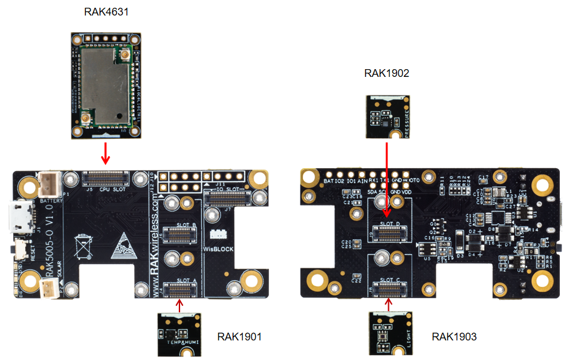

## Weather Monitoring over LoRaWAN®
This solution shows how to create an weather monitoring node. The sensor node measures air temperature, air humidity, barometric pressure and environment luminosity values. After the node joins to server successfully, It then transmits this data periodically to a LoRaWan® server. 

### Data Format 

| Byte1 | Byte2        | Byte3        | Byte4     | Byte5     |
| ----- | ------------ | ------------ | --------- | --------- |
| 1     | Temperature1 | Temperature2 | Humidity1 | Humidity2 |

| Byte6       | Byte7       | Byte8       | Byte9       | Byte10      | Byte11      |
| ----------- | ----------- | ----------- | ----------- | ----------- | ----------- |
| Barometric1 | Barometric2 | Barometric3 | Barometric4 | Luminosity1 | Luminosity2 |


  - Byte 1 is a marker for the data type, here always 1    
  - Every value is MSB first
  - Temperature is sent as two bytes, enlarged 100 times for accuracy. For example, 2510 means 25.01 C, sent as  0x09 0xCE
  - Humidity is sent as two bytes, enlarged 100 times for accuracy. For example, 4173 means 41.73 %, sent as  0x10 0x4D
  - Barometric pressure is sent as four bytes, enlarged 100 times for accuracy. For example, 100945 means 1009.45 hPa, sent as 0x00 0x01 0x8A 0x51
  - Environment luminosity value is sent as as two bytes, enlarged 100 times for accuracy. For example, 10046 means 100.46 lux, sent as 0x27 0x3E 

### Attention

If this examples is implemented for the Region US915, DR0 cannot be used because the package size is too large to fit into the allowed payload.    

### Hardware required
To build this system, the following hardware are required:

- WisBlock Base RAK5005-O * 1pcs   
- WisBlock Core RAK4631 * 1pcs   
- WisBlock Sensor RAK1901 * 1pcs    
- WisBlock Sensor RAK1902 * 1pcs    
- WisBlock Sensor RAK1903 * 1pcs    



### Software required
- [Arduino IDE](https://www.arduino.cc/en/Main/Software)
- [RAK4630 BSP](https://github.com/RAKWireless/RAK-nRF52-Arduino)    
- Arduino LPS22HB library


- Sparkfun SHTC3 library


- ClosedCube OPT3001 library


- SX126x-Arduino library


### The code for the weather monitor node can be found in the [sketch file](https://github.com/RAKWireless/WisBlock/blob/master/examples/RAK4630/solutions/Weather_Monitoring/Weather_Monitoring.ino)

<!--
is as follows:
```cpp
#include <Arduino.h>
#include <LoRaWan-RAK4630.h>
#include <SPI.h>
#include <Wire.h>
#include <Arduino_LPS22HB.h>  // Click here to get the library: http://librarymanager/All#Arduino_LPS22HB
#include "SparkFun_SHTC3.h" // Click here to get the library: http://librarymanager/All#SparkFun_SHTC3
SHTC3 mySHTC3;              // Declare an instance of the SHTC3 class

#include <ClosedCube_OPT3001.h> // Click here to get the library: http://librarymanager/All#OPT3001
ClosedCube_OPT3001 opt3001;
#define OPT3001_ADDRESS 0x44


// RAK4630 supply two LED
#ifndef LED_BUILTIN
#define LED_BUILTIN 35
#endif

#ifndef LED_BUILTIN2
#define LED_BUILTIN2 36
#endif

bool doOTAA = true;
#define SCHED_MAX_EVENT_DATA_SIZE APP_TIMER_SCHED_EVENT_DATA_SIZE /**< Maximum size of scheduler events. */
#define SCHED_QUEUE_SIZE 60  /**< Maximum number of events in the scheduler queue. */
#define LORAWAN_DATERATE DR_0 /*LoRaMac datarates definition, from DR_0 to DR_5*/
#define LORAWAN_TX_POWER TX_POWER_5 /*LoRaMac tx power definition, from TX_POWER_0 to TX_POWER_15*/
#define JOINREQ_NBTRIALS 3 /**< Number of trials for the join request. */
DeviceClass_t gCurrentClass = CLASS_A; /* class definition*/
lmh_confirm gCurrentConfirm = LMH_CONFIRMED_MSG; /* confirm/unconfirm packet definition*/
uint8_t gAppPort = LORAWAN_APP_PORT;   /* data port*/

/**@brief Structure containing LoRaWan parameters, needed for lmh_init()
 */
static lmh_param_t lora_param_init = {LORAWAN_ADR_ON , LORAWAN_DATERATE, LORAWAN_PUBLIC_NETWORK, JOINREQ_NBTRIALS, LORAWAN_TX_POWER, LORAWAN_DUTYCYCLE_OFF};

// Foward declaration
static void lorawan_has_joined_handler(void);
static void lorawan_rx_handler(lmh_app_data_t *app_data);
static void lorawan_confirm_class_handler(DeviceClass_t Class);
static void send_lora_frame(void);

/**@brief Structure containing LoRaWan callback functions, needed for lmh_init()
*/
static lmh_callback_t lora_callbacks = {BoardGetBatteryLevel, BoardGetUniqueId, BoardGetRandomSeed,
										lorawan_rx_handler, lorawan_has_joined_handler, lorawan_confirm_class_handler};


//OTAA keys
uint8_t nodeDeviceEUI[8] = {0x88, 0x88, 0x88, 0x88, 0x88, 0x88, 0x33, 0x33};
uint8_t nodeAppEUI[8] = {0xB8, 0x27, 0xEB, 0xFF, 0xFE, 0x39, 0x00, 0x00};
uint8_t nodeAppKey[16] = {0x88, 0x88, 0x88, 0x88, 0x88, 0x88, 0x88, 0x88,0x88, 0x88, 0x88, 0x88, 0x88, 0x88, 0x33, 0x33};


// Private defination
#define LORAWAN_APP_DATA_BUFF_SIZE 64  /**< buffer size of the data to be transmitted. */
#define LORAWAN_APP_INTERVAL 20000 /**< Defines for user timer, the application data transmission interval. 20s, value in [ms]. */
static uint8_t m_lora_app_data_buffer[LORAWAN_APP_DATA_BUFF_SIZE]; //< Lora user application data buffer.
static lmh_app_data_t m_lora_app_data = {m_lora_app_data_buffer, 0, 0, 0, 0}; //< Lora user application data structure.

TimerEvent_t appTimer;
static uint32_t timers_init(void);
static uint32_t count = 0;
static uint32_t count_fail = 0;

void setup()
{
	pinMode(LED_BUILTIN, OUTPUT);
	digitalWrite(LED_BUILTIN, LOW);

  // Initialize LoRa chip.
  lora_rak4630_init();

	// Initialize Serial for debug output
	Serial.begin(115200);
        while(!Serial){delay(10);}
	Serial.println("=====================================");
	Serial.println("Welcome to RAK4630 LoRaWan!!!");
  Serial.println("Type: OTAA");


#if defined(REGION_AS923)
    Serial.println("Region: AS923");
#elif defined(REGION_AU915)
    Serial.println("Region: AU915");
#elif defined(REGION_CN470)
    Serial.println("Region: CN470");
#elif defined(REGION_CN779)
    Serial.println("Region: CN779");
#elif defined(REGION_EU433)
    Serial.println("Region: EU433");
#elif defined(REGION_IN865)
    Serial.println("Region: IN865");
#elif defined(REGION_EU868)
    Serial.println("Region: EU868");
#elif defined(REGION_KR920)
    Serial.println("Region: KR920");
#elif defined(REGION_US915)
    Serial.println("Region: US915");
#elif defined(REGION_US915_HYBRID)
    Serial.println("Region: US915_HYBRID");
#else
    Serial.println("Please define a region in the compiler options.");
#endif
    Serial.println("=====================================");
    
  Wire.begin();
 /* shtc3 init */
  Serial.println("shtc3 init");
  Serial.print("Beginning sensor. Result = ");           // Most SHTC3 functions return a variable of the type "SHTC3_Status_TypeDef" to indicate the status of their execution 
  mySHTC3.begin();                              // To start the sensor you must call "begin()", the default settings use Wire (default Arduino I2C port)
  Wire.setClock(400000);                                      // The sensor is listed to work up to 1 MHz I2C speed, but the I2C clock speed is global for all sensors on that bus so using 400kHz or 100kHz is recommended
  Serial.println();

  if(mySHTC3.passIDcrc)                                       // Whenever data is received the associated checksum is calculated and verified so you can be sure the data is true
  {                                                           // The checksum pass indicators are: passIDcrc, passRHcrc, and passTcrc for the ID, RH, and T readings respectively
    Serial.print("ID Passed Checksum. ");
    Serial.print("Device ID: 0b"); 
    Serial.println(mySHTC3.ID, BIN);                       // The 16-bit device ID can be accessed as a member variable of the object
  }
  else
  {
    Serial.println("ID Checksum Failed. ");
  }
   /* LPS22HB init */
    if (!BARO.begin()) {
      Serial.println("Failed to initialize pressure sensor!");
      while (1);
    }
  /* opt3001 init */
  opt3001.begin(OPT3001_ADDRESS);
  Serial.print("OPT3001 Manufacturer ID");
  Serial.println(opt3001.readManufacturerID());
  Serial.print("OPT3001 Device ID");
  Serial.println(opt3001.readDeviceID());

  configureSensor();

	// Initialize Scheduler and timer
    uint32_t err_code;

  err_code = timers_init();
	if (err_code != 0)
	{
		Serial.printf("timers_init failed - %d\n", err_code);
	}

	// Setup the EUIs and Keys
	lmh_setDevEui(nodeDeviceEUI);
	lmh_setAppEui(nodeAppEUI);
	lmh_setAppKey(nodeAppKey);

	// Initialize LoRaWan
	err_code = lmh_init(&lora_callbacks, lora_param_init,doOTAA);
	if (err_code != 0)
	{
		Serial.printf("lmh_init failed - %d\n", err_code);
	}

	// Start Join procedure
	lmh_join();
}

void loop()
{
	// Handle Radio events
	Radio.IrqProcess();
}

/**@brief LoRa function for handling HasJoined event.
 */
void lorawan_has_joined_handler(void)
{
  Serial.println("OTAA Mode, Network Joined!");

  lmh_error_status ret = lmh_class_request(gCurrentClass);
  if(ret == LMH_SUCCESS)
  {
    delay(1000);
  	TimerSetValue(&appTimer, LORAWAN_APP_INTERVAL);
  	TimerStart(&appTimer);
  }
}

/**@brief Function for handling LoRaWan received data from Gateway
 *
 * @param[in] app_data  Pointer to rx data
 */
void lorawan_rx_handler(lmh_app_data_t *app_data)
{
	Serial.printf("LoRa Packet received on port %d, size:%d, rssi:%d, snr:%d, data:%s\n",
				  app_data->port, app_data->buffsize, app_data->rssi, app_data->snr, app_data->buffer);

}

void lorawan_confirm_class_handler(DeviceClass_t Class)
{
    Serial.printf("switch to class %c done\n", "ABC"[Class]);
    // Informs the server that switch has occurred ASAP
    m_lora_app_data.buffsize = 0;
    m_lora_app_data.port = gAppPort;
    lmh_send(&m_lora_app_data, gCurrentConfirm);
}

void send_lora_frame(void)
{
	if (lmh_join_status_get() != LMH_SET)
	{
		//Not joined, try again later
		return;
	}
   data_get();

    lmh_error_status error = lmh_send(&m_lora_app_data, gCurrentConfirm);
    if (error == LMH_SUCCESS)
    {
        count++;
        Serial.printf("lmh_send ok count %d\n", count);
    }
    else
    {
        count_fail++;
        Serial.printf("lmh_send fail count %d\n", count_fail);
    }
}

/**@brief Function for handling user timerout event.
 */
void tx_lora_periodic_handler(void)
{
   TimerSetValue(&appTimer, LORAWAN_APP_INTERVAL);
   TimerStart(&appTimer);
   Serial.println("Sending frame now...");
   send_lora_frame();
}

/**@brief Function for the Timer initialization.
 *
 * @details Initializes the timer module. This creates and starts application timers.
 */
uint32_t timers_init(void)
{
    TimerInit(&appTimer, tx_lora_periodic_handler);
    return 0;
}
String data="";
void data_get(){
    Serial.print("result: ");
    uint32_t i = 0;
    memset(m_lora_app_data.buffer, 0, LORAWAN_APP_DATA_BUFF_SIZE);
    m_lora_app_data.port = gAppPort;
    mySHTC3.update();
    
    float temp = mySHTC3.toDegC();
    float hum = mySHTC3.toPercent();
    float pres = BARO.readPressure();
      
    OPT3001 result = opt3001.readResult();

    data = "Tem:"+String(temp)+"C "+"Hum:"+String(hum)+"% "+"Pres:"+String(pres)+"KPa "+"Lig:"+String(result.lux)+"lux";
    Serial.println(data);
    
    uint16_t t = temp*100;
    uint16_t h = hum*100;
    uint32_t pre = pres *100;
    uint16_t l = result.lux *100;
    //result: T=28.25C, RH=50.00%, P=958.57hPa, light=100.46 lux
    m_lora_app_data.buffer[i++] = 0x01;
    m_lora_app_data.buffer[i++] = (uint8_t) (t>>8);
    m_lora_app_data.buffer[i++] = (uint8_t)t;
    m_lora_app_data.buffer[i++] = (uint8_t)(h>>8);
    m_lora_app_data.buffer[i++] = (uint8_t)h;
    m_lora_app_data.buffer[i++] = (uint8_t)((pre & 0xFF000000)>>24);
    m_lora_app_data.buffer[i++] = (uint8_t)((pre & 0x00FF0000)>>16);
    m_lora_app_data.buffer[i++] = (uint8_t)((pre & 0x0000FF00)>>8);
    m_lora_app_data.buffer[i++] = (uint8_t)(pre & 0x000000FF);
    m_lora_app_data.buffer[i++] = (uint8_t) (l>>8);
    m_lora_app_data.buffer[i++] = (uint8_t)l;
    m_lora_app_data.buffsize = i;
}
void configureSensor() {
  OPT3001_Config newConfig;
  
  newConfig.RangeNumber = B1100;  
  newConfig.ConvertionTime = B0;
  newConfig.Latch = B1;
  newConfig.ModeOfConversionOperation = B11;

  OPT3001_ErrorCode errorConfig = opt3001.writeConfig(newConfig);
  if (errorConfig != NO_ERROR)
    {}//printError("OPT3001 configuration", errorConfig);
  else {
    OPT3001_Config sensorConfig = opt3001.readConfig();
    Serial.println("OPT3001 Current Config:");
    Serial.println("------------------------------");
    
    Serial.print("Conversion ready (R):");
    Serial.println(sensorConfig.ConversionReady,HEX);

    Serial.print("Conversion time (R/W):");
    Serial.println(sensorConfig.ConvertionTime, HEX);

    Serial.print("Fault count field (R/W):");
    Serial.println(sensorConfig.FaultCount, HEX);

    Serial.print("Flag high field (R-only):");
    Serial.println(sensorConfig.FlagHigh, HEX);

    Serial.print("Flag low field (R-only):");
    Serial.println(sensorConfig.FlagLow, HEX);

    Serial.print("Latch field (R/W):");
    Serial.println(sensorConfig.Latch, HEX);

    Serial.print("Mask exponent field (R/W):");
    Serial.println(sensorConfig.MaskExponent, HEX);

    Serial.print("Mode of conversion operation (R/W):");
    Serial.println(sensorConfig.ModeOfConversionOperation, HEX);

    Serial.print("Polarity field (R/W):");
    Serial.println(sensorConfig.Polarity, HEX);

    Serial.print("Overflow flag (R-only):");
    Serial.println(sensorConfig.OverflowFlag, HEX);

    Serial.print("Range number (R/W):");
    Serial.println(sensorConfig.RangeNumber, HEX);

    Serial.println("------------------------------");
  }
  
}
```

-->

### Result
Here is the log output of the application:

```
09:41:40.546 -> =====================================
09:41:40.546 -> Welcome to RAK4630 LoRaWan!!!
09:41:40.546 -> Type: OTAA
09:41:40.546 -> Region: EU868
09:41:40.546 -> =====================================
09:41:40.546 -> shtc3 init
09:41:40.546 -> Beginning sensor. Result = 
09:41:40.546 -> ID Passed Checksum. Device ID: 0b100001000111
09:41:40.546 -> OPT3001 Manufacturer ID21577
09:41:40.546 -> OPT3001 Device ID12289
09:41:40.546 -> OPT3001 Current Config:
09:41:40.546 -> ------------------------------
09:41:40.546 -> Conversion ready (R):0
09:41:40.546 -> Conversion time (R/W):0
09:41:40.546 -> Fault count field (R/W):0
09:41:40.546 -> Flag high field (R-only):0
09:41:40.546 -> Flag low field (R-only):0
09:41:40.546 -> Latch field (R/W):1
09:41:40.546 -> Mask exponent field (R/W):0
09:41:40.546 -> Mode of conversion operation (R/W):3
09:41:40.546 -> Polarity field (R/W):0
09:41:40.546 -> Overflow flag (R-only):0
09:41:40.546 -> Range number (R/W):C
09:41:40.546 -> ------------------------------
09:41:45.753 -> OTAA Mode, Network Joined!
09:42:06.746 -> Sending frame now...
09:42:06.746 -> result: Tem:27.88C Hum:70.61% Pres:75.97KPa Lig:529.92lux
09:42:06.781 -> lmh_send ok count 1
09:42:26.749 -> Sending frame now...
09:42:26.749 -> result: Tem:27.89C Hum:70.63% Pres:95.33KPa Lig:530.88lux
09:42:26.749 -> lmh_send ok count 2

```

Data arrives at LoRaWAN® server.


LoRa® is a registered trademark or service mark of Semtech Corporation or its affiliates. LoRaWAN® is a licensed mark.