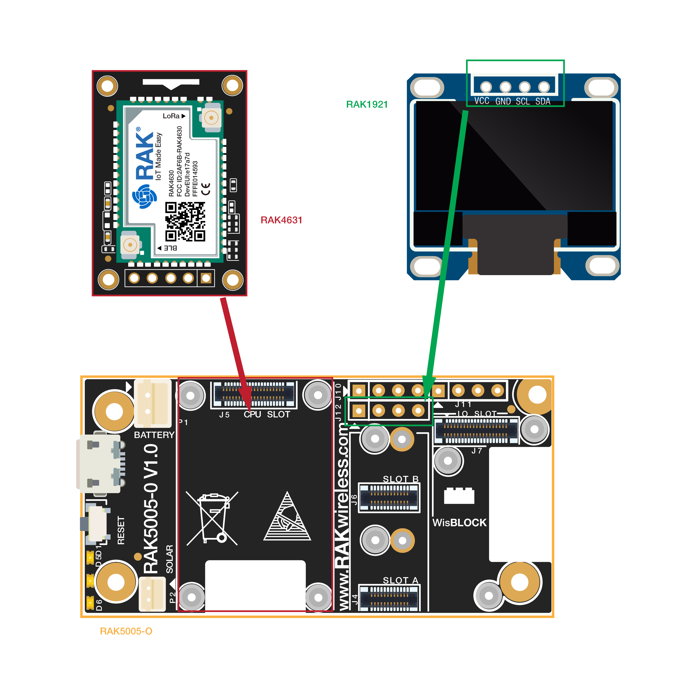
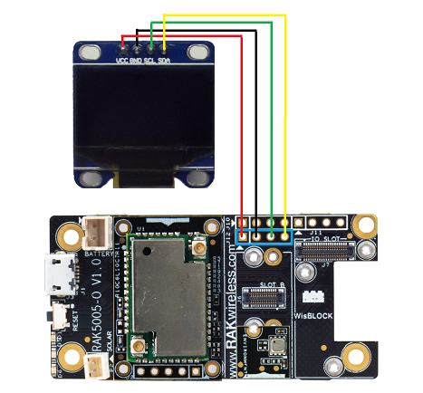
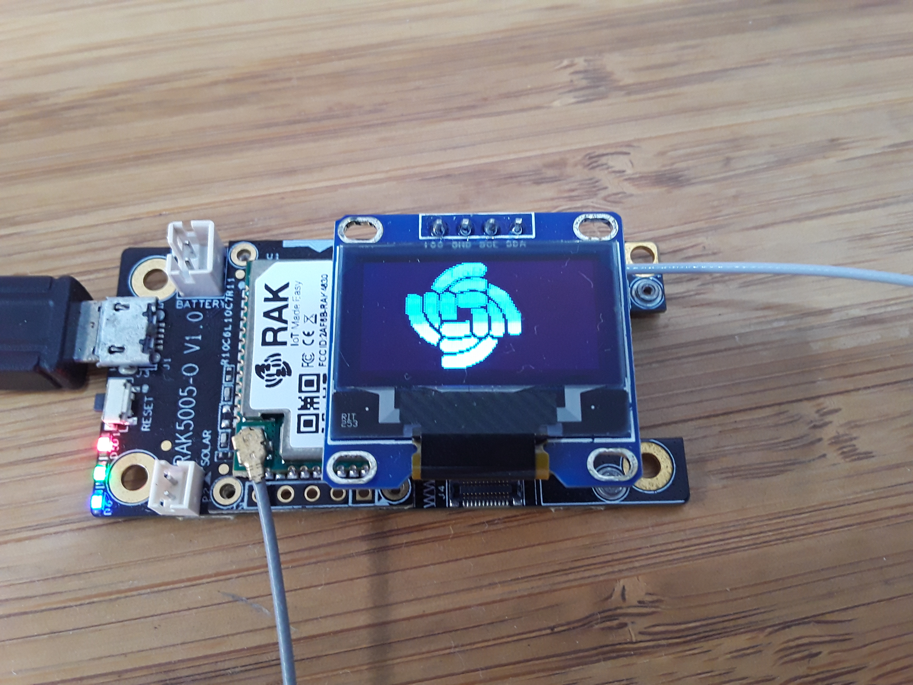

# WisBlock IO RAK1921 OLED Board Programming Guide

This example shows how to use WisBlock IO RAK1921 which is an OLED SSD1306(128*64, I2C) board.


----
## Hardware required
----
The following hardware are required.

- WisBlock Base RAK5005-O  \*  1pcs    
- WisBlock Core RAK4631      \*  1pcs    
- WisBlock IO RAK1921          \*  1pcs    


Hardware is shown as follows:



Assembled as follows:



For stable connection, please use screws to tighten.

----
## Software required
----
To use the environment WisBlock Sensor RAK1906, The following software is required.

- [ArduinoIDE](https://www.arduino.cc/en/Main/Software)
- [RAK4630 BSP](https://github.com/RAKWireless/RAK-nRF52-Arduino)
- U8g2 library


Connect the assembled hardware to the PC with a USB cable, open the Arduino, and select the development board and port in the tool menu.


## Demo

### Demo 1

The Demo  is designed to display BME680 sensor data on SSD1306.

```
#include <Arduino.h>
#include <U8g2lib.h>

#include <Wire.h>

#define RAK_Whirl_width 64
#define RAK_Whirl_height 64
static unsigned char RAK_Whirl_bits[] = {
  0x00, 0x00, 0x00, 0x00, 0x00, 0x00, 0x00, 0x00, 0x00, 0x00, 0x00, 0x00,
  0xff, 0x07, 0x00, 0x00, 0x00, 0x00, 0x00, 0xe0, 0xff, 0x0f, 0x00, 0x00,
  0x00, 0x00, 0x00, 0xf8, 0xff, 0x1f, 0x00, 0x00, 0x00, 0x00, 0x00, 0xfe,
  0xff, 0x1f, 0x00, 0x00, 0x00, 0x00, 0x80, 0xff, 0xff, 0x1f, 0x00, 0x00,
  0x00, 0x00, 0xc0, 0xff, 0xff, 0x0f, 0x00, 0x00, 0x00, 0x00, 0xe0, 0xff,
  0xff, 0x0f, 0x00, 0x00, 0x00, 0x00, 0xf0, 0xff, 0xff, 0x07, 0x00, 0x00,
  0x00, 0x00, 0xf8, 0xff, 0x01, 0x00, 0x00, 0x00, 0x00, 0x00, 0xfc, 0x3f,
  0xe0, 0x03, 0x00, 0x00, 0x00, 0x00, 0xfe, 0x0f, 0xff, 0x1f, 0x00, 0x00,
  0x00, 0x00, 0xfe, 0xc7, 0xff, 0x1f, 0x00, 0x00, 0x00, 0x00, 0xff, 0xf3,
  0xff, 0x1f, 0x00, 0x00, 0x00, 0x00, 0xff, 0xf8, 0xff, 0x9f, 0x00, 0x00,
  0x00, 0x80, 0x7f, 0xfc, 0xff, 0x9f, 0x03, 0x00, 0x00, 0x80, 0x3f, 0xfe,
  0xff, 0x9f, 0x0f, 0x00, 0x00, 0x00, 0x1e, 0xfe, 0x07, 0xcf, 0x1f, 0x00,
  0x00, 0x00, 0x0c, 0x38, 0x00, 0xc0, 0x7f, 0x00, 0x00, 0xf0, 0xc1, 0x01,
  0xfe, 0xc3, 0xff, 0x00, 0x7c, 0xf8, 0xf3, 0xe7, 0xff, 0xcf, 0xff, 0x01,
  0xfc, 0xf9, 0xf3, 0xe7, 0xff, 0x9f, 0xff, 0x01, 0xfe, 0xf9, 0xf3, 0xef,
  0xff, 0x1f, 0xff, 0x03, 0xfe, 0xf9, 0xf3, 0xef, 0xff, 0x1f, 0xfe, 0x03,
  0xfe, 0xf9, 0xfb, 0xef, 0xff, 0x9f, 0xfc, 0x07, 0xfe, 0xf9, 0xfb, 0xef,
  0xff, 0x9f, 0xf9, 0x07, 0xfe, 0xf9, 0xfb, 0xef, 0xff, 0xcf, 0xf3, 0x0f,
  0xfe, 0xf9, 0xfb, 0xcf, 0xff, 0xc1, 0xf3, 0x0f, 0xfe, 0xf9, 0xfb, 0x0f,
  0x00, 0xc0, 0xe7, 0x1f, 0xfe, 0xf9, 0xfb, 0x0f, 0xe0, 0xcf, 0xcf, 0x1f,
  0xfe, 0xf9, 0xf3, 0x0f, 0xe0, 0xcf, 0xcf, 0x3f, 0xfe, 0xf3, 0xf3, 0x0f,
  0xe0, 0xdf, 0xdf, 0x3f, 0xfc, 0xf3, 0xf3, 0x0f, 0xe0, 0xdf, 0x9f, 0x7f,
  0xfc, 0xf3, 0xf3, 0x0f, 0xe0, 0x9f, 0x9f, 0x7f, 0xfc, 0xe7, 0xf7, 0x0f,
  0xe0, 0x9f, 0x9f, 0x7f, 0xf8, 0xe7, 0x07, 0x00, 0xe0, 0x9f, 0x3f, 0x7f,
  0xf8, 0xcf, 0x07, 0x00, 0xe6, 0x9f, 0x3f, 0x7f, 0xf0, 0x9f, 0xe7, 0xff,
  0xe7, 0x9f, 0x3f, 0x7f, 0xf0, 0x1f, 0xf3, 0xff, 0xe7, 0x9f, 0x3f, 0x7f,
  0xe0, 0x3f, 0xf2, 0xff, 0xe7, 0x9f, 0x3f, 0x7f, 0xe0, 0x7f, 0xf8, 0xff,
  0xe7, 0x9f, 0x3f, 0x7f, 0xc0, 0xff, 0xf8, 0xff, 0xe7, 0x9f, 0x3f, 0x7f,
  0x80, 0xff, 0xf1, 0xff, 0xe7, 0xdf, 0x3f, 0x7f, 0x00, 0xff, 0xf3, 0xff,
  0xcf, 0xcf, 0x1f, 0x3e, 0x00, 0xff, 0xc7, 0xff, 0x80, 0x07, 0x1f, 0x00,
  0x00, 0xfc, 0x07, 0x00, 0x10, 0x20, 0x00, 0x00, 0x00, 0xf8, 0x63, 0x80,
  0x7f, 0x70, 0x00, 0x00, 0x00, 0xf0, 0xf3, 0xff, 0xff, 0xfc, 0x03, 0x00,
  0x00, 0xc0, 0xf9, 0xff, 0x7f, 0xfe, 0x03, 0x00, 0x00, 0x00, 0xf9, 0xff,
  0x3f, 0xff, 0x01, 0x00, 0x00, 0x00, 0xf8, 0xff, 0x9f, 0xff, 0x01, 0x00,
  0x00, 0x00, 0xf8, 0xff, 0xc7, 0xff, 0x00, 0x00, 0x00, 0x00, 0xf0, 0xff,
  0xf1, 0x7f, 0x00, 0x00, 0x00, 0x00, 0xe0, 0x1f, 0xf8, 0x7f, 0x00, 0x00,
  0x00, 0x00, 0x00, 0x00, 0xff, 0x3f, 0x00, 0x00, 0x00, 0x00, 0x00, 0xf0,
  0xff, 0x1f, 0x00, 0x00, 0x00, 0x00, 0xe0, 0xff, 0xff, 0x0f, 0x00, 0x00,
  0x00, 0x00, 0xf0, 0xff, 0xff, 0x07, 0x00, 0x00, 0x00, 0x00, 0xf0, 0xff,
  0xff, 0x03, 0x00, 0x00, 0x00, 0x00, 0xf0, 0xff, 0xff, 0x00, 0x00, 0x00,
  0x00, 0x00, 0xf0, 0xff, 0x3f, 0x00, 0x00, 0x00, 0x00, 0x00, 0xf0, 0xff,
  0x0f, 0x00, 0x00, 0x00, 0x00, 0x00, 0xe0, 0xff, 0x01, 0x00, 0x00, 0x00,
  0x00, 0x00, 0x00, 0x00, 0x00, 0x00, 0x00, 0x00
};

/**
   Made with Marlin Bitmap Converter
   http://marlinfw.org/tools/u8glib/converter.html

   This bitmap from the file 'RAK-Whirls.png'
*/
#define CUSTOM_BOOTSCREEN_BMPWIDTH  64
#define CUSTOM_BOOTSCREEN_BMPHEIGHT 64
const unsigned char custom_start_bmp[] PROGMEM = {
  0x00, 0x00, 0x00, 0x00, 0x00, 0x00, 0x00, 0x00, // ................................................................
  0x00, 0x00, 0x00, 0x01, 0xFF, 0xF0, 0x00, 0x00, // ...............................#############....................
  0x00, 0x00, 0x00, 0x0F, 0xFF, 0xF8, 0x00, 0x00, // ............................#################...................
  0x00, 0x00, 0x00, 0x3F, 0xFF, 0xF8, 0x00, 0x00, // ..........................###################...................
  0x00, 0x00, 0x00, 0x7F, 0xFF, 0xF8, 0x00, 0x00, // .........................####################...................
  0x00, 0x00, 0x01, 0xFF, 0xFF, 0xF8, 0x00, 0x00, // .......................######################...................
  0x00, 0x00, 0x03, 0xFF, 0xFF, 0xF8, 0x00, 0x00, // ......................#######################...................
  0x00, 0x00, 0x07, 0xFF, 0xFF, 0xF0, 0x00, 0x00, // .....................#######################....................
  0x00, 0x00, 0x0F, 0xFF, 0xFF, 0xE0, 0x00, 0x00, // ....................#######################.....................
  0x00, 0x00, 0x1F, 0xFF, 0xC0, 0x00, 0x00, 0x00, // ...................###############..............................
  0x00, 0x00, 0x3F, 0xFE, 0x0F, 0xE0, 0x00, 0x00, // ..................#############.....#######.....................
  0x00, 0x00, 0x7F, 0xF8, 0xFF, 0xF8, 0x00, 0x00, // .................############...#############...................
  0x00, 0x00, 0x7F, 0xE3, 0xFF, 0xFC, 0x00, 0x00, // .................##########...################..................
  0x00, 0x00, 0xFF, 0xCF, 0xFF, 0xFC, 0x00, 0x00, // ................##########..##################..................
  0x00, 0x01, 0xFF, 0x9F, 0xFF, 0xFD, 0x80, 0x00, // ...............##########..###################.##...............
  0x00, 0x01, 0xFF, 0x3F, 0xFF, 0xFD, 0xE0, 0x00, // ...............#########..####################.####.............
  0x00, 0x01, 0xFE, 0x7F, 0xFF, 0xF9, 0xF0, 0x00, // ...............########..####################..#####............
  0x00, 0x01, 0xFC, 0xFF, 0xFF, 0xFB, 0xFC, 0x00, // ...............#######..#####################.########..........
  0x00, 0x00, 0x30, 0x1E, 0x00, 0x03, 0xFE, 0x00, // ..................##.......####...............#########.........
  0x00, 0x0F, 0x87, 0xC0, 0x7F, 0xC3, 0xFF, 0x00, // ............#####....#####.......#########....##########........
  0x3F, 0x1F, 0xCF, 0xE7, 0xFF, 0xFB, 0xFF, 0x80, // ..######...#######..#######..################.###########.......
  0x3F, 0x9F, 0xEF, 0xF7, 0xFF, 0xF9, 0xFF, 0xC0, // ..#######..########.########.################..###########......
  0x7F, 0x9F, 0xCF, 0xF7, 0xFF, 0xFC, 0xFF, 0xE0, // .########..#######..########.#################..###########.....
  0x7F, 0xBF, 0xDF, 0xF7, 0xFF, 0xFC, 0x7F, 0xF0, // .########.########.#########.#################...###########....
  0x7F, 0xBF, 0xDF, 0xF7, 0xFF, 0xFD, 0x3F, 0xF0, // .########.########.#########.#################.#..##########....
  0x7F, 0xBF, 0xDF, 0xF7, 0xFF, 0xF9, 0x9F, 0xF8, // .########.########.#########.################..##..##########...
  0x7F, 0xBF, 0xDF, 0xF7, 0xFF, 0xFB, 0xCF, 0xF8, // .########.########.#########.################.####..#########...
  0x7F, 0x9F, 0xDF, 0xF7, 0xFF, 0xE3, 0xEF, 0xFC, // .########..#######.#########.##############...#####.##########..
  0x7F, 0x9F, 0xDF, 0xF0, 0x00, 0x03, 0xE7, 0xFC, // .########..#######.#########..................#####..#########..
  0x7F, 0x9F, 0xDF, 0xF0, 0x07, 0xFB, 0xF7, 0xFE, // .########..#######.#########.........########.######.##########.
  0x7F, 0xDF, 0xDF, 0xF0, 0x07, 0xFB, 0xFB, 0xFE, // .#########.#######.#########.........########.#######.#########.
  0x7F, 0xDF, 0xCF, 0xF0, 0x07, 0xFB, 0xFB, 0xFE, // .#########.#######..########.........########.#######.#########.
  0x7F, 0xCF, 0xEF, 0xF0, 0x07, 0xFB, 0xF9, 0xFE, // .#########..#######.########.........########.#######..########.
  0x3F, 0xEF, 0xEF, 0xF0, 0x07, 0xF9, 0xFD, 0xFE, // ..#########.#######.########.........########..#######.########.
  0x3F, 0xEF, 0xEF, 0xF0, 0x07, 0xF9, 0xFD, 0xFE, // ..#########.#######.########.........########..#######.########.
  0x3F, 0xF7, 0xEF, 0x00, 0x07, 0xFD, 0xFC, 0xFE, // ..##########.######.####.............#########.#######..#######.
  0x1F, 0xF3, 0xE0, 0x00, 0x67, 0xFD, 0xFC, 0xFE, // ...#########..#####..............##..#########.#######..#######.
  0x1F, 0xFB, 0xE7, 0xFF, 0xF7, 0xFD, 0xFC, 0xFE, // ...##########.#####..###############.#########.#######..#######.
  0x0F, 0xFD, 0xCF, 0xFF, 0xF7, 0xFD, 0xFC, 0xFE, // ....##########.###..################.#########.#######..#######.
  0x0F, 0xFC, 0xDF, 0xFF, 0xF7, 0xFD, 0xFC, 0xFE, // ....##########..##.#################.#########.#######..#######.
  0x07, 0xFE, 0x5F, 0xFF, 0xF7, 0xF9, 0xFC, 0xFE, // .....##########..#.#################.########..#######..#######.
  0x03, 0xFF, 0x1F, 0xFF, 0xF7, 0xF9, 0xFC, 0xFE, // ......##########...#################.########..#######..#######.
  0x03, 0xFF, 0x9F, 0xFF, 0xF7, 0xFB, 0xFC, 0xFE, // ......###########..#################.########.########..#######.
  0x01, 0xFF, 0xCF, 0xFF, 0xF7, 0xFB, 0xFC, 0x7E, // .......###########..################.########.########...######.
  0x00, 0xFF, 0xE7, 0xFF, 0xE3, 0xF1, 0xFC, 0x3C, // ........###########..##############...######...#######....####..
  0x00, 0x7F, 0xF0, 0x78, 0x08, 0x04, 0x70, 0x00, // .........###########.....####.......#........#...###............
  0x00, 0x3F, 0xE6, 0x01, 0xFE, 0x0F, 0x00, 0x00, // ..........#########..##........########.....####................
  0x00, 0x0F, 0xCF, 0xFF, 0xFF, 0x9F, 0xC0, 0x00, // ............######..#####################..#######..............
  0x00, 0x07, 0xDF, 0xFF, 0xFF, 0x3F, 0xC0, 0x00, // .............#####.#####################..########..............
  0x00, 0x01, 0xDF, 0xFF, 0xFE, 0x7F, 0xC0, 0x00, // ...............###.####################..#########..............
  0x00, 0x00, 0x1F, 0xFF, 0xF9, 0xFF, 0x80, 0x00, // ...................##################..##########...............
  0x00, 0x00, 0x1F, 0xFF, 0xF3, 0xFF, 0x80, 0x00, // ...................#################..###########...............
  0x00, 0x00, 0x1F, 0xFF, 0xC7, 0xFF, 0x00, 0x00, // ...................###############...###########................
  0x00, 0x00, 0x0F, 0xFE, 0x1F, 0xFE, 0x00, 0x00, // ....................###########....############.................
  0x00, 0x00, 0x00, 0x00, 0x7F, 0xFE, 0x00, 0x00, // .................................##############.................
  0x00, 0x00, 0x00, 0x07, 0xFF, 0xFC, 0x00, 0x00, // .............................#################..................
  0x00, 0x00, 0x07, 0xFF, 0xFF, 0xF8, 0x00, 0x00, // .....................########################...................
  0x00, 0x00, 0x0F, 0xFF, 0xFF, 0xF0, 0x00, 0x00, // ....................########################....................
  0x00, 0x00, 0x0F, 0xFF, 0xFF, 0xE0, 0x00, 0x00, // ....................#######################.....................
  0x00, 0x00, 0x0F, 0xFF, 0xFF, 0x80, 0x00, 0x00, // ....................#####################.......................
  0x00, 0x00, 0x0F, 0xFF, 0xFF, 0x00, 0x00, 0x00, // ....................####################........................
  0x00, 0x00, 0x0F, 0xFF, 0xFC, 0x00, 0x00, 0x00, // ....................##################..........................
  0x00, 0x00, 0x07, 0xFF, 0xE0, 0x00, 0x00, 0x00, // .....................##############.............................
  0x00, 0x00, 0x03, 0xFF, 0x00, 0x00, 0x00, 0x00 // ......................##########................................
};

/*
  U8g2lib Example Overview:
    Frame Buffer Examples: clearBuffer/sendBuffer. Fast, but may not work with all Arduino boards because of RAM consumption
    Page Buffer Examples: firstPage/nextPage. Less RAM usage, should work with all Arduino boards.
    U8x8 Text Only Example: No RAM usage, direct communication with display controller. No graphics, 8x8 Text only.

  This is a frame buffer example.
*/

U8G2_SSD1306_128X64_NONAME_F_HW_I2C u8g2(U8G2_R0, /* reset=*/ U8X8_PIN_NONE);

// End of constructor list

//#define MINI_LOGO

void setup(void) {
  u8g2.begin();
  u8g2.clearDisplay();
  while (1) {
    for (int i = 0; i < 64; i++)
    {
      u8g2.drawXBM(i, 0, 64, 64, RAK_Whirl_bits);
      u8g2.sendBuffer();
    }
    for (int i = 63; i >= 0 ; i--)
    {
      u8g2.drawXBM(i, 0, 64, 64, RAK_Whirl_bits);
      u8g2.sendBuffer();
    }
  }
}

void loop(void) {
}
```


The test results are as follows：




