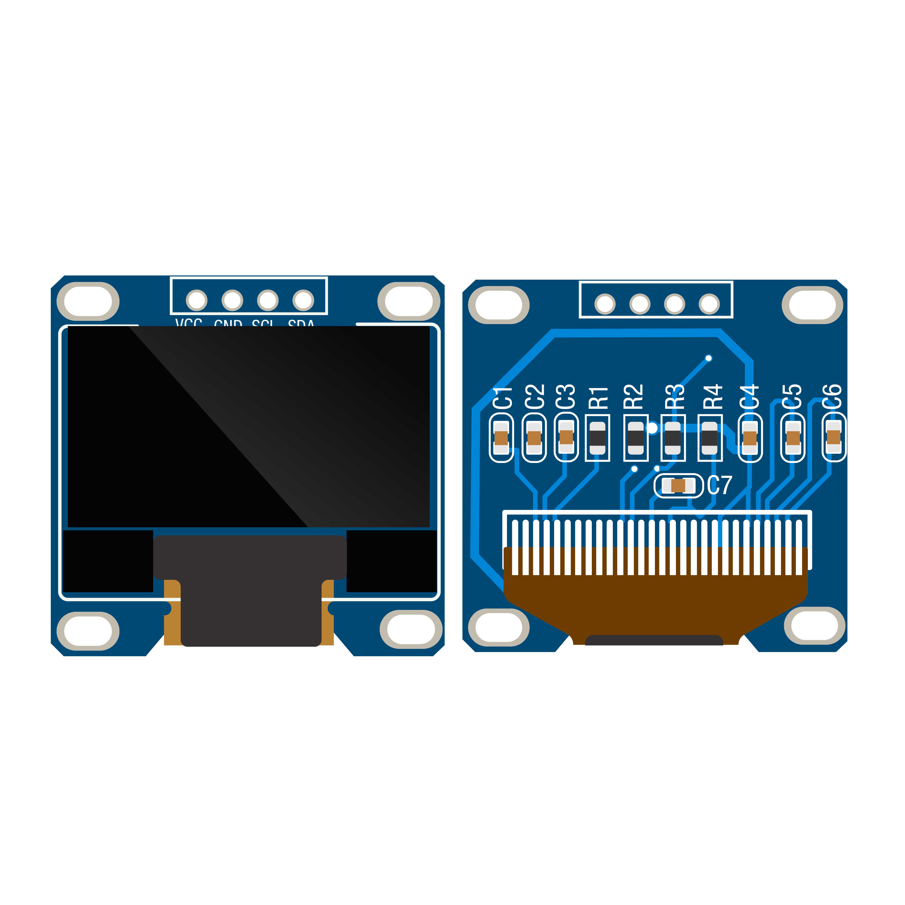
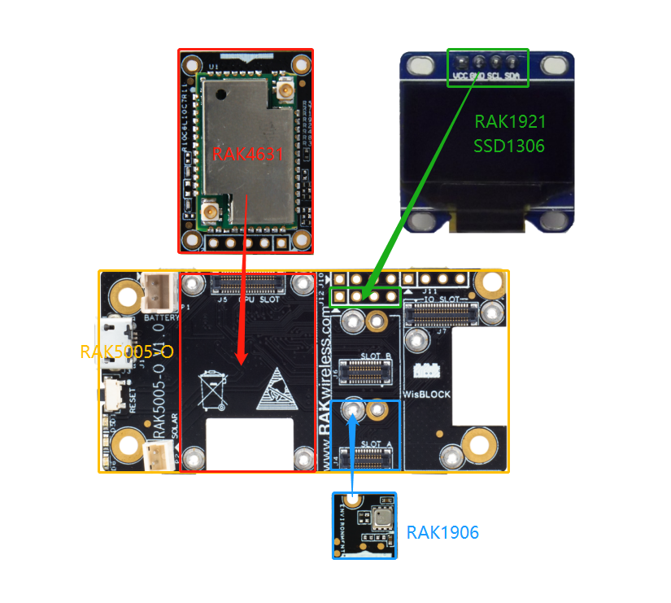
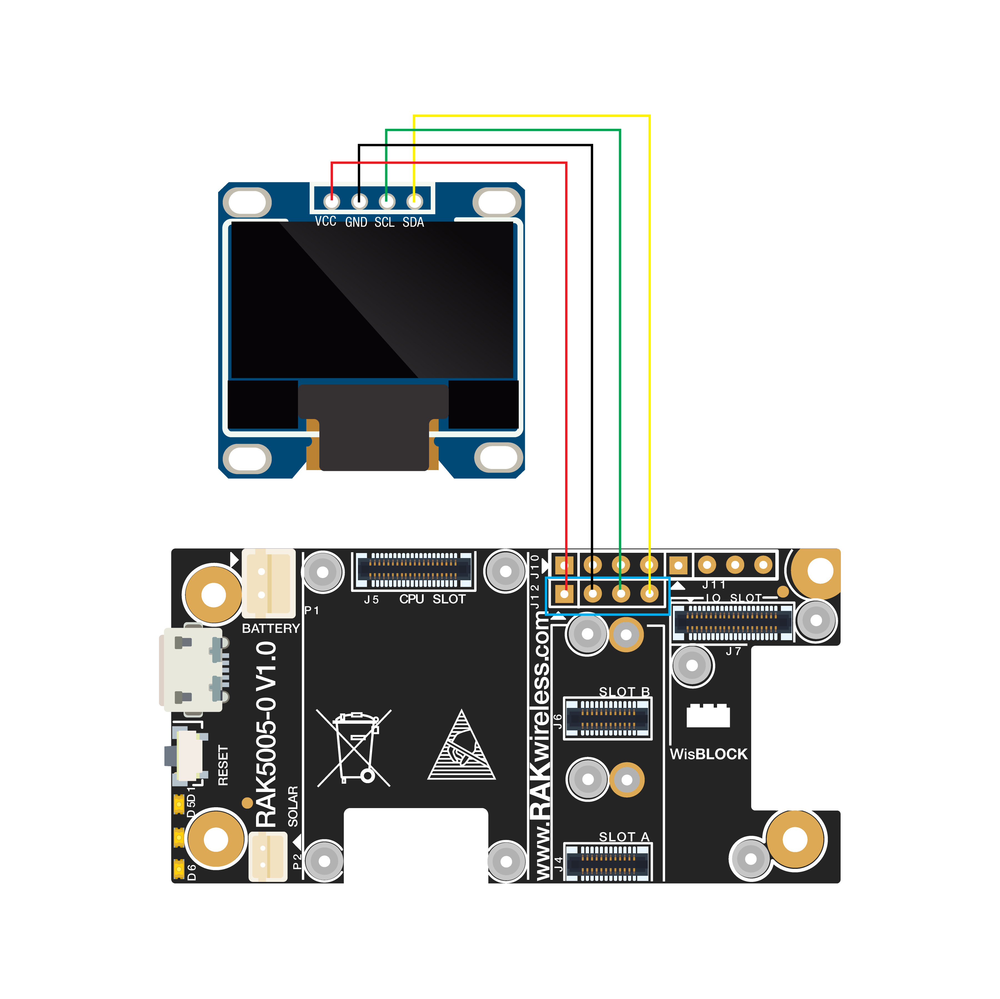
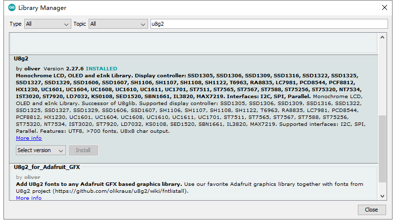
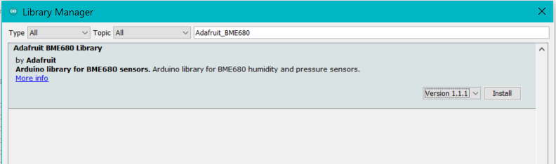

# WisBlock IO RAK1921 OLED Board Programming Guide

This example shows how to use WisBlock IO RAK1921 which is an OLED SSD1306(128*64, I2C) board.



----
## Hardware required
----
The following hardware are required.

- WisBlock Base RAK5005-O  \*  1pcs    
- WisBlock Core RAK4631      \*  1pcs    
- WisBlock Sensor RAK1906          \*  1pcs        (Optional)    
- WisBlock IO RAK1921          \*  1pcs    


Hardware is shown as follows:




Assembled as follows:



For stable connection, please use screws to tighten.

----
## Software required
----
To use the environment WisBlock Sensor RAK1906, The following software is required.

- [ArduinoIDE](https://www.arduino.cc/en/Main/Software)
- [RAK4630 BSP](https://github.com/RAKWireless/RAK-nRF52-Arduino)    
- U8g2 library




- Adafruit BME680 Library




Connect the assembled hardware to the PC with a USB cable, open the Arduino, and select the development board and port in the tool menu.


## Demo

### Demo 1

The Demo  is designed to display BME680 sensor data on SSD1306.

```
/*
   This sketch demonstrate how to use SSD1306 to display sensor data of BME680.
*/
/**
   @file RAK1920_QWIIC_AirQuality_SGP30.ino
   @author rakwireless.com
   @brief This sketch demonstrate how to use SSD1306 to display sensor data of BME680.
   @version 0.1
   @date 2020-07-28

   @copyright Copyright (c) 2020

   @note RAK5005-O GPIO mapping to RAK4631 GPIO ports
   RAK5005-O <->  nRF52840
   IO1       <->  P0.17 (Arduino GPIO number 17)
   IO2       <->  P1.02 (Arduino GPIO number 34)
   IO3       <->  P0.21 (Arduino GPIO number 21)
   IO4       <->  P0.04 (Arduino GPIO number 4)
   IO5       <->  P0.09 (Arduino GPIO number 9)
   IO6       <->  P0.10 (Arduino GPIO number 10)
   SW1       <->  P0.01 (Arduino GPIO number 1)
   A0        <->  P0.04/AIN2 (Arduino Analog A2
   A1        <->  P0.31/AIN7 (Arduino Analog A7
   SPI_CS    <->  P0.26 (Arduino GPIO number 26)
*/

#include <Wire.h>
#include <Adafruit_Sensor.h>
#include <Adafruit_BME680.h> // Click to install library: http://librarymanager/All#Adafruit_BME680
#include <U8g2lib.h>		   // Click to install library: http://librarymanager/All#u8g2

U8G2_SSD1306_128X64_NONAME_F_HW_I2C u8g2(U8G2_R0);
Adafruit_BME680 bme;

void bme680_init()
{
  Wire.begin();

  if (!bme.begin(0x76)) {
    Serial.println("Could not find a valid BME680 sensor, check wiring!");
    return;
  }

  // Set up oversampling and filter initialization
  bme.setTemperatureOversampling(BME680_OS_8X);
  bme.setHumidityOversampling(BME680_OS_2X);
  bme.setPressureOversampling(BME680_OS_4X);
  bme.setIIRFilterSize(BME680_FILTER_SIZE_3);
  bme.setGasHeater(320, 150); // 320*C for 150 ms
}

void bme680_get()
{
  char data[32] = {0};
  double temp = bme.temperature;
  double pres = bme.pressure / 100.0;
  double hum = bme.humidity;

  Serial.print("T=");
  Serial.print(temp);
  Serial.print("C, RH=");
  Serial.print(hum);
  Serial.print("%, P=");
  Serial.print(pres);
  Serial.print("hPa");

  float gas = bme.gas_resistance / 1000.0;

  Serial.printf(", G= %.3f kOhms\n", gas);

  // display bme680 sensor data on OLED
  u8g2.clearBuffer();					// clear the internal memory
  u8g2.setFont(u8g2_font_ncenB10_tr); // choose a suitable font

  memset(data, 0, sizeof(data));
  sprintf(data, "T=%.2fC", temp);
  u8g2.drawStr(3, 15, data);

  memset(data, 0, sizeof(data));
  snprintf(data, 64, "RH=%.2f%%", hum);
  u8g2.drawStr(3, 30, data);

  memset(data, 0, sizeof(data));
  sprintf(data, "P=%.2fhPa", pres);
  u8g2.drawStr(3, 45, data);

  memset(data, 0, sizeof(data));
  sprintf(data, "G=%.3f kOhms", gas);
  u8g2.drawStr(3, 60, data);

  u8g2.sendBuffer(); // transfer internal memory to the display
}

void setup()
{
  // Initialize the built in LED
  pinMode(LED_BUILTIN, OUTPUT);
  digitalWrite(LED_BUILTIN, LOW);

  // Initialize Serial for debug output
  Serial.begin(115200);

  time_t serial_timeout = millis();
  // On nRF52840 the USB serial is not available immediately
  while (!Serial)
  {
    if ((millis() - serial_timeout) < 5000)
    {
      delay(100);
      digitalWrite(LED_BUILTIN, !digitalRead(LED_BUILTIN));
    }
    else
    {
      break;
    }
  }

  bme680_init();
  u8g2.begin();
}

void loop()
{
  if (! bme.performReading()) {
    Serial.println("Failed to perform reading :(");
    return;
  }
  bme680_get();
  delay(5000);
}
```


The test results are as follows：


