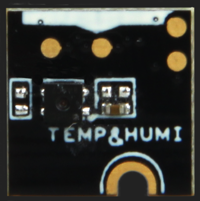
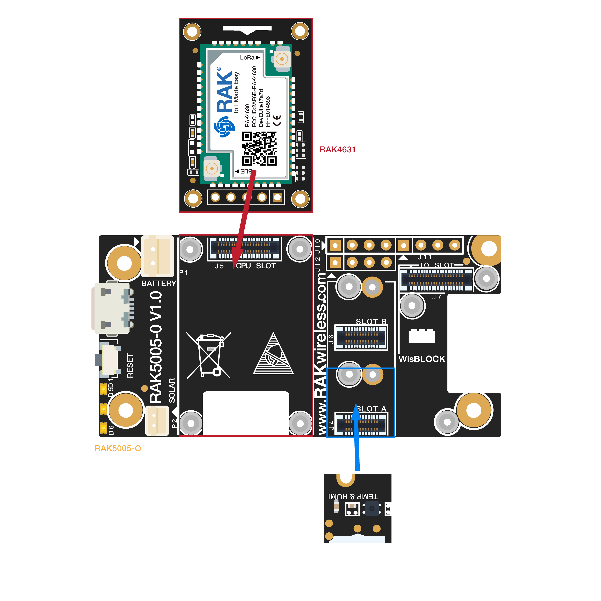

# WisBlock Sensor RAK1901 Temperature & Humidity Board Programming Guide

This example shows how to use WisBlock Sensor RAK1901 temperature & humidity board.



----
## Hardware required
----
To test the RAK1901, The following hardware is required.

- WisBlock Base RAK5005-O  *  1pcs
- WisBlock Core RAK4631  *  1pcs
- WisBlock Sensor RAK1901      *  1pcs

RAK1901 is a Temperature & Humidity sensor board with an I2C interface, which means it can be connected with RAK5005-O through the I2C slot (SLOT A/B/C/D). It contains SHTC3. The SHTC3 is a digital humidity and temperature sensor designed especially for battery-driven high-volume consumer electronics applications. This sensor is strictly designed to overcome conventional limits for size, power consumption, and performance to price ratio in order to fulfill current and future requirements. Sensirion’s CMOSens® technology offers a complete sensor system on a single chip, consisting of a capacitive humidity sensor, a bandgap temperature sensor, analog and digital signal processing, A/D converter, calibration data memory, and a digital communication interface supporting I2C Fast Mode Plus. The small 2 × 2 × 0.75 mm3 DFN package enables applications in even the most limited of spaces.

The sensor covers a humidity measurement range of 0 to 100 %RH and a temperature measurement range of - 40 °C to 125 °C with a typical accuracy of ±2 %RH and ±0.2°C. The broad supply voltage of 1.62 V to 3.6 V and an energy budget below 1 µJ per measurement make the SHTC3 suitable for mobile or wireless applications powered by batteries. With the industry-proven quality and reliability of Sensirion’s humidity and temperature sensors and constant accuracy over a large measurement range, the SHTC3 offers best performance-to-price ratio. Tape and reel packaging together with suitability for standard SMD assembly processes make the SHTC3 predestined for high-volume applications.



----
## Software required
----
To test the RAK1901, The following software is required.

- [ArduinoIDE](https://www.arduino.cc/en/Main/Software)
- [RAK4630 BSP](https://github.com/RAKWireless/RAK-nRF52-Arduino)    
- SparkFun SHTC3 Humidity and Temperature Sensor Library


The Arduino test software is written as follow:

```

#include "SparkFun_SHTC3.h" // Click here to get the library: http://librarymanager/All#SparkFun_SHTC3
SHTC3 mySHTC3;              // Declare an instance of the SHTC3 class


void setup() {
  // Setup usb 
  Serial.begin(115200);
  while(!Serial);

/* shtc3 init */
  Serial.println("shtc3 init");
  Serial.print("Beginning sensor. Result = ");           
  errorDecoder(mySHTC3.begin());                              
  Wire.setClock(400000);                                      
  Serial.println();

  if(mySHTC3.passIDcrc)                                       
  {                                                          
    Serial.print("ID Passed Checksum. ");
    Serial.print("Device ID: 0b"); 
    Serial.println(mySHTC3.ID, BIN);                       
  }
  else
  {
    Serial.println("ID Checksum Failed. ");
  }
}

void loop() {

  shtc3_get();
  delay(1000);
}

void shtc3_get(void)
{
  float Temperature,Humidity;
  mySHTC3.update();
  if(mySHTC3.lastStatus == SHTC3_Status_Nominal)              
  {
    /* Packing LoRa data */
    Temperature = mySHTC3.toDegC();
    Humidity = mySHTC3.toPercent();


    Serial.print("RH = "); 
    Serial.print(mySHTC3.toPercent());                   
    Serial.print("% (checksum: "); 
    if(mySHTC3.passRHcrc)                                     
    {
      Serial.print("pass");
    }
    else
    {
      Serial.print("fail");
    }
    Serial.print("), T = "); 
    Serial.print(mySHTC3.toDegC());                        
    Serial.print(" deg C (checksum: "); 
    if(mySHTC3.passTcrc)
    {
      Serial.print("pass");
    }
    else
    {
      Serial.print("fail");
    }
    Serial.println(")");
  }
  else
  {
    Serial.print("Update failed, error: "); 
    errorDecoder(mySHTC3.lastStatus);
    Serial.println();
  }
}

void errorDecoder(SHTC3_Status_TypeDef message)                            
{
  switch(message)
  {
    case SHTC3_Status_Nominal : Serial.print("Nominal"); break;
    case SHTC3_Status_Error : Serial.print("Error"); break;
    case SHTC3_Status_CRC_Fail : Serial.print("CRC Fail"); break;
    default : Serial.print("Unknown return code"); break;
  }
}
```


----
## Test Results
It will get temperature and humidity per 1s and print. The test results are as follows：

```
09:20:35.067 -> RH = 71.74% (checksum: pass), T = 27.15 deg C (checksum: pass)
09:20:36.071 -> RH = 71.77% (checksum: pass), T = 27.15 deg C (checksum: pass)
09:20:37.071 -> RH = 71.77% (checksum: pass), T = 27.16 deg C (checksum: pass)
09:20:38.106 -> RH = 71.78% (checksum: pass), T = 27.18 deg C (checksum: pass)
09:20:39.103 -> RH = 71.77% (checksum: pass), T = 27.15 deg C (checksum: pass)
09:20:40.106 -> RH = 71.82% (checksum: pass), T = 27.13 deg C (checksum: pass)
09:20:41.142 -> RH = 71.88% (checksum: pass), T = 27.15 deg C (checksum: pass)
09:20:42.149 -> RH = 71.91% (checksum: pass), T = 27.18 deg C (checksum: pass)
09:20:43.147 -> RH = 71.96% (checksum: pass), T = 27.16 deg C (checksum: pass)
09:20:44.179 -> RH = 71.93% (checksum: pass), T = 27.14 deg C (checksum: pass)
09:20:45.175 -> RH = 71.94% (checksum: pass), T = 27.15 deg C (checksum: pass)
09:20:46.205 -> RH = 71.90% (checksum: pass), T = 27.15 deg C (checksum: pass)
09:20:47.201 -> RH = 71.86% (checksum: pass), T = 27.15 deg C (checksum: pass)
09:20:48.236 -> RH = 71.85% (checksum: pass), T = 27.14 deg C (checksum: pass)
09:20:49.234 -> RH = 71.91% (checksum: pass), T = 27.18 deg C (checksum: pass)
09:20:50.234 -> RH = 71.88% (checksum: pass), T = 27.15 deg C (checksum: pass)
09:20:51.268 -> RH = 71.87% (checksum: pass), T = 27.16 deg C (checksum: pass)
09:20:52.270 -> RH = 71.85% (checksum: pass), T = 27.18 deg C (checksum: pass)
09:20:53.305 -> RH = 71.80% (checksum: pass), T = 27.17 deg C (checksum: pass)
09:20:54.306 -> RH = 71.74% (checksum: pass), T = 27.17 deg C (checksum: pass)
09:20:55.305 -> RH = 71.72% (checksum: pass), T = 27.14 deg C (checksum: pass)
09:20:56.329 -> RH = 71.69% (checksum: pass), T = 27.15 deg C (checksum: pass)


```

