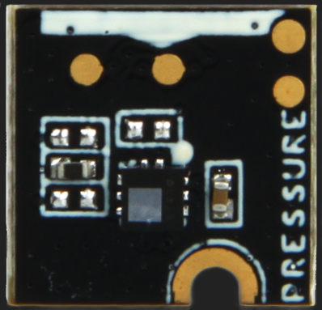
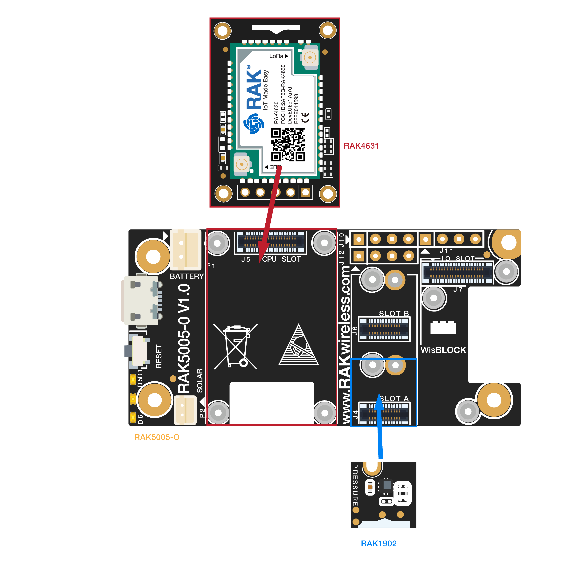
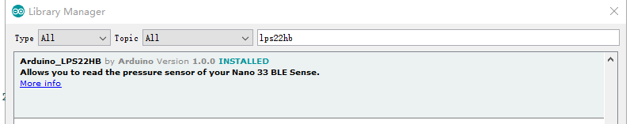

# WisBlock Sensor RAK1902 Pressure Board Programming Guide

This example shows how to use WisBlock Sensor RAK1902 pressure board and program with it.



----
## Hardware required
----
To test the RAK1902, The following hardware is required.

- WisBlock Base RAK5005-O  *  1pcs
- WisBlock Core RAK4631  *  1pcs
- WisBlock Sensor RAK1902      *  1pcs

RAK1902 is a pressure sensor board with an I2C interface, which means it can be connected with RAK5005-O through the I2C slot (SLOT A/B/C/D). It contains LPS22HB. The LPS22HB is an ultra-compact piezoresistive absolute pressure sensor which functions as a digital output barometer. The device comprises a sensing element and an IC interface which communicates through I2C or SPI from the sensing element to the application. The sensing element, which detects absolute pressure, consists of a suspended membrane manufactured using a dedicated process developed by ST. The LPS22HB is available in a full-mold, holed LGA package (HLGA). It is guaranteed to operate over a temperature range extending from -40 °C to +85 °C. The package is holed to allow external pressure to reach the sensing element.



----
## Software required
----
To test the RAK1902, The following software is required.

- [ArduinoIDE](https://www.arduino.cc/en/Main/Software)
- [RAK4630 BSP](https://github.com/RAKWireless/RAK-nRF52-Arduino)    
- Arduino_LPS22HB Library



The Arduino test software is written as follow:

```
#include <Arduino_LPS22HB.h>  // Click here to get the library: http://librarymanager/All#Arduino_LPS22HB


void setup() {
  // Setup usb 
  Serial.begin(115200);
  while(!Serial);

    /* LPS22HB init */
    if (!BARO.begin()) {
      Serial.println("Failed to initialize pressure sensor!");
      while (1);
    }
}

void loop() {

  lps22hb_get();
  delay(1000);
}

void lps22hb_get(){
  // read the sensor value
  float pressure = BARO.readPressure();

  // print the sensor value
  Serial.print("Pressure = ");
  Serial.print(pressure);
  Serial.println(" kPa");
}
```


----
## Test Results
It will get air pressure per 1s and print. The test results are as follows：

```
10:21:40.493 -> Pressure = 75.97 kPa
10:21:40.493 -> Pressure = 95.42 kPa
10:21:41.480 -> Pressure = 95.42 kPa
10:21:42.484 -> Pressure = 95.42 kPa
10:21:43.489 -> Pressure = 95.42 kPa
10:21:44.494 -> Pressure = 95.43 kPa
10:21:45.500 -> Pressure = 95.42 kPa
10:21:46.501 -> Pressure = 95.42 kPa
10:21:47.510 -> Pressure = 95.42 kPa
10:21:48.519 -> Pressure = 95.42 kPa
10:21:49.525 -> Pressure = 95.42 kPa
10:21:50.534 -> Pressure = 95.42 kPa
10:21:51.542 -> Pressure = 95.42 kPa
10:21:52.515 -> Pressure = 95.42 kPa
10:21:53.525 -> Pressure = 95.42 kPa
10:21:54.531 -> Pressure = 95.42 kPa
10:21:55.537 -> Pressure = 95.42 kPa
10:21:56.546 -> Pressure = 95.42 kPa
10:21:57.551 -> Pressure = 95.41 kPa
10:21:58.560 -> Pressure = 95.42 kPa
10:21:59.568 -> Pressure = 95.42 kPa
10:22:00.568 -> Pressure = 95.42 kPa
10:22:01.569 -> Pressure = 95.42 kPa
10:22:02.574 -> Pressure = 95.42 kPa
10:22:03.581 -> Pressure = 95.42 kPa


```

