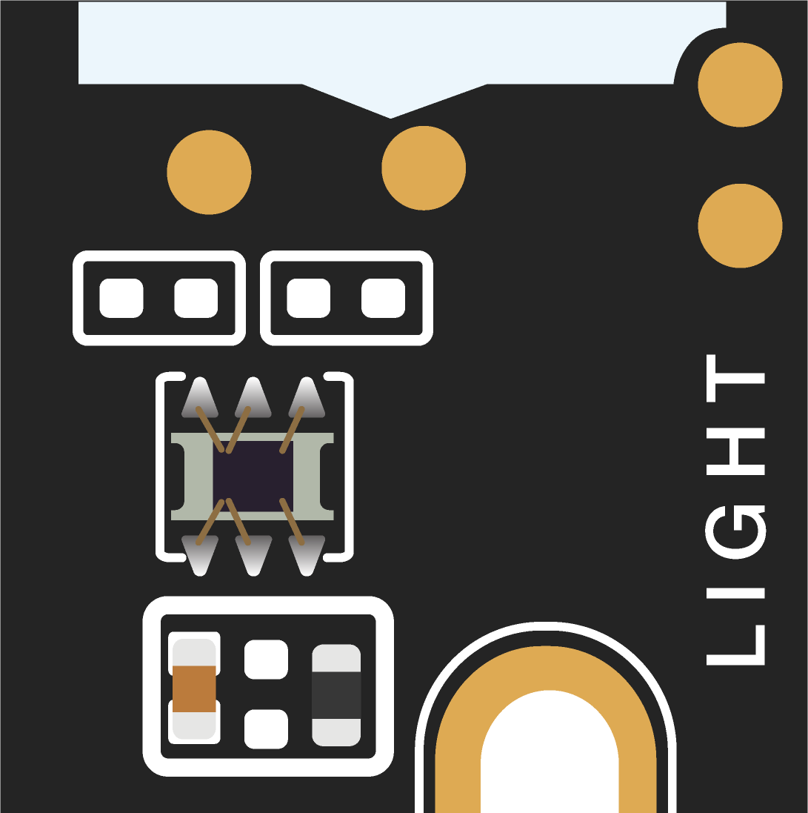
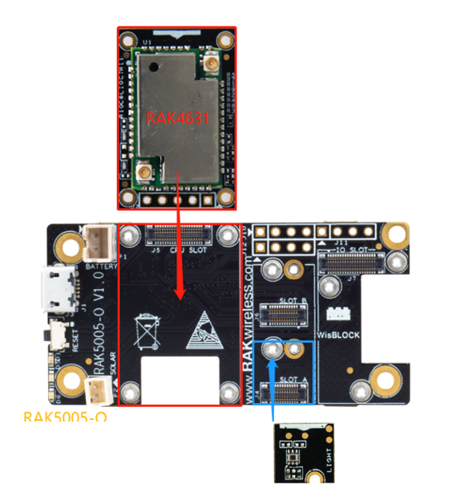
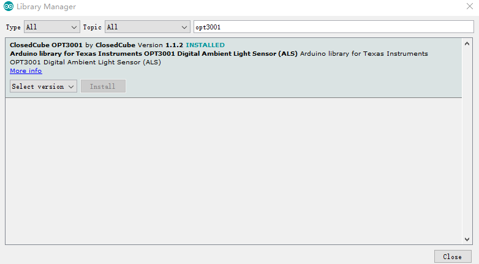

# WisBlock Sensor RAK1903 Optical Board Programming Guide

This example shows how to use WisBlock Sensor RAK1903 optical board.



----
## Hardware required
----
To test the RAK1903, The following hardware is required.

- WisBlock Base RAK5005-O  *  1pcs
- WisBlock Core RAK4631  *  1pcs
- WisBlock Sensor RAK1903      *  1pcs

RAK1903 is a ambient optical sensor board with an I2C interface, which means it can be connected with RAK5005-O through the I2C slot (SLOT A/B/C/D). It contains OPT3001. The OPT3001 is a sensor that measures the intensity of visible optical. The spectral response of the sensor tightly matches the photopic response of the human eye and includes significant infrared rejection. The OPT3001 is a single-chip lux meter, measuring the intensity of optical as visible by the human eye. The precision spectral response and strong IR rejection of the device enables the OPT3001 to accurately meter the intensity of optical as seen by the human eye regardless of optical source. The strong IR rejection also aids in maintaining high accuracy when industrial design calls for mounting the sensor under dark glass for aesthetics. The OPT3001 is designed for systems that create optical-based experiences for humans, and an ideal preferred replacement for photodiodes, photoresistors, or other ambient optical sensors with less human eye matching and IR rejection.

Measurements can be made from 0.01 lux up to 83k lux without manually selecting full-scale ranges 2 Applications by using the built-in, full-scale setting feature. This capability allows optical measurement over a 23-bit effective dynamic range. The digital operation is flexible for system integration. Measurements can be either continuous or single shot. The control and interrupt system features autonomous operation, allowing the processor to sleep while the sensor searches for appropriate wake-up events to report via the interrupt pin. The digital output is reported over an I2C and SMBus compatible, two-wire serial interface.




----
## Software required
----
To test the RAK1903, The following software is required.

- [ArduinoIDE](https://www.arduino.cc/en/Main/Software)
- [RAK4630 BSP](https://github.com/RAKWireless/RAK-nRF52-Arduino)    
- ClosedCube OPT3001 Library



The Arduino test software is written as follow:

```
#include <Wire.h>
#include <ClosedCube_OPT3001.h> // Click here to get the library: http://librarymanager/All#OPT3001
ClosedCube_OPT3001 opt3001;
#define OPT3001_ADDRESS 0x44


void setup() {
  // Setup usb 
  Serial.begin(115200);
  while(!Serial);

  /* opt3001 init */
  opt3001.begin(OPT3001_ADDRESS);
  Serial.print("OPT3001 Manufacturer ID");
  Serial.println(opt3001.readManufacturerID());
  Serial.print("OPT3001 Device ID");
  Serial.println(opt3001.readDeviceID());

  configureSensor();
  printResult("High-Limit", opt3001.readHighLimit());
  printResult("Low-Limit", opt3001.readLowLimit());
}

void loop() {

  opt3001_get();
  delay(1000);
}

void configureSensor() {
  OPT3001_Config newConfig;
  
  newConfig.RangeNumber = B1100;  
  newConfig.ConvertionTime = B0;
  newConfig.Latch = B1;
  newConfig.ModeOfConversionOperation = B11;

  OPT3001_ErrorCode errorConfig = opt3001.writeConfig(newConfig);
  if (errorConfig != NO_ERROR)
    printError("OPT3001 configuration", errorConfig);
  else {
    OPT3001_Config sensorConfig = opt3001.readConfig();
    Serial.println("OPT3001 Current Config:");
    Serial.println("------------------------------");
    
    Serial.print("Conversion ready (R):");
    Serial.println(sensorConfig.ConversionReady,HEX);

    Serial.print("Conversion time (R/W):");
    Serial.println(sensorConfig.ConvertionTime, HEX);

    Serial.print("Fault count field (R/W):");
    Serial.println(sensorConfig.FaultCount, HEX);

    Serial.print("Flag high field (R-only):");
    Serial.println(sensorConfig.FlagHigh, HEX);

    Serial.print("Flag low field (R-only):");
    Serial.println(sensorConfig.FlagLow, HEX);

    Serial.print("Latch field (R/W):");
    Serial.println(sensorConfig.Latch, HEX);

    Serial.print("Mask exponent field (R/W):");
    Serial.println(sensorConfig.MaskExponent, HEX);

    Serial.print("Mode of conversion operation (R/W):");
    Serial.println(sensorConfig.ModeOfConversionOperation, HEX);

    Serial.print("Polarity field (R/W):");
    Serial.println(sensorConfig.Polarity, HEX);

    Serial.print("Overflow flag (R-only):");
    Serial.println(sensorConfig.OverflowFlag, HEX);

    Serial.print("Range number (R/W):");
    Serial.println(sensorConfig.RangeNumber, HEX);

    Serial.println("------------------------------");
  }
  
}

void opt3001_get()
{
  OPT3001 result = opt3001.readResult();
  if (result.error == NO_ERROR) {
    Serial.print("OPT3001");
    Serial.print(": ");
    Serial.print(result.lux);
    Serial.println(" lux");

    uint16_t luminosity = result.lux;
  }
  else {
    printError("OPT3001",result.error);
  }
}

void printResult(String text, OPT3001 result) {
  if (result.error == NO_ERROR) {
    Serial.print(text);
    Serial.print(": ");
    Serial.print(result.lux);
    Serial.println(" lux");
  }
  else {
    printError(text,result.error);
  }
}
void printError(String text, OPT3001_ErrorCode error) {
  Serial.print(text);
  Serial.print(": [ERROR] Code #");
  Serial.println(error);
}
```


----
## Test Results
It will get illumination intensity per 1s and print. The test results are as follows：

```
10:46:16.379 -> OPT3001 Manufacturer ID21577
10:46:16.379 -> OPT3001 Device ID12289
10:46:16.379 -> OPT3001 Current Config:
10:46:16.379 -> ------------------------------
10:46:16.379 -> Conversion ready (R):0
10:46:16.379 -> Conversion time (R/W):0
10:46:16.379 -> Fault count field (R/W):0
10:46:16.379 -> Flag high field (R-only):0
10:46:16.379 -> Flag low field (R-only):0
10:46:16.379 -> Latch field (R/W):1
10:46:16.379 -> Mask exponent field (R/W):0
10:46:16.379 -> Mode of conversion operation (R/W):3
10:46:16.379 -> Polarity field (R/W):0
10:46:16.379 -> Overflow flag (R-only):0
10:46:16.379 -> Range number (R/W):C
10:46:16.379 -> ------------------------------
10:46:16.379 -> High-Limit: 83865.60 lux
10:46:16.379 -> Low-Limit: 0.00 lux
10:46:16.379 -> OPT3001: 0.00 lux
10:46:17.343 -> OPT3001: 579.68 lux
10:46:18.342 -> OPT3001: 579.36 lux
10:46:19.334 -> OPT3001: 580.64 lux
10:46:20.365 -> OPT3001: 580.64 lux
10:46:21.366 -> OPT3001: 580.96 lux
10:46:22.363 -> OPT3001: 580.96 lux
10:46:23.360 -> OPT3001: 580.96 lux
10:46:24.363 -> OPT3001: 580.64 lux
10:46:25.363 -> OPT3001: 580.32 lux
10:46:26.363 -> OPT3001: 580.64 lux
10:46:27.362 -> OPT3001: 580.96 lux
10:46:28.370 -> OPT3001: 580.96 lux
10:46:29.376 -> OPT3001: 580.32 lux
10:46:30.374 -> OPT3001: 580.64 lux
10:46:31.366 -> OPT3001: 581.60 lux
10:46:32.370 -> OPT3001: 580.96 lux
10:46:33.376 -> OPT3001: 580.96 lux
10:46:34.377 -> OPT3001: 580.96 lux
10:46:35.378 -> OPT3001: 581.28 lux
10:46:36.379 -> OPT3001: 573.60 lux


```

