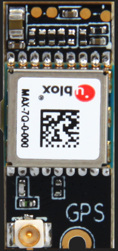

# WisBlock Sensor RAK1910 GPS board Programming Guide #

[TOC]

## 1. Introduction ##
This guide introduces the WisBlock Sensor RAK1910 GPS board and how to program with it.

The information obtained from the GPS will then be printed over the USB debug port of the WisBlock Base board.

## 2. Hardware ##
WisBlock can integrate this GPS receiver which allows to know the exact outside location of the mote anytime. In this way the exact position of the mote can be obtained and even the current time and date, to synchronize the WisBlock Core internal clock (RTC) with the real time. 

- [WisBlock Sensor RAK1910](https://store.rakwireless.com/)
 


**Model**

- MAX-7Q-0-000 (u-blox)

**GPS performance**

- Sensitivity:

  ​	Acquisition: -160 dBm

  ​	Navigation&Tracking: -161 dBm

- Hot start time: <1 s

- Cold start time: <29 s

- Positional accuracy error: < 2.5 m

- Speed accuracy: < 0.1 m/s

- WAAS, EGNOS and MSAS capability

**GLONASS performance**

- Sensitivity:

  ​	Acquisition: -156 dBm

  ​	Navigation&Tracking: -158 dBm

- Hot start time: <1 s

- Cold start time: <30 s

- Positional accuracy error: < 4 m

- Speed accuracy: < 0.1 m/s

- GLONASS L1 FDMA capability

**Available information** 

​		latitude, longitude, altitude, speed, direction and date&time

Due to the GPS signal is weak inside buildings, It is recommended to use the GPS module outdoors, with a direct line of sight to the sky. This will ensure the necessary signal quality to obtain valid GPS data.
The GPS module gives us information about:

- latitude
- longitude
- altitude
- speed
- direction
- date/time

This GPS module uses the UART_2 on **SLOT A** in [WisBlock Base RAK5005-O][#3.1 Hardware required] to communicate with the microcontroller.

The GPS starts up by default at 4800 bps. This speed can be increased using the library functions that have been designed for controlling and managing the module.

The GPS receiver has 2 operational modes: NMEA (National Marine Electronic Association) mode and binary mode. NMEA mode uses statements from this standard to obtain location, time and date. The binary mode is based on the sending of structured frames to establish communication between the microcontroller and the GPS receiver, i.e. to read/set ephemeris.

The different types of NMEA statements that the Waspmote’s built in GPS receiver supports are:

- NMEA GGA: provides location data and an indicator of data accuracy
- NMEA GSA: provides the status of the satellites the GPS receiver has been connected to
- NMEA GSV: provides information about the satellites the GPS receiver has been connected to
- NMEA RMC: provides information about the date, time, location and speed
- NMEA VTG: provides information about the speed and course of the GPS receiver
- NEMA GLL: provides information about the location of the GPS receiver

The most important NMEA statements are the GGA statements which provide a validity indicator of the measurement carried out, the RMC statement which provides location, speed and date/time and the GSA statement which provides information about the status of the satellites the GPS receiver has been connected to.

To obtain more information about the NMEA standard and the NMEA statements, visit the website:
http://www.gpsinformation.org/dale/nmea.htm

## 3. How to program

The principal purpose of this section is how to get location, time, date and movement information of the device in which this module is on.

### 3.1 Hardware required

To build this system the WisBlock Core RAK4631 microcontroller is using the RAK1910 GPS module. With just two WisBlock boards plugged into the WisBlock Base RAK5005-O board the system is ready to be used.

- [WisBlock Base RAK5005-O](https://store.rakwireless.com/)    

  

- WisBlock Core RAK4631    
    
    


### 3.2 Software required

- [ArduinoIDE](https://www.arduino.cc/en/Main/Software)
- [RAK4630 BSP](/BSP/)

### 3.1 How to initialize GPS module

```c
  //gps init 
  pinMode(17, OUTPUT);
  digitalWrite(17, HIGH);

  pinMode(34,OUTPUT); 
  digitalWrite(34,0);
  delay(1000);
  digitalWrite(34,1);
  delay(1000);

  Serial1.begin(9600);
  while(!Serial1);
  Serial.println("gps uart init ok!");`
```


### 3.2 How to receive NMEA statements from GPS module

```c
void rec_nmea(const char *nmea_name, char *_dataBuffer)
{
    char dummyBuffer[7] ="";
    uint8_t i = 0;
    bool valid = 0;
    bool end = 0;

    //_dataBuffer = (char *)malloc(GPS_BUFFER_SIZE);
    if(_dataBuffer == NULL)
    {
    	Serial.println("_dataBuffer failed");
    }

  	unsigned long previous = millis();
    while( (!valid) && (millis()-previous)<2000)
    {
    	if(Serial1.available() > 0)
    	{
    		dummyBuffer[0] = Serial1.read();
    		if (dummyBuffer[0] == '$')
    		{
    			//read five bytes
    			while((Serial1.available()<5) && (millis()-previous)<2000);
    			for (i=1; i<6;i++)
    			{
    				dummyBuffer[i] = Serial1.read();
    			}
    			dummyBuffer[6] = '\0';

				//strcmp returns '0' if both equal
				if(!strcmp(dummyBuffer, nmea_name) )
				{
					valid = 1;
				}
			}
		}
        //avoid millis overflow problem
        if( millis() < previous ) previous = millis();
	}

	if (valid)
	{
		previous = millis();
		i=0;
		while((!end) && (i < 82) &&  (millis()-previous)<2000)
		{
			// read the GPS sentence
			if(Serial1.available() > 0)
			{
				_dataBuffer[i] = Serial1.read();
				if (_dataBuffer[i] == '*' || _dataBuffer[i] == '$')
				{
					// end of NMEA or new one.
					end = 1;
					_dataBuffer[i+1] = '\0';
				}
				i++;
			}
			//avoid millis overflow problem
			if( millis() < previous ) previous = millis();
		}
	}
	PRINT_GPS(F("inbuffer: "));
	Serial.println(_dataBuffer);
}
```


### 3.2 How to determine the GPS module is connected to the satellite

```c
char state[2];
bool check()
{
    char *argument;
    char *_dataBuffer;
    char _dataBuffer2[GPS_BUFFER_SIZE];

	_dataBuffer = (char *)malloc(GPS_BUFFER_SIZE);
	rec_nmea("$GPRMC", _dataBuffer);	//***********Get NMEA RMC statements************

	memset(_dataBuffer2, 0x00, sizeof(_dataBuffer2));
	strncpy(_dataBuffer2, _dataBuffer, strlen(_dataBuffer));
	_dataBuffer2[strlen(_dataBuffer)]='\0';

	free(_dataBuffer);

	//first of all, look if connected
	argument = strtok (_dataBuffer2, ",");
	//strcmp returns '0' if both equal
	if(!strcmp(argument, "V") )
	{
        strncpy(state, argument, strlen(argument));
        state[strlen(argument)]='\0';
	}
	else
	{
        // status
        argument = strtok(NULL,",");
        strncpy(state, argument, strlen(argument));
        state[strlen(argument)]='\0';
	}

    if (state[0] == 'A')
    {
    	return 1;
    }
    else
    {
    	if (state[0] == 'V')
    	{
    		return 0;
    	}
    	// If state is not V and it is not connected, must be an error parsing
    	return -1;
    }
}

/* check() - get if receiver is connected to some satellite
 *
 * It gets if receiver is connected to some satellite
 *
 * It returns '1' if connected, '0' if not
 */
bool signalStatus = 0;
bool check_status()
{
	unsigned long previous = millis();
	// Wait here till timeout or status=connected
	while((!signalStatus) && (millis()-previous)<5000)
	{
        // Updates global status
        signalStatus = check();
		//avoid millis overflow problem
		if( millis() < previous ) previous = millis();
  	}

    if (signalStatus == 1)
    	return 1;
    else
    	return 0;
}
```


### 3.3 How to get time

```c
/*
 * getTime (void) - answers the current time on the GPS
 *
 * gets the time from the GPS and returns it in the format
 * "175600.0000" - hhmmss.mmmm
 *
 * return time if ok, 0 if timeout or no gps signal.
 */
char time_gps[11];
char* get_time(void)
{
    char *argument;
    char *_dataBuffer;
	unsigned long previous = millis();
	uint16_t flag = 0;

	// check if GPS signal
  	if (signal_status == 1)
  	{
    	_dataBuffer = (char *)malloc(GPS_BUFFER_SIZE);

		//update time variable
		while((flag != 1) && (millis()-previous)<5000)
		{
  			rec_nmea("$GPGGA", _dataBuffer);
  			_dataBuffer[strlen(_dataBuffer)]='\0';

  			//first of all, look if connected
  			argument = strtok (_dataBuffer,",");
  			//strcmp returns '0' if both equal
  			if(!strcmp(argument,"0") )
  			{
                strncpy(state, argument, strlen(argument));
                state[strlen(argument)] = '\0';
            }
  			else
  			{
    			// time is set before getting possition
    			strncpy(time_gps, argument, strlen(argument));
    			time_gps[strlen(argument)] = '\0';

                flag = 1;
            }
  			//avoid millis overflow problem
  			if( millis() < previous ) previous = millis();
  		}
  		free(_dataBuffer);

  		//if timeout, date not updated.
        if (flag != 1)
        {
        	return 0;
        }
        	else
        {
        	return time_gps;
        }

	}
	else
	{
		// No gps signal
		return 0;
	}
}
```

### 3.4 How to get date

```c
/*
 * getDate (void) - answers the current date on the GPS
 *
 * gets the date from the GPS and returns it in the format "180509" - ddmmyy
 *
 * return date if ok, 0 if timeout or no gps signal.
 */
char date_gps[7];
char* get_date(void)
{
    char *argument;
    char *_dataBuffer;
    unsigned long previous = millis();
    uint16_t flag = 0;

    // check if GPS signal
    if (signal_status == 1)
    {
        _dataBuffer = (char *)malloc(GPS_BUFFER_SIZE);
        //update date variable
        while((flag != 1) && (millis()-previous)<5000)
        {
            rec_nmea("$GPRMC", _dataBuffer);
            _dataBuffer[strlen(_dataBuffer)]='\0';

            //first of all, look if connected
            argument = strtok (_dataBuffer, ",");
            //strcmp returns '0' if both equal
            if(!strcmp(argument, "V") )
            {
                strncpy(state,argument,strlen(argument));
                state[strlen(argument)]='\0';
            }
            else
            {
                // status
                argument = strtok(NULL,",");
            }

            if (state[0] == 'A')
            {
                // latitude
                argument = strtok(NULL,",");
                // North/South
                argument = strtok(NULL,",");
                // Longitude
                argument = strtok(NULL,",");
                // East / West
                argument = strtok(NULL,",");
                // Speed
                argument = strtok(NULL,",");
                // date
                argument = strtok(NULL,",");
                strncpy(date_gps, argument, strlen(argument));
                date_gps[strlen(argument)] = '\0';
            }
            //avoid millis overflow problem
            if( millis() < previous ) previous = millis();
		}

        //if timeout, date not updated.
        if (flag != 1)
        	return 0;
        else
        	return date_gps;
	}
	else
	{
		return 0;
	}
}
```


### 3.5 How to get Latitude

```c
/*
 * getLatitude (void) - gets the latitude from the GPS
 *
 * forces getLocation and responds the current value of the latitude
 * variable as a string
 *
 * return latitude if ok, 0 if timeout or no gps signal.
 */
char latitude[11];
char* get_latitude(void)
{
	char *argument;
    char *_dataBuffer;
    unsigned long previous = millis();
    uint16_t flag = 0;

	// check if GPS signal
  	if (signal_status == 1)
  	{
        _dataBuffer = (char *)malloc(GPS_BUFFER_SIZE);
        //update latitude variable
        while((flag != 1) && (millis()-previous)<5000)
        {
            rec_nmea("$GPGGA", _dataBuffer);
            _dataBuffer[strlen(_dataBuffer)]='\0';

            //first of all, look if connected
            argument = strtok (_dataBuffer,",");
            //strcmp returns '0' if both equal
            if(!strcmp(argument,"0") )
            {
                strncpy(state, argument, strlen(argument));
                state[strlen(argument)] = '\0';
            }
            else
            {
                // status or LAT?
                argument = strtok(NULL, ",");
                if(strcmp(argument, "0") )
                {
                    //connected. keep extracting tokens.
                    // latitude
                    strncpy(latitude, argument, strlen(argument));
                    latitude[strlen(argument)] = '\0';

                    flag = 1;
                }
			}
			//avoid millis overflow problem
			if( millis() < previous ) previous = millis();
		}
    	free(_dataBuffer);
    	//if timeout, date not updated.
        if (flag != 1)
          return 0;
        else
          return latitude;
	}
	else
	{
        // No gps signal
        return 0;
	}
}
```


### 3.6 How to get Longitude

```c
/*
 * getLongitude (void) - gets the longitude the GPS
 *
 * forces getLocation and responds the current value of the longitude
 * variable as a string
 *
 * return longitude if ok, 0 if timeout or no gps signal.
 */
 char longitude[11];
 char* get_longitude(void)
 {
    char *argument;
    char *_dataBuffer;
    unsigned long previous = millis();
    uint16_t flag = 0;

    // check if GPS signal
    if (signal_status == 1)
    {
        _dataBuffer = (char *)malloc(GPS_BUFFER_SIZE);
        //update latitude variable
        while((flag != 1) && (millis()-previous)<5000)
        {
            rec_nmea("$GPGGA", _dataBuffer);
            _dataBuffer[strlen(_dataBuffer)]='\0';
      
			//first of all, look if connected
			argument = strtok (_dataBuffer,",");
			if(strcmp(argument,"0") )
			{
                // status or LAT?
                argument = strtok(NULL, ",");
                if(strcmp(argument,"0") )
    			{
                    //connected. keep extracting tokens.
                    // latitude
                    // North/South
                    argument = strtok(NULL, ",");
                    // Longitude
                    argument = strtok(NULL, ",");
                    strncpy(longitude, argument, strlen(argument));
                    longitude[strlen(argument)] = '\0';

                    flag = 1;
				}
			}
  			//avoid millis overflow problem
  			if( millis() < previous ) previous = millis();
		}
		free(_dataBuffer);
		//if timeout, date not updated.
		if (flag != 1)
		{
  			return 0;
		}
		else
		{
  			return longitude;
		}
	}
	else
	{
    	// No gps signal
    	return 0;
  	}
}
```

### 3.7 How to get Altitude

```c
/*
 * getAltitude (void) - gets the altitude from the GPS
 *
 * forces getLocation and responds the current value of the altitude
 * variable (in meters) as a string
 *
 * return altitude if ok, 0 if timeout or no gps signal.
 */
 char altitude[20];
 char* get_altitude(void)
 {
	char *argument;
    char *_dataBuffer;
    unsigned long previous = millis();
    uint16_t flag = 0;

  	// check if GPS signal
    if (signal_status == 1)
    {
		_dataBuffer = (char *)malloc(GPS_BUFFER_SIZE);
        //update latitude variable
        while((flag != 1) && (millis()-previous)<5000)
        {
			rec_nmea("$GPGGA", _dataBuffer);
			_dataBuffer[strlen(_dataBuffer)]='\0';
      
			//first of all, look if connected
            argument = strtok (_dataBuffer,",");
            //strcmp returns '0' if both equal
            if(!strcmp(argument,"0") )
  			{
                strncpy(state, argument, strlen(argument));
                state[strlen(argument)] = '\0';
			}
			else
			{
            	// status or LAT?
            	argument = strtok(NULL, ",");
                if(!strcmp(argument, "0") )
                {
                    strncpy(state, argument, strlen(argument));
                    state[strlen(argument)] = '\0';

                    PRINT_GPS(F("state: "));
                    Serial.println(state);
                }
                else
                {
                    //connected. keep extracting tokens.
                    // latitude
                    // North/South
                    argument = strtok(NULL, ",");
                    // Longitude
                    argument = strtok(NULL, ",");
                    // East / West
                    argument = strtok(NULL, ",");
                    //position FIX
                    argument = strtok(NULL, ",");
                    // satellites used
                    argument = strtok(NULL, ",");
                    // Precision
                    argument = strtok(NULL, ",");
                    // Altitude
                    argument = strtok(NULL, ",");
                    strncpy(altitude, argument, strlen(argument));
                    altitude[strlen(argument)] = '\0';

                    flag = 1;
                }
  			}
  			//avoid millis overflow problem
  			if( millis() < previous ) previous = millis();
		}
    	free(_dataBuffer);
        //if timeout, date not updated.
        if (flag != 1)
        {
          return 0;
        }
        else
        {
          return altitude;
        }
	}
	else
    {
        // No gps signal
        return 0;
    }
}
```

### 3.8 How to get Speed

```c
/*
 * getSpeed (void) - gets the speed from the GPS
 *
 * Stores the final value in the variable speed as string.
 *
 * Returns the speed in Km/h if ok, 0 if timeout or no gps signal.
 */
 char speed[20];
 char* get_speed(void)
 {
	char *argument;
    char *_dataBuffer;
    unsigned long previous = millis();
    uint16_t flag = 0;

    // check if GPS signal
    if (signal_status == 1)
    {
        _dataBuffer = (char *)malloc(GPS_BUFFER_SIZE);
        //update date variable
        while((flag != 1) && (millis()-previous)<5000)
        {
            rec_nmea("$GPRMC", _dataBuffer);
            _dataBuffer[strlen(_dataBuffer)]='\0';

            // separate all the subarrays from 'dataBuffer' to 'argument' pointer
            // Example: $GPRMC,083224.00,A,3412.49303,N,10853.17755,E,0.269,,010720,,,A*71
            //first of all, look if connected
            argument = strtok (_dataBuffer, ",");
            //strcmp returns '0' if both equal
            if(!strcmp(argument, "V") )
            {
                strncpy(state,argument,strlen(argument));
                state[strlen(argument)]='\0';
            }
            else
            {
                // status
                argument = strtok(NULL,",");
            }
            if (state[0] == 'A')
            {
                // latitude
                argument = strtok(NULL,",");
                // North/South
                argument = strtok(NULL,",");
                // Longitude
                argument = strtok(NULL,",");
                // East / West
                argument = strtok(NULL,",");
                // Speed
                argument = strtok(NULL,",");
                strncpy(speed, argument, strlen(argument));
                speed[strlen(argument)] = '\0';

                flag = 1;
            }
            //avoid millis overflow problem
            if( millis() < previous ) previous = millis();
		}
        free(_dataBuffer);
        //if timeout, date not updated.
        if (flag != 1)
        return 0;
        else
        return speed;
  	}
    else
    {
        return 0;
    }
}
```


## 4. Code examples base on Arduino

```
#include <Arduino.h>

#define PRINT_GPS(str)  Serial.print(F("[GPS] ")); Serial.print(str);   // define print message
#define GPS_BUFFER_SIZE 160
#define TIMEOUT 240

bool status;
char state[2];
bool signal_status = 0;
char latitude[11];
char longitude[11];

void setup() {
    // put your setup code here, to run once:
    //gps init 
    pinMode(17, OUTPUT);
    digitalWrite(17, HIGH);

    pinMode(34,OUTPUT); 
    digitalWrite(34,0);
    delay(1000);
    digitalWrite(34,1);
    delay(1000);

    Serial1.begin(9600);
    while(!Serial1);
    Serial.println("GPS uart init ok!");
}

void rec_nmea(const char *nmea_name, char *_dataBuffer)
{
    char dummyBuffer[7] ="";
    uint8_t i = 0;
    bool valid = 0;
    bool end = 0;

    //_dataBuffer = (char *)malloc(GPS_BUFFER_SIZE);
    if(_dataBuffer == NULL)
    {
    Serial.println("_dataBuffer failed");
    }

  	unsigned long previous = millis();
  	while( (!valid) && (millis()-previous)<2000)
  	{
		if(Serial1.available() > 0)
		{
            dummyBuffer[0] = Serial1.read();
            if (dummyBuffer[0] == '$')
      		{
                //read five bytes
                while((Serial1.available()<5) && (millis()-previous)<2000);
                for (i=1; i<6;i++)
                {
                	dummyBuffer[i] = Serial1.read();
                }
        		dummyBuffer[6] = '\0';

                //char aux[10] ="";
                //strcpy_P(aux, (char*)pgm_read_word(nmea_name));
                //strcmp returns '0' if both equal
                //if(!strcmp(dummyBuffer, aux) )
                if(!strcmp(dummyBuffer, nmea_name) )
                {
                valid = 1;
                }
  			}
		}
        //avoid millis overflow problem
        if( millis() < previous ) previous = millis();
	}

    if (valid)
  	{
        previous = millis();
    	i=0;
    	while((!end) && (i < 82) &&  (millis()-previous)<2000)
    	{
            // read the GPS sentence
            if(Serial1.available() > 0)
      		{
                _dataBuffer[i] = Serial1.read();
                if (_dataBuffer[i] == '*' || _dataBuffer[i] == '$')
        		{
                    // end of NMEA or new one.
                    end = 1;
                    _dataBuffer[i+1] = '\0';
        		}
        		i++;
      		}
      		//avoid millis overflow problem
      		if( millis() < previous ) previous = millis();
    	}
	}
    //PRINT_GPS(F("inbuffer: "));
    //Serial.println(_dataBuffer);
}

bool check()
{
    char *argument;
    char *_dataBuffer;
    char _dataBuffer2[GPS_BUFFER_SIZE];

    _dataBuffer = (char *)malloc(GPS_BUFFER_SIZE);
    rec_nmea("$GPRMC", _dataBuffer);

    memset(_dataBuffer2, 0x00, sizeof(_dataBuffer2));
    strncpy(_dataBuffer2, _dataBuffer, strlen(_dataBuffer));
    _dataBuffer2[strlen(_dataBuffer)]='\0';

    free(_dataBuffer);

    //first of all, look if connected
    argument = strtok (_dataBuffer2, ",");
    //strcmp returns '0' if both equal
    if(!strcmp(argument, "V") )
	{
        strncpy(state, argument, strlen(argument));
        state[strlen(argument)]='\0';
	}
	else
	{
        // status
        argument = strtok(NULL,",");
        strncpy(state, argument, strlen(argument));
        state[strlen(argument)]='\0';
    }

    if (state[0] == 'A')
    {
      return 1;
    }
	else
	{
        if (state[0] == 'V')
        {
       		return 0;
        }
  		// If state is not V and it is not connected, must be an error parsing
  		return -1;
	}
}

/* check() - get if receiver is connected to some satellite
 *
 * It gets if receiver is connected to some satellite
 *
 * It returns '1' if connected, '0' if not
 */
bool check_status()
{
    unsigned long previous = millis();
    // Wait here till timeout or status=connected
    while((!signal_status) && (millis()-previous)<5000)
    {
   		// Updates global status
   		signal_status = check();

        //avoid millis overflow problem
        if( millis() < previous ) previous = millis();
    }

    if (signal_status == 1)
    	return 1;
    else
    	return 0;
}

/* waitForSignal(timeout) - check if receiver is connected to some satellite
 * until time out
 *
 * It checks continuously if receiver is connected to some satellite until time out.
 * The timeout is set as an input parameter defined in seconds
 *
 * It returns '1' if connected, '0' if not
 */
bool wait_for_signal(unsigned long timeout)
{
    unsigned long initTime = millis();
    unsigned long time = 0;
    bool status = 0;

  	while(!status && (time < timeout*1000))
  	{
        status = check_status();
        delay(100);
        time = millis() - initTime;

        //avoid millis overflow problem
        if( millis() < initTime ) initTime=millis();

        if(0 == status)
        {
        PRINT_GPS(F("status_waitforsignal = "));
        Serial.println(status);
	}
  }
	return status;
}

/*
 * getLatitude (void) - gets the latitude from the GPS
 *
 * forces getLocation and responds the current value of the latitude
 * variable as a string
 *
 * return latitude if ok, 0 if timeout or no gps signal.
 */
char* get_latitude(void)
{
    char *argument;
    char *_dataBuffer;
    unsigned long previous = millis();
    uint16_t flag = 0;

    // check if GPS signal
    if (signal_status == 1)
    {
        _dataBuffer = (char *)malloc(GPS_BUFFER_SIZE);
        //update latitude variable
        while((flag != 1) && (millis()-previous)<5000)
    	{
            rec_nmea("$GPGGA", _dataBuffer);
            _dataBuffer[strlen(_dataBuffer)]='\0';
      
			//first of all, look if connected
            argument = strtok (_dataBuffer,",");
            //strcmp returns '0' if both equal
            if(!strcmp(argument,"0") )
            {
                strncpy(state, argument, strlen(argument));
                state[strlen(argument)] = '\0';
            }
            else
            {
                // status or LAT?
                argument = strtok(NULL, ",");
                if(strcmp(argument, "0") )
                {
                	//connected. keep extracting tokens.
                	// latitude
                	strncpy(latitude, argument, strlen(argument));
                	latitude[strlen(argument)] = '\0';

      				flag = 1;
    			}
			}
  			//avoid millis overflow problem
  			if( millis() < previous ) previous = millis();
		}
		free(_dataBuffer);
		//if timeout, date not updated.
        if (flag != 1)
        {
			return 0;
        }
        else
        {
			return latitude;
        }
	}
    else
    {
    	// No gps signal
    	return 0;
    }
}

/*
 * getLongitude (void) - gets the longitude the GPS
 *
 * forces getLocation and responds the current value of the longitude
 * variable as a string
 *
 * return longitude if ok, 0 if timeout or no gps signal.
 */
 char* get_longitude(void)
 {
    char *argument;
    char *_dataBuffer;
    unsigned long previous = millis();
    uint16_t flag = 0;

    // check if GPS signal
    if (signal_status == 1)
    {
        _dataBuffer = (char *)malloc(GPS_BUFFER_SIZE);
        //update longitude variable
        while((flag != 1) && (millis()-previous)<5000)
        {
            rec_nmea("$GPGGA", _dataBuffer);
            _dataBuffer[strlen(_dataBuffer)]='\0';
      
      //first of all, look if connected
      argument = strtok (_dataBuffer,",");
      if(strcmp(argument,"0") )
      {
                // status or LAT?
                argument = strtok(NULL, ",");
                if(strcmp(argument,"0") )
          {
                    //connected. keep extracting tokens.
                    // latitude
                    // North/South
                    argument = strtok(NULL, ",");
                    // Longitude
                    argument = strtok(NULL, ",");
                    strncpy(longitude, argument, strlen(argument));
                    longitude[strlen(argument)] = '\0';

                    flag = 1;
        }
      }
        //avoid millis overflow problem
        if( millis() < previous ) previous = millis();
    }
    free(_dataBuffer);
    //if timeout, date not updated.
    if (flag != 1)
    {
        return 0;
    }
    else
    {
        return longitude;
    }
  }
  else
  {
      // No gps signal
      return 0;
    }
}

void loop() {
    char *latitude;
    char *longitude;

    status = wait_for_signal(TIMEOUT);
    if( status == true )
  	{
        Serial.println("status: Connected");
        latitude = get_latitude();
        longitude = get_longitude();
        Serial.print("latitude: ");
        Serial.print(latitude);
        Serial.print("\t");
        Serial.print("longitude: ");
        Serial.println(longitude);
	}
    else
    {
        Serial.printf("\n----------------------\n");
        Serial.printf("GPS TIMEOUT. NOT connected\n");
        Serial.printf("----------------------\n");
    }
}
```

**Results**

```
15:56:32.212 -> status: Connected
15:56:32.212 -> latitude: 3412.509.0 longitude: 10853.10251
15:56:34.219 -> status: Connected
15:56:34.219 -> latitude: 3412.50.6 longitude: 10853.10234
15:56:36.226 -> status: Connected
15:56:36.226 -> latitude: 3412.50.4 longitude: 10853.10439
15:56:38.234 -> status: Connected
15:56:38.234 -> latitude: 3412.509 longitude: 10853.10593
15:56:40.216 -> status: Connected
15:56:40.216 -> latitude: 3412.503.4 longitude: 10853.10697
```

Please note that the above value of latitude and longitude are the original value which comes from GPS $GPGGA format.