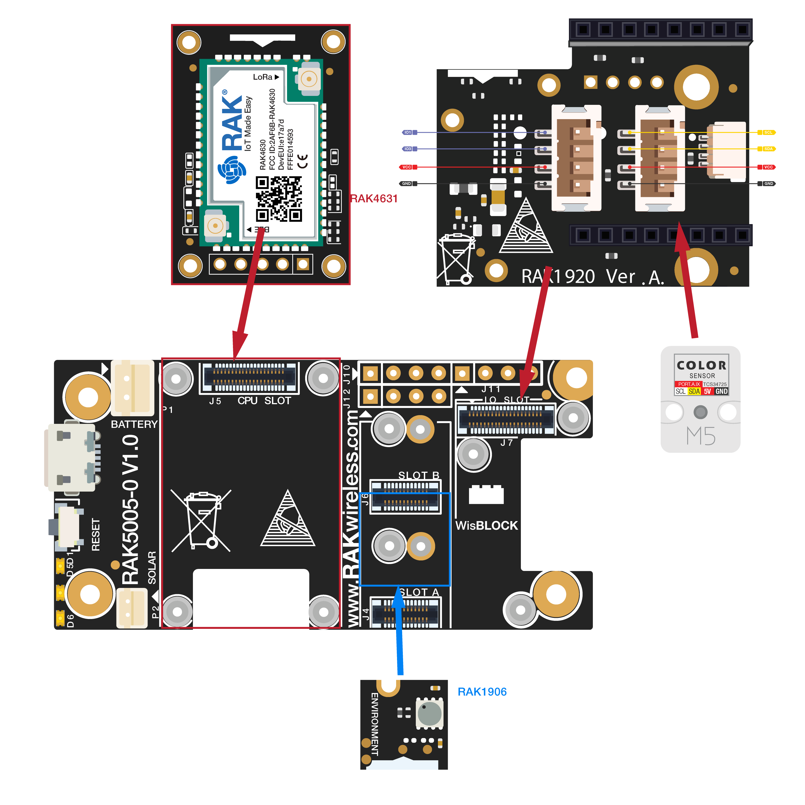
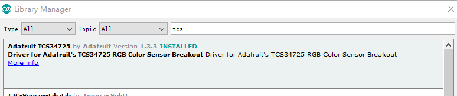

# WisBlock IO RAK1920 Sensor Adapter Board Programming Guide (Grove)

This example shows how to use WisBlock IO RAK1920, which is a MikroBUS/Grove/QWIIC adapter board, to connect with a Grove interface sensor.


----
## Hardware required
----
To test the RAK1920, The following hardware is required.

- WisBlock Base RAK5005-O  *  1pcs
- WisBlock Core RAK4631  *  1pcs
- WisBlock IO RAK1920      *  1pcs
- Color Sensor RGB Unit (TCS3472)    *  1pcs

RAK1920 is a Mikrobus/Grove/QWIIC adapter board which can be connected to Mikrobus/Grove/QWIIC sensor. This guide shows how to use Grove sensor with WisBlock. The adapter board has two Grove interface, one near to RAK4631 is for I/O(Grove B). The other one is for I2C(Grove A). Here we choose Color Sensor RGB Unit (TCS3472) from https://m5stack.com/collections/m5-unit/products/color-unit. RGB Unit is color recognition unit integrated TCS3472. Like its namesake, It is able to detect color value and return RGB data to the host. Identify color principle: In the TCS3472, a 3*4 array of filtered photodiodes and a 16 bit analog-to-digital converters are embedded. Of the 12 photodiodes, 3 have red filters, 3 have green filters, 3 have blue filters and 3 have no filter(clear). When detecting the color of an object, TCS3472 returns data from four channels: red(R), green(G), blue(B) and clear(C)(non-filtered). The response from the red, green and blue channels (RGB) can be used to determine a particular source’s chromaticity coordinates (x, y). It should be connected to Grove A.



----
## Software required
----
To test the RAK1920, The following software is required.

- [ArduinoIDE](https://www.arduino.cc/en/Main/Software)
- [RAK4630 BSP](https://github.com/RAKWireless/RAK-nRF52-Arduino)
- Adafruit TCS34725 library




The Arduino test software is written as follow:

```
#include <Wire.h>
#include "Adafruit_TCS34725.h"

// set to false if using a common cathode LED
#define commonAnode true

// our RGB -> eye-recognized gamma color
byte gammatable[256];


Adafruit_TCS34725 tcs = Adafruit_TCS34725(TCS34725_INTEGRATIONTIME_50MS, TCS34725_GAIN_4X);

void setup() {
  Serial.begin(115200);
    while(!Serial){delay(10);}
  Serial.println("Color View Test!");

  if (tcs.begin()) {
    Serial.println("Found sensor");
  } else {
    Serial.println("No TCS34725 found ... check your connections");
  }

  // thanks PhilB for this gamma table!
  // it helps convert RGB colors to what humans see
  for (int i=0; i<256; i++) {
    float x = i;
    x /= 255;
    x = pow(x, 2.5);
    x *= 255;

    if (commonAnode) {
      gammatable[i] = 255 - x;
    } else {
      gammatable[i] = x;
    }
  }
}

// The commented out code in loop is example of getRawData with clear value.
// Processing example colorview.pde can work with this kind of data too, but It requires manual conversion to 
// [0-255] RGB value. You can still uncomments parts of colorview.pde and play with clear value.
void loop() {
  float red, green, blue;
  
  tcs.setInterrupt(false);  // turn on LED

  delay(60);  // takes 50ms to read

  tcs.getRGB(&red, &green, &blue);
  
  tcs.setInterrupt(true);  // turn off LED

  Serial.print("R:\t"); Serial.print(int(red)); 
  Serial.print("\tG:\t"); Serial.print(int(green)); 
  Serial.print("\tB:\t"); Serial.print(int(blue));
  Serial.print("\n");
}

```


----
## Test Results
It will return changing RGB as external environment changing. The test results are as follows：

```
10:10:02.708 -> Color View Test!
10:10:02.788 -> Found sensor
10:10:02.893 -> R:	94	G:	87	B:	68
10:10:02.996 -> R:	95	G:	85	B:	68
10:10:03.136 -> R:	92	G:	87	B:	67
10:10:03.239 -> R:	92	G:	87	B:	69
10:10:03.344 -> R:	94	G:	86	B:	68
10:10:03.483 -> R:	92	G:	87	B:	67
10:10:03.588 -> R:	92	G:	87	B:	67
10:10:03.693 -> R:	94	G:	86	B:	66
10:10:03.797 -> R:	94	G:	86	B:	66
10:10:03.938 -> R:	93	G:	87	B:	68
10:10:04.042 -> R:	93	G:	85	B:	68
10:10:04.146 -> R:	94	G:	85	B:	70
10:10:04.284 -> R:	97	G:	81	B:	70
10:10:04.389 -> R:	95	G:	82	B:	70
10:10:04.493 -> R:	96	G:	79	B:	70
10:10:04.598 -> R:	95	G:	85	B:	85
10:10:04.737 -> R:	99	G:	74	B:	74
10:10:04.841 -> R:	90	G:	80	B:	80
10:10:04.945 -> R:	79	G:	81	B:	94
10:10:05.085 -> R:	67	G:	85	B:	99
10:10:05.190 -> R:	71	G:	83	B:	96
10:10:05.294 -> R:	75	G:	83	B:	94
10:10:05.400 -> R:	76	G:	80	B:	96
10:10:05.539 -> R:	76	G:	83	B:	93
10:10:05.643 -> R:	84	G:	88	B:	73
10:10:05.748 -> R:	78	G:	87	B:	85
10:10:05.853 -> R:	80	G:	80	B:	92
10:10:05.992 -> R:	80	G:	80	B:	94
10:10:06.097 -> R:	81	G:	79	B:	94
10:10:06.202 -> R:	81	G:	79	B:	94
10:10:06.341 -> R:	80	G:	78	B:	92
10:10:06.446 -> R:	82	G:	78	B:	92
10:10:06.550 -> R:	80	G:	80	B:	93
10:10:06.669 -> R:	80	G:	81	B:	93
10:10:06.791 -> R:	82	G:	80	B:	90
10:10:06.997 -> R:	81	G:	80	B:	90
10:10:07.012 -> R:	79	G:	82	B:	89
10:10:07.135 -> R:	79	G:	81	B:	91
10:10:07.238 -> R:	78	G:	80	B:	93
10:10:07.343 -> R:	79	G:	80	B:	91
10:10:07.483 -> R:	86	G:	86	B:	64
10:10:07.587 -> R:	85	G:	86	B:	64
10:10:07.690 -> R:	76	G:	83	B:	93
10:10:07.795 -> R:	73	G:	82	B:	96
10:10:07.934 -> R:	76	G:	80	B:	95
10:10:08.039 -> R:	77	G:	79	B:	95
10:10:08.143 -> R:	79	G:	81	B:	94
10:10:08.283 -> R:	88	G:	80	B:	82
10:10:08.387 -> R:	83	G:	79	B:	88
10:10:08.492 -> R:	77	G:	81	B:	92
10:10:08.597 -> R:	75	G:	83	B:	94
10:10:08.735 -> R:	71	G:	83	B:	96
10:10:08.838 -> R:	71	G:	85	B:	97
10:10:08.943 -> R:	72	G:	83	B:	96
10:10:09.082 -> R:	76	G:	83	B:	95
10:10:09.185 -> R:	76	G:	82	B:	94
10:10:09.290 -> R:	76	G:	81	B:	95
10:10:09.395 -> R:	77	G:	80	B:	95
10:10:09.532 -> R:	77	G:	80	B:	95
10:10:09.636 -> R:	77	G:	80	B:	95
10:10:09.740 -> R:	77	G:	80	B:	95
10:10:09.879 -> R:	78	G:	80	B:	94
10:10:09.984 -> R:	78	G:	80	B:	95
10:10:10.088 -> R:	77	G:	81	B:	96
10:10:10.226 -> R:	78	G:	79	B:	95
10:10:10.331 -> R:	79	G:	79	B:	94
10:10:10.435 -> R:	74	G:	81	B:	94
10:10:10.540 -> R:	75	G:	81	B:	95
10:10:10.677 -> R:	76	G:	81	B:	95
10:10:10.779 -> R:	75	G:	82	B:	96
10:10:10.882 -> R:	72	G:	85	B:	95
10:10:11.017 -> R:	72	G:	85	B:	95
10:10:11.120 -> R:	74	G:	82	B:	94
10:10:11.223 -> R:	75	G:	81	B:	94
10:10:11.360 -> R:	75	G:	81	B:	94
10:10:11.462 -> R:	75	G:	82	B:	95
10:10:11.598 -> R:	75	G:	82	B:	94
10:10:11.700 -> R:	75	G:	82	B:	96
10:10:11.802 -> R:	75	G:	82	B:	95
10:10:11.939 -> R:	75	G:	82	B:	93
10:10:12.042 -> R:	74	G:	83	B:	94
10:10:12.144 -> R:	73	G:	83	B:	94
10:10:12.279 -> R:	75	G:	81	B:	95
10:10:12.381 -> R:	77	G:	79	B:	93
10:10:12.484 -> R:	72	G:	83	B:	93
10:10:12.623 -> R:	74	G:	82	B:	93
10:10:12.727 -> R:	73	G:	84	B:	93
10:10:12.831 -> R:	93	G:	85	B:	66
10:10:12.971 -> R:	101	G:	81	B:	63
10:10:13.076 -> R:	87	G:	87	B:	71
10:10:13.178 -> R:	92	G:	87	B:	68
10:10:13.282 -> R:	90	G:	85	B:	68
10:10:13.422 -> R:	95	G:	88	B:	69
10:10:13.527 -> R:	93	G:	87	B:	69
10:10:13.631 -> R:	91	G:	88	B:	68
10:10:13.769 -> R:	92	G:	88	B:	69
10:10:13.874 -> R:	91	G:	89	B:	68
10:10:13.978 -> R:	92	G:	88	B:	69
10:10:14.083 -> R:	90	G:	88	B:	69
10:10:14.220 -> R:	90	G:	88	B:	69
10:10:14.325 -> R:	91	G:	88	B:	70
10:10:14.430 -> R:	90	G:	88	B:	69
10:10:14.569 -> R:	89	G:	87	B:	70
10:10:14.674 -> R:	89	G:	89	B:	69
10:10:14.774 -> R:	89	G:	89	B:	69
10:10:14.884 -> R:	89	G:	89	B:	69
10:10:15.023 -> R:	89	G:	89	B:	69
10:10:15.128 -> R:	91	G:	89	B:	69
10:10:15.232 -> R:	90	G:	87	B:	72
10:10:15.371 -> R:	91	G:	88	B:	71
10:10:15.475 -> R:	90	G:	87	B:	71
10:10:15.580 -> R:	90	G:	87	B:	70
10:10:15.683 -> R:	91	G:	88	B:	71
10:10:15.822 -> R:	91	G:	86	B:	72
10:10:15.927 -> R:	90	G:	85	B:	73
10:10:16.032 -> R:	85	G:	85	B:	72
10:10:16.171 -> R:	87	G:	87	B:	74


```

