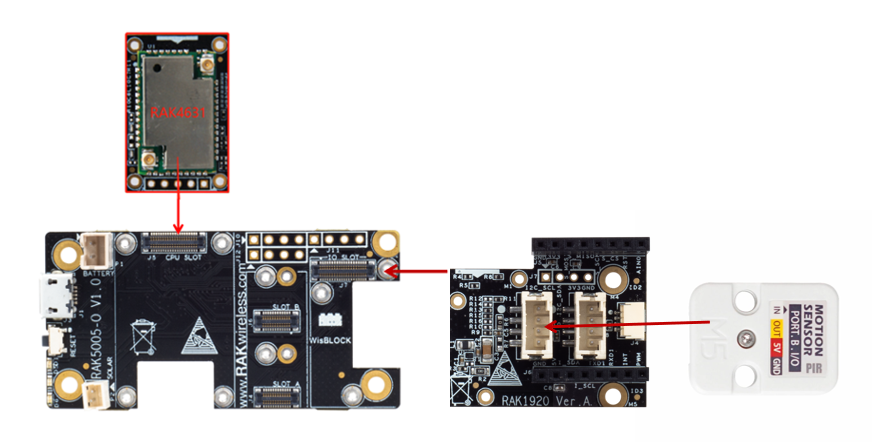

# WisBlock IO RAK1920 Sensor Adapter Board Programming Guide (Grove)

This example shows how to use RAK1920, which is a MikroBUS/Grove/QWIIC adapter board, to connect with a Grove interface sensor.


----
## Hardware required
----
To test the RAK1920, The following hardware is required.

- WisBlock Base RAK5005-O  *  1pcs
- WisBlock Core RAK4631  *  1pcs
- WisBlock IO RAK1920      *  1pcs
- PIR Motion Sensor (AS312)   *  1pcs

RAK1920 is a Mikrobus/Grove/QWIIC adapter board which can be connected to Mikrobus/Grove/QWIIC sensor. This guide shows how to use Grove sensor with WisBlock. The adapter board has two Grove interface, one near to RAK4631 is for I/O(Grove B). The other one is for I2C(Grove A). Here we choose PIR Motion Sensor (AS312) from https://m5stack.com/collections/m5-unit/products/pir-module. PIR is a human body infrared unit. It belongs to the "passive pyroelectric infrared detector". It detects the infrared radiation emitted and reflected by the human body or object. When infrared is detected, the output level is high and it takes a while. Delay (high during the period and allow repeated triggers) until the trigger signal disappears (restores low).

- Detects the distance: 500cm
- latency time: 2s
- Sensing range: < 100°
- Quiescent current: < 60uA
- Operating temperature: -20 - 80 °C
- GROVE interface, support UIFlow and Arduino
- Two Lego installation holes
- Grove B



----
## Software required
----
To test the RAK1920, The following software is required.

- [ArduinoIDE](https://www.arduino.cc/en/Main/Software)
- [RAK4630 BSP](https://github.com/RAKWireless/RAK-nRF52-Arduino)    


The Arduino test software is written as follow:

```
/*
    Description: Human body detection using PIR Unit.
*/

void setup() {
  Serial.begin(115200);
  while(!Serial);
  pinMode(21, INPUT);
}

void loop() {
  if(digitalRead(21)==1){
    Serial.println("PIR Status: Sensing");
    Serial.println(" value: 1");
  }
  else{
    Serial.println("PIR Status: Not Sensed");
    Serial.println(" value: 0");
  }
  delay(500);
}
```


----
## Test Results
It will detect human body per 0.5s. If find the human body close to it, it will shows as below:

```
10:20:07.266 -> PIR Status: Sensing
10:20:07.266 ->  value: 1
10:20:07.755 -> PIR Status: Sensing
10:20:07.755 ->  value: 1
10:20:08.242 -> PIR Status: Sensing
10:20:08.242 ->  value: 1
10:20:08.764 -> PIR Status: Sensing
10:20:08.764 ->  value: 1
10:20:09.251 -> PIR Status: Sensing
10:20:09.251 ->  value: 1

```

When no one nears, it will shows

```
10:20:05.249 -> PIR Status: Not Sensed
10:20:05.249 ->  value: 0
10:20:05.737 -> PIR Status: Not Sensed
10:20:05.737 ->  value: 0
10:20:06.260 -> PIR Status: Not Sensed
10:20:06.260 ->  value: 0
10:20:06.746 -> PIR Status: Not Sensed
10:20:06.746 ->  value: 0

```

