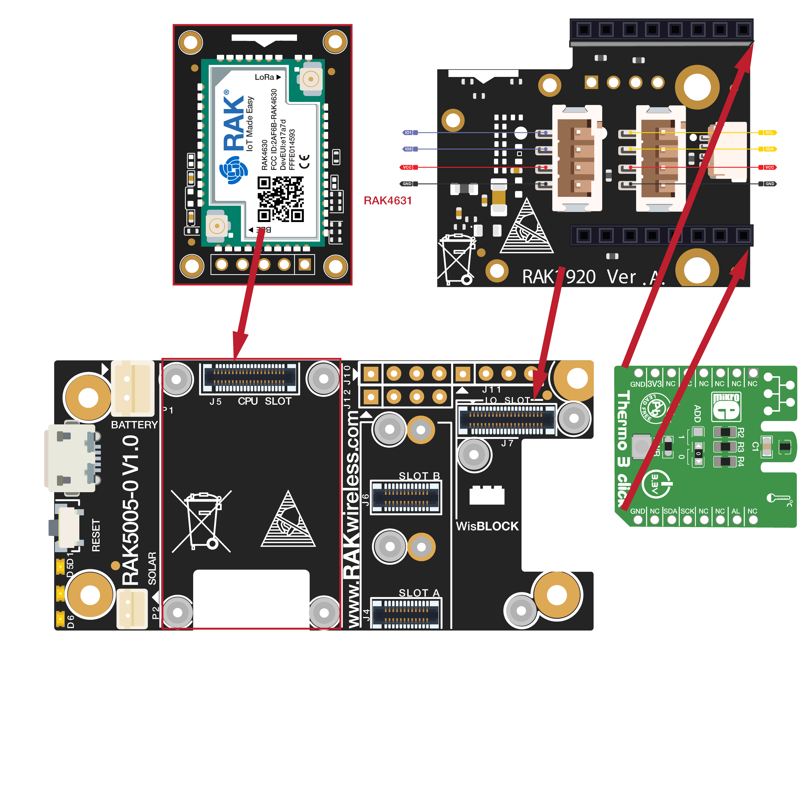

# WisBlock IO RAK1920 Sensor Adapter Board Programming Guide (MicroBUS)

This example shows how to use WisBlock IO RAK1920, which is a MikroBUS/Grove/QWIIC adapter board, to connect with a MicroBUS interface sensor.


----
## Hardware required
----
To test the RAK1920, The following hardware is required.

- WisBlock Base RAK5005-O  *  1pcs
- WisBlock Core RAK4631  *  1pcs
- WisBlock IO RAK1920      *  1pcs
- Thermo 3 click     *  1pcs

RAK1920 is a Mikrobus/Grove/QWIIC adapter board which can be connected to Mikrobus/Grove/QWIIC sensor. This guide shows how to use Mikrobus sensor with WisBlock. Here we choose Thermo 3 click from https://www.mikroe.com/thermo-3-click.  Thermo 3 click carries [TMP102](https://download.mikroe.com/documents/datasheets/tmp102-data-sheet.pdf), a digital temperature sensor IC with a tiny footprint of only 1.6mm x 1.6mm. The click is designed to run on a 3.3V power supply only. It communicates with the target MCU through mikroBUS™ I2 C pins (SCL, SDA), and an additional Alert pint (INT on the default mikroBUS™ configuration). Without requiring calibration, TMP102 is accurate within 0.5°C. Measurement range is between **-25°C to 85°C**. An integrated 12-bit ADC allows for measurement resolutions down to 0.0625°C.



----
## Software required
----
To test the RAK1920, The following software is required.

- [ArduinoIDE](https://www.arduino.cc/en/Main/Software)
- [RAK4630 BSP](https://github.com/RAKWireless/RAK-nRF52-Arduino)
- SparkFun TMP102 Breakout library


The Arduino test software is written as follow:

```
#include <Wire.h> // Used to establied serial communication on the I2C bus
#include <SparkFunTMP102.h> // Click here to get the library: http://librarymanager/All#SparkFun_TMP102

TMP102 sensor0;

void setup() {
  Serial.begin(115200);
  while(!Serial){delay(10);}
  Wire.begin(); //Join I2C Bus
  
  /* The TMP102 uses the default settings with the address 0x48 using Wire.
  
   Optionally, if the address jumpers are modified, or using a different I2C bus,
   these parameters can be changed here. E.g. sensor0.begin(0x49,Wire1)
   
   It will return true on success or false on failure to communicate. */
  while(!sensor0.begin())
  {
    Serial.println("Cannot connect to TMP102.");
    Serial.println("Is the board connected? Is the device ID correct?");
    delay(1000);
  }
  
  Serial.println("Connected to TMP102!");
  delay(100);

  // Initialize sensor0 settings  
  // set the number of consecutive faults before triggering alarm.
  // 0-3: 0:1 fault, 1:2 faults, 2:4 faults, 3:6 faults.
  sensor0.setFault(0);  // Trigger alarm immediately
  
  // set the polarity of the Alarm. (0:Active LOW, 1:Active HIGH).
  sensor0.setAlertPolarity(1); // Active HIGH
  
  // set the sensor in Comparator Mode (0) or Interrupt Mode (1).
  sensor0.setAlertMode(0); // Comparator Mode.
  
  // set the Conversion Rate (how quickly the sensor gets a new reading)
  //0-3: 0:0.25Hz, 1:1Hz, 2:4Hz, 3:8Hz
  sensor0.setConversionRate(2);
  
  //set Extended Mode.
  //0:12-bit Temperature(-55C to +128C) 1:13-bit Temperature(-55C to +150C)
  sensor0.setExtendedMode(0);

  //set T_HIGH, the upper limit to trigger the alert on
  sensor0.setHighTempF(85.0);  // set T_HIGH in F
  
  //set T_LOW, the lower limit to shut turn off the alert
  sensor0.setLowTempF(84.0);  // set T_LOW in F
}
 
void loop()
{
  float temperature;
  boolean alertPinState, alertRegisterState;
  
  // Turn sensor on to start temperature measurement.
  // Current consumtion typically ~10uA.
  sensor0.wakeup();

  // read temperature data
  //temperature = sensor0.readTempF();
  temperature = sensor0.readTempC();
  
  // Place sensor in sleep mode to save power.
  // Current consumtion typically <0.5uA.
  sensor0.sleep();

  // Print temperature and alarm state
  Serial.print("Temperature: ");
  Serial.println(temperature);
  
  delay(1000);  // Wait 1000ms
}
```


----
## Test Results
It will get temperature per 1s and print. The test results are as follows：

```
09:46:54.698 -> Connected to TMP102!
09:46:54.794 -> Temperature: 25.38
09:46:55.770 -> Temperature: 25.38
09:46:56.777 -> Temperature: 25.38
09:46:57.806 -> Temperature: 25.38
09:46:58.803 -> Temperature: 25.38
09:46:59.810 -> Temperature: 25.31
09:47:00.808 -> Temperature: 25.38
09:47:01.809 -> Temperature: 25.38
09:47:02.810 -> Temperature: 25.38
09:47:03.820 -> Temperature: 25.38
09:47:04.830 -> Temperature: 25.38
```

