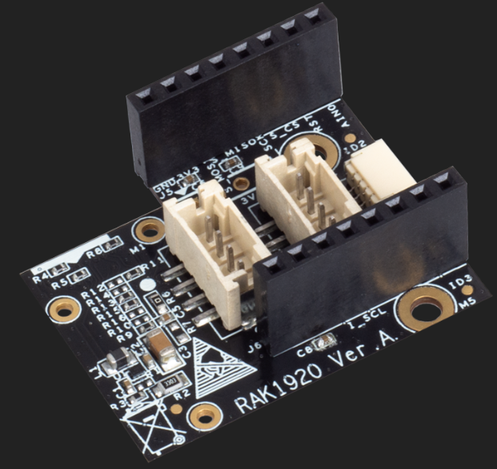
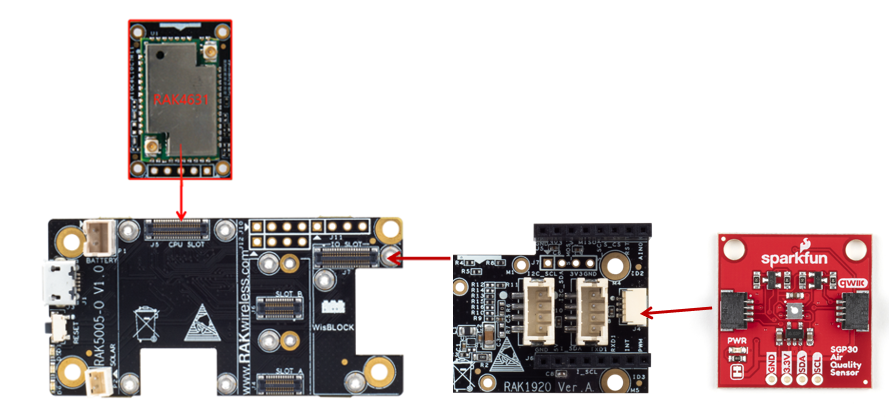

# WisBlock IO RAK1920 Sensor Adapter Board Programming Guide (QWIIC)

This example shows how to use WisBlock IO RAK1920, which is a Mikrobus/Grove/QWIIC adapter board, to connect with a QWIIC interface sensor.



----
## Hardware required
----
To test the RAK1920, The following hardware is required.

- WisBlock Base RAK5005-O  *  1pcs    
- WisBlock Core RAK4631  *  1pcs    
- WisBlock IO RAK1920      *  1pcs    
- SparkFun SGP30 Air Quality Sensor     *  1pcs    

RAK1920 is a Mikrobus/Grove/QWIIC adapter board which can be connected to Mikrobus/Grove/QWIIC sensor. This guide shows how to use QWIIC sensor with WisBlock. Here we choose SparkFun SGP30 Air Quality Sensor from https://www.sparkfun.com/products/16531.  The SparkFun SGP30 Air Quality Sensor provides information on the quality of the air in your room or house by monitoring the volatile organic compounds around the sensor. The SGP30 Air Quality Sensor can return valid indoor air quality (IAQ) readings within 15 seconds of powering up! By comparison, typical air quality (IAQ) sensors are great for measuring CO2 and volatile organic compounds (VOCs) but some of them require a burn-in time of 48 hours and a 20-min start up time. Along with a very quick start-up time, the SGP30 is very resistant to contamination from other gases to ensure low drift and long-term stability for extremely reliable results. You can read the SGP30 gas sensor output measurements of total VOCs (TVOC) in parts per billion (ppb), carbon dioxide (CO2) equivalent in parts per million (ppm) and H2. 



----
## Software required
----
To test the RAK1920, The following software is required.

- [ArduinoIDE](https://www.arduino.cc/en/Main/Software)
- [RAK4630 BSP](https://github.com/RAKWireless/RAK-nRF52-Arduino)    
- SparkFun SGP30 Arduino library


The Arduino test software is written as follow:

```
/*
  Library for the Sensirion SGP30 Indoor Air Quality Sensor
  By: Ciara Jekel
  SparkFun Electronics
  Date: June 28th, 2018
  License: This code is public domain but you buy me a beer if you use this and we meet someday (Beerware license).
  SGP30 Datasheet: https://cdn.sparkfun.com/assets/c/0/a/2/e/Sensirion_Gas_Sensors_SGP30_Datasheet.pdf
  Feel like supporting our work? Buy a board from SparkFun!
  https://www.sparkfun.com/products/14813
  This example reads the sensors calculated CO2 and TVOC values
*/

#include "SparkFun_SGP30_Arduino_Library.h" // Click here to get the library: http://librarymanager/All#SparkFun_SGP30
#include <Wire.h>

SGP30 mySensor; //create an object of the SGP30 class

void setup() {
  Serial.begin(115200);
  while(!Serial);
  Wire.begin();
  //Initialize sensor
  if (mySensor.begin() == false) {
    Serial.println("No SGP30 Detected. Check connections.");
  }
  //Initializes sensor for air quality readings
  //measureAirQuality should be called in one second increments after a call to initAirQuality
  mySensor.initAirQuality();
}

void loop() {
  //First fifteen readings will be
  //CO2: 400 ppm  TVOC: 0 ppb
  delay(1000); //Wait 1 second
  //measure CO2 and TVOC levels
  mySensor.measureAirQuality();
  Serial.print("CO2: ");
  Serial.print(mySensor.CO2);
  Serial.print(" ppm\tTVOC: ");
  Serial.print(mySensor.TVOC);
  Serial.println(" ppb");
}
```


----
## Test Results
It will get CO2 and TVOC per 1s and print. The test results are as follows：

```
11:07:47.766 -> CO2: 360 ppm	TVOC: 89 ppb
11:07:48.776 -> CO2: 355 ppm	TVOC: 88 ppb
11:07:49.784 -> CO2: 358 ppm	TVOC: 83 ppb
11:07:50.790 -> CO2: 362 ppm	TVOC: 88 ppb
11:07:51.801 -> CO2: 377 ppm	TVOC: 81 ppb
11:07:52.847 -> CO2: 356 ppm	TVOC: 90 ppb
11:07:53.857 -> CO2: 361 ppm	TVOC: 86 ppb
11:07:54.868 -> CO2: 354 ppm	TVOC: 82 ppb

```

