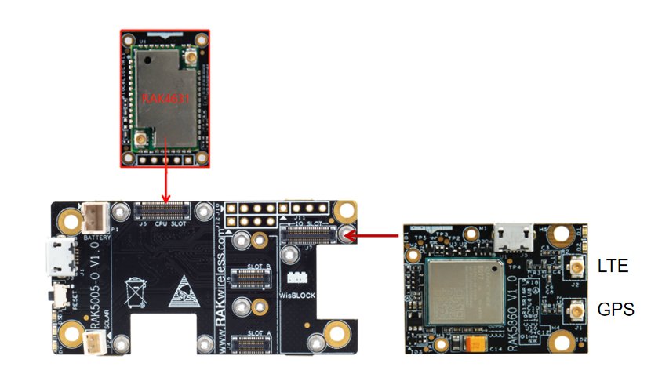

# WisBlock Cellular Programming Guide

This example shows how to use RAK5860,  LTE BG77 Cat M1/NB2 Module.

----
## Hardware required
----
To test the RAK5860, The following hardware is required.

- WisBlock Base RAK5005-O  *  1pcs
- WisBlock Core RAK4631  *  1pcs
- RAK5860      *  1pcs

BG77 is an ultra-compact LPWA module supporting LTE Cat M1, LTE Cat NB2 and integrated GNSS. It is fully compliant with 3GPP Rel. 14 specification and provides maximum data rates of 588 kbps downlink and 1119 kbps uplink. It features ultra-low power consumption by leveraging the integrated RAM/flash as well as the ARM Cortex A7 processor supporting ThreadX, achieving up to 70% reduction in PSM leakage and 85% reduction in eDRX current consumption compared to its predecessor. RAK4631 could communicate with BG77 via UART. Besides, RAK5860 also supplies an USB port to communicate with external directly. The Key features are below, more details is at https://www.quectel.com/product/bg77.htm

- Frequency Bands: 
  -  Cat M1: LTE FDD: B1/B2/B3/B4/B5/B8/B12/B13/B18/B19/B20/B25/B26/B27/B28/B66/B85
  -  Cat NB2: LTE FDD: B1/B2/B3/B4/B5/B8/B12/B13/B18/B19/B20/B25/B28/B66/B71/B85
- Region: Global
- GNSS (Optional): GPS/GLONASS/BeiDou/Galileo/QZSS



----
## Software required
----
To test the RAK5860, The following software is required.

- [ArduinoIDE](https://www.arduino.cc/en/Main/Software)
- [RAK4630 BSP](https://github.com/RAKWireless/RAK-nRF52-Arduino)     


## NB-IOT Test

The demo is written as follow. It shows how to connect to NB-IOT net with CHINA UNICOM NBIOT sim card and then ping with a website.

```
#define BG77_POWER_KEY    17
String bg77_rsp = "";
void setup()
{
  // Open serial communications and wait for port to open:
  Serial.begin(115200);
  while ( !Serial ) delay(10);   // for nrf52840 with native usb
  Serial.println("RAK4630 Cellular TEST With CHINA UNICOM NBIOT sim card!");
 
  //BG77 init
  pinMode(BG77_POWER_KEY, OUTPUT);
  digitalWrite(BG77_POWER_KEY,0);
  delay(1000);
  digitalWrite(BG77_POWER_KEY,1);
  delay(2000);
  digitalWrite(BG77_POWER_KEY,0);
  Serial1.begin(115200);
  delay(1000);
  Serial.println("BG77 power up!");
  bg77_at("ATI",500);
  delay(2000);
  bg77_at("AT+CGDCONT=1,\"IP\",\"snbiot\"",500);
  delay(2000);   
  bg77_at("AT+QCFG=\"nwscanseq\",03,1",500);
  delay(2000); 
  bg77_at("AT+QCFG=\"band\",F,2000095,2000095",500);
  delay(2000);
  bg77_at("AT+QCFG=\"iotopmode\",1,1",500);
  delay(2000);
  bg77_at("AT+CFUN=1,0",500);
  delay(2000); 
  bg77_at("AT+CPIN?",500);
  delay(2000);    
  bg77_at("AT+QNWINFO",500);
  delay(2000);
  bg77_at("AT+QCSQ",500);
  delay(2000);
  bg77_at("AT+CSQ",500);
  delay(2000);
  bg77_at("AT+QIACT=1",3000);
  delay(2000);
}

//this function is suitable for most AT commands of bg96. e.g. bg96_at("ATI")
void bg77_at(char *at, uint16_t timeout)
{
  char tmp[256] = {0};
  int len = strlen(at);
  strncpy(tmp,at,len);
  uint16_t t = timeout;
  tmp[len]='\r';
  Serial1.write(tmp);
  delay(10);
  while(t--){
      if(Serial1.available())
      {
         bg77_rsp += char(Serial1.read());
      }
      delay(1);
  }
  Serial.println(bg77_rsp);
  bg77_rsp="";
}

void ping_at(char *at)
{
  char tmp[256] = {0};
  int len = strlen(at);
  uint16_t timeout = 10000;
  strncpy(tmp,at,len);
  tmp[len]='\r';
  Serial1.write(tmp);
  delay(10);
  
  while(timeout--){
    if(Serial1.available())
      {
        bg77_rsp += char(Serial1.read());
      }
      delay(1);
  }
  Serial.println(bg77_rsp);
  bg77_rsp="";
}

void loop() // run over and over//
{   
  Serial.println("Begin receive packet from www.baidu.com!");
  ping_at("AT+QPING=1,\"www.baidu.com\"");
  delay(1000);
}
```


----
Test Results

It will get data from website per 5s and print. The test results are as follows：

```

[11:16:58.843]Recieve←◆RAK4630 Cellular TEST With CHINA UNICOM NBIOT sim card!

[11:17:02.849]Recieve←◆BG77 power up!

[11:17:03.343]Recieve←◆

[11:17:05.845]Recieve←◆
RDY
AT+CGDCONT=1,"IP","snbiot"
OK


[11:17:08.346]Recieve←◆
APP RDY
AT+QCFG="nwscanseq",03,1
OK


[11:17:10.848]Recieve←◆AT+QCFG="band",F,2000095,2000095
OK


[11:17:13.350]Recieve←◆AT+QCFG="iotopmode",1,1
OK


[11:17:15.851]Recieve←◆AT+CFUN=1,0
OK


[11:17:18.350]Recieve←◆AT+CPIN?
+CPIN: READY

OK


[11:17:22.853]Recieve←◆AT+QNWINFO
+QNWINFO: "NBIoT","46001","LTE BAND 3",1452

OK

[11:17:23.351]Recieve←◆AT+QCSQ
+QCSQ: "NBIoT",-103,-114,152,-10

OK


[11:17:25.851]Recieve←◆AT+CSQ
+CSQ: 5,99

OK


[11:17:30.792]Recieve←◆AT+QIACT=1
OK


[11:17:32.794]Recieve←◆Begin receive packet from www.baidu.com!

[11:17:43.582]Recieve←◆AT+QPING=1,"www.baidu.com"
OK

+QPING: 0,"61.135.169.125",32,469,255

+QPING: 0,"61.135.169.125",32,238,255

+QPING: 0,"61.135.169.125",32,207,255

+QPING: 0,"61.135.169.125",32,238,255

+QPING: 0,4,4,0,207,469,28

Begin receive packet from www.baidu.com!

[11:17:54.432]Recieve←◆AT+QPING=1,"www.baidu.com"
OK

+QPING: 0,"61.135.169.121",32,570,255

+QPING: 0,"61.135.169.121",32,239,255

+QPING: 0,"61.135.169.121",32,216,255

+QPING: 0,"61.135.169.121",32,211,255

+QPING: 0,4,4,0,211,570,309
Begin receive packet from www.baidu.com!

[11:18:05.136]Recieve←◆AT+QPING=1,"www.baidu.com"
OK

+QPING: 0,"61.135.169.125",32,684,255

+QPING: 0,"61.135.169.125",32,299,255

+QPING: 0,"61.135.169.125",32,381,255

+QPING: 0,"61.135.169.125",32,288,255

+QPING: 0,4,4,0,288,684,41
Begin receive packet from www.baidu.com!

[11:18:15.912]Recieve←◆AT+QPING=1,"www.baidu.com"
OK

+QPING: 0,"61.135.169.121",32,297,255

+QPING: 0,"61.135.169.121",32,238,255

+QPING: 0,"61.135.169.121",32,235,255

+QPING: 0,"61.135.169.121",32,201,255

+QPING: 0,4,4,0,201,297,24
Begin receive packet from www.baidu.com!

[11:18:26.689]Recieve←◆AT+QPING=1,"www.baidu.com"
OK

+QPING: 0,"61.135.169.121",32,501,255

+QPING: 0,"61.135.169.121",32,225,255

+QPING: 0,"61.135.169.121",32,186,255

+QPING: 0,"61.135.169.121",32,181,255

+QPING: 0,4,4,0,181,501,273
Begin receive packet from www.baidu.com!

[11:18:37.467]Recieve←◆AT+QPING=1,"www.baidu.com"
OK

+QPING: 0,"61.135.169.125",32,273,255

+QPING: 0,"61.135.169.125",32,194,255

+QPING: 0,"61.135.169.125",32,192,255

+QPING: 0,"61.135.169.125",32,178,255

+QPING: 0,4,4,0,178,273,20
Begin receive packet from www.baidu.com!

[11:18:48.243]Recieve←◆AT+QPING=1,"www.baidu.com"
OK

+QPING: 0,"61.135.169.125",32,1212,255

+QPING: 0,"61.135.169.125",32,267,255

+QPING: 0,"61.135.169.125",32,384,255

+QPING: 0,"61.135.169.125",32,383,255

+QPING: 0,4,4,0,267,1212,5
Begin receive packet from www.baidu.com!

[11:18:59.020]Recieve←◆AT+QPING=1,"www.baidu.com"
OK

+QPING: 0,"61.135.169.121",32,563,255

+QPING: 0,"61.135.169.121",32,346,255

+QPING: 0,"61.135.169.121",32,237,255

+QPING: 0,"61.135.169.121",32,220,255

+QPING: 0,4,4,0,220,563,341
Begin receive packet from www.baidu.com!

[11:19:09.796]Recieve←◆AT+QPING=1,"www.baidu.com"
OK

+QPING: 0,"61.135.169.125",32,594,255

+QPING: 0,"61.135.169.125",32,228,255

+QPING: 0,"61.135.169.125",32,274,255

+QPING: 0,"61.135.169.125",32,251,255

+QPING: 0,4,4,0,228,594,33
Begin receive packet from www.baidu.com!

[11:19:20.573]Recieve←◆AT+QPING=1,"www.baidu.com"
OK

+QPING: 0,"61.135.169.125",32,617,255

+QPING: 0,"61.135.169.125",32,218,255

+QPING: 0,"61.135.169.125",32,205,255

+QPING: 0,"61.135.169.125",32,238,255

+QPING: 0,4,4,0,205,617,31
Begin receive packet from www.baidu.com!


```


## Unvarnished Transmission Test

The demo shows how to communicate with BG77 via WisBlock via USB on RAK5005-O.

```
/*
 *
 * bg77-at module product testing
 *
 */

#define BG77_POWER_KEY    17

void setup()
{
  // Open serial communications and wait for port to open:
  Serial.begin(115200);
  while ( !Serial ) delay(10);
  Serial.println("BG77 AT CMD TEST!");
  // Check if the modem is already awake
  time_t timeout = millis();
  bool moduleSleeps = true;
  Serial1.begin(115200);
  delay(1000);
  Serial1.println("ATI");
  //BG77 init
  while ((millis() - timeout) < 4000)
  {
    if (Serial1.available())
    {
      String result = Serial1.readString();
      Serial.println("Modem response after start:");
      Serial.println(result);
      moduleSleeps = false;
    }
  }
  if (moduleSleeps)
  {
    // Module slept, wake it up
    pinMode(BG77_POWER_KEY, OUTPUT);
    digitalWrite(BG77_POWER_KEY, 0);
    delay(1000);
    digitalWrite(BG77_POWER_KEY, 1);
    delay(2000);
    digitalWrite(BG77_POWER_KEY, 0);
    delay(1000);
  }
  Serial.println("BG77 power up!");
}

void loop()
{
  int timeout = 100;
  String resp = "";
  String snd = "";
  char cArr[128] = {0};
  while(timeout--)
  {
    if(Serial1.available()>0)
    {
      resp += char(Serial1.read());
    }
    if(Serial.available()>0)
    {
      snd += char(Serial.read());
    }
    delay(1);
  }
  if(resp.length() > 0)
  {
    Serial.print(resp);
  }
  if(snd.length() > 0)
  {
    memset(cArr, 0, 128);
    snd.toCharArray(cArr,snd.length() + 1);
    Serial1.write(cArr);
    delay(10);
  }
  resp = "";
  snd = "";
}
```

Test Results

```

[11:54:36.832]OUT→◇ATI
□
[11:54:36.953]IN←◆ATI
Quectel
BG77
Revision: BG77LAR02A02

OK

[11:54:39.080]OUT→◇ATI
□
[11:54:39.210]IN←◆ATI
Quectel
BG77
Revision: BG77LAR02A02

OK

```

## How to use USB on RAK5860

Firstly download related tools from https://www.quectel.com/ProductDownload/BG77.html . Then Download our unvarnished transmission demo which will power up BG77. After the BG77 starts ok (blue led on and green led blink), connect to the USB of BG77 to your PC. According to your PC, choose appropriate driver. For windows 10, Open the ..\BG77\05 Tool&Driver\Quectel_LTE&5G_Windows_USB_Driver_V2.2.2 and install.  Then open Device manager and find Quectel USB Modem's port. This is the AT port of BG77.


Open Serials tool with the Quectel USB AT Port and send AT command now.

```
[14:47:44.458]发→◇AT
□
[14:47:44.461]收←◆AT
OK

[14:47:44.594]发→◇AT
□
[14:47:44.597]收←◆AT
OK

[14:47:44.841]发→◇AT
□
[14:47:44.844]收←◆AT
OK

[14:48:39.026]发→◇ATI
□
[14:48:39.029]收←◆ATI
Quectel
BG77
Revision: BG77LAR02A02

OK

```

