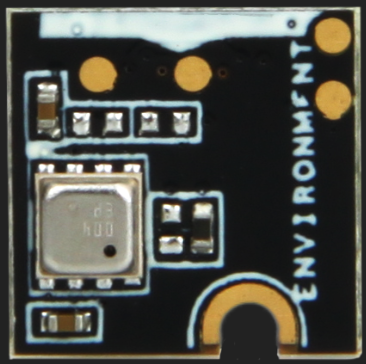
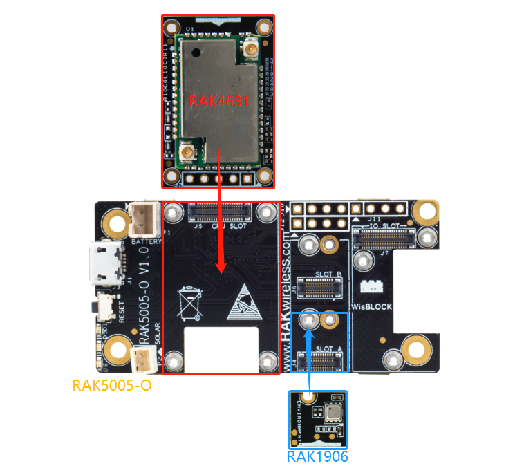
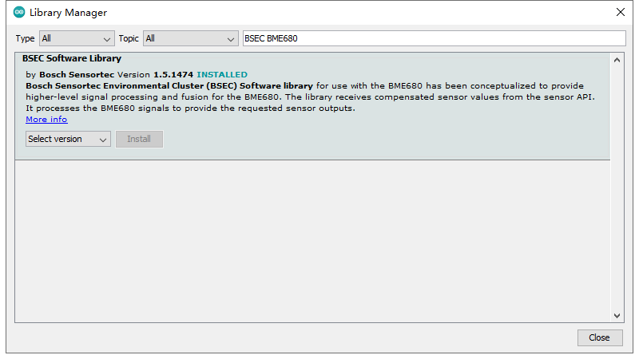

# WisBlock Sensor RAK1906 Environment board User Guide

This example shows how to use the WisBlock Sensor RAK1906 environment board.

The WisBlock Sensor RAK1906 environment board uses gas sensor BME680  which can measure relative humidity, barometric pressure, ambient temperature and gas (VOC).


Product physical map is as follows:



----
## Hardware required
----
To use the WisBlock Sensor RAK1906 environment board, The following hardware is required.

- WisBlock Base RAK5005-O  \*  1pcs
- WisBlock Core RAK4631      \*  1pcs
- WisBlock Sensor RAK1906          \*  1pcs


Hardware is shown as follows:



For stable connection, please use screws to tighten.

----
## Software required
----
To use the WisBlock Sensor RAK1906 environment board, The following software is required.

- [ArduinoIDE](https://www.arduino.cc/en/Main/Software)
- [RAK4630 BSP](https://github.com/RAKWireless/RAK-nRF52-Arduino)
- CloseCube BME680 Library


- BME680 BSEC Library




Connect the assembled hardware to the PC with a USB cable, open the Arduino, and select the development board and port in the tool menu.


## Demo

### Demo 1

The Demo is designed to get BME680 sensor data every 5 seconds and print the results on serial port.

```
#include <Wire.h>
#include "ClosedCube_BME680.h"  //https://github.com/closedcube/ClosedCube_BME680_Arduino

ClosedCube_BME680 bme680;

void bme680_init()
{
  Wire.begin();
  bme680.init(0x76); // I2C address: 0x76 or 0x77
  bme680.reset();

  Serial.print("Chip ID=0x");
  Serial.println(bme680.getChipID(), HEX);

  // oversampling: humidity = x1, temperature = x2, pressure = x16
  bme680.setOversampling(BME680_OVERSAMPLING_X1, BME680_OVERSAMPLING_X2, BME680_OVERSAMPLING_X16);
  bme680.setIIRFilter(BME680_FILTER_3);
  bme680.setGasOn(300, 100); // 300 degree Celsius and 100 milliseconds

  bme680.setForcedMode();
}

void bme680_get()
{
  double temp = bme680.readTemperature();
  double pres = bme680.readPressure();
  double hum = bme680.readHumidity();

  Serial.print("T=");
  Serial.print(temp);
  Serial.print("C, RH=");
  Serial.print(hum);
  Serial.print("%, P=");
  Serial.print(pres);
  Serial.print("hPa");

  uint32_t gas = bme680.readGasResistance();

  Serial.print(", G=");
  Serial.print(gas);
  Serial.print(" Ohms");
  Serial.println();

  bme680.setForcedMode();
}

void setup()
{
  // Initialize Serial for debug output
  Serial.begin(115200);
  // while(!Serial){delay(10);}

  bme680_init();
}

void loop()
{
  bme680_get();
  delay(5000);
}

```


The test results are as follows：

```
[10:46:52.455]T=27.39C, RH=65.00%, P=950.21hPa, G=37388 Ohms

[10:46:57.460]T=27.39C, RH=66.00%, P=950.21hPa, G=65443 Ohms

[10:47:02.467]T=27.38C, RH=66.00%, P=950.23hPa, G=157592 Ohms

[10:47:07.471]T=27.37C, RH=66.00%, P=950.25hPa, G=469700 Ohms

[10:47:12.477]T=27.37C, RH=66.00%, P=950.25hPa, G=98524 Ohms

[10:47:17.482]T=27.36C, RH=66.00%, P=950.27hPa, G=114360 Ohms

[10:47:22.487]T=27.35C, RH=66.00%, P=950.27hPa, G=129192 Ohms

[10:47:27.493]T=27.34C, RH=66.00%, P=950.29hPa, G=143114 Ohms

[10:47:32.499]T=27.34C, RH=66.00%, P=950.29hPa, G=153006 Ohms

[10:47:37.504]T=27.33C, RH=66.00%, P=950.27hPa, G=163023 Ohms

[10:47:42.510]T=27.33C, RH=66.00%, P=950.29hPa, G=171440 Ohms

[10:47:47.515]T=27.33C, RH=66.00%, P=950.29hPa, G=177552 Ohms

[10:47:52.520]T=27.32C, RH=66.00%, P=950.29hPa, G=182430 Ohms

```


### Demo 2

The Demo is from the examples of BME BSEC library, which is designed to get BME680 sensor data including IAQ. The sensor data will be printed on serial port in the order of "**Timestamp [ms], raw temperature [°C], pressure [hPa], raw relative humidity [%], gas [Ohm], IAQ, IAQ accuracy, temperature [°C], relative humidity [%], Static IAQ, CO2 equivalent, breath VOC equivalent**".

For example:

```
6625, 26.58, 95334.00, 67.13, 11561.00, 25.00, 0, 26.52, 67.17, 25.00, 500.00, 0.50
```

The Demo is as follows.

```
#include "bsec.h"

// Helper functions declarations
void checkIaqSensorStatus(void);
void errLeds(void);

// Create an object of the class Bsec
Bsec iaqSensor;

String output;

// Entry point for the example
void setup(void)
{
  Serial.begin(115200);
  while(!Serial) delay(10);
  Wire.begin();

  iaqSensor.begin(BME680_I2C_ADDR_PRIMARY, Wire);
  output = "\nBSEC library version " + String(iaqSensor.version.major) + "." + String(iaqSensor.version.minor) + "." + String(iaqSensor.version.major_bugfix) + "." + String(iaqSensor.version.minor_bugfix);
  Serial.println(output);
  checkIaqSensorStatus();

  bsec_virtual_sensor_t sensorList[10] = {
    BSEC_OUTPUT_RAW_TEMPERATURE,
    BSEC_OUTPUT_RAW_PRESSURE,
    BSEC_OUTPUT_RAW_HUMIDITY,
    BSEC_OUTPUT_RAW_GAS,
    BSEC_OUTPUT_IAQ,
    BSEC_OUTPUT_STATIC_IAQ,
    BSEC_OUTPUT_CO2_EQUIVALENT,
    BSEC_OUTPUT_BREATH_VOC_EQUIVALENT,
    BSEC_OUTPUT_SENSOR_HEAT_COMPENSATED_TEMPERATURE,
    BSEC_OUTPUT_SENSOR_HEAT_COMPENSATED_HUMIDITY,
  };

  iaqSensor.updateSubscription(sensorList, 10, BSEC_SAMPLE_RATE_LP);
  checkIaqSensorStatus();

  // Print the header
  output = "Timestamp [ms], raw temperature [°C], pressure [hPa], raw relative humidity [%], gas [Ohm], IAQ, IAQ accuracy, temperature [°C], relative humidity [%], Static IAQ, CO2 equivalent, breath VOC equivalent";
  Serial.println(output);
}

// Function that is looped forever
void loop(void)
{
  unsigned long time_trigger = millis();
  if (iaqSensor.run()) { // If new data is available
    output = String(time_trigger);
    output += ", " + String(iaqSensor.rawTemperature);
    output += ", " + String(iaqSensor.pressure);
    output += ", " + String(iaqSensor.rawHumidity);
    output += ", " + String(iaqSensor.gasResistance);
    output += ", " + String(iaqSensor.iaq);
    output += ", " + String(iaqSensor.iaqAccuracy);
    output += ", " + String(iaqSensor.temperature);
    output += ", " + String(iaqSensor.humidity);
    output += ", " + String(iaqSensor.staticIaq);
    output += ", " + String(iaqSensor.co2Equivalent);
    output += ", " + String(iaqSensor.breathVocEquivalent);
    Serial.println(output);
  } else {
    checkIaqSensorStatus();
  }
}

// Helper function definitions
void checkIaqSensorStatus(void)
{
  if (iaqSensor.status != BSEC_OK) {
    if (iaqSensor.status < BSEC_OK) {
      output = "BSEC error code : " + String(iaqSensor.status);
      Serial.println(output);
      for (;;)
        errLeds(); /* Halt in case of failure */
    } else {
      output = "BSEC warning code : " + String(iaqSensor.status);
      Serial.println(output);
    }
  }

  if (iaqSensor.bme680Status != BME680_OK) {
    if (iaqSensor.bme680Status < BME680_OK) {
      output = "BME680 error code : " + String(iaqSensor.bme680Status);
      Serial.println(output);
      for (;;)
        errLeds(); /* Halt in case of failure */
    } else {
      output = "BME680 warning code : " + String(iaqSensor.bme680Status);
      Serial.println(output);
    }
  }
}

void errLeds(void)
{
  pinMode(LED_BUILTIN, OUTPUT);
  digitalWrite(LED_BUILTIN, HIGH);
  delay(100);
  digitalWrite(LED_BUILTIN, LOW);
  delay(100);
}
```


The test results are as follows：

```
12:27:03.639 -> 
12:27:03.639 -> BSEC library version 1.4.7.4
12:27:03.639 -> Timestamp [ms], raw temperature [°C], pressure [hPa], raw relative humidity [%], gas [Ohm], IAQ, IAQ accuracy, temperature [°C], relative humidity [%], Static IAQ, CO2 equivalent, breath VOC equivalent
12:27:03.903 -> 3067, 27.95, 95332.00, 70.27, 1503.00, 25.00, 0, 27.95, 70.26, 25.00, 500.00, 0.50
12:27:06.894 -> 6067, 27.92, 95332.00, 69.26, 1492.00, 25.00, 0, 27.86, 69.62, 25.00, 500.00, 0.50
12:27:09.888 -> 9067, 27.93, 95332.00, 67.62, 1503.00, 25.00, 0, 27.87, 67.91, 25.00, 500.00, 0.50
12:27:12.892 -> 12067, 27.90, 95334.00, 66.21, 1516.00, 25.00, 0, 27.84, 66.58, 25.00, 500.00, 0.50
12:27:15.896 -> 15067, 27.88, 95332.00, 65.21, 1523.00, 25.00, 0, 27.82, 65.62, 25.00, 500.00, 0.50
12:27:18.902 -> 18067, 27.83, 95334.00, 64.51, 1525.00, 25.00, 0, 27.77, 65.03, 25.00, 500.00, 0.50
12:27:21.898 -> 21067, 27.79, 95330.00, 64.04, 1533.00, 25.00, 0, 27.73, 64.61, 25.00, 500.00, 0.50
12:27:24.900 -> 24067, 27.75, 95330.00, 63.80, 1532.00, 25.00, 0, 27.69, 64.42, 25.00, 500.00, 0.50
12:27:27.900 -> 27067, 27.70, 95332.00, 63.59, 1539.00, 25.00, 0, 27.64, 64.27, 25.00, 500.00, 0.50
12:27:30.896 -> 30067, 27.66, 95332.00, 63.47, 1536.00, 25.00, 0, 27.60, 64.17, 25.00, 500.00, 0.50
12:27:33.900 -> 33067, 27.65, 95330.00, 63.43, 1541.00, 25.00, 0, 27.59, 64.06, 25.00, 500.00, 0.50
12:27:36.902 -> 36067, 27.63, 95330.00, 63.38, 1541.00, 25.00, 0, 27.57, 63.99, 25.00, 500.00, 0.50
12:27:39.897 -> 39067, 27.63, 95334.00, 63.38, 1544.00, 25.00, 0, 27.57, 63.91, 25.00, 500.00, 0.50
12:27:42.897 -> 42067, 27.58, 95332.00, 63.35, 1544.00, 25.00, 0, 27.52, 63.96, 25.00, 500.00, 0.50
12:27:45.874 -> 45067, 27.53, 95336.00, 63.34, 1546.00, 25.00, 0, 27.47, 64.03, 25.00, 500.00, 0.50
12:27:48.899 -> 48067, 27.49, 95334.00, 63.37, 1543.00, 25.00, 0, 27.43, 64.07, 25.00, 500.00, 0.50
12:27:51.897 -> 51067, 27.48, 95336.00, 63.39, 1547.00, 25.00, 0, 27.42, 64.03, 25.00, 500.00, 0.50

```


