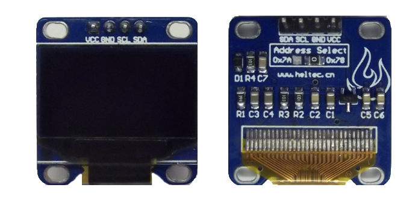
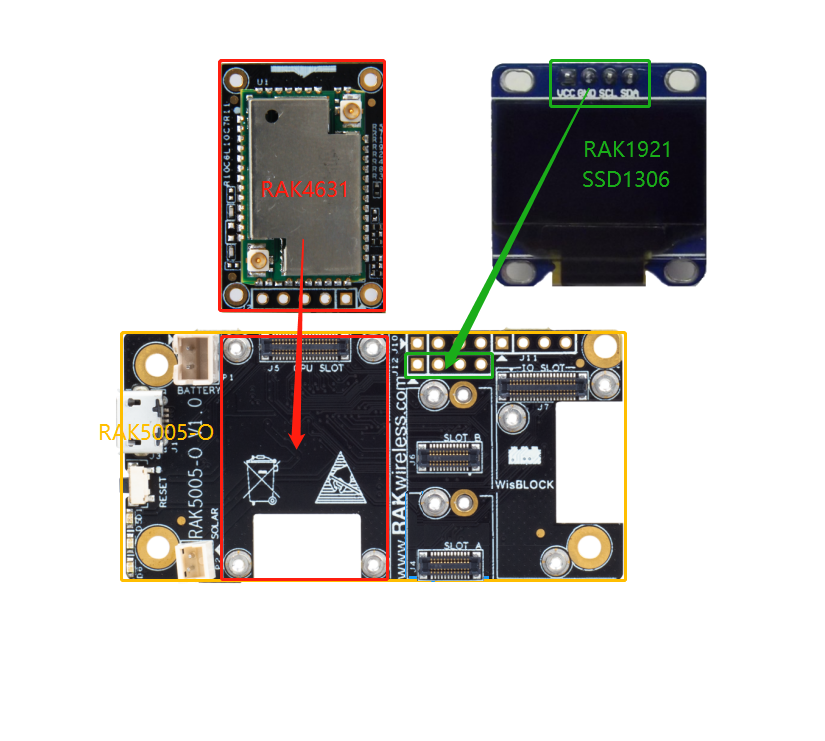

# WisBlock IO RAK1921 OLED Board Programming Guide

This example shows how to use WisBlock IO RAK1921 which is an OLED SSD1306(128*64, I2C) board.



----
## Hardware required
----
The following hardware are required.

- WisBlock Base RAK5005-O  \*  1pcs    
- WisBlock Core RAK4631      \*  1pcs    
- WisBlock IO RAK1921          \*  1pcs    


Hardware is shown as follows:



Assembled as follows:


For stable connection, please use screws to tighten.

----
## Software required
----
To use the environment WisBlock Sensor RAK1906, The following software is required.

- [ArduinoIDE](https://www.arduino.cc/en/Main/Software)
- [RAK4630 BSP](/BSP/)
- U8g2 library


Connect the assembled hardware to the PC with a USB cable, open the Arduino, and select the development board and port in the tool menu.


## Demo

### Demo 1

The Demo  is designed to display an animated ball on SSD1306.

```
#include <Arduino.h>
#include <U8g2lib.h>   //https://github.com/olikraus/u8g2

U8G2_SSD1306_128X64_NONAME_F_HW_I2C u8g2(U8G2_R0);

void setup(void) {
  u8g2.begin();
}

//128 * 64
int x = 20;  //  5<=x<=123
int y = 20;  //  5<=y<=59

void loop(void) {
  u8g2.clearBuffer();                   // clear the internal memory
  u8g2.drawCircle(x, y, 5, U8G2_DRAW_ALL);
  central();
  u8g2.sendBuffer();                    // transfer internal memory to the display
  delay(10);
}

int h = 0; // 0 down, 1 up
int v = 0;  // 0 left,1 right

void central()
{

  if (x == 5)
  {
    v = 1;
  }
  if (x == 123)
  {
    v = 0;
  }
  if (y == 5)
  {
    h = 0;
  }
  if (y == 59 )
  {
    h = 1;
  }
  if (v == 1)
    x++;
  else
    x--;
  if (h == 0)
    y++;
  else
    y--;
}
```


The test results are as follows：


