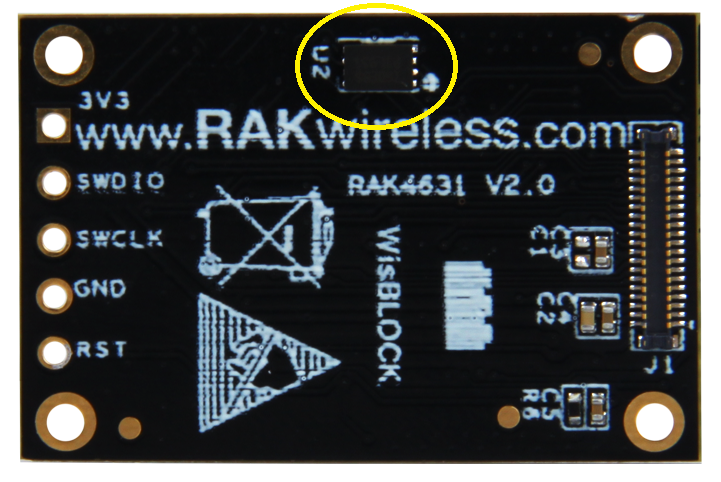
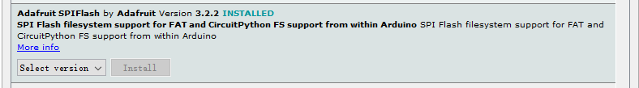

# RAK4630 NOR-Flash
This example shows how to access the external NOR Flash (8 MiB) on the RAK4630 module. The NOR Flash is a nonvolitale memory chip that keeps its data even after power off. It is the place to store e.g. you LoRaWan® device ID, application key and join EUI.

## Hardware required
To test the external NOR Flash, the following hardware is required:

- WisBlock Base RAK5005-O * 1pcs
- WisBlock Core RAK4631 * 1pcs    


## Software required
To test the external NOR Flash, the following is required


- [ArduinoIDE](https://www.arduino.cc/en/Main/Software)
- [RAK4630 BSP](/BSP/)
- Adafruit SPIFlash library    



- SDFAT file system


The test software is written as follow:
```cpp
/**
 * @file main.cpp
 * @author Bernd Giesecke (bernd.giesecke@rakwireless.com)
 * @brief Test RAK4631 QSPI flash
 * @version 0.1
 * @date 2020-07-30
 * 
 * @copyright Copyright (c) 2020
 * 
 */

#include <Arduino.h>
#include "SdFat.h"
#include "Adafruit_SPIFlash.h"

/** Adafruit QSPI Flash Transport */
Adafruit_FlashTransport_QSPI flashTransport;
/** Adafruit SPI Flash */
Adafruit_SPIFlash flash(&flashTransport);

/** Flash definition structure for ISSI IS25LP080D NOR Flash */
SPIFlash_Device_t rakFlash{
  .total_size = (1 << 23), /* 8 MiB */
  .start_up_time_us = 300,
  .manufacturer_id = 0x9D,
  .memory_type = 0x60,
  .capacity = 0x14,
  .max_clock_speed_mhz = 133,
  .quad_enable_bit_mask = 0x40,
  .has_sector_protection = false,
  .supports_fast_read = true,
  .supports_qspi = true,
  .supports_qspi_writes = true,
  .write_status_register_split = false,
  .single_status_byte = true,
};
/** Buffer to write to Flash */
uint8_t flashBuffer[512] = {0};
/** Buffer to read from Flash */
uint8_t buf[512];

/**
 * @brief Arduino setup function
 * @note Called once after power on or reset
 * 
 */
void setup(void)
{
  // Initialize builtin LED
  pinMode(LED_BUILTIN, OUTPUT);
  digitalWrite(LED_BUILTIN, HIGH);

  // Initialize Serial for debug output
  Serial.begin(115200);

  // Wait for USB Serial to be ready
  time_t timeout = millis();
  while (!Serial)
  {
    if ((millis() - timeout) < 5000)
    {
      delay(100);
      digitalWrite(LED_BUILTIN, !digitalRead(LED_BUILTIN));
    }
    else
    {
      break;
    }
  }

  digitalWrite(LED_BUILTIN, LOW);
  Serial.println("=====================================");
  Serial.println("RAK4631 Flash test");
  Serial.println("=====================================");

  // Fill the buffer with some values
  flashBuffer[0] = 0xAA;
  flashBuffer[1] = 0x55;
  flashBuffer[2] = 0x00;
  flashBuffer[3] = 0xFF;

  for (int i = 4; i < 512; i++)
  {
    flashBuffer[i] = i;
  }

  // Start access to the flash
  if (!flash.begin(&rakFlash))
  {
    Serial.println("Flash access failed, check the settings");
  }
  flash.waitUntilReady();

  // Get Flash information
  Serial.print("JEDEC ID: ");
  Serial.print(flash.getJEDECID(), HEX);
  Serial.print(" Flash size: ");
  Serial.print(flash.size());
  Serial.print(" # pages: ");
  Serial.print(flash.numPages());
  Serial.print(" page size: ");
  Serial.println(flash.pageSize());

  // Get content of the flash
  flash.readBuffer(0, buf, 256);
  Serial.println("First 16 bytes before erasing Flash");
  Serial.printf("%X %X %X %X %X %X %X %X %X %X %X %X %X %X %X %X\n",
          buf[0], buf[1], buf[2], buf[3],
          buf[4], buf[5], buf[6], buf[7],
          buf[8], buf[9], buf[10], buf[11],
          buf[12], buf[13], buf[14], buf[15]);

  // Erase the Flash content
  Serial.println("Erase Flash");
  flash.eraseChip();
  flash.waitUntilReady();

  // Read the content to see if erasing worked
  flash.readBuffer(0, buf, 256);
  Serial.println("First 16 bytes after erasing Flash");
  Serial.printf("%X %X %X %X %X %X %X %X %X %X %X %X %X %X %X %X\n",
          buf[0], buf[1], buf[2], buf[3],
          buf[4], buf[5], buf[6], buf[7],
          buf[8], buf[9], buf[10], buf[11],
          buf[12], buf[13], buf[14], buf[15]);

  // Write new data to the Flash
  Serial.println("Writing 0xAA, 0x55, 0x00, 0xFF");

  flash.writeBuffer(0, flashBuffer, 512);
  flash.waitUntilReady();

  Serial.println("Write done");

  // Read the content to see if write worked
  flash.readBuffer(0, buf, 16);
  Serial.println("First 16 bytes after writing new content");
  Serial.printf("%X %X %X %X %X %X %X %X %X %X %X %X %X %X %X %X\n",
          buf[0], buf[1], buf[2], buf[3],
          buf[4], buf[5], buf[6], buf[7],
          buf[8], buf[9], buf[10], buf[11],
          buf[12], buf[13], buf[14], buf[15]);

  // That's all folks, we loop here until next time
  while (1)
  {
    delay(300);
    digitalWrite(LED_BUILTIN, !digitalRead(LED_BUILTIN));
  }
}

/**
 * @brief Arduino loop function
 * @note We do nothing here in this example
 * 
 */
void loop(void)
{
}
```
## Test results
```log
=====================================
RAK4631 Flash test
=====================================
JEDEC ID: 9D6014 Flash size: 8388608 # pages: 32768 page size: 256
First 16 bytes before erasing Flash
AA 55 0 FF 4 5 6 7 8 9 A B C D E F
Erase Flash
First 16 bytes after erasing Flash
FF FF FF FF FF FF FF FF FF FF FF FF FF FF FF FF
Writing 0xAA, 0x55, 0x00, 0xFF
Write done
First 16 bytes after writing new content
AA 55 0 FF 4 5 6 7 8 9 A B C D E F
```