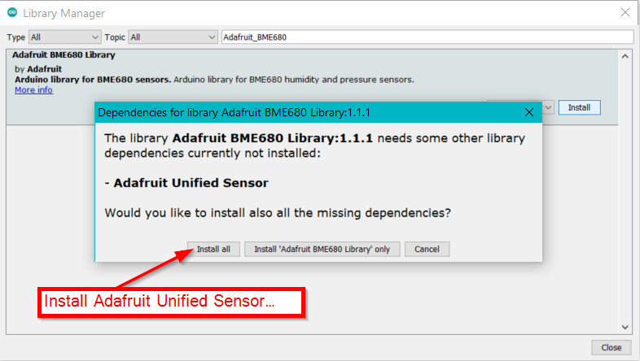

## Environment Monitoring over LoRaWAN®
This solution shows how to create an environmental data sensor node. The sensor node measures air temperature, air humidity, barometric pressure and gas levels. After the node joins to server successfully, It then transmits this data periodically to a LoRaWan® server. 

### Data Format 

| Byte1 | Byte2        | Byte3        | Byte4     | Byte5     |
| ----- | ------------ | ------------ | --------- | --------- |
| 1     | Temperature1 | Temperature2 | Humidity1 | Humidity2 |

| Byte6       | Byte7       | Byte8       | Byte9       | Byte10 | Byte11 | Byte12 | Byte13 |
| ----------- | ----------- | ----------- | ----------- | ------ | ------ | ------ | ------ |
| Barometric1 | Barometric2 | Barometric3 | Barometric4 | Gas1   | Gas2   | Gas3   | Gas4   |


  - Byte 1 is a marker for the data type, here always 1    
  - Every value is MSB first
  - Temperature is sent as two bytes, enlarged 100 times for accuracy. For example, 2510 means 25.01 C, sent as  0x09 0xCE
  - Humidity is sent as two bytes, enlarged 100 times for accuracy. For example, 4173 means 41.73 %, sent as  0x10 0x4D
  - Barometric pressure is sent as four bytes, enlarged 100 times for accuracy. For example, 100945 means 1009.45 hPa, sent as 0x00 0x01 0x8A 0x51
  - Gas resistance is sent as as four bytes,  For example, 63560 Ohm, sent as 0x00 0x00 0xF8 0x48

### Attention
If this examples is implemented for the Region US915, DR0 cannot be used because the package size is too large to fit into the allowed payload.    

### Hardware required
To build this system, the following hardware are required:

- WisBlock Base RAK5005-O * 1pcs   
- WisBlock Core RAK4631 * 1pcs   
- WisBlock Sensor RAK1906 * 1pcs    


### Software required
- [Arduino IDE](https://www.arduino.cc/en/Main/Software)
- [RAK4630 BSP](https://github.com/RAKWireless/RAK-nRF52-Arduino)    
- Adafruit BME680 Library


During the installation you will be asked to install the Adafruit Unified Sensor library. Please install it as well.


- SX126x-Arduino library


The code for the environment sensor node is as follows:
```cpp
/**
   @file Environment_Monitoring.ino
   @author rakwireless.com
   @brief This sketch demonstrate how to get environment data from BME680
      and send the data to lora gateway.
   @version 0.1
   @date 2020-07-28

   @copyright Copyright (c) 2020

   @note RAK5005-O GPIO mapping to RAK4631 GPIO ports
   RAK5005-O <->  nRF52840
   IO1       <->  P0.17 (Arduino GPIO number 17)
   IO2       <->  P1.02 (Arduino GPIO number 34)
   IO3       <->  P0.21 (Arduino GPIO number 21)
   IO4       <->  P0.04 (Arduino GPIO number 4)
   IO5       <->  P0.09 (Arduino GPIO number 9)
   IO6       <->  P0.10 (Arduino GPIO number 10)
   SW1       <->  P0.01 (Arduino GPIO number 1)
   A0        <->  P0.04/AIN2 (Arduino Analog A2
   A1        <->  P0.31/AIN7 (Arduino Analog A7
   SPI_CS    <->  P0.26 (Arduino GPIO number 26)
*/

#include <Arduino.h>
#include <LoRaWan-RAK4630.h> // Click to install library: http://librarymanager/ALL#SX126x-Arduino
#include <SPI.h>

#include <Wire.h>
#include <Adafruit_Sensor.h>
#include <Adafruit_BME680.h> // Click to install library: http://librarymanager/All#Adafruit_BME680
#include <U8g2lib.h>		   // Click to install library: http://librarymanager/ALL#u8g2

U8G2_SSD1306_128X64_NONAME_F_HW_I2C u8g2(U8G2_R0);
Adafruit_BME680 bme;

// RAK4630 supply two LED
#ifndef LED_BUILTIN
#define LED_BUILTIN 35
#endif

#ifndef LED_BUILTIN2
#define LED_BUILTIN2 36
#endif

bool doOTAA = true;
#define SCHED_MAX_EVENT_DATA_SIZE APP_TIMER_SCHED_EVENT_DATA_SIZE /**< Maximum size of scheduler events. */
#define SCHED_QUEUE_SIZE 60										  /**< Maximum number of events in the scheduler queue. */
#define LORAWAN_DATERATE DR_3									  /*LoRaMac datarates definition, from DR_0 to DR_5*/
#define LORAWAN_TX_POWER TX_POWER_0								  /*LoRaMac tx power definition, from TX_POWER_0 to TX_POWER_15*/
#define JOINREQ_NBTRIALS 5										  /**< Number of trials for the join request. */
DeviceClass_t gCurrentClass = CLASS_A;							  /* class definition*/
lmh_confirm gCurrentConfirm = LMH_CONFIRMED_MSG;				  /* confirm/unconfirm packet definition*/
uint8_t gAppPort = LORAWAN_APP_PORT;							  /* data port*/

/**@brief Structure containing LoRaWan parameters, needed for lmh_init()
*/
static lmh_param_t lora_param_init = {LORAWAN_ADR_OFF, LORAWAN_DATERATE, LORAWAN_PUBLIC_NETWORK, JOINREQ_NBTRIALS, LORAWAN_TX_POWER, LORAWAN_DUTYCYCLE_OFF};

// Foward declaration
static void lorawan_has_joined_handler(void);
void lorawan_join_fail(void);
static void lorawan_rx_handler(lmh_app_data_t *app_data);
static void lorawan_confirm_class_handler(DeviceClass_t Class);
static void send_lora_frame(void);

/**@brief Structure containing LoRaWan callback functions, needed for lmh_init()
*/
static lmh_callback_t lora_callbacks = {BoardGetBatteryLevel, BoardGetUniqueId, BoardGetRandomSeed,
                                        lorawan_rx_handler, lorawan_has_joined_handler, lorawan_confirm_class_handler, lorawan_join_fail
                                       };

//OTAA keys !!! KEYS ARE MSB !!!
/** Device EUI required for OTAA network join */
uint8_t nodeDeviceEUI[8] = {0x00, 0x0D, 0x75, 0xE6, 0x56, 0x4D, 0xC1, 0xF3};
/** Application EUI required for network join */
uint8_t nodeAppEUI[8] = {0x70, 0xB3, 0xD5, 0x7E, 0xD0, 0x02, 0x01, 0xE1};
/** Application key required for network join */
uint8_t nodeAppKey[16] = {0x2B, 0x84, 0xE0, 0xB0, 0x9B, 0x68, 0xE5, 0xCB, 0x42, 0x17, 0x6F, 0xE7, 0x53, 0xDC, 0xEE, 0x79};
/** Device address required for ABP network join */

// Private defination
#define LORAWAN_APP_DATA_BUFF_SIZE 64										  /**< buffer size of the data to be transmitted. */
#define LORAWAN_APP_INTERVAL 20000											  /**< Defines for user timer, the application data transmission interval. 20s, value in [ms]. */
static uint8_t m_lora_app_data_buffer[LORAWAN_APP_DATA_BUFF_SIZE];			  //< Lora user application data buffer.
static lmh_app_data_t m_lora_app_data = {m_lora_app_data_buffer, 0, 0, 0, 0}; //< Lora user application data structure.

TimerEvent_t appTimer;
static uint32_t timers_init(void);
static uint32_t count = 0;
static uint32_t count_fail = 0;

void setup()
{
  // Initialize the built in LED
  pinMode(LED_BUILTIN, OUTPUT);
  digitalWrite(LED_BUILTIN, LOW);

  // Initialize Serial for debug output
  Serial.begin(115200);

  time_t serial_timeout = millis();
  // On nRF52840 the USB serial is not available immediately
  while (!Serial)
  {
    if ((millis() - serial_timeout) < 5000)
    {
      delay(100);
      digitalWrite(LED_BUILTIN, !digitalRead(LED_BUILTIN));
    }
    else
    {
      break;
    }
  }

  Serial.println("=====================================");
  Serial.println("Welcome to RAK4630 LoRaWan!!!");
  Serial.println("Type: OTAA");

#if defined(REGION_AS923)
  Serial.println("Region: AS923");
#elif defined(REGION_AU915)
  Serial.println("Region: AU915");
#elif defined(REGION_CN470)
  Serial.println("Region: CN470");
#elif defined(REGION_CN779)
  Serial.println("Region: CN779");
#elif defined(REGION_EU433)
  Serial.println("Region: EU433");
#elif defined(REGION_IN865)
  Serial.println("Region: IN865");
#elif defined(REGION_EU868)
  Serial.println("Region: EU868");
#elif defined(REGION_KR920)
  Serial.println("Region: KR920");
#elif defined(REGION_US915)
  Serial.println("Region: US915");
#elif defined(REGION_US915_HYBRID)
  Serial.println("Region: US915_HYBRID");
#else
  Serial.println("Please define a region in the compiler options.");
#endif
  Serial.println("=====================================");

  // Initialize LoRa chip.
  lora_rak4630_init();

  /* bme680 init */
  init_bme680();

  u8g2.begin();

  //creat a user timer to send data to server period
  uint32_t err_code;

  err_code = timers_init();
  if (err_code != 0)
  {
    Serial.printf("timers_init failed - %d\n", err_code);
  }

  // Setup the EUIs and Keys
  lmh_setDevEui(nodeDeviceEUI);
  lmh_setAppEui(nodeAppEUI);
  lmh_setAppKey(nodeAppKey);

  // Initialize LoRaWan
  err_code = lmh_init(&lora_callbacks, lora_param_init, doOTAA);
  if (err_code != 0)
  {
    Serial.printf("lmh_init failed - %d\n", err_code);
  }

#ifdef REGION_US915
  // Set correct sub band channel
  if (!lmh_setSubBandChannels(1))
  {
    Serial.println("lmh_setSubBandChannels failed. Wrong sub band requested?");
  }
#endif
  // Start Join procedure
  u8g2.clearBuffer();					// clear the internal memory
  u8g2.setFont(u8g2_font_ncenB10_tr); // choose a suitable font

  u8g2.drawStr(20, 39, "Joining ...");
  u8g2.sendBuffer(); // transfer internal memory to the display
  lmh_join();
}

void loop()
{
  // Handle Radio events
  Radio.IrqProcess();
}

/**@brief LoRa function for failed Join event
*/
void lorawan_join_fail(void)
{
  Serial.println("OTAA join failed!");
}

/**@brief LoRa function for handling HasJoined event.
*/
void lorawan_has_joined_handler(void)
{
  Serial.println("OTAA Mode, Network Joined!");
  u8g2.clearBuffer();					// clear the internal memory
  u8g2.setFont(u8g2_font_ncenB10_tr); // choose a suitable font

  u8g2.drawStr(20, 39, "Joined");
  u8g2.sendBuffer(); // transfer internal memory to the display
  //delay(2000);

  lmh_error_status ret = lmh_class_request(gCurrentClass);
  if (ret == LMH_SUCCESS)
  {
    delay(1000);
    TimerSetValue(&appTimer, LORAWAN_APP_INTERVAL);
    TimerStart(&appTimer);
  }
}

/**@brief Function for handling LoRaWan received data from Gateway

   @param[in] app_data  Pointer to rx data
*/
void lorawan_rx_handler(lmh_app_data_t *app_data)
{
  Serial.printf("LoRa Packet received on port %d, size:%d, rssi:%d, snr:%d, data:%s\n",
                app_data->port, app_data->buffsize, app_data->rssi, app_data->snr, app_data->buffer);
}

void lorawan_confirm_class_handler(DeviceClass_t Class)
{
  Serial.printf("switch to class %c done\n", "ABC"[Class]);
  // Informs the server that switch has occurred ASAP
  m_lora_app_data.buffsize = 0;
  m_lora_app_data.port = gAppPort;
  lmh_send(&m_lora_app_data, gCurrentConfirm);
}

void send_lora_frame(void)
{
  if (lmh_join_status_get() != LMH_SET)
  {
    //Not joined, try again later
    return;
  }
  if (!bme.performReading()) {
    return;
  }
  bme680_get();

  lmh_error_status error = lmh_send(&m_lora_app_data, gCurrentConfirm);
  if (error == LMH_SUCCESS)
  {
    count++;
    Serial.printf("lmh_send ok count %d\n", count);
  }
  else
  {
    count_fail++;
    Serial.printf("lmh_send fail count %d\n", count_fail);
  }
}

/**@brief Function for handling user timerout event.
*/
void tx_lora_periodic_handler(void)
{
  TimerSetValue(&appTimer, LORAWAN_APP_INTERVAL);
  TimerStart(&appTimer);
  Serial.println("Sending frame now...");
  send_lora_frame();
}

/**@brief Function for the Timer initialization.

   @details Initializes the timer module. This creates and starts application timers.
*/
uint32_t timers_init(void)
{
  TimerInit(&appTimer, tx_lora_periodic_handler);
  return 0;
}

void init_bme680(void)
{
  Wire.begin();

  if (!bme.begin(0x76)) {
    Serial.println("Could not find a valid BME680 sensor, check wiring!");
    return;
  }

  // Set up oversampling and filter initialization
  bme.setTemperatureOversampling(BME680_OS_8X);
  bme.setHumidityOversampling(BME680_OS_2X);
  bme.setPressureOversampling(BME680_OS_4X);
  bme.setIIRFilterSize(BME680_FILTER_SIZE_3);
  bme.setGasHeater(320, 150); // 320*C for 150 ms
}

String data = "";

void bme680_get()
{
  char oled_data[32] = {0};
  Serial.print("result: ");
  uint32_t i = 0;
  memset(m_lora_app_data.buffer, 0, LORAWAN_APP_DATA_BUFF_SIZE);
  m_lora_app_data.port = gAppPort;

  double temp = bme.temperature;
  double pres = bme.pressure / 100.0;
  double hum = bme.humidity;
  uint32_t gas = bme.gas_resistance;

  data = "Tem:" + String(temp) + "C " + "Hum:" + String(hum) + "% " + "Pres:" + String(pres) + "KPa " + "Gas:" + String(gas) + "Ohms";
  Serial.println(data);

  // display bme680 sensor data on OLED
  u8g2.clearBuffer();					// clear the internal memory
  u8g2.setFont(u8g2_font_ncenB10_tr); // choose a suitable font

  memset(oled_data, 0, sizeof(oled_data));
  sprintf(oled_data, "T=%.2fC", temp);
  u8g2.drawStr(3, 15, oled_data);

  memset(oled_data, 0, sizeof(oled_data));
  snprintf(oled_data, 64, "RH=%.2f%%", hum);
  u8g2.drawStr(3, 30, oled_data);

  memset(oled_data, 0, sizeof(oled_data));
  sprintf(oled_data, "P=%.2fhPa", pres);
  u8g2.drawStr(3, 45, oled_data);

  memset(oled_data, 0, sizeof(oled_data));
  sprintf(oled_data, "G=%dOhms", gas);
  u8g2.drawStr(3, 60, oled_data);

  u8g2.sendBuffer(); // transfer internal memory to the display

  uint16_t t = temp * 100;
  uint16_t h = hum * 100;
  uint32_t pre = pres * 100;

  //result: T=28.25C, RH=50.00%, P=958.57hPa, G=100406 Ohms
  m_lora_app_data.buffer[i++] = 0x01;
  m_lora_app_data.buffer[i++] = (uint8_t)(t >> 8);
  m_lora_app_data.buffer[i++] = (uint8_t)t;
  m_lora_app_data.buffer[i++] = (uint8_t)(h >> 8);
  m_lora_app_data.buffer[i++] = (uint8_t)h;
  m_lora_app_data.buffer[i++] = (uint8_t)((pre & 0xFF000000) >> 24);
  m_lora_app_data.buffer[i++] = (uint8_t)((pre & 0x00FF0000) >> 16);
  m_lora_app_data.buffer[i++] = (uint8_t)((pre & 0x0000FF00) >> 8);
  m_lora_app_data.buffer[i++] = (uint8_t)(pre & 0x000000FF);
  m_lora_app_data.buffer[i++] = (uint8_t)((gas & 0xFF000000) >> 24);
  m_lora_app_data.buffer[i++] = (uint8_t)((gas & 0x00FF0000) >> 16);
  m_lora_app_data.buffer[i++] = (uint8_t)((gas & 0x0000FF00) >> 8);
  m_lora_app_data.buffer[i++] = (uint8_t)(gas & 0x000000FF);
  m_lora_app_data.buffsize = i;
}
```

### Result

```js
10:30:07.777 -> =====================================
10:30:07.777 -> Welcome to RAK4630 LoRaWan!!!
10:30:07.777 -> Type: OTAA
10:30:07.777 -> Region: EU868
10:30:07.777 -> =====================================
10:30:07.777 -> Chip ID=0x61
10:30:12.974 -> OTAA Mode, Network Joined!
10:30:33.999 -> Sending frame now...
10:30:33.999 -> result: Tem:28.70C Hum:67.00% Pres:948.50KPa Gas:27646Ohms
10:30:33.999 -> lmh_send ok count 1
10:30:53.979 -> Sending frame now...
10:30:53.979 -> result: Tem:28.70C Hum:67.00% Pres:948.50KPa Gas:242488Ohms
10:30:54.012 -> lmh_send ok count 2
10:31:14.006 -> Sending frame now...
10:31:14.006 -> result: Tem:28.70C Hum:67.00% Pres:948.50KPa Gas:457174Ohms
10:31:14.006 -> lmh_send ok count 3
10:31:33.997 -> Sending frame now...
10:31:33.997 -> result: Tem:28.69C Hum:67.00% Pres:948.50KPa Gas:74102Ohms
10:31:34.032 -> lmh_send ok count 4

```

Data arrives at LoRaWAN® server.


LoRa® is a registered trademark or service mark of Semtech Corporation or its affiliates. LoRaWAN® is a licensed mark.

