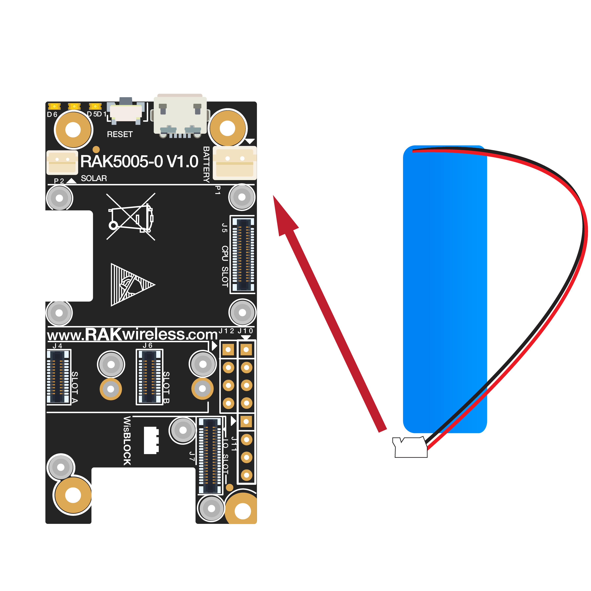
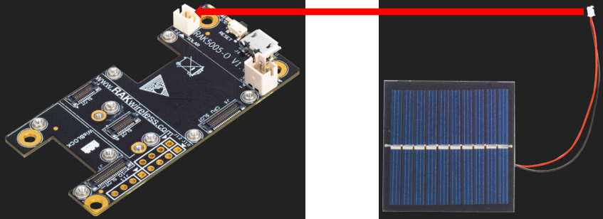

# WisBlock Quick Start Guide

## Content
- [Introduction](#introduction)    
- [Safety information](#safety-information)    
- [Hardware Setup](#hardware-setup)

## Introduction

WisBlock is an amazing product built by RAK company for IoT industry. It can build circuits like building blocks quickly to realize your idea, and through high-speed connectors and fasteners interconnection, it can directly compose the reliable industrial products.

WisBlock consists of WisBlock Base, WisBlock Core, WisBlock Sensor, and WisBlock IO.

RAK5005-O is the WisBlock Base board which can be connected with WisBlock Core and WisBlock IO through the connector of the board, and provides direct data bus interconnection. WisBlock Base module also integrates the power supply circuit to realize low power battery power supply. In order to facilitate users, WisBlock Base has reserved USB ports, indicator lights, keys and extended IO interfaces.

WisBlock is not only a functional test capable product in product development verification stage, but also industrial products oriented to mass production. It uses a high-speed connector to ensure the integrity of the signal. At the same time, it is equipped with fastening screw, which can be used in vibration environment. And WisBlock can be used reliably in various civil and industrial scenarios through rigorous reliability tests.

WisBlock uses a compact stacked hardware design, which integrates various computing, connecting and sensor circuits in the size of 60*30mm. The compact size makes it easy for users to build in various customized housings to achieve complete products. RAK also have a series of housings for WisBlock modules, which can meet the requirements of various protection levels.

More details about WisBlock hardware, please have a look at the document:

https://docs.rakwireless.com/Product-Categories/WisBlock/

## Safety information

Please read the following items carefully so that WisBlock can be used safely.

### Hardware

1) Please use WisBlock according to its hardware specification, including the power supply, the temperature of using, the battery, and so on.

2) Don't submerge WisBlock in liquids, and don't place WisBlock where water can reach.

3) Don't power WisBlock using other power sources which RAK hasn't suggested.

### Software

1)  There is already a bootloader in every WisBlock core board MCU when you receive the device, so that you needn't to flash the bootloader again. Normally, you only need to use it directly or upload new code into it through Arduino IDE. If you accidentally erase the bootloader, please contact with us on RAK forum: forum.rakwireless.com.

2) Please don't unplug any hardware connector when you are uploading code into it, otherwise WisBlock may become unresponsive.

## Hardware Setup

### WisBlock Base Board--- RAK5005-O

RAK5005-O is the WisBlock Base board which can connect with the core board and other sensor boards through some slots. RAK5005-O has an USB interface which connect with the core MCU's USB pins so that you can use Arduino IDE to upload and debug it directly.

Please note: as you see, there are 6 slots on RAK5005-O, "CPU SLOT" is used for the core board which has the main MCU, "IO SLOT" is used for IO extension, for example, RS485 board, 4-20mA/0-5V board, Wi-Fi board, Cellular board. "SLOT A", "SLOT B", "SLOT C", and "SLOT D" are used to connect with I2C board, while "SLOT A" can be used for GPS board too.

You can have a look at the datasheet for more information:

https://docs.rakwireless.com/Product-Categories/WisBlock/RAK5005-O/Datasheet/#wisblock-overview

The RAK5005-O board offers several GPIO's on solder pads or on the WisBlock Sensor or WisBlock IO modules. These GPIO's are named IO1 to IO6 and SW1. These GPIO's are connected to GPIO's of the WisBlock Core modules and the pin assignments can be found in the Quick Start Guides of the WisBlock Core modules.

### Battery

Please use the battery which RAK suggest, and connect the battery with RAK5005-O as follow:     

# Important Reminder:
- ### When connecting the battery make sure the polarity is correct. Not all connectors are wired the same.
- ### Ground pole should be close to the PCB boarder.
- ### Plus pole should be close to USB connector.

The matching connector for the battery wires is an [JST PHR-2 2mm pitch female](https://www.jst-mfg.com/product/detail_e.php?series=199)

**Battery specification**     

| No.  | Items                     | Specifications           |
| ---- | ------------------------- | ------------------------ |
| 1    | Charge Cut-off Voltage    | 4.2V                     |
| 2    | Nominal Voltage           | 3.7V                     |
| 3    | Discharge Cut-off Voltage | 2.75V                    |
| 4    | Typical Capacity          | 2650mAh                  |
| 5    | Max Discharge Current     | 0.5C at 25℃-45℃          |
| 6    | PH Connector              | 2.0mm pitch              |
| 7    | Cable Length              | 110.0±3.0mm              |
| 8    | Cable Color               | Red: VBAT+, Black: VBAT- |

### Solar panel

You can connect the solar panel with RAK5005-O as follow:

The matching connector for the solar panel wires is an [JST ZHR-2 1.5mm pitch female](https://www.jst-mfg.com/product/detail_e.php?series=287)

**Solar panel specification**

| No.  | Items            | specifications                         |
| ---- | ---------------- | -------------------------------------- |
| 1    | Nominal  Voltage | 5V                                     |
| 2    | Typical Current  | 80mA                                   |
| 3    | Size             | Length: 60mm, Width: 60mm, Height: 2mm |
| 4    | Connector        | 1.5mm pitch                            |
| 5    | Cable color      | Red: VCC, Black: GND                   |

### Examples

[Examples](https://github.com/RAKWireless/WisBlock#examples)
