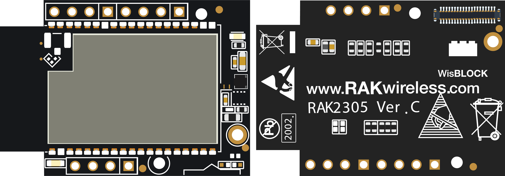
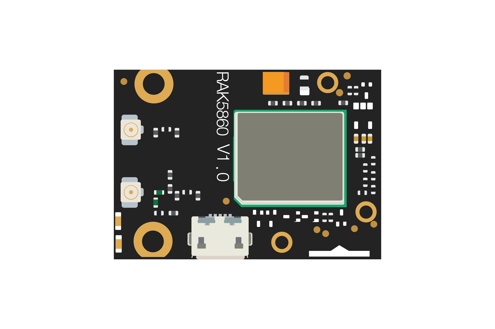
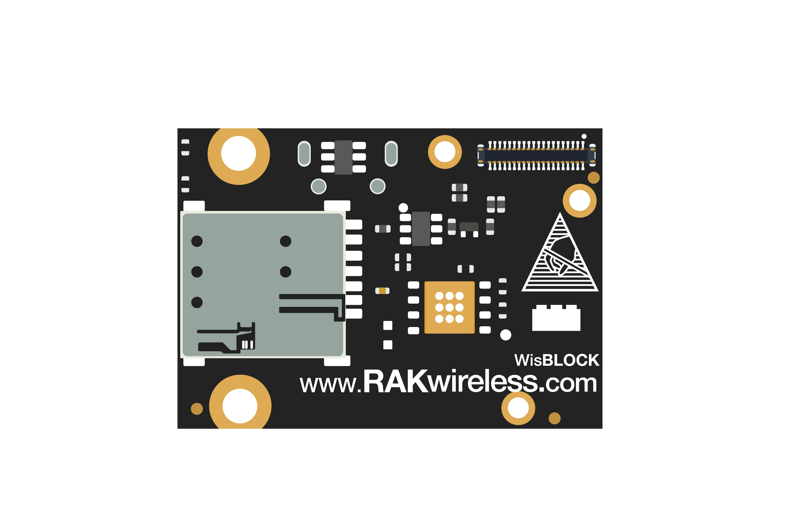
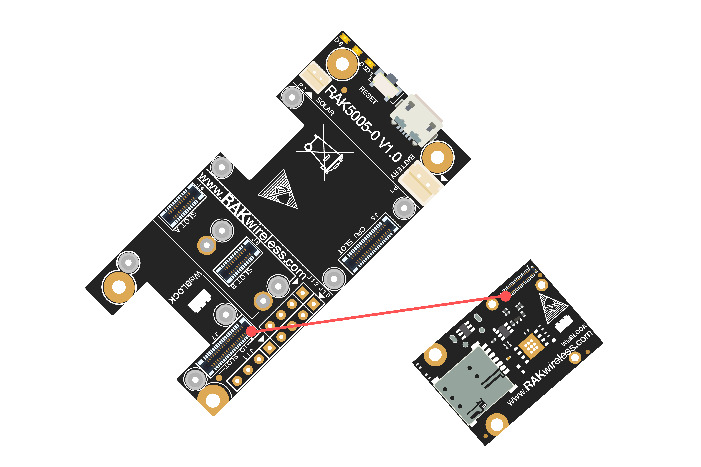
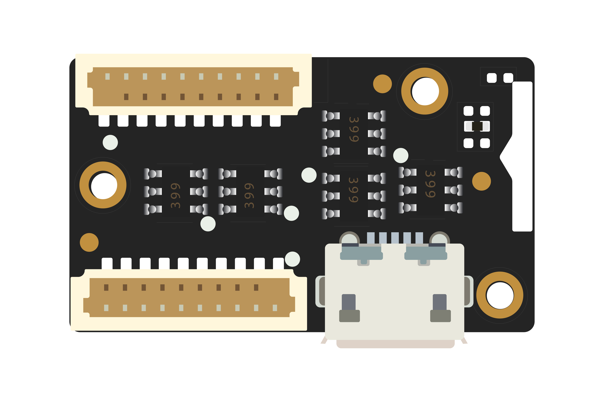
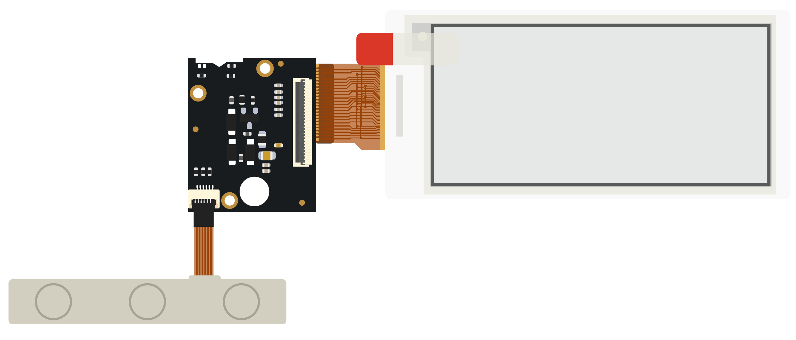
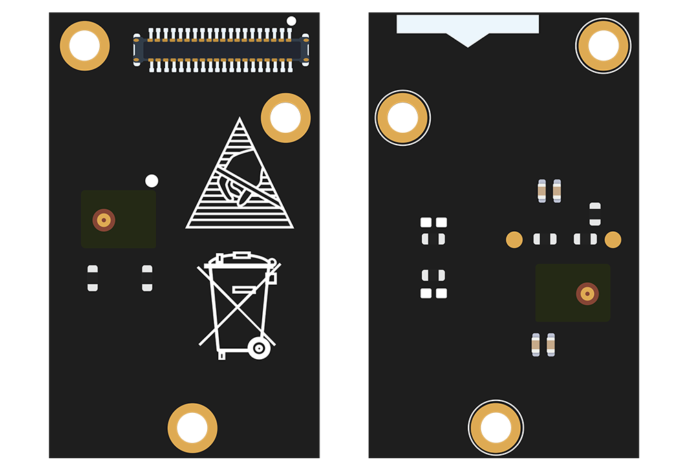

# WisBlock Quick Start Guide

## Content
- [Introduction](#introduction)    
- [Safety information](#safety-information)    
- [Hardware](#hardware)
- [Software](#software)
- [WisBlock IO Boards](#wisblock-io-boards)

## Introduction

WisBlock is an amazing product built by RAK company for IoT industry. It can build circuits like building blocks quickly to realize your idea, and through high-speed connectors and fasteners interconnection, it can directly compose the reliable industrial products.

WisBlock consists of WisBlock Base, WisBlock Core, WisBlock Sensor, and WisBlock IO.

RAK5005-O is the WisBlock Base board which can be connected with WisBlock Core and WisBlock IO through the connector of the board, and provides direct data bus interconnection. WisBlock Base module also integrates the power supply circuit to realize low power battery power supply. In order to facilitate users, WisBlock Base has reserved USB ports, indicator lights, keys and extended IO interfaces.

WisBlock is not only a functional test capable product in product development verification stage, but also industrial products oriented to mass production. It uses a high-speed connector to ensure the integrity of the signal. At the same time, it is equipped with fastening screw, which can be used in vibration environment. And WisBlock can be used reliably in various civil and industrial scenarios through rigorous reliability tests.

WisBlock uses a compact stacked hardware design, which integrates various computing, connecting and sensor circuits in the size of 60*30mm. The compact size makes it easy for users to build in various customized housings to achieve complete products. RAK also have a series of housings for WisBlock modules, which can meet the requirements of various protection levels.

More details about WisBlock hardware, please have a look at the document:

https://docs.rakwireless.com/Product-Categories/WisBlock/

## Safety information

Please read the following items carefully so that WisBlock can be used safely.

### Hardware

1) Please use WisBlock according to its hardware specification, including the power supply, the temperature of using, the battery, and so on.

2) Don't submerge WisBlock in liquids, and don't place WisBlock where water can reach.

3) Don't power WisBlock using other power sources which RAK hasn't suggested.

### Software

1)  SW libraries and examples are available for all WisBlock IO modules.

2) Please don't unplug any hardware connector when you are uploading code into it, otherwise WisBlock may become unresponsive.

### WisBlock IO Boards

#### WiFi board --- RAK2305

RAK2305 is a WiFi board which is ESP32 module actually, and it can only be connected with RAK5005-O through the IO SLOT.

More information about RAK2305, please have a look at the following link:

https://docs.rakwireless.com/Product-Categories/WisBlock/RAK2305/Overview/#product-description

#### Cellular board --- RAK5860

RAK5860 is a cellular board which uses Quectel BG77 module actually, and it can only be connected with RAK5005-O through IO SLOT.

 

More information about RAK5860, please have a look at the following link:

https://docs.rakwireless.com/Product-Categories/WisBlock/RAK5860/Overview/#product-description

#### 4~20mA board --- RAK5801

RAK5801 is an IO board which can connect with any 4~20mA sensors. This board can only be connected with RAK5005-O through IO SLOT.

More information about RAK5801, please have a look at the following link:

https://docs.rakwireless.com/Product-Categories/WisBlock/RAK5801/Overview/#product-description

#### 0~5V board --- RAK5811

RAK5811 is an IO board which can connect with any 0~5V sensors. This board can only be connected with RAK5005-O through IO SLOT.

More information about RAK5811, please have a look at the following link:

https://docs.rakwireless.com/Product-Categories/WisBlock/RAK5811/Overview/#product-description

#### RS485 board --- RAK5802

RAK5802 is an IO board which can connect with any RS485 sensors. This board can only be connected with RAK5005-O through IO SLOT.

More information about RAK5802, please have a look at the following link:

https://docs.rakwireless.com/Product-Categories/WisBlock/RAK5802/Overview/#product-description

#### IO extension board --- RAK5804

RAK5804 is an IO extension board which is used to extent more IO interface, and it can only be connected with RAK5005-O through IO SLOT.

More information about RAK5804, please have a look at the following link:

https://docs.rakwireless.com/Product-Categories/WisBlock/RAK5804/Overview/#product-description

#### Sensor conversion board --- RAK1920

RAK1920 is a sensor conversion board which can connect with any Microbus, Grove, or Qwiic sensors. This board can only be connected with RAK5005-O through IO SLOT.

More information about RAK1920, please have a look at the following link:

https://docs.rakwireless.com/Product-Categories/WisBlock/RAK1920/Overview/#product-description

#### OLED --- RAK1921

RAK1921 is an OLED board which uses SSD1306(128*64, I2C) actually.

https://docs.rakwireless.com/Product-Categories/WisBlock/RAK1921/Overview/#product-description

#### Epaper --- RAK14000

The RAK14000 is a WisBlock IO module that allows you to connect an E-Ink Display and Three-Button module. E-Ink Displays, also known as Electronic Paper, are display that consumes extremely low power. A perfect alternative to the conventional LCD and OLED displays, especially on power-conscious projects. Also, the E-Ink display contents stays visible for days even without any power supply.      
Display Resolution: 296 x 128 pixels

#### Stereo Microphone --- RAK18000

The RAK18000 is a digital microphone module that is designed to detect sounds and to support left and right channels. It is also capable of changing microphone orientation on the left or right channel through the switch resistor.

### Antennas

#### LTE antenna:

# INCLUDE IMAGE OF LTE ANTENNA

#### GPS antenna:

Just connect them to the IPEX connector of the RAK5860 or RAK1910.

### Examples

[Examples](https://github.com/RAKWireless/WisBlock#examples)
