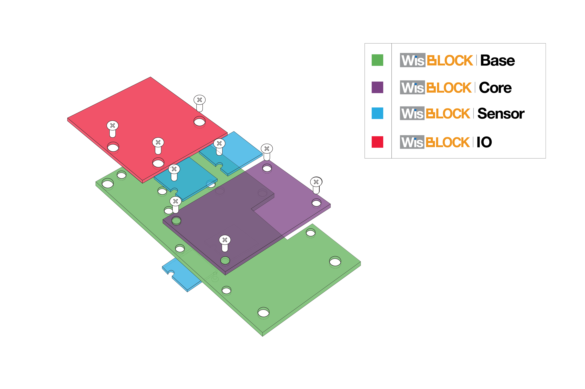
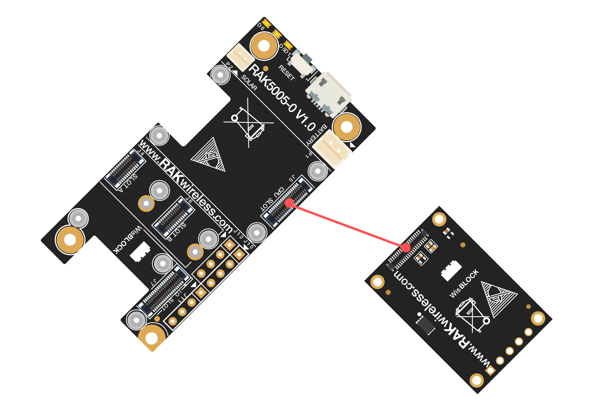

# WisBlock Quick Start Guide

## Content
- [Introduction](#introduction)    
- [Safety information](#safety-information)    
- [Hardware Setup](#hardware-setup)
- [Arduino IDE BSP Installation](#arduino-ide-bsp-installation)
- [Load Examples](#load-examples)

## Introduction

WisBlock is an amazing product built by RAK company for IoT industry. It can build circuits like building blocks quickly to realize your idea, and through high-speed connectors and fasteners interconnection, it can directly compose the reliable industrial products.

WisBlock consists of WisBlock Base, WisBlock Core, WisBlock Sensor, and WisBlock IO.

RAK4631 is the WisBlock Core board which consists of nRF52840 and SX1262. It supports LoRa® and BLE functions, and supply a rich resource MCU so that you can program it if you want.

WisBlock is not only a functional test capable product in product development verification stage, but also industrial products oriented to mass production. It uses a high-speed connector to ensure the integrity of the signal. At the same time, it is equipped with fastening screw, which can be used in vibration environment. And WisBlock can be used reliably in various civil and industrial scenarios through rigorous reliability tests.

WisBlock uses a compact stacked hardware design, which integrates various computing, connecting and sensor circuits in the size of 60*30mm. The compact size makes it easy for users to build in various customized housings to achieve complete products. RAK also have a series of housings for WisBlock modules, which can meet the requirements of various protection levels.

More details about WisBlock hardware, please have a look at the document:

https://docs.rakwireless.com/Product-Categories/WisBlock/

## Safety information

Please read the following items carefully so that WisBlock can be used safely.

### Hardware

1) Please use WisBlock according to its hardware specification, including the power supply, the temperature of using, the battery, and so on.

2) Don't submerge WisBlock in liquids, and don't place WisBlock where water can reach.

3) Don't power WisBlock using other power sources which RAK hasn't suggested.

### Software

1)  There is already a bootloader in every WisBlock core board MCU when you receive the device, so that you needn't to flash the bootloader again. Normally, you only need to use it directly or upload new code into it through Arduino IDE. If you accidentally erase the bootloader, please contact with us on RAK forum: forum.rakwireless.com.

2) Please don't unplug any hardware connector when you are uploading code into it, otherwise WisBlock may become unresponsive.

## Hardware Setup

### WisBlock Core board --- RAK4631

RAK4631 is the WisBlock Core board, because the MCU stay on this board.

RAK4631 consists of a nRF52840 MCU and a SX1262 LoRa® chip mainly. The final Arduino  code will be uploaded into nRF52840 actually. This core board supports BLE and LoRa® features. You can connect it with RAK5005-O base board with slot, and program it through the USB interface on RAK5005-O through Arduino IDE.

https://docs.rakwireless.com/Product-Categories/WisBlock/RAK4631/Datasheet/#overview

**RAK5005-O GPIO mapping to RAK4631 GPIO ports**
 * RAK5005-O <->  nRF52840
 * IO1       <->  P0.17 (Arduino GPIO number 17)
 * IO2       <->  P1.02 (Arduino GPIO number 34)
 * IO3       <->  P0.21 (Arduino GPIO number 21)
 * IO4       <->  P0.04 (Arduino GPIO number 4)
 * IO5       <->  P0.09 (Arduino GPIO number 9)
 * IO6       <->  P0.10 (Arduino GPIO number 10)
 * SW1       <->  P0.01 (Arduino GPIO number 1)
 * A0        <->  P0.04/AIN2 (Arduino Analog A2
 * A1        <->  P0.31/AIN7 (Arduino Analog A7
 * SPI_CS    <->  P0.26 (Arduino GPIO number 26) 

## Arduino IDE BSP Installation

You can use Arduino IDE for WisBlock coding and programming.

The RAK4631 is included in the RAKwireless Arduino BSP.       
You can find the installation instructions in our [RAKwireless Arduino BSP](https://github.com/RAKWireless/RAKwireless-Arduino-BSP-Index) repository.

### Examples

[Examples](https://github.com/RAKWireless/WisBlock#examples)