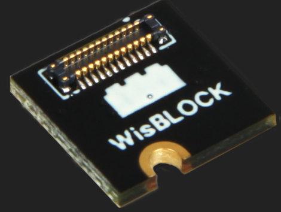
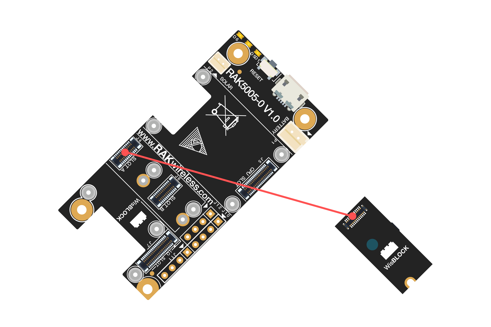
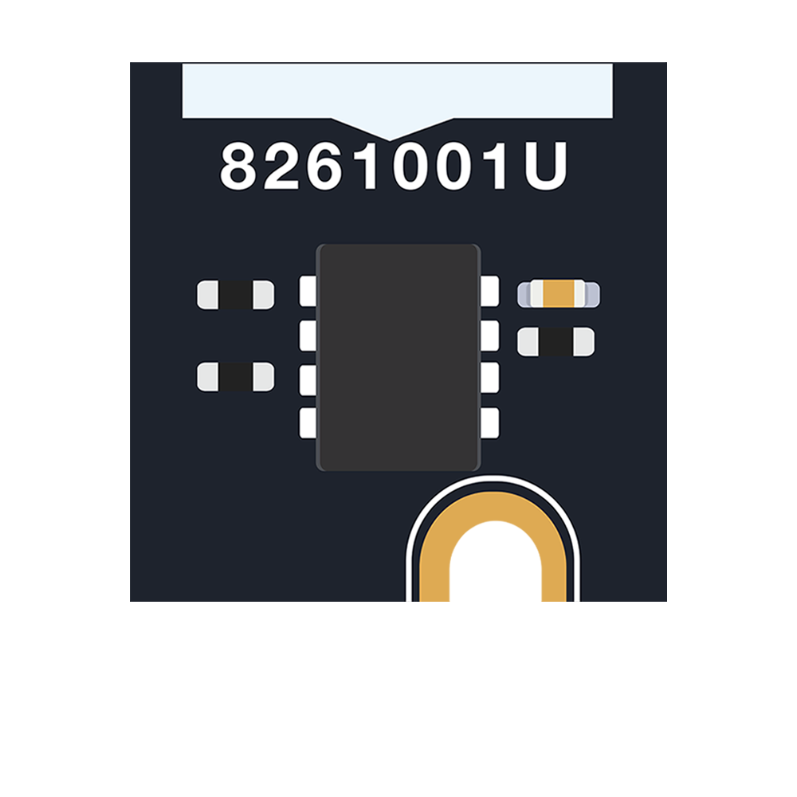
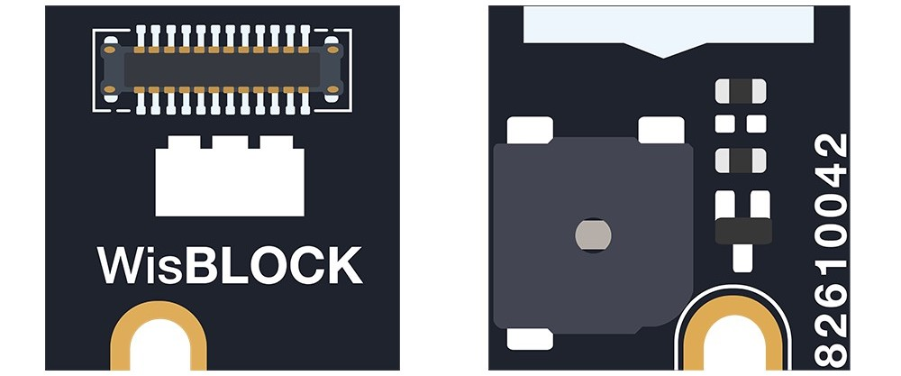
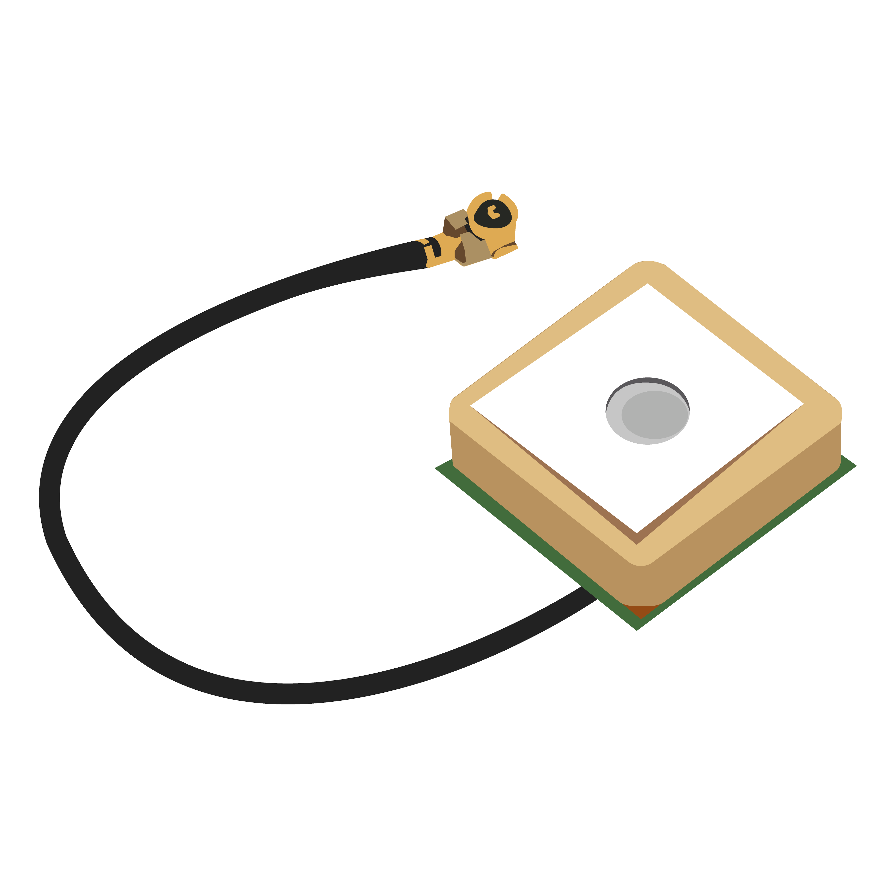

# WisBlock Quick Start Guide

## Content
- [Introduction](#introduction)    
- [Safety information](#safety-information)    
- [Hardware](#hardware)
- [Software](#software)
- [WisBlock Sensor Boards](#wisblock-sensor-boards)

## Introduction

WisBlock is an amazing product built by RAK company for IoT industry. It can build circuits like building blocks quickly to realize your idea, and through high-speed connectors and fasteners interconnection, it can directly compose the reliable industrial products.

WisBlock consists of WisBlock Base, WisBlock Core, WisBlock Sensor, and WisBlock IO.

RAK5005-O is the WisBlock Base board which can be connected with WisBlock Core and WisBlock IO through the connector of the board, and provides direct data bus interconnection. WisBlock Base module also integrates the power supply circuit to realize low power battery power supply. In order to facilitate users, WisBlock Base has reserved USB ports, indicator lights, keys and extended IO interfaces.

WisBlock is not only a functional test capable product in product development verification stage, but also industrial products oriented to mass production. It uses a high-speed connector to ensure the integrity of the signal. At the same time, it is equipped with fastening screw, which can be used in vibration environment. And WisBlock can be used reliably in various civil and industrial scenarios through rigorous reliability tests.

WisBlock uses a compact stacked hardware design, which integrates various computing, connecting and sensor circuits in the size of 60*30mm. The compact size makes it easy for users to build in various customized housings to achieve complete products. RAK also have a series of housings for WisBlock modules, which can meet the requirements of various protection levels.

More details about WisBlock hardware, please have a look at the document:

https://docs.rakwireless.com/Product-Categories/WisBlock/

## Safety information

Please read the following items carefully so that WisBlock can be used safely.

### Hardware

1) Please use WisBlock according to its hardware specification, including the power supply, the temperature of using, the battery, and so on.

2) Don't submerge WisBlock in liquids, and don't place WisBlock where water can reach.

3) Don't power WisBlock using other power sources which RAK hasn't suggested.

### Software

1)  SW libraries and examples are available for all WisBlock IO modules.

2) Please don't unplug any hardware connector when you are uploading code into it, otherwise WisBlock may become unresponsive.

### WisBlock Sensor Boards

#### Temperature & Humidity sensor board --- RAK1901

RAK1901 is a Temperature & Humidity sensor board with an I2C interface, which means it can be connected with RAK5005-O through the I2C slot (SLOT A/B/C/D).

  

More information about RAK1901, please have a look at the following link:

https://docs.rakwireless.com/Product-Categories/WisBlock/RAK1901/Overview/#product-description

#### Pressure sensor board --- RAK1902

RAK1902 is a pressure sensor board with an I2C interface, which means it can be connected with RAK5005-O through the I2C slot (SLOT A/B/C/D).

 

More information about RAK1902, please have a look at the following link:

https://docs.rakwireless.com/Product-Categories/WisBlock/RAK1902/Overview/#product-description

#### Optical sensor board --- RAK1903

RAK1903 is an optical sensor board with an I2C interface, which means it can be connected with RAK5005-O through the I2C slot (SLOT A/B/C/D).

 

More information about RAK1903, please have a look at the following link:

https://docs.rakwireless.com/Product-Categories/WisBlock/RAK1903/Overview/#product-description

#### 3-axis acceleration sensor board --- RAK1904

RAK1904 is a 3-axis acceleration sensor board with an I2C interface, which means it can be connected with RAK5005-O through the I2C slot (SLOT A/B/C/D).

 

More information about RAK1904, please have a look at the following link:

https://docs.rakwireless.com/Product-Categories/WisBlock/RAK1904/Overview/

#### Environment sensor board --- RAK1906

RAK1906 is an environment sensor board with I2C interface, which means it can be connected with RAK5005-O through the I2C slot (SLOT A/B/C/D).

 

More information about RAK1906, please have a look at the following link:

https://docs.rakwireless.com/Product-Categories/WisBlock/RAK1906/Overview/#product-description

#### GPS board --- RAK1910

RAK1910 is a GPS board with UART interface, which means it can only be connected with RAK5005-O through SLOT A.

 

More information about RAK1910, please have a look at the following link:

https://docs.rakwireless.com/Product-Categories/WisBlock/RAK1910/Overview/#product-description

#### GPS board --- RAK12500

RAK12500 is a GPS board with I2C interface.The RAK12500 uses the u-blox MAX-M8Q module. It supports a wide variety of satellite data protocols such as GPS, GLONASS, QZSS, and BeiDou. This ensures the retrieval of precise location data. The module features exceptional performance, high sensitivity, and minimal acquisition time. A very suitable module for your low-power IoT solution needs.

More information about RAK12500, please have a look at the following link:

https://docs.rakwireless.com/Product-Categories/WisBlock/

#### Infrared Temperature Sensor --- RAK12003

The RAK12003 WisBlock Infrared Temperature Sensor Module is part of the RAKwireless WisBlock Series. It can be used for an accurate contactless thermal measurement for applications such as General purpose industry, temperature control of moving and hard to reach parts, body temperature measurement, non-contact thermometer for mobile and IoT application.

More information about RAK12003, please have a look at the following link:

https://docs.rakwireless.com/Product-Categories/WisBlock/

#### EEPROM memory --- RAK15000

The RAK15000 WisBlock EEPROM module, part of the RAKwireless Wisblock series, is a serial EEPROM module with an I2C interface. Designed to work at low power mode, the standby average consumption is lower than 3 µA ( VCC = 5.5 V ). The RAK15000 uses Microchip AT24CM02 that provides 2,097,152 bits of Serial Electrically Erasable and Programmable Read-Only Memory (EEPROM), organized as 262,144 words of 8 bits each.

More information about RAK15000, please have a look at the following link:

https://docs.rakwireless.com/Product-Categories/WisBlock/

#### FLASH memory --- RAK15001

The RAK15001 is a NOR flash module with a 16 MBit (2 MByte) nonvolatile memory. It uses GD25Q16CNIG (16 Mbit) from GigaDevice with standard SPI interface. In this large memory, you can save big data that your applications need to access frequently, like conversion tables, lookup tables or images, and even sound files. Compared to the EEPROM module, the RAK15001 Flash Memory module has fewer write/erase cycles, so it is not ideal as storage for constantly changing data like for sensor readings.

More information about RAK15001, please have a look at the following link:

https://docs.rakwireless.com/Product-Categories/WisBlock/

#### 12V power supply --- RAK19002

The RAK19002 is a step-up boost regulator module, part of the RAK Wireless WisBlock Series. The module can supply 12 V/50 mA and could be mounted on the WisSensor slot of RAK5005-O. The output voltage of the module is controlled by WisBlock Core IO pin.

More information about RAK19002, please have a look at the following link:

https://docs.rakwireless.com/Product-Categories/WisBlock/

#### Buzzer --- RAK18001

The RAK18001 is a WisBlock Sensor module that uses a MLT-5020 as its built-in buzzer. It produces an audible high-pitched sound which can be used in various alarm and notifier applications. The sound and loudness can be controlled through PWM (Pulse-Width Modulation) signal from a WisBlock Core. The output sounds and pitch level can be customized to the point that it is even possible to play a small melody!

More information about RAK18001, please have a look at the following link:

https://docs.rakwireless.com/Product-Categories/WisBlock/

### Antennas

#### GPS antenna:

Just connect them to the IPEX connector of the RAK5860 or RAK1910.

### Examples

[Examples](https://github.com/RAKWireless/WisBlock#examples)